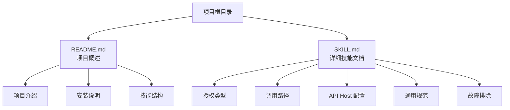
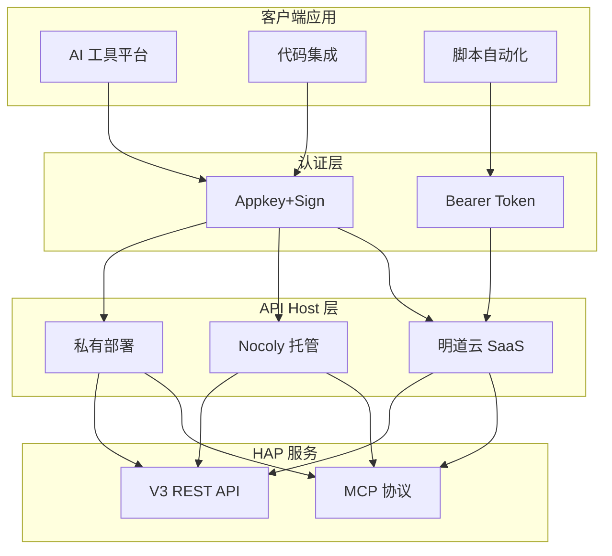
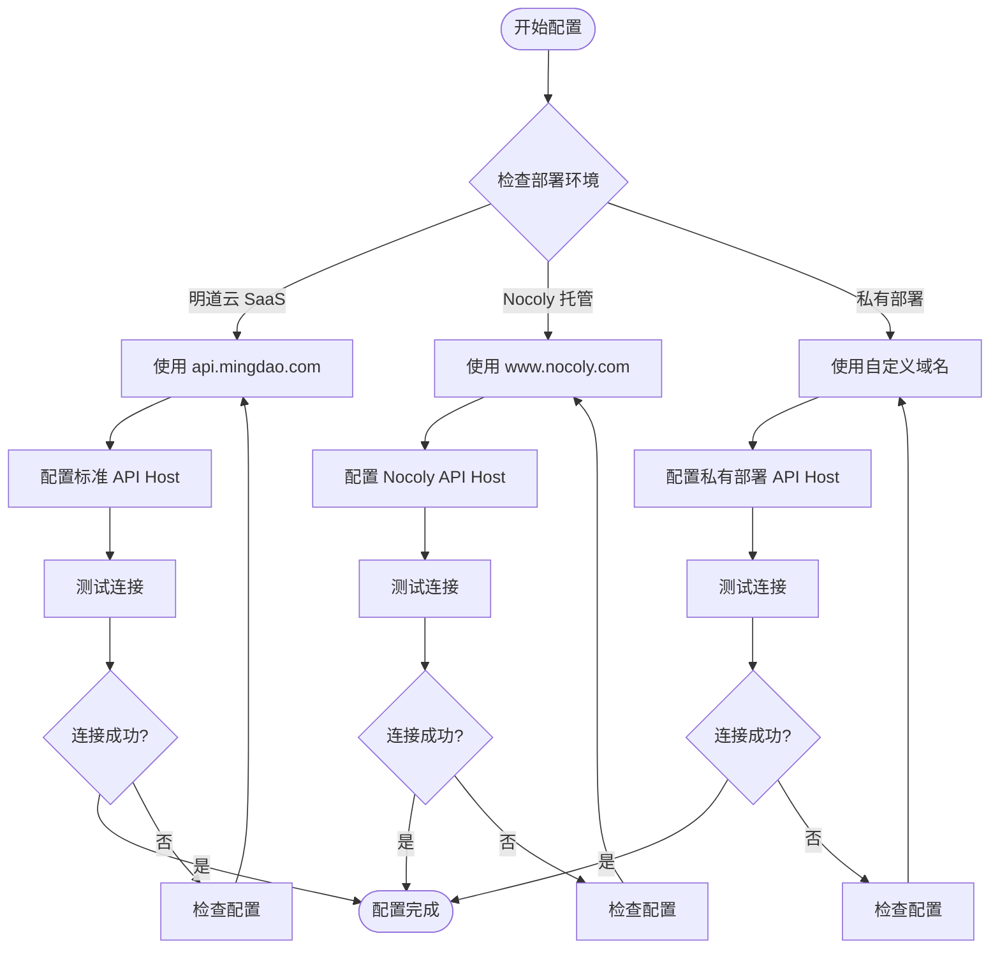
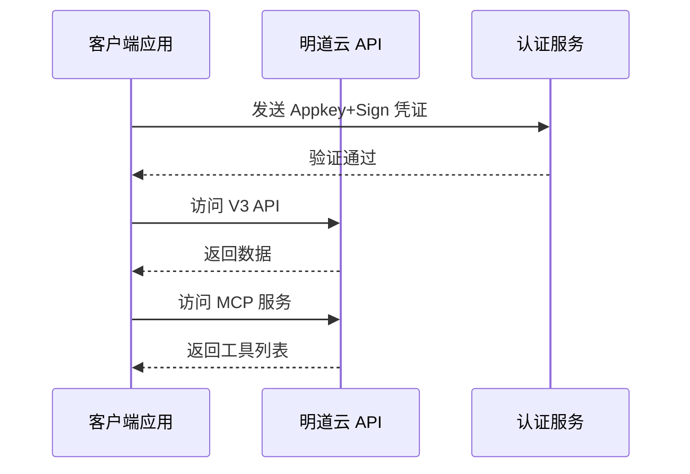
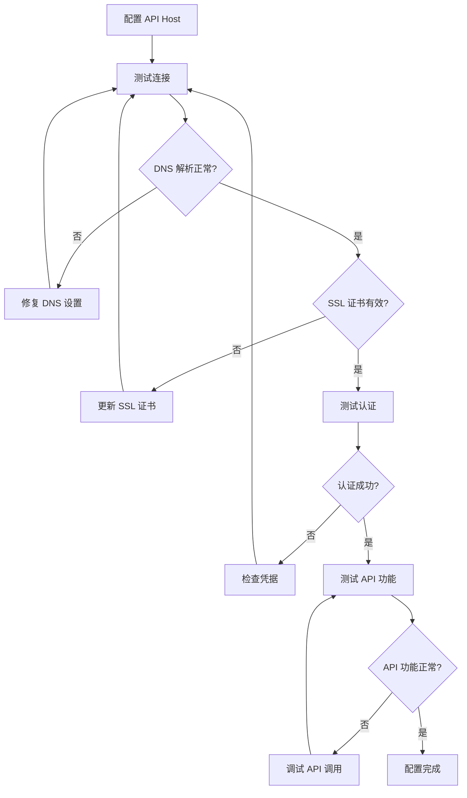
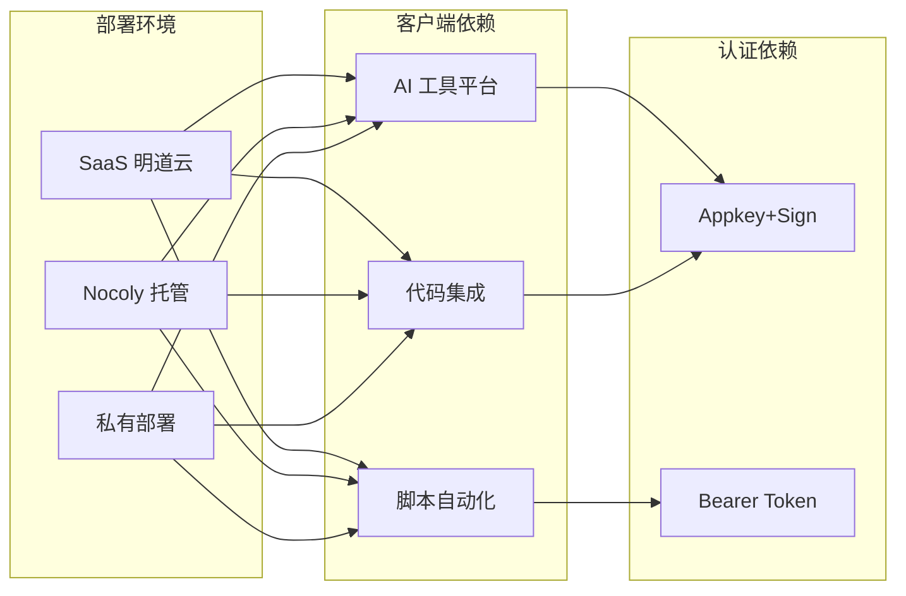
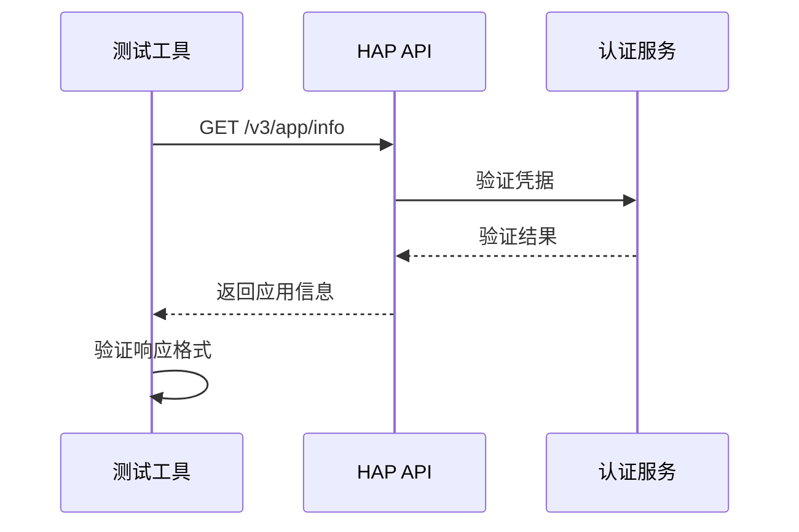

# API Host 配置

<cite>
**本文档引用的文件**
- [README.md](file://README.md)
- [SKILL.md](file://SKILL.md)
</cite>

## 目录
1. [简介](#简介)
2. [项目结构](#项目结构)
3. [核心组件](#核心组件)
4. [架构概览](#架构概览)
5. [详细组件分析](#详细组件分析)
6. [依赖关系分析](#依赖关系分析)
7. [性能考虑](#性能考虑)
8. [故障排除指南](#故障排除指南)
9. [结论](#结论)

## 简介

本文档专注于明道云 HAP 应用的 API Host 配置，详细解释了不同部署环境下的域名配置和连接设置。明道云 HAP（Harmony Application Platform）支持多种部署模式，包括 SaaS 服务、Nocoly 服务以及私有部署，每种部署环境都有其特定的 API Host 配置要求。

该文档旨在帮助开发者和系统管理员正确配置 HAP 应用的 API 连接，确保在不同环境中能够稳定地访问 HAP 服务。

## 项目结构

本项目采用简洁的文档结构，主要包含两个核心文件：

**图表来源**
- [README.md:1-53](file://README.md#L1-L53)
- [SKILL.md:1-436](file://SKILL.md#L1-L436)

**章节来源**
- [README.md:1-53](file://README.md#L1-L53)
- [SKILL.md:1-436](file://SKILL.md#L1-L436)

## 核心组件

### API Host 类型

明道云 HAP 支持三种主要的产品线和部署模式，每种都有其特定的 API Host 配置：

| 产品线 | API Host | MCP URL 示例 | 特殊说明 |
|--------|----------|-------------|----------|
| 明道云 HAP | `https://api.mingdao.com` | `https://api.mingdao.com/mcp?...` | 标准 SaaS 服务 |
| Nocoly HAP | `https://www.nocoly.com` | `https://www.nocoly.com/mcp?...` | 第三方托管服务 |
| 私有部署 | `https://<域名>/api` | `https://<域名>/mcp?...` | 企业内部部署 |

### 配置要点

1. **明道云 HAP**：使用标准的 `api.mingdao.com` 域名，适用于大多数 SaaS 用户
2. **Nocoly HAP**：使用 `nocoly.com` 域名，适用于选择第三方托管的用户
3. **私有部署**：使用自定义域名，API 路径需要添加 `/api` 前缀

**章节来源**
- [SKILL.md:236-247](file://SKILL.md#L236-L247)

## 架构概览

### API Host 配置架构

**图表来源**
- [SKILL.md:236-247](file://SKILL.md#L236-L247)
- [SKILL.md:35-54](file://SKILL.md#L35-L54)

### 环境切换流程

**图表来源**
- [SKILL.md:236-247](file://SKILL.md#L236-L247)

## 详细组件分析

### 明道云 SaaS 配置

#### 基础配置

明道云 SaaS 是最常用的部署模式，使用标准的 API 主机地址：

- **API Host**: `https://api.mingdao.com`
- **MCP URL**: `https://api.mingdao.com/mcp?...`
- **V3 API 路径**: `https://api.mingdao.com/v3/...`

#### 配置示例

**图表来源**
- [SKILL.md:240-243](file://SKILL.md#L240-L243)

#### OAuth Bearer Token 配置

对于个人级授权，需要特别注意域名白名单：

- **OAuth App 域名**: `api.mingdao.com`
- **Token 有效性**: 仅对创建时配置的域名有效
- **常见错误**: `10001 Http Headers verification failed`

**章节来源**
- [SKILL.md:240-243](file://SKILL.md#L240-L243)
- [SKILL.md:335-343](file://SKILL.md#L335-L343)

### Nocoly 托管配置

#### 基础配置

Nocoly 提供第三方托管的 HAP 服务，使用不同的域名：

- **API Host**: `https://www.nocoly.com`
- **MCP URL**: `https://www.nocoly.com/mcp?...`
- **V3 API 路径**: `https://www.nocoly.com/v3/...`

#### 配置差异

Nocoly 与明道云的主要区别在于域名和可能的 API 路径差异。配置时需要注意：

1. **域名一致性**: 确保所有 API 请求都使用相同的域名
2. **证书验证**: 确保 SSL 证书有效
3. **网络可达性**: 确保防火墙允许访问 Nocoly 的服务器

**章节来源**
- [SKILL.md:240-244](file://SKILL.md#L240-L244)

### 私有部署配置

#### 基础配置

私有部署是最灵活的选项，但也是最复杂的配置：

- **API Host**: `https://<自定义域名>/api`
- **MCP URL**: `https://<自定义域名>/mcp?...`
- **特殊要求**: V3 API 路径需要添加 `/api` 前缀

#### 配置复杂性

私有部署需要考虑更多因素：

1. **域名解析**: 确保 DNS 正确解析到私有服务器
2. **SSL 证书**: 配置有效的 SSL 证书
3. **网络配置**: 配置防火墙和负载均衡器
4. **API 路径**: 确保 V3 API 路径包含 `/api` 前缀

**章节来源**
- [SKILL.md:240-246](file://SKILL.md#L240-L246)

### 配置验证流程

**图表来源**
- [SKILL.md:236-247](file://SKILL.md#L236-L247)

## 依赖关系分析

### 环境依赖

**图表来源**
- [SKILL.md:236-247](file://SKILL.md#L236-L247)
- [SKILL.md:13-32](file://SKILL.md#L13-L32)

### 依赖关系特点

1. **环境独立性**: 每种部署环境都有其独立的 API Host 配置
2. **认证分离**: SaaS 和 Nocoly 使用 Appkey+Sign，私有部署同样使用 Appkey+Sign
3. **客户端兼容性**: 同一套客户端代码可以在不同环境中运行

**章节来源**
- [SKILL.md:236-247](file://SKILL.md#L236-L247)

## 性能考虑

### 连接性能优化

1. **连接池管理**: 在私有部署环境中，建议启用连接池以提高性能
2. **超时设置**: 根据网络环境调整 API 调用超时时间
3. **重试机制**: 实现智能重试机制处理临时网络故障

### 网络配置建议

1. **DNS 缓存**: 合理配置 DNS 缓存减少解析延迟
2. **CDN 加速**: 对于 SaaS 环境，考虑使用 CDN 加速静态资源
3. **负载均衡**: 私有部署建议配置负载均衡器提高可用性

## 故障排除指南

### 常见错误及解决方案

#### 错误码 10001：HTTP Headers 验证失败

**症状**: `10001 Http Headers verification failed`

**原因**: OAuth Bearer Token 的域名不在白名单中

**解决方案**:
1. 确保使用 `api.mingdao.com` 域名
2. 检查 OAuth App 的域名配置
3. 重新生成 OAuth Token

#### 错误码 600101：授权已失效

**症状**: `600101 授权已失效` 或 `invalid_token`

**原因**: Bearer Token 过期

**解决方案**:
1. 实现 Token 自动刷新机制
2. 检查 Token 的过期时间
3. 实现优雅的重试逻辑

#### 连接超时问题

**症状**: API 请求超时

**原因**:
1. 网络连接问题
2. DNS 解析失败
3. 服务器负载过高

**解决方案**:
1. 检查网络连通性
2. 验证 DNS 设置
3. 实现重试和熔断机制

### 连接测试方法

#### 基础连接测试

**图表来源**
- [SKILL.md:110-126](file://SKILL.md#L110-L126)

#### 高级功能测试

1. **工具发现测试**: 验证 MCP 工具列表
2. **数据读取测试**: 验证基本的 CRUD 操作
3. **批量操作测试**: 验证批量数据处理能力

**章节来源**
- [SKILL.md:378-398](file://SKILL.md#L378-L398)

### 调试技巧

1. **日志记录**: 启用详细的 API 调用日志
2. **网络抓包**: 使用工具捕获网络请求和响应
3. **状态监控**: 实时监控 API 响应时间和错误率

## 结论

明道云 HAP 应用的 API Host 配置相对简单，主要区别在于不同的部署环境使用不同的域名。关键的成功因素包括：

1. **正确的域名选择**: 根据部署环境选择合适的 API Host
2. **严格的凭据管理**: 确保 Appkey+Sign 或 Bearer Token 的正确配置
3. **完善的错误处理**: 实现健壮的错误处理和重试机制
4. **持续的监控**: 建立监控体系及时发现和解决问题

通过遵循本文档的配置指南和故障排除方法，可以确保在各种部署环境下都能稳定地访问 HAP 服务。