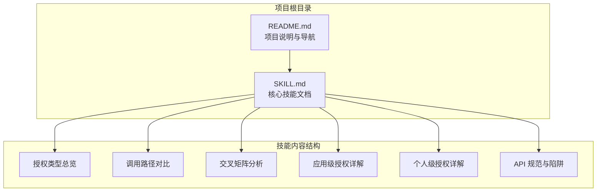
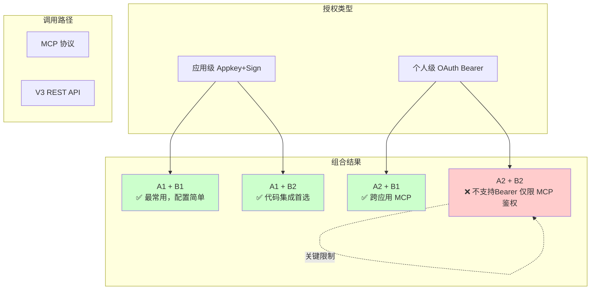
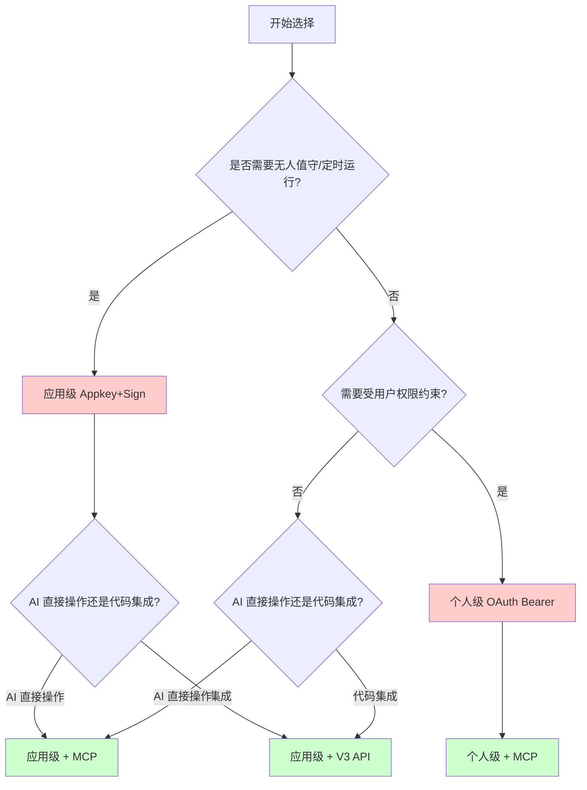
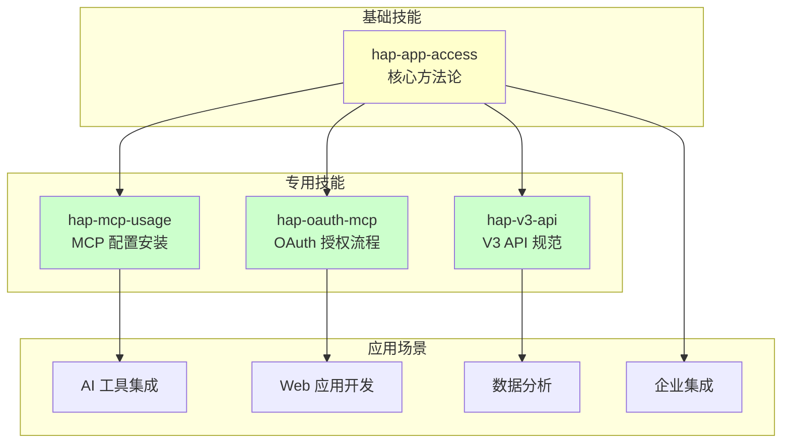
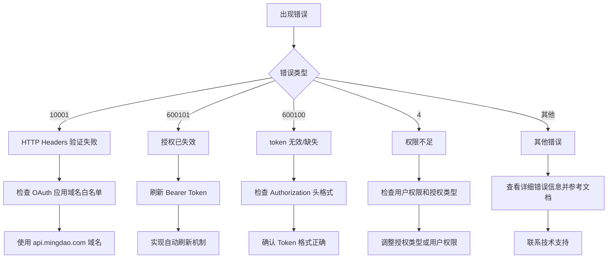

# 交叉矩阵分析

<cite>
**本文引用的文件**
- [README.md](file://README.md)
- [SKILL.md](file://SKILL.md)
</cite>

## 目录
1. [简介](#简介)
2. [项目结构](#项目结构)
3. [核心组件](#核心组件)
4. [架构概览](#架构概览)
5. [详细组件分析](#详细组件分析)
6. [依赖关系分析](#依赖关系分析)
7. [性能考量](#性能考量)
8. [故障排除指南](#故障排除指南)
9. [结论](#结论)
10. [附录](#附录)

## 简介

本文档针对明道云 HAP 应用的授权类型与调用路径交叉组合进行全面分析。项目提供了两种授权类型（应用级 Appkey+Sign 与个人级 OAuth Bearer）与两种调用路径（MCP 协议与 V3 REST API）的完整 2×2 交叉矩阵分析，帮助开发者根据具体需求选择最适合的组合方案。

该技能包专注于通用的访问方法论，不包含任何具体业务逻辑，旨在为 AI 助手和开发者提供清晰的选择指导和最佳实践建议。

## 项目结构

项目采用极简的双文件结构设计：

**图表来源**
- [README.md: 1-53:1-53](file://README.md#L1-L53)
- [SKILL.md: 1-436:1-436](file://SKILL.md#L1-L436)

**章节来源**
- [README.md: 1-53:1-53](file://README.md#L1-L53)
- [SKILL.md: 1-436:1-436](file://SKILL.md#L1-L436)

## 核心组件

### 授权类型组件

系统提供两种核心授权类型，每种都有明确的身份特征和适用场景：

| 维度 | 应用级授权（Appkey+Sign） | 个人级授权（OAuth Bearer） |
|------|--------------------------|---------------------------|
| 身份 | 应用身份（不受人约束） | 个人身份（等同于登录用户） |
| 凭证 | Appkey + Sign（长期有效） | Bearer Token（约 1 天过期） |
| 权限范围 | 应用内 API 开关控制的全部数据 | 当前登录用户在应用中可见的数据 |
| 跨应用 | 只能访问所属应用 | 可跨应用访问用户有权限的所有应用 |
| 适用场景 | 后台定时任务、服务间同步、脚本自动化 | 个人数据查询、以用户视角读写数据 |
| 过期 | 不过期（除非在 HAP 后台重置） | 约 1 天，需要刷新机制 |
| 获取位置 | HAP 后台 → 应用 → API 开发 → API 密钥 | OAuth 授权流程 |

**章节来源**
- [SKILL.md: 13-32:13-32](file://SKILL.md#L13-L32)

### 调用路径组件

两种调用路径服务于不同的使用场景和技术栈：

| 维度 | MCP 协议（SSE/Streamable HTTP） | V3 REST API（HTTP JSON） |
|------|-------------------------------|-------------------------|
| 协议 | MCP（Model Context Protocol） | 标准 HTTPS + JSON |
| 端点 | `https://api.mingdao.com/mcp` | `https://api.mingdao.com/v3/open/...` |
| 鉴权注入 | URL query 参数或 SSE Header | HTTP 请求头 |
| 工具发现 | 自动暴露 40~70 个工具 | 需查 API 文档 |
| 调用方式 | AI 工具原生支持（如 Qoder/Cursor 的 MCP 集成） | 代码中 `fetch`/`requests` 等 |
| 适合谁 | AI 助手直接操作数据 | 开发者在代码中集成 |
| 分页 | `pageSize` 上限 **90** | `pageSize` 上限 **1000** |
| 响应大小 | 单次约 **256KB** 缓冲上限 | 无此限制 |

**章节来源**
- [SKILL.md: 35-54:35-54](file://SKILL.md#L35-L54)

## 架构概览

### 2×2 交叉矩阵分析

系统的核心价值在于对四种组合的完整矩阵分析：

**图表来源**
- [SKILL.md: 57-65:57-65](file://SKILL.md#L57-L65)

### 关键技术限制

存在重要的技术限制需要特别注意：

1. **OAuth Bearer Token 的使用边界**：只能用于 MCP 协议调用，不能直接用于 V3 REST API
2. **V3 API 的认证要求**：必须使用 `HAP-Appkey` + `HAP-Sign` 请求头
3. **MCP 协议的响应限制**：单次响应约 256KB 缓冲上限

**章节来源**
- [SKILL.md: 64](file://SKILL.md#L64)

## 详细组件分析

### 组合一：应用级 + MCP（最常用）

这是最常见和推荐的组合，适用于大多数场景：

#### 优势分析
- **配置简单**：Appkey+Sign 无需复杂的 OAuth 流程
- **稳定可靠**：长期有效，无需考虑过期问题
- **功能完整**：支持约 40-70 个工具的自动发现
- **AI 友好**：AI 工具原生支持 MCP 协议

#### 适用场景
- 后台定时任务和批处理操作
- 无人值守的数据同步
- AI 助手直接操作明道云数据
- 系统间的服务调用

#### 实施要点
- 在 AI 工具的 MCP 配置中直接使用 Appkey+Sign
- 典型工具包括应用信息获取、工作表操作、记录 CRUD 等
- 配置步骤详见相关技能文档

**章节来源**
- [SKILL.md: 59-61:59-61](file://SKILL.md#L59-L61)
- [SKILL.md: 76-96:76-96](file://SKILL.md#L76-L96)

### 组合二：应用级 + V3 API（代码集成首选）

专为开发者设计的组合，适合各种编程语言和框架：

#### 优势分析
- **标准化接口**：遵循标准 HTTP JSON 协议
- **灵活强大**：支持 1000 的分页上限，适合大数据量处理
- **广泛支持**：几乎所有编程语言都有成熟的 HTTP 客户端库
- **响应无限制**：没有 MCP 的 256KB 响应限制

#### 适用场景
- Web 应用和移动应用开发
- 数据分析和报表生成
- 大规模数据导出和导入
- 企业级集成解决方案

#### 实施要点
- 使用标准 HTTP 请求头注入认证信息
- 支持完整的 CRUD 操作和批量处理
- 需要遵循统一的调用规范和参数格式

**章节来源**
- [SKILL.md: 59-61:59-61](file://SKILL.md#L59-L61)
- [SKILL.md: 98-164:98-164](file://SKILL.md#L98-L164)

### 组合三：个人级 + MCP（跨应用访问）

专门为需要跨应用访问能力的场景设计：

#### 优势分析
- **跨应用能力**：可以访问用户有权限的所有应用
- **用户权限约束**：严格遵循用户的实际权限范围
- **实时性好**：基于当前登录状态，权限变更即时生效
- **工具丰富**：支持 60-70 个工具，涵盖应用级全部功能

#### 适用场景
- 个人数据聚合和分析
- 多应用间的协作工具
- 用户自助式的数据查询
- 临时性的跨应用数据访问

#### 实施要点
- 每次工具调用必须提供 `appId` 和 `ai_description` 参数
- 需要实现 Token 过期检测和自动刷新机制
- 注意 OAuth 应用的域名白名单限制

**章节来源**
- [SKILL.md: 59-62:59-62](file://SKILL.md#L59-L62)
- [SKILL.md: 168-233:168-233](file://SKILL.md#L168-L233)

### 组合四：个人级 + V3 API（不支持）

这是唯一不被支持的组合，存在根本性的技术限制：

#### 限制说明
- **认证机制不兼容**：V3 API 只接受 Appkey+Sign，不接受 Bearer Token
- **架构设计决定**：这是明道云平台的设计限制，无法通过技术手段绕过
- **替代方案**：必须使用应用级授权才能使用 V3 API

#### 替代策略
- 使用应用级 Appkey+Sign + V3 API 组合
- 或者使用个人级 + MCP 组合
- 根据具体需求选择最适合的替代方案

**章节来源**
- [SKILL.md: 62-64:62-64](file://SKILL.md#L62-L64)

### 决策指导流程

**图表来源**
- [SKILL.md: 401-418:401-418](file://SKILL.md#L401-L418)

**章节来源**
- [SKILL.md: 401-418:401-418](file://SKILL.md#L401-L418)

## 依赖关系分析

### 技术依赖关系

**图表来源**
- [README.md: 39-48:39-48](file://README.md#L39-L48)

### 组件耦合度分析

- **低耦合设计**：每个技能模块相对独立，便于单独使用和维护
- **高内聚特性**：每个技能专注于特定的功能领域
- **扩展性强**：新的应用场景可以通过组合现有技能实现

**章节来源**
- [README.md: 39-48:39-48](file://README.md#L39-L48)

## 性能考量

### 响应时间对比

| 组合 | 响应时间特点 | 适用场景 | 优化建议 |
|------|-------------|----------|----------|
| 应用级 + MCP | 实时响应，延迟较低 | AI 直接操作 | 合理设置分页大小（≤90） |
| 应用级 + V3 API | 标准 HTTP 响应 | 大数据量处理 | 使用 100-500 的分页大小 |
| 个人级 + MCP | 受 Token 刷新影响 | 跨应用访问 | 实现主动检测机制 |
| 个人级 + V3 API | 不支持 | - | 使用替代组合 |

### 资源消耗分析

- **MCP 协议**：内存占用相对较小，但受 256KB 响应限制
- **V3 API**：内存占用随数据量线性增长，适合大数据处理
- **Token 管理**：个人级授权需要额外的 Token 刷新开销

### 网络带宽考虑

- **MCP 协议**：适合频繁的小数据量查询
- **V3 API**：适合一次性传输大量数据
- **缓存策略**：建议在应用层实现适当的缓存机制

## 故障排除指南

### 常见错误及解决方案

**图表来源**
- [SKILL.md: 378-398:378-398](file://SKILL.md#L378-L398)

### 关键错误码解析

| 错误码 | 含义 | 典型原因 | 解决方案 |
|--------|------|---------|---------|
| `1` | 成功 | 无问题 | 继续正常操作 |
| `-1` | 通用失败 | 系统内部错误 | 查看 `error_msg` 详细信息 |
| `4` | 权限不足 | 当前身份无操作权限 | 检查授权类型和用户权限 |
| `10` | 参数错误 | 参数缺失或格式错误 | 检查参数名（驼峰）和值格式 |
| `10001` | HTTP Headers 验证失败 | OAuth token 域名不在白名单 | 确认使用 `api.mingdao.com` |
| `600101` | 授权已失效 | Bearer token 过期 | 实现自动刷新机制 |
| `600100` | token 无效/缺失 | token 为空或格式错误 | 检查 Authorization 头 |

**章节来源**
- [SKILL.md: 378-398:378-398](file://SKILL.md#L378-L398)

### 陷阱清单

项目总结了 10 个高频陷阱和解决方案：

1. **选项字段写入必须用 key**：写入 SingleSelect/MultipleSelect 字段时，value 必须传 option key（UUID）的数组
2. **关联字段 get_record_list 可能丢失**：对部分 Relation 字段可能返回空字符串，需要额外调用补全
3. **_owner 字段响应为空但 filter 有效**：读取时永远为空，但 filter 仍然有效
4. **caid 服务端 filter 的 in 操作不稳定**：需要客户端过滤
5. **OAuth Bearer 域名白名单**：OAuth App 的 Bearer Token 只对创建时配置的域名鉴权有效
6. **MCP 单次响应 256KB 上限**：超出会抛异常，需要降低 pageSize 或改用 V3 API
7. **数值字段读写类型不一致**：写入数字类型，读取返回字符串
8. **日期过滤时区偏移**：可能因服务端时区设置偏移 ±1 天
9. **triggerWorkflow 参数**：控制是否触发 HAP 工作流
10. **Personal MCP 的 appId 和 ai_description**：应用级不需要，个人级每次调用必须提供

**章节来源**
- [SKILL.md: 301-376:301-376](file://SKILL.md#L301-L376)

## 结论

通过对明道云 HAP 应用授权类型与调用路径交叉组合的全面分析，可以得出以下结论：

### 最佳实践建议

1. **优先选择应用级 + MCP 组合**：这是最常用和最稳定的组合，适合大多数场景
2. **V3 API 适合代码集成**：当需要在代码中进行复杂的数据处理时，优先考虑应用级 + V3 API
3. **个人级授权用于跨应用场景**：当需要访问用户有权限的所有应用时，选择个人级 + MCP
4. **避免个人级 + V3 API 组合**：这是不被支持的组合，应该寻找替代方案

### 选择决策树

最终的决策应该基于以下因素：
- **无人值守需求**：选择应用级授权
- **用户权限约束**：选择个人级授权
- **AI 直接操作 vs 代码集成**：AI 场景选 MCP，代码场景选 V3 API
- **跨应用访问需求**：选择个人级授权

### 性能优化建议

- 合理设置分页大小，避免超过协议限制
- 实现适当的缓存策略
- 优化网络请求频率
- 根据数据量选择合适的调用路径

这个技能包为开发者提供了清晰的方法论指导，帮助在复杂的授权和调用路径选择中做出明智的决策。

## 附录

### 相关技能索引

| 技能名称 | 主要用途 | 适用场景 |
|----------|----------|----------|
| `hap-mcp-usage` | MCP 配置的自动化安装 | 9 种 AI 工具平台的 MCP 集成 |
| `hap-oauth-mcp` | OAuth 授权流程 + Bearer Token 获取/刷新 | 个人级授权的完整实现 |
| `hap-v3-api` | V3 REST API 的完整使用规范 | 标准 HTTP JSON 接口使用 |
| `hap-frontend-project` | 使用 HAP 作为后端搭建独立网站 | 前端项目开发 |
| `hap-view-plugin` | 开发 HAP 自定义视图插件 | 视图扩展开发 |

### 版本信息

- **技能版本**：v1.0
- **适用范围**：明道云 HAP（SaaS / Nocoly / 私有部署）
- **许可证**：MIT