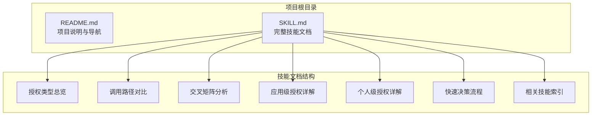
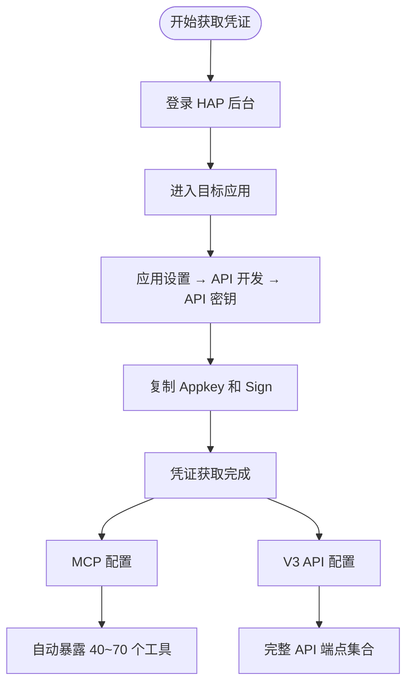
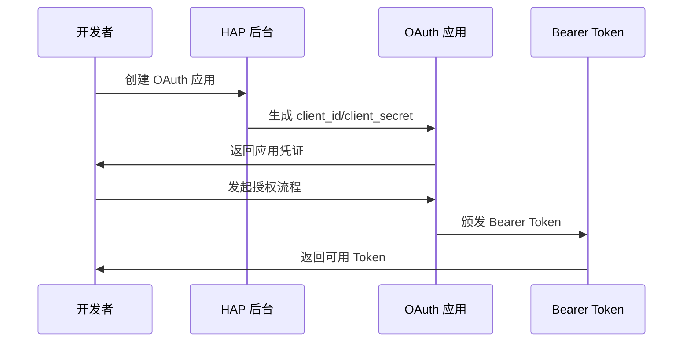
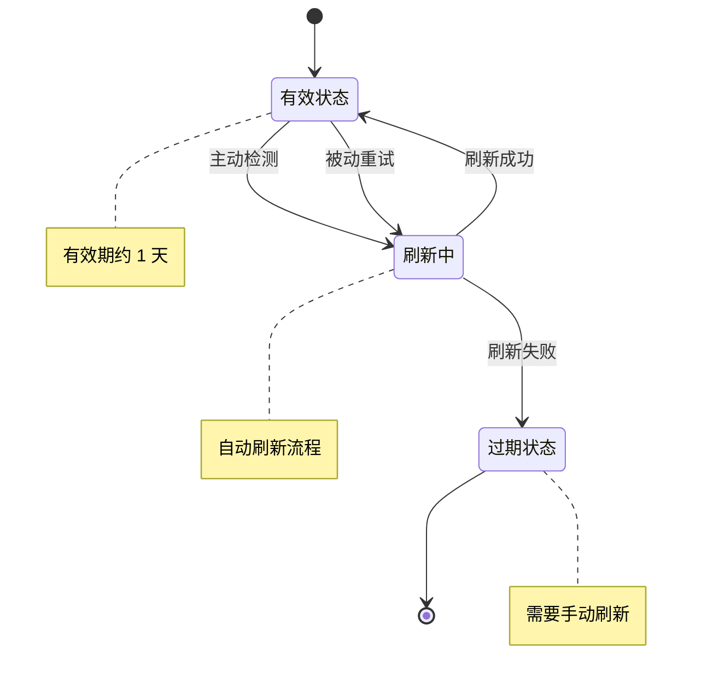
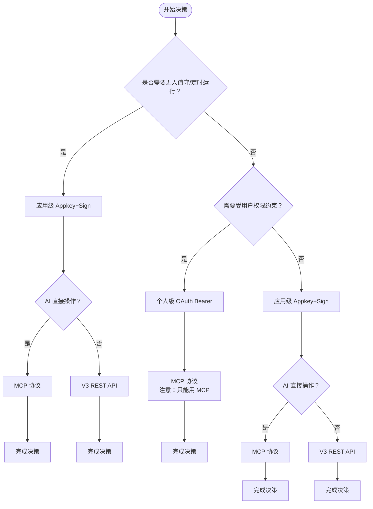
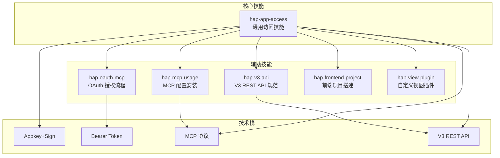
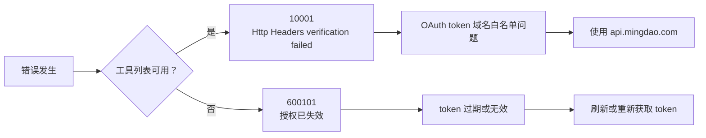

# 快速决策流程

<cite>
**本文引用的文件**
- [README.md](file://README.md)
- [SKILL.md](file://SKILL.md)
</cite>

## 目录
1. [简介](#简介)
2. [项目结构](#项目结构)
3. [核心组件](#核心组件)
4. [架构概览](#架构概览)
5. [详细组件分析](#详细组件分析)
6. [依赖关系分析](#依赖关系分析)
7. [性能考虑](#性能考虑)
8. [故障排除指南](#故障排除指南)
9. [结论](#结论)
10. [附录](#附录)

## 简介

本文件为明道云 HAP 应用开发创建了详细的快速决策流程文档。该文档基于仓库中的技能文档，提供了清晰的选型决策树，帮助开发者根据具体需求快速选择合适的授权类型和调用路径组合。

明道云 HAP 应用提供两种授权类型（应用级 Appkey+Sign / 个人级 OAuth Bearer）与两种调用路径（MCP 协议 / V3 REST API）的交叉组合，共四种不同的访问方式。每种组合都有其特定的适用场景、优势和限制。

## 项目结构

该项目采用极简的文档驱动结构，主要包含两个核心文件：

**图表来源**
- [README.md: 1-53:1-53](file://README.md#L1-L53)
- [SKILL.md: 1-436:1-436](file://SKILL.md#L1-L436)

**章节来源**
- [README.md: 1-53:1-53](file://README.md#L1-L53)
- [SKILL.md: 1-436:1-436](file://SKILL.md#L1-L436)

## 核心组件

### 授权类型组件

明道云 HAP 提供两种基本的授权类型，每种都有明确的身份特征和适用场景：

| 维度 | 应用级授权（Appkey+Sign） | 个人级授权（OAuth Bearer） |
|------|--------------------------|---------------------------|
| 身份 | 应用身份（不受人约束） | 个人身份（等同于登录用户） |
| 凭证 | Appkey + Sign（长期有效） | Bearer Token（约 1 天过期） |
| 权限范围 | 应用内 API 开关控制的全部数据 | 当前登录用户在应用中可见的数据 |
| 跨应用 | 只能访问所属应用 | 可跨应用访问用户有权限的所有应用 |
| 适用场景 | 后台定时任务、服务间同步、脚本自动化 | 个人数据查询、以用户视角读写数据 |
| 过期 | 不过期（除非在 HAP 后台重置） | 约 1 天，需要刷新机制 |

**选择原则**：
- 需要无人值守运行 → 应用级（Appkey+Sign）
- 需要受用户权限约束 → 个人级（OAuth Bearer）
- 需要跨多个应用 → 个人级（一个 token 覆盖多应用）
- 两者都可用 → 优先应用级（无过期风险）

### 调用路径组件

获得授权后，开发者有两种技术路径来调用 HAP：

| 维度 | MCP 协议（SSE/Streamable HTTP） | V3 REST API（HTTP JSON） |
|------|-------------------------------|-------------------------|
| 协议 | MCP（Model Context Protocol） | 标准 HTTPS + JSON |
| 端点 | `https://api.mingdao.com/mcp` | `https://api.mingdao.com/v3/open/...` |
| 鉴权注入 | URL query 参数或 SSE Header | HTTP 请求头 |
| 工具发现 | 自动暴露 40~70 个工具 | 需查 API 文档 |
| 调用方式 | AI 工具原生支持（如 Qoder/Cursor 的 MCP 集成） | 代码中 `fetch`/`requests` 等 |
| 适合谁 | AI 助手直接操作数据 | 开发者在代码中集成 |
| 分页 | `pageSize` 上限 **90** | `pageSize` 上限 **1000** |
| 响应大小 | 单次约 **256KB** 缓冲上限 | 无此限制 |

**选择原则**：
- AI 在对话中直接操作数据 → MCP
- 写代码（前端/后端/脚本）集成 HAP → V3 REST API
- 两者都能用 → AI 场景用 MCP，代码场景用 V3 API

**章节来源**
- [SKILL.md: 13-32:13-32](file://SKILL.md#L13-L32)
- [SKILL.md: 35-54:35-54](file://SKILL.md#L35-L54)

## 架构概览

基于仓库内容，明道云 HAP 的整体架构可以概括为四象限决策矩阵：

```mermaid
graph TB
subgraph "授权类型决策"
A1[应用级 Appkey+Sign]
A2[个人级 OAuth Bearer]
end
subgraph "调用路径决策"
B1[MCP 协议]
B2[V3 REST API]
end
subgraph "组合结果"
C1[应用级 + MCP<br/>最常用，配置简单]
C2[应用级 + V3 API<br/>代码集成首选]
C3[个人级 + MCP<br/>跨应用 MCP]
C4[个人级 + V3 API<br/>❌ 不支持]
end
A1 --> B1
A1 --> B2
A2 --> B1
A2 --> B2
B1 --> C1
B1 --> C3
B2 --> C2
B2 --> C4
```

**图表来源**
- [SKILL.md: 57-65:57-65](file://SKILL.md#L57-L65)

## 详细组件分析

### 应用级授权（Appkey+Sign）深度分析

应用级授权是最常用的访问方式，适用于需要无人值守运行的场景：

#### 凭证获取流程

**图表来源**
- [SKILL.md: 70-96:70-96](file://SKILL.md#L70-L96)

#### MCP 路径配置要点

应用级 MCP 配置相对简单，主要包含以下要素：
- URL 格式：`https://api.mingdao.com/mcp?HAP-Appkey=<Appkey>&HAP-Sign=<Sign>`
- 自动暴露的工具数量：约 40-70 个
- 典型工具包括：应用信息、工作表列表、记录查询、增删改等基础操作

#### V3 REST API 路径特点

V3 API 提供了更完整的功能集：
- 请求头要求：`HAP-Appkey` + `HAP-Sign`
- 支持的端点：应用信息、工作表管理、记录操作、用户查找等
- 分页上限：`pageSize` 最大 1000
- 适合场景：代码集成、批量操作、复杂查询

**章节来源**
- [SKILL.md: 68-165:68-165](file://SKILL.md#L68-L165)

### 个人级授权（OAuth Bearer）深度分析

个人级授权适用于需要用户权限约束的场景，特别是跨应用访问：

#### Token 获取流程

**图表来源**
- [SKILL.md: 170-175:170-175](file://SKILL.md#L170-L175)

#### MCP 路径特殊要求

个人级 MCP 配置有额外的安全要求：
- 必须包含 `Authorization=Bearer <Token>` 参数
- 每次工具调用必须提供 `appId` 和 `ai_description` 参数
- 支持跨应用访问，工具数量可达 60-70 个

#### Token 生命周期管理

**图表来源**
- [SKILL.md: 211-228:211-228](file://SKILL.md#L211-L228)

**章节来源**
- [SKILL.md: 168-234:168-234](file://SKILL.md#L168-L234)

### 快速决策流程详解

基于仓库内容，完整的快速决策流程如下：

**图表来源**
- [SKILL.md: 401-418:401-418](file://SKILL.md#L401-L418)

#### 决策逻辑说明

1. **首要考虑因素**：是否需要无人值守运行
   - 需要无人值守 → 选择应用级（Appkey+Sign）
   - 不需要无人值守 → 进入下一步

2. **权限约束需求**：是否需要受用户权限约束
   - 需要用户权限约束 → 选择个人级（OAuth Bearer）
   - 不需要用户权限约束 → 选择应用级（更简单）

3. **调用方式选择**：AI 直接操作还是代码集成
   - AI 直接操作 → 选择 MCP 协议
   - 代码集成 → 选择 V3 REST API

4. **最终限制**：个人级授权的 V3 API 限制
   - 个人级授权不能用于 V3 REST API
   - 必须使用 MCP 协议进行调用

**章节来源**
- [SKILL.md: 401-418:401-418](file://SKILL.md#L401-L418)

## 依赖关系分析

基于仓库文档，各技能模块之间的依赖关系如下：

**图表来源**
- [README.md: 39-49:39-49](file://README.md#L39-L49)
- [SKILL.md: 422-431:422-431](file://SKILL.md#L422-L431)

### 关键依赖关系

1. **hap-app-access** 是核心技能，提供通用方法论
2. **hap-mcp-usage** 专门处理 MCP 配置安装
3. **hap-oauth-mcp** 专门处理 OAuth 授权流程
4. **hap-v3-api** 提供 V3 API 的完整规范

这些技能相互补充，形成完整的 HAP 应用开发技能体系。

**章节来源**
- [README.md: 39-49:39-49](file://README.md#L39-L49)
- [SKILL.md: 422-431:422-431](file://SKILL.md#L422-L431)

## 性能考虑

基于仓库文档，主要的性能考量包括：

### 分页策略

| 路径 | pageSize 上限 | 推荐值 | 说明 |
|------|-------------|--------|------|
| MCP `get_record_list` | **90** | 50 | 单次响应有 ~256KB 缓冲上限，大表必须降 page_size |
| V3 API `rows/list` | **1000** | 100~500 | 无缓冲限制，但不宜过大 |

### 响应大小限制

- **MCP 协议**：单次响应约 256KB 缓冲上限
- **V3 REST API**：无此限制，但建议合理控制数据量

### 性能优化建议

1. **大表查询**：优先使用 V3 API，配合合理的分页策略
2. **实时性要求高**：使用 MCP 协议，但要注意分页限制
3. **批量操作**：V3 API 支持批量操作，性能优于逐条操作

**章节来源**
- [SKILL.md: 280-288:280-288](file://SKILL.md#L280-L288)

## 故障排除指南

### 常见错误及解决方案

| 错误码 | 含义 | 典型原因 | 解决方案 |
|--------|------|---------|---------|
| `1` | 成功 | — | — |
| `-1` | 通用失败 | 查看 `error_msg` | 按 error_msg 排查 |
| `4` | 权限不足 | 当前身份无该操作权限 | 检查授权类型和用户权限 |
| `10` | 参数错误 | 参数缺失或格式错误 | 检查参数名（驼峰）和值格式 |
| `10001` | HTTP Headers 验证失败 | OAuth token 域名不在白名单 | 确认使用 `api.mingdao.com` |
| `600101` | 授权已失效 | Bearer token 过期 | 刷新 token |
| `600100` | token 无效/缺失 | token 为空或格式错误 | 检查 Authorization 头 |

### 10001 vs 600101 区分

**图表来源**
- [SKILL.md: 390-398:390-398](file://SKILL.md#L390-L398)

### 陷阱清单

基于仓库文档，主要的开发陷阱包括：

1. **选项字段写入**：必须使用 option key（UUID）而非显示文本
2. **关联字段丢失**：`get_record_list` 可能返回空字符串，需额外调用补全
3. **_owner 字段**：列表中返回空字符串但 filter 仍有效
4. **caid 过滤不稳定**：服务端对数组 in 操作支持有限
5. **OAuth Bearer 域名白名单**：只能访问创建时配置的域名
6. **MCP 响应大小限制**：单次约 256KB，超限需降低 page_size
7. **数值字段类型不一致**：写入数字，读取返回字符串
8. **日期过滤时区偏移**：可能因服务端时区设置偏移 ±1 天

**章节来源**
- [SKILL.md: 301-376:301-376](file://SKILL.md#L301-L376)

## 结论

通过分析明道云 HAP 应用开发的技能文档，我们可以总结出以下关键结论：

### 核心决策原则

1. **授权类型优先级**：应用级（Appkey+Sign）通常优于个人级（OAuth Bearer）
2. **调用路径选择**：AI 直接操作选 MCP，代码集成选 V3 API
3. **个人级授权限制**：仅能使用 MCP 协议，不能用于 V3 REST API

### 推荐方案

#### 场景一：无人值守定时任务
- 推荐方案：应用级 Appkey+Sign + V3 REST API
- 优势：无需担心 token 过期，适合自动化场景

#### 场景二：AI 助手直接操作
- 推荐方案：应用级 Appkey+Sign + MCP 协议
- 优势：AI 工具原生支持，操作简便

#### 场景三：用户权限约束的数据查询
- 推荐方案：个人级 OAuth Bearer + MCP 协议
- 优势：受用户权限约束，可跨应用访问

#### 场景四：代码集成和批量操作
- 推荐方案：应用级 Appkey+Sign + V3 REST API
- 优势：功能完整，支持批量操作和复杂查询

### 实施建议

1. **优先选择应用级授权**：除非有明确的用户权限约束需求
2. **根据调用方式选择路径**：AI 场景用 MCP，代码场景用 V3 API
3. **注意个人级授权限制**：不要尝试将 Bearer Token 用于 V3 API
4. **关注性能限制**：合理设置分页参数，避免响应超限
5. **准备错误处理**：实现 token 刷新机制和错误恢复策略

## 附录

### 相关技能索引

基于仓库文档，相关的技能模块包括：

| 技能名称 | 主要用途 | 适用场景 |
|----------|----------|----------|
| `hap-mcp-usage` | MCP 配置的自动化安装 | 9 种 AI 工具平台的 MCP 集成 |
| `hap-oauth-mcp` | OAuth 授权流程 + Bearer Token 获取/刷新 | 个人级授权的完整实现 |
| `hap-v3-api` | V3 REST API 的完整使用规范 | 代码集成和批量操作 |
| `hap-frontend-project` | 使用 HAP 作为后端搭建独立网站 | 前端项目开发 |
| `hap-view-plugin` | 开发 HAP 自定义视图插件 | 视图扩展开发 |

### 版本信息

- **技能版本**：v1.0
- **适用范围**：明道云 HAP（SaaS / Nocoly / 私有部署）
- **许可证**：MIT

**章节来源**
- [SKILL.md: 422-436:422-436](file://SKILL.md#L422-L436)