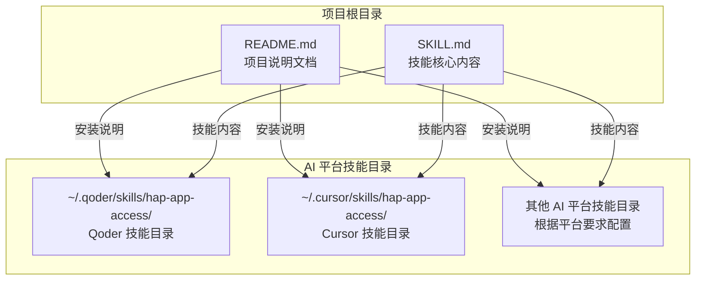
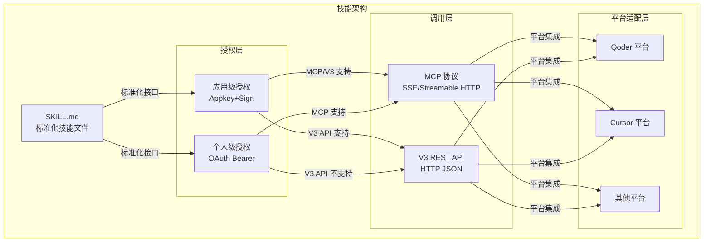
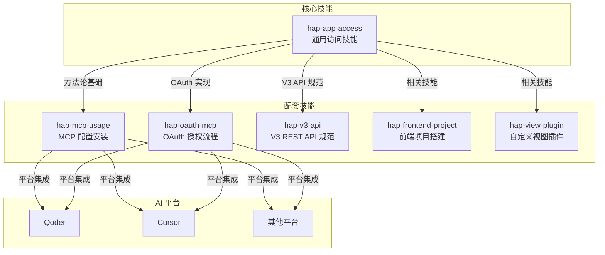

# 快速开始

<cite>
**本文引用的文件**
- [README.md](file://README.md)
- [SKILL.md](file://SKILL.md)
</cite>

## 目录
1. [简介](#简介)
2. [项目结构](#项目结构)
3. [核心组件](#核心组件)
4. [架构概览](#架构概览)
5. [详细组件分析](#详细组件分析)
6. [依赖关系分析](#依赖关系分析)
7. [性能考虑](#性能考虑)
8. [故障排除指南](#故障排除指南)
9. [结论](#结论)
10. [附录](#附录)

## 简介

明道云 HAP 应用通用访问技能是一个为 AI 工具平台设计的通用技能包，覆盖了两种授权类型（应用级 Appkey+Sign / 个人级 OAuth Bearer）与两种调用路径（MCP 协议 / V3 REST API）的交叉组合。该技能不包含任何具体业务逻辑，只提供通用的授权、连接、调用方法论与陷阱清单，帮助开发者和 AI 助手快速理解和正确使用明道云 HAP 应用的访问能力。

## 项目结构

该项目采用极简的单文件结构，包含以下核心文件：



**图表来源**
- [README.md: 7-19:7-19](file://README.md#L7-L19)
- [SKILL.md: 1-5:1-5](file://SKILL.md#L1-L5)

**章节来源**
- [README.md: 1-53:1-53](file://README.md#L1-L53)

## 核心组件

### 技能文件结构

SKILL.md 采用标准的 YAML 头部格式，包含技能的基本元数据：

- **名称**: hap-app-access
- **描述**: 明道云 HAP 应用通用访问技能
- **许可证**: MIT
- **版本**: v1.0

### 授权类型对比

该技能提供了两种核心授权类型的详细对比：

| 维度 | 应用级授权（Appkey+Sign） | 个人级授权（OAuth Bearer） |
|------|--------------------------|---------------------------|
| 身份 | 应用身份（不受人约束） | 个人身份（等同于登录用户） |
| 凭证 | Appkey + Sign（长期有效） | Bearer Token（约 1 天过期） |
| 权限范围 | 应用内 API 开关控制的全部数据 | 当前登录用户在应用中可见的数据 |
| 跨应用 | 只能访问所属应用 | 可跨应用访问用户有权限的所有应用 |
| 适用场景 | 后台定时任务、服务间同步、脚本自动化 | 个人数据查询、以用户视角读写数据 |
| 过期 | 不过期（除非在 HAP 后台重置） | 约 1 天，需要刷新机制 |

**章节来源**
- [SKILL.md: 13-32:13-32](file://SKILL.md#L13-L32)

### 调用路径对比

两种调用路径各有特点：

| 维度 | MCP 协议（SSE/Streamable HTTP） | V3 REST API（HTTP JSON） |
|------|-------------------------------|-------------------------|
| 协议 | MCP（Model Context Protocol） | 标准 HTTPS + JSON |
| 端点 | `https://api.mingdao.com/mcp` | `https://api.mingdao.com/v3/open/...` |
| 鉴权注入 | URL query 参数或 SSE Header | HTTP 请求头 |
| 工具发现 | 自动暴露 40~70 个工具 | 需查 API 文档 |
| 调用方式 | AI 工具原生支持（如 Qoder/Cursor 的 MCP 集成） | 代码中 `fetch`/`requests` 等 |
| 适合谁 | AI 助手直接操作数据 | 开发者在代码中集成 |
| 分页 | `pageSize` 上限 **90** | `pageSize` 上限 **1000** |
| 响应大小 | 单次约 **256KB** 缓冲上限 | 无此限制 |

**章节来源**
- [SKILL.md: 35-54:35-54](file://SKILL.md#L35-L54)

## 架构概览

该技能采用"通用方法论 + 平台无关"的设计理念，通过标准化的技能文件格式，让不同的 AI 工具平台能够统一识别和加载。



**图表来源**
- [SKILL.md: 57-64:57-64](file://SKILL.md#L57-L64)
- [README.md: 9-21:9-21](file://README.md#L9-L21)

## 详细组件分析

### 应用级授权（Appkey+Sign）

应用级授权是最常用的授权方式，适用于无人值守的自动化场景。

#### 凭证获取流程

1. 登录 HAP → 进入目标应用 → **应用设置** → **API 开发** → **API 密钥**
2. 复制 `Appkey` 和 `Sign`
3. 或复制 MCP URL：`https://api.mingdao.com/mcp?HAP-Appkey=<Appkey>&HAP-Sign=<Sign>`

#### MCP 路径配置

在 AI 工具的 MCP 配置中写入：

```json
{
  "mcpServers": {
    "hap-mcp-<应用名>": {
      "url": "https://api.mingdao.com/mcp?HAP-Appkey=<Appkey>&HAP-Sign=<Sign>"
    }
  }
}
```

配置后可用的典型工具（约 40 个）：
- `get_app_info` / `get_app_worksheets_list` / `get_worksheet_structure`
- `get_record_list` / `get_record_details` / `get_record_pivot_data`
- `create_record` / `update_record` / `delete_record`
- `batch_create_records` / `batch_update_records` / `batch_delete_records`

**章节来源**
- [SKILL.md: 68-97:68-97](file://SKILL.md#L68-L97)

#### V3 REST API 路径

**请求头**：
```
Content-Type: application/json
HAP-Appkey: <Appkey>
HAP-Sign: <Sign>
```

**常用端点**：
- 获取应用信息：GET `/v3/app/info`
- 获取工作表列表：GET `/v3/app/worksheets`
- 查询记录：POST `/v3/app/worksheets/{id}/rows/list`
- 创建记录：POST `/v3/app/worksheets/{id}/rows`
- 更新记录：PUT `/v3/app/worksheets/{id}/rows/{rowId}`
- 删除记录：DELETE `/v3/app/worksheets/{id}/rows/{rowId}`

**章节来源**
- [SKILL.md: 98-164:98-164](file://SKILL.md#L98-L164)

### 个人级授权（OAuth Bearer）

个人级授权适用于需要受用户权限约束的场景，支持跨应用访问。

#### 获取 Token 流程

1. 在 HAP 组织管理后台创建 **OAuth 应用**（获取 `client_id` / `client_secret`）
2. 通过 OAuth 授权码流程或资源所有者密码凭据流程获取 Bearer Token
3. 或使用 `hap-oauth-mcp` 技能自动完成授权 + 生成 MCP 配置

#### MCP 路径配置

```json
{
  "mcpServers": {
    "HAP-Personal-MCP": {
      "url": "https://api.mingdao.com/mcp?Authorization=Bearer%20<Token>"
    }
  }
}
```

配置后可用的典型工具（约 60~70 个）：
- 涵盖应用级的全部工具
- 额外包含：`get_org_list`（组织列表）、跨应用数据访问等
- 受用户权限约束：只能看到用户有权限的应用和工作表

**章节来源**
- [SKILL.md: 168-192:168-192](file://SKILL.md#L168-L192)

#### MCP 调用必填参数

Personal MCP 的**每次工具调用**必须额外提供：

```json
{
  "appId": "<目标应用的 AppID>",
  "ai_description": "<本次调用的用途描述>",
  "worksheetId": "<工作表 ID>",
  "...": "其他业务参数"
}
```

- `appId`：必填，标识访问哪个应用，否则返回 401
- `ai_description`：必填，HAP 服务端用于审计和鉴权校验，否则返回 401

**章节来源**
- [SKILL.md: 193-210:193-210](file://SKILL.md#L193-L210)

#### Token 过期与刷新

Bearer Token 有效期约 **1 天**，过期后所有 Personal MCP 调用返回鉴权失败。

**刷新策略**：
- 主动检测：调用前检查 token 的 `expires_at` / `refreshed_at`，提前刷新
- 被动重试：调用返回鉴权失败时，自动刷新 token 并重试一次
- 手动刷新：使用 `hap-oauth-mcp` 技能重新生成 MCP 配置

**章节来源**
- [SKILL.md: 211-229:211-229](file://SKILL.md#L211-L229)

### 通用调用规范

#### 驼峰命名

所有参数使用驼峰：`pageSize` / `pageIndex` / `useFieldIdAsKey` / `worksheetId`（不是 `page_size` / `page_index`）。

#### Filter 结构

```json
{
  "filter": {
    "type": "group",
    "logic": "AND",
    "children": [
      {
        "type": "condition",
        "field": "<fieldId 或 alias>",
        "operator": "eq",
        "value": ["<值>"]
      }
    ]
  }
}
```

规则：
- 顶层必须是 `group`
- 最多两层嵌套：`group → group → condition`
- `operator` 是字符串：`"eq"` / `"in"` / `"between"` / `"contains"` / `"belongsto"` 等

#### 分页

| 路径 | pageSize 上限 | 推荐值 | 说明 |
|------|-------------|--------|------|
| MCP `get_record_list` | **90** | 50 | 单次响应有 ~256KB 缓冲上限，大表必须降 page_size |
| V3 API `rows/list` | **1000** | 100~500 | 无缓冲限制，但不宜过大 |

**章节来源**
- [SKILL.md: 250-298:250-298](file://SKILL.md#L250-L298)

## 依赖关系分析

该技能与其他 HAP 技能存在明确的依赖关系：



**图表来源**
- [README.md: 39-48:39-48](file://README.md#L39-L48)

**章节来源**
- [README.md: 39-48:39-48](file://README.md#L39-L48)

## 性能考虑

### 响应大小限制

MCP 协议的单次响应有约 256KB 的缓冲上限，超出会抛出异常。对于大表查询，建议：
- 降低 `pageSize`（大表推荐 50）
- 或改用 V3 REST API

### 分页策略

必须翻页获取全部记录，**不可用单页数据做全局统计**。建议：
- MCP：使用 50 的 page_size
- V3 API：使用 100~500 的 page_size

### 字段 ID 处理

当使用 `useFieldIdAsKey=True` 时，读取时必须用 UUID 做 key，否则取不到值。这是最常见的踩坑点之一。

## 故障排除指南

### 常见错误码

| 错误码 | 含义 | 典型原因 | 解法 |
|--------|------|---------|------|
| `1` | 成功 | — | — |
| `-1` | 通用失败 | 查看 `error_msg` | 按 error_msg 排查 |
| `4` | 权限不足 | 当前身份无该操作权限 | 检查授权类型和用户权限 |
| `10` | 参数错误 | 参数缺失或格式错误 | 检查参数名（驼峰）和值格式 |
| `10001` | HTTP Headers 验证失败 | OAuth token 域名不在白名单 | 确认使用 `api.mingdao.com` |
| `600101` | 授权已失效 | Bearer token 过期 | 刷新 token |
| `600100` | token 无效/缺失 | token 为空或格式错误 | 检查 Authorization 头 |

### 10001 vs 600101 的区分

| 表现 | 含义 | 路径 |
|------|------|------|
| `10001 Http Headers verification failed` | 域名/scope 层白名单不匹配 | HAP V3 代理层拦截 |
| `600101 授权已失效` / `invalid_token` | token 本身过期或无效 | OAuth introspection 服务拦截 |

**章节来源**
- [SKILL.md: 378-398:378-398](file://SKILL.md#L378-L398)

### 陷阱清单

#### 选项字段写入

写入 SingleSelect / MultipleSelect 字段时，value 必须传 **option key（UUID）** 的数组，不能传显示文本。

#### 关联字段 get_record_list 可能丢失

`get_record_list` 对部分 Relation 字段可能返回空字符串 `""`，即使后端确实挂了关联。**解法**：对空值关联字段，额外调 `get_record_details(rowId)` 补全。

#### OAuth Bearer 域名白名单

OAuth App 的 Bearer Token 只对**创建该 App 时配置的域名**鉴权有效。当前明道云默认只对 `api.mingdao.com` 白名单。

**章节来源**
- [SKILL.md: 301-376:301-376](file://SKILL.md#L301-L376)

## 结论

明道云 HAP 应用通用访问技能通过标准化的方法论和清晰的配置指南，为不同类型的 AI 工具平台提供了统一的访问入口。其核心优势在于：

1. **平台无关性**：通过标准的 SKILL.md 格式，可在多种 AI 平台间无缝切换
2. **方法论导向**：提供清晰的授权类型选择和调用路径决策框架
3. **实用性强**：包含完整的配置示例、常见陷阱和故障排除方案
4. **扩展性好**：与其他 HAP 技能形成完整的技能生态

新用户可以按照本文档的安装和配置步骤，在最短时间内掌握 HAP 应用的访问方法，并根据具体需求选择合适的授权类型和调用路径。

## 附录

### 快速决策流程

```
需要访问 HAP 应用数据
│
├─ 是否需要无人值守/定时运行？
│   ├─ 是 → 应用级 Appkey+Sign
│   │       ├─ AI 直接操作 → MCP（§4.2）
│   │       └─ 代码集成 → V3 API（§4.3）
│   │
│   └─ 否 → 需要受用户权限约束？
│       ├─ 是 → 个人级 OAuth Bearer
│       │       └─ 只能走 MCP（§5.2），注意 appId + ai_description
│       │
│       └─ 否 → 应用级 Appkey+Sign（更简单）
│               ├─ AI 直接操作 → MCP（§4.2）
│               └─ 代码集成 → V3 API（§4.3）
```

### API Host 支持

| 产品线 | API Host | MCP URL 示例 |
|--------|----------|-------------|
| 明道云 HAP | `https://api.mingdao.com` | `https://api.mingdao.com/mcp?...` |
| Nocoly HAP | `https://www.nocoly.com` | `https://www.nocoly.com/mcp?...` |
| 私有部署 | `https://<域名>/api` | `https://<域名>/mcp?...` |

**章节来源**
- [SKILL.md: 401-418:401-418](file://SKILL.md#L401-L418)
- [SKILL.md: 236-246:236-246](file://SKILL.md#L236-L246)