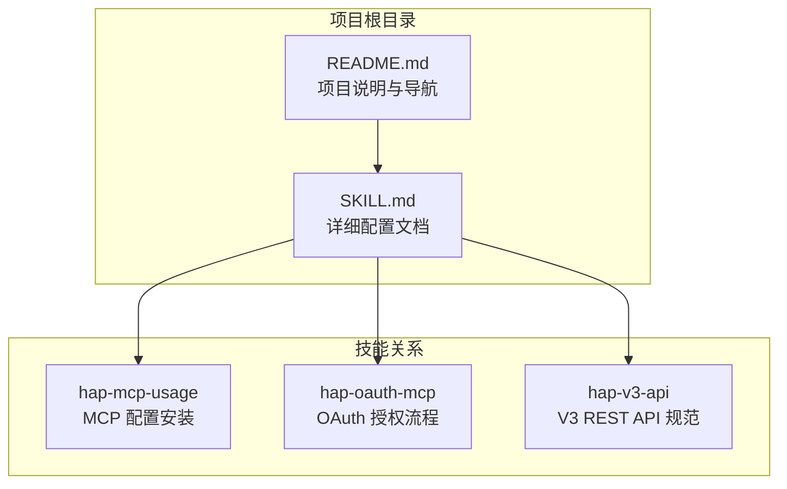
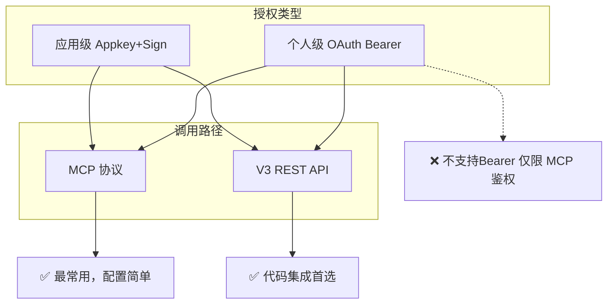
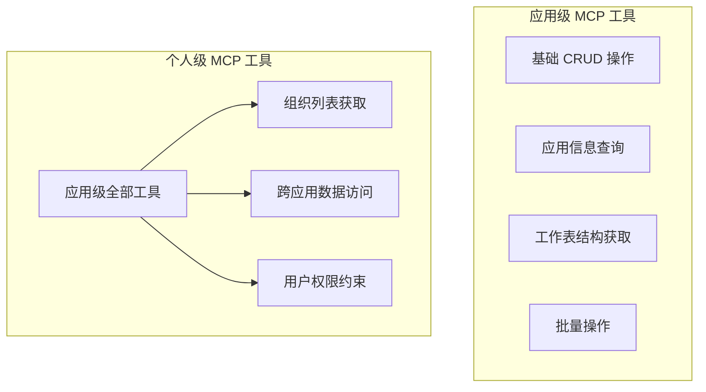
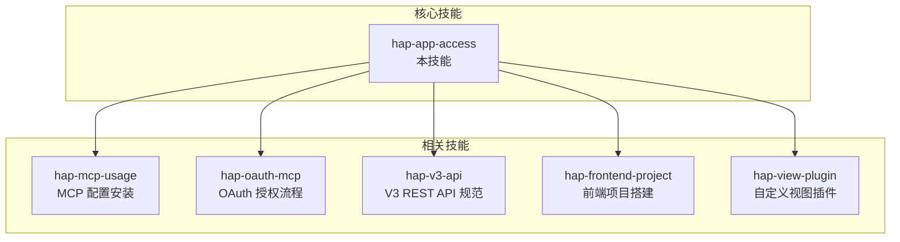
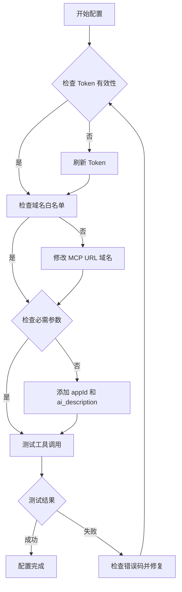
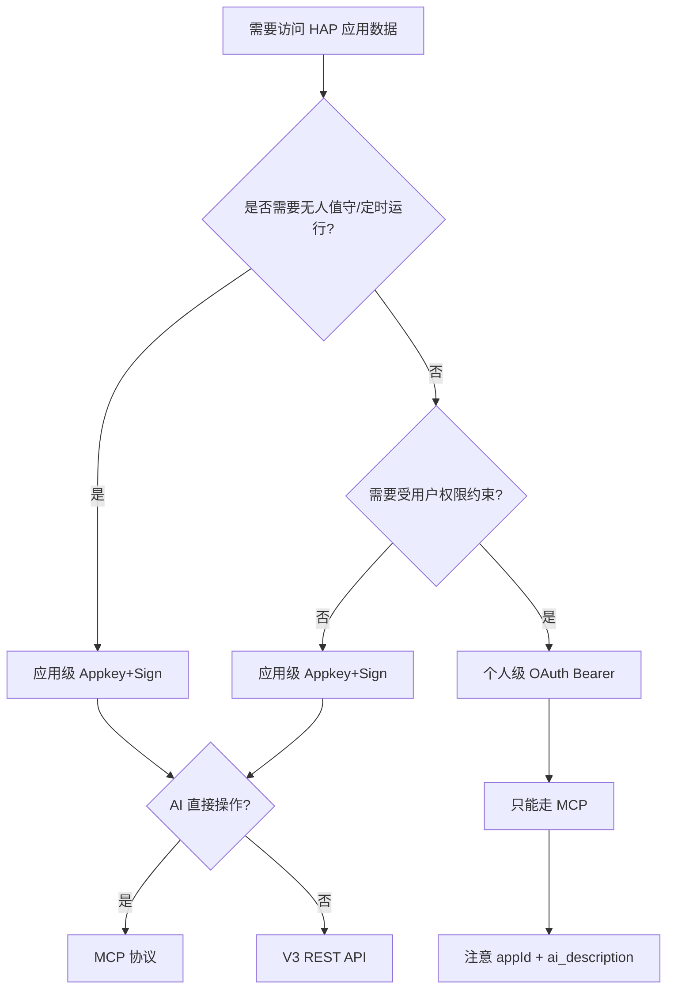

# MCP 协议配置

<cite>
**本文引用的文件**
- [README.md](file://README.md)
- [SKILL.md](file://SKILL.md)
</cite>

## 目录
1. [简介](#简介)
2. [项目结构](#项目结构)
3. [核心组件](#核心组件)
4. [架构概览](#架构概览)
5. [详细组件分析](#详细组件分析)
6. [依赖关系分析](#依赖关系分析)
7. [性能考虑](#性能考虑)
8. [故障排除指南](#故障排除指南)
9. [结论](#结论)
10. [附录](#附录)

## 简介

本文件专注于明道云 HAP 应用的 OAuth Bearer 在 MCP 协议中的配置方法。MCP（Model Context Protocol）是明道云提供的一种流式协议，允许 AI 工具直接与 HAP 应用进行交互。本文档详细解释了如何在 AI 工具的 MCP 配置中正确设置 Authorization: Bearer Token，包括配置格式、参数说明和最佳实践。

明道云 HAP 应用支持两种授权类型：应用级 Appkey+Sign 和个人级 OAuth Bearer。对于 OAuth Bearer Token，它只能用于 MCP 协议调用，不能用于 V3 REST API 直连。个人级授权具有跨应用访问能力，权限范围受限于当前登录用户的权限。

## 项目结构

该项目采用极简的双文件结构，专注于提供明道云 HAP 应用访问的通用方法论：



**图表来源**
- [README.md: 1-53:1-53](file://README.md#L1-L53)
- [SKILL.md: 422-436:422-436](file://SKILL.md#L422-L436)

**章节来源**
- [README.md: 1-53:1-53](file://README.md#L1-L53)
- [SKILL.md: 1-436:1-436](file://SKILL.md#L1-L436)

## 核心组件

### 授权类型对比

明道云 HAP 应用提供两种授权类型，每种都有其特定的使用场景：

| 维度 | 应用级授权（Appkey+Sign） | 个人级授权（OAuth Bearer） |
|------|--------------------------|---------------------------|
| 身份 | 应用身份（不受人约束） | 个人身份（等同于登录用户） |
| 凭证 | Appkey + Sign（长期有效） | Bearer Token（约 1 天过期） |
| 权限范围 | 应用内 API 开关控制的全部数据 | 当前登录用户在应用中可见的数据 |
| 跨应用 | 只能访问所属应用 | 可跨应用访问用户有权限的所有应用 |
| 适用场景 | 后台定时任务、服务间同步、脚本自动化 | 个人数据查询、以用户视角读写数据 |
| 过期 | 不过期（除非在 HAP 后台重置） | 约 1 天，需要刷新机制 |
| 获取位置 | HAP 后台 → 应用 → API 开发 → API 密钥 | OAuth 授权流程 |

**章节来源**
- [SKILL.md: 13-32:13-32](file://SKILL.md#L13-L32)

### 调用路径对比

明道云 HAP 提供两种调用路径，适用于不同的使用场景：

| 维度 | MCP 协议（SSE/Streamable HTTP） | V3 REST API（HTTP JSON） |
|------|-------------------------------|-------------------------|
| 协议 | MCP（Model Context Protocol） | 标准 HTTPS + JSON |
| 端点 | `https://api.mingdao.com/mcp` | `https://api.mingdao.com/v3/open/...` |
| 鉴权注入 | URL query 参数或 SSE Header | HTTP 请求头 |
| 工具发现 | 自动暴露 40~70 个工具 | 需查 API 文档 |
| 调用方式 | AI 工具原生支持（如 Qoder/Cursor 的 MCP 集成） | 代码中 `fetch`/`requests` 等 |
| 适合谁 | AI 助手直接操作数据 | 开发者在代码中集成 |
| 分页 | `pageSize` 上限 **90** | `pageSize` 上限 **1000** |
| 响应大小 | 单次约 **256KB** 缓冲上限 | 无此限制 |

**章节来源**
- [SKILL.md: 35-54:35-54](file://SKILL.md#L35-L54)

## 架构概览

### 交叉矩阵：2×2 = 4 种组合

明道云 HAP 应用的授权类型与调用路径形成了一个完整的交叉矩阵：



**图表来源**
- [SKILL.md: 57-65:57-65](file://SKILL.md#L57-L65)

### 关键限制说明

存在一个重要的技术限制：OAuth Bearer Token 不能用于 V3 REST API 直连，只能用于 MCP 协议调用。V3 API 只认 Appkey+Sign。

**章节来源**
- [SKILL.md: 64](file://SKILL.md#L64)

## 详细组件分析

### OAuth Bearer 在 MCP 中的配置

#### 基本配置格式

在 AI 工具的 MCP 配置中，OAuth Bearer Token 的配置格式如下：

```json
{
  "mcpServers": {
    "HAP-Personal-MCP": {
      "url": "https://api.mingdao.com/mcp?Authorization=Bearer%20<Token>"
    }
  }
}
```

#### 配置参数说明

| 参数 | 类型 | 必填 | 说明 |
|------|------|------|------|
| `mcpServers` | 对象 | 是 | MCP 服务器配置集合 |
| `HAP-Personal-MCP` | 字符串 | 是 | 服务器名称标识 |
| `url` | 字符串 | 是 | MCP 服务器地址，包含 Authorization 参数 |

**章节来源**
- [SKILL.md: 176-186:176-186](file://SKILL.md#L176-L186)

#### 配置后可用的典型工具

个人级 OAuth Bearer 配置后，MCP 会暴露约 60-70 个工具，这些工具涵盖了应用级的全部功能，并增加了以下个人级特有能力：

**应用级工具（40+ 个）**：
- `get_app_info` / `get_app_worksheets_list` / `get_worksheet_structure`
- `get_record_list` / `get_record_details` / `get_record_pivot_data`
- `create_record` / `update_record` / `delete_record`
- `batch_create_records` / `batch_update_records` / `batch_delete_records`

**个人级扩展工具（20+ 个）**：
- `get_org_list`（组织列表）
- 跨应用数据访问能力
- 受用户权限约束的数据访问

**章节来源**
- [SKILL.md: 90-97:90-97](file://SKILL.md#L90-L97)
- [SKILL.md: 188-192:188-192](file://SKILL.md#L188-L192)

### 个人级 MCP 的必需参数

与应用级不同，个人级 MCP 的每次工具调用都必须提供额外的参数：

```json
{
  "appId": "<目标应用的 AppID>",
  "ai_description": "<本次调用的用途描述>",
  "worksheetId": "<工作表 ID>",
  "...": "其他业务参数"
}
```

#### 参数详细说明

| 参数 | 类型 | 必填 | 说明 |
|------|------|------|------|
| `appId` | 字符串 | 是 | 标识访问哪个应用，否则返回 401 |
| `ai_description` | 字符串 | 是 | HAP 服务端用于审计和鉴权校验，否则返回 401 |
| `worksheetId` | 字符串 | 是 | 工作表 ID，用于指定具体的工作表操作 |

**章节来源**
- [SKILL.md: 193-210:193-210](file://SKILL.md#L193-L210)

### Token 过期与刷新机制

OAuth Bearer Token 有效期约为 1 天，过期后所有 Personal MCP 调用都会返回鉴权失败。

#### 刷新策略

| 策略 | 描述 | 适合场景 |
|------|------|---------|
| 主动检测 | 调用前检查 token 的 `expires_at` / `refreshed_at`，提前刷新 | 定时任务、长时间运行的脚本 |
| 被动重试 | 调用返回鉴权失败时，自动刷新 token 并重试一次 | 简单脚本、交互式工具 |
| 手动刷新 | 使用 `hap-oauth-mcp` 技能重新生成 MCP 配置 | 偶尔使用、调试 |

#### 鉴权失败的典型表现

- `isError: true` + `error_code: 600101`（授权已失效）
- 响应包含 `token无效` / `token过期` / `Authorization failed` 等关键词
- `success: false`

**章节来源**
- [SKILL.md: 211-229:211-229](file://SKILL.md#L211-L229)

### 与应用级 MCP 工具的区别

个人级 MCP 与应用级 MCP 在工具集上存在显著差异：



**图表来源**
- [SKILL.md: 188-192:188-192](file://SKILL.md#L188-L192)

**章节来源**
- [SKILL.md: 188-192:188-192](file://SKILL.md#L188-L192)

## 依赖关系分析

### 技能依赖关系

该项目与其他相关技能形成了清晰的依赖关系：



**图表来源**
- [README.md: 39-49:39-49](file://README.md#L39-L49)
- [SKILL.md: 422-431:422-431](file://SKILL.md#L422-L431)

### 配置示例路径

为了便于查找具体的配置示例，以下是相关的配置示例所在的位置：

- **应用级 MCP 配置示例**：[SKILL.md: 80-88:80-88](file://SKILL.md#L80-L88)
- **个人级 MCP 配置示例**：[SKILL.md: 178-186:178-186](file://SKILL.md#L178-L186)
- **个人级 MCP 必需参数示例**：[SKILL.md: 197-204:197-204](file://SKILL.md#L197-L204)

**章节来源**
- [SKILL.md: 80-88:80-88](file://SKILL.md#L80-L88)
- [SKILL.md: 178-186:178-186](file://SKILL.md#L178-L186)
- [SKILL.md: 197-204:197-204](file://SKILL.md#L197-L204)

## 性能考虑

### MCP 协议的性能特点

MCP 协议具有以下性能特征：

- **单次响应限制**：MCP 协议的单次响应有约 256KB 的缓冲上限
- **分页限制**：`pageSize` 上限为 90
- **推荐值**：对于大表，建议使用 50 的页面大小

### V3 REST API 的性能优势

与 MCP 相比，V3 REST API 具有以下优势：

- **无响应大小限制**：理论上可以处理更大的响应数据
- **更高的分页上限**：`pageSize` 上限为 1000
- **推荐值**：建议使用 100-500 的页面大小

**章节来源**
- [SKILL.md: 280-288:280-288](file://SKILL.md#L280-L288)

## 故障排除指南

### 常见配置问题及解决方案

#### 10001 错误码问题

**问题表现**：`10001 Http Headers verification failed`

**原因分析**：OAuth token 域名不在白名单

**解决方案**：确保 MCP URL 中的域名与 OAuth App 白名单一致（使用 `api.mingdao.com`）

#### 600101 错误码问题

**问题表现**：`600101 授权已失效` / `invalid_token`

**原因分析**：token 本身过期或无效

**解决方案**：刷新 token 或检查 Authorization 头格式

#### 401 未授权问题

**问题表现**：每次调用都返回 401

**原因分析**：缺少必需的 `appId` 和 `ai_description` 参数

**解决方案**：在每次工具调用时提供这两个必需参数

**章节来源**
- [SKILL.md: 378-398:378-398](file://SKILL.md#L378-L398)
- [SKILL.md: 372-375:372-375](file://SKILL.md#L372-L375)

### 配置验证流程



**图表来源**
- [SKILL.md: 378-398:378-398](file://SKILL.md#L378-L398)

## 结论

明道云 HAP 应用的 OAuth Bearer 在 MCP 协议中的配置相对简单，但需要注意几个关键点：

1. **授权类型选择**：根据使用场景选择应用级或个人级授权
2. **配置格式正确性**：确保 Authorization 头格式正确，使用 `Bearer <Token>` 格式
3. **必需参数提供**：个人级 MCP 调用必须提供 `appId` 和 `ai_description`
4. **Token 管理**：建立有效的 Token 刷新机制，避免过期导致的调用失败
5. **域名白名单**：确保 MCP URL 域名与 OAuth App 白名单一致

通过遵循本文档的指导，开发者可以成功配置并使用 OAuth Bearer Token 通过 MCP 协议访问明道云 HAP 应用的数据。

## 附录

### 快速决策流程



**图表来源**
- [SKILL.md: 401-418:401-418](file://SKILL.md#L401-L418)

### 相关技能索引

- **hap-mcp-usage**：MCP 配置的自动化安装（9 种 AI 工具平台）
- **hap-oauth-mcp**：OAuth 授权流程 + Bearer Token 获取/刷新
- **hap-v3-api**：V3 REST API 的完整使用规范
- **hap-frontend-project**：使用 HAP 作为后端搭建独立网站
- **hap-view-plugin**：开发 HAP 自定义视图插件

**章节来源**
- [README.md: 39-49:39-49](file://README.md#L39-L49)
- [SKILL.md: 422-431:422-431](file://SKILL.md#L422-L431)