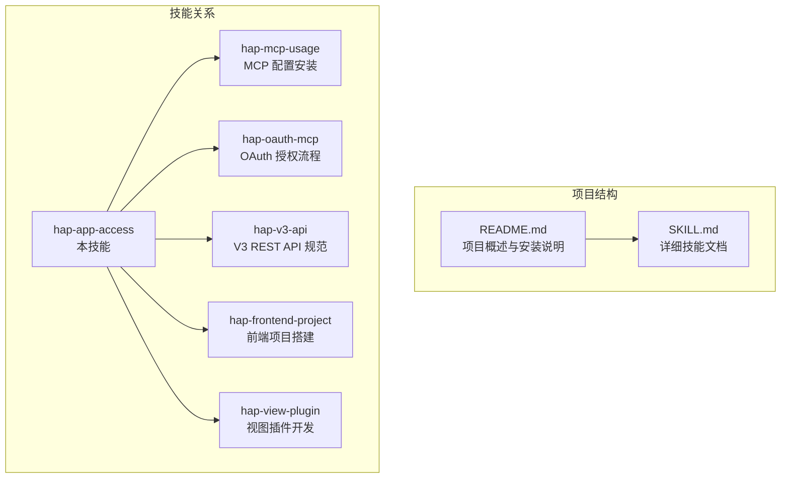
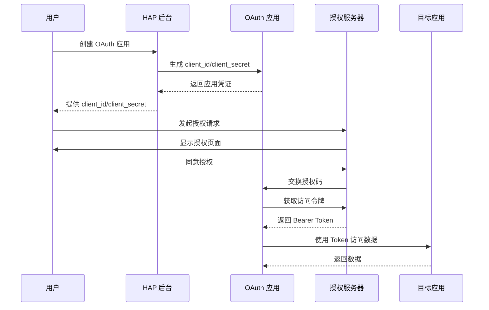
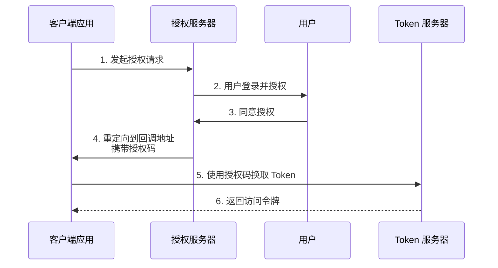
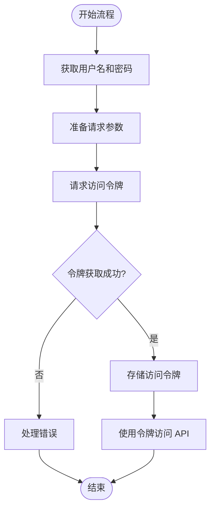
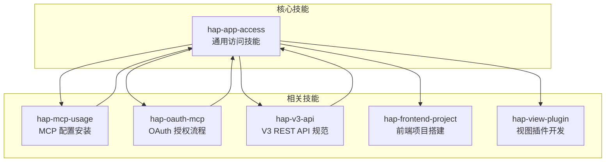
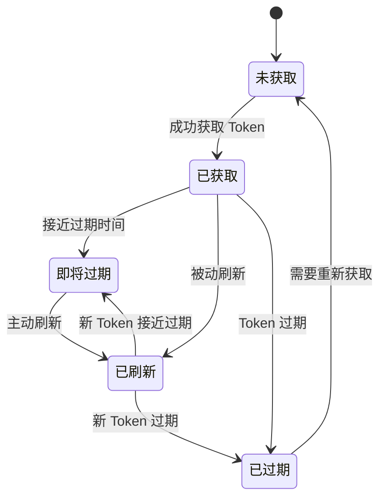
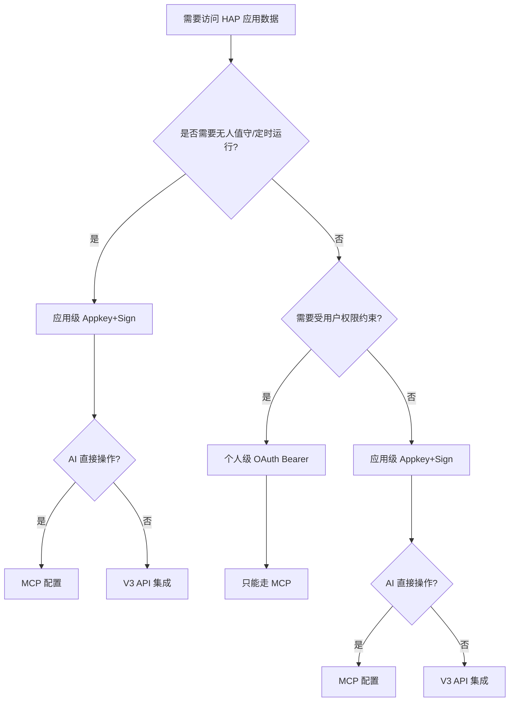

# Token 获取流程

<cite>
**本文引用的文件**
- [README.md](file://README.md)
- [SKILL.md](file://SKILL.md)
</cite>

## 目录
1. [简介](#简介)
2. [项目结构](#项目结构)
3. [核心组件](#核心组件)
4. [架构概览](#架构概览)
5. [详细组件分析](#详细组件分析)
6. [依赖关系分析](#依赖关系分析)
7. [性能考虑](#性能考虑)
8. [故障排除指南](#故障排除指南)
9. [结论](#结论)
10. [附录](#附录)

## 简介

本文档详细阐述了明道云 HAP 应用的 OAuth Bearer Token 获取流程，包括在 HAP 组织管理后台创建 OAuth 应用并获取 client_id 和 client_secret 的步骤，以及通过 OAuth 授权码流程或资源所有者密码凭据流程获取 Bearer Token 的完整过程。

明道云 HAP 应用提供两种授权类型：应用级 Appkey+Sign 和个人级 OAuth Bearer。OAuth Bearer Token 特别适用于需要受用户权限约束的场景，能够跨应用访问用户有权限的所有应用。

## 项目结构

该项目采用文档驱动的方式，通过 Markdown 文件提供完整的技能说明和最佳实践指导。



**图表来源**
- [README.md: 1-53:1-53](file://README.md#L1-L53)
- [SKILL.md: 401-436:401-436](file://SKILL.md#L401-L436)

**章节来源**
- [README.md: 1-53:1-53](file://README.md#L1-L53)
- [SKILL.md: 23-37:23-37](file://SKILL.md#L23-L37)

## 核心组件

### 授权类型对比

| 维度 | 应用级授权（Appkey+Sign） | 个人级授权（OAuth Bearer） |
|------|--------------------------|---------------------------|
| 身份 | 应用身份（不受人约束） | 个人身份（等同于登录用户） |
| 凭证 | Appkey + Sign（长期有效） | Bearer Token（约 1 天过期） |
| 权限范围 | 应用内 API 开关控制的全部数据 | 当前登录用户在应用中可见的数据 |
| 跨应用 | 只能访问所属应用 | 可跨应用访问用户有权限的所有应用 |
| 适用场景 | 后台定时任务、服务间同步、脚本自动化 | 个人数据查询、以用户视角读写数据 |
| 过期 | 不过期（除非在 HAP 后台重置） | 约 1 天，需要刷新机制 |
| 获取位置 | HAP 后台 → 应用 → API 开发 → API 密钥 | OAuth 授权流程 |

### 选择原则

- 需要**无人值守运行** → 应用级（Appkey+Sign）
- 需要**受用户权限约束** → 个人级（OAuth Bearer）
- 需要跨多个应用 → 个人级（一个 token 覆盖多应用）
- 两者都可用 → 优先应用级（无过期风险）

**章节来源**
- [SKILL.md: 13-32:13-32](file://SKILL.md#L13-L32)

## 架构概览

OAuth Bearer Token 获取流程涉及多个组件和交互步骤：



**图表来源**
- [SKILL.md: 170-175:170-175](file://SKILL.md#L170-L175)

## 详细组件分析

### OAuth 应用创建流程

#### 步骤 1：登录 HAP 后台
1. 登录明道云 HAP 组织管理后台
2. 进入目标应用 → **应用设置** → **API 开发** → **API 密钥**
3. 点击创建 OAuth 应用按钮

#### 步骤 2：配置应用信息
- 应用名称：自定义应用名称
- 应用描述：简要描述应用用途
- 域名白名单：配置允许使用该 OAuth 应用的域名
- 授权回调地址：配置授权成功后的回调 URL

#### 步骤 3：获取凭证
1. 复制 `client_id` 和 `client_secret`
2. 这些凭证将在后续的 Token 获取流程中使用

**章节来源**
- [SKILL.md: 170-175:170-175](file://SKILL.md#L170-L175)

### 授权码流程（Authorization Code Flow）

授权码流程适用于 Web 应用和移动应用，提供最高的安全性。



**图表来源**
- [SKILL.md: 172-174:172-174](file://SKILL.md#L172-L174)

#### 参数配置

| 参数 | 必填 | 类型 | 说明 |
|------|------|------|------|
| response_type | 是 | string | 固定为 "code" |
| client_id | 是 | string | OAuth 应用的 client_id |
| redirect_uri | 是 | string | 授权回调地址 |
| scope | 否 | string | 权限范围 |
| state | 建议 | string | CSRF 保护参数 |

### 资源所有者密码凭据流程（Resource Owner Password Credentials Flow）

该流程适用于可信客户端，如企业内部应用。



**图表来源**
- [SKILL.md: 172-174:172-174](file://SKILL.md#L172-L174)

#### 参数配置

| 参数 | 必填 | 类型 | 说明 |
|------|------|------|------|
| grant_type | 是 | string | 固定为 "password" |
| client_id | 是 | string | OAuth 应用的 client_id |
| client_secret | 是 | string | OAuth 应用的 client_secret |
| username | 是 | string | 用户名 |
| password | 是 | string | 用户密码 |
| scope | 否 | string | 权限范围 |

### Token 获取完整过程

#### 授权码流程实现步骤

1. **发起授权请求**
   - 构建授权 URL
   - 包含必要的查询参数
   - 重定向用户到授权页面

2. **处理授权回调**
   - 接收授权码
   - 验证 state 参数
   - 保存授权码

3. **交换访问令牌**
   - 使用授权码向 Token 服务器申请访问令牌
   - 验证响应数据
   - 存储访问令牌

4. **使用访问令牌**
   - 在请求头中添加 Authorization: Bearer <token>
   - 访问受保护的 API

#### 资源所有者密码凭据流程实现步骤

1. **收集用户凭据**
   - 获取用户名和密码
   - 验证用户输入

2. **请求访问令牌**
   - 构建请求参数
   - 发送 HTTP 请求
   - 处理响应

3. **存储和使用令牌**
   - 安全存储访问令牌
   - 设置过期时间
   - 自动刷新机制

**章节来源**
- [SKILL.md: 168-234:168-234](file://SKILL.md#L168-L234)

### MCP 配置与 Token 使用

#### Personal MCP 配置

```json
{
  "mcpServers": {
    "HAP-Personal-MCP": {
      "url": "https://api.mingdao.com/mcp?Authorization=Bearer%20<Token>"
    }
  }
}
```

#### 必填参数

Personal MCP 的每次工具调用必须额外提供：

```json
{
  "appId": "<目标应用的 AppID>",
  "ai_description": "<本次调用的用途描述>",
  "worksheetId": "<工作表 ID>",
  "...": "其他业务参数"
}
```

- `appId`：必填，标识访问哪个应用
- `ai_description`：必填，HAP 服务端用于审计和鉴权校验

**章节来源**
- [SKILL.md: 176-210:176-210](file://SKILL.md#L176-L210)

## 依赖关系分析

### 技能依赖关系



**图表来源**
- [README.md: 39-49:39-49](file://README.md#L39-L49)
- [SKILL.md: 422-431:422-431](file://SKILL.md#L422-L431)

### Token 生命周期管理



**图表来源**
- [SKILL.md: 211-229:211-229](file://SKILL.md#L211-L229)

**章节来源**
- [README.md: 39-49:39-49](file://README.md#L39-L49)
- [SKILL.md: 422-431:422-431](file://SKILL.md#L422-L431)

## 性能考虑

### Token 刷新策略

| 策略 | 描述 | 适合场景 |
|------|------|---------|
| 主动检测 | 调用前检查 token 的 `expires_at` / `refreshed_at`，提前刷新 | 定时任务、长时间运行的脚本 |
| 被动重试 | 调用返回鉴权失败时，自动刷新 token 并重试一次 | 简单脚本、交互式工具 |
| 手动刷新 | 使用 `hap-oauth-mcp` 技能重新生成 MCP 配置 | 偶尔使用、调试 |

### 响应大小限制

- **MCP 协议**：单次响应约 256KB 缓冲上限
- **V3 REST API**：无此限制，但建议避免过大请求体

**章节来源**
- [SKILL.md: 215-229:215-229](file://SKILL.md#L215-L229)
- [SKILL.md: 344-349:344-349](file://SKILL.md#L344-L349)

## 故障排除指南

### 常见错误及解决方案

#### 错误码速查

| 错误码 | 含义 | 典型原因 | 解法 |
|--------|------|---------|------|
| `1` | 成功 | — | — |
| `-1` | 通用失败 | 查看 `error_msg` | 按 error_msg 排查 |
| `4` | 权限不足 | 当前身份无该操作权限 | 检查授权类型和用户权限 |
| `10` | 参数错误 | 参数缺失或格式错误 | 检查参数名（驼峰）和值格式 |
| `10001` | HTTP Headers 验证失败 | OAuth token 域名不在白名单 | 确认使用 `api.mingdao.com` |
| `600101` | 授权已失效 | Bearer token 过期 | 刷新 token |
| `600100` | token 无效/缺失 | token 为空或格式错误 | 检查 Authorization 头 |

#### 10001 vs 600101 的区分

| 表现 | 含义 | 路径 |
|------|------|------|
| `10001 Http Headers verification failed` | 域名/scope 层白名单不匹配 | HAP V3 代理层拦截 |
| `600101 授权已失效` / `invalid_token` | token 本身过期或无效 | OAuth introspection 服务拦截 |

**章节来源**
- [SKILL.md: 378-398:378-398](file://SKILL.md#L378-L398)

### 域名白名单问题

OAuth App 的 Bearer Token 只对**创建该 App 时配置的域名**鉴权有效。当前明道云默认只对 `api.mingdao.com` 白名单。

- 调 `api.mingdao.com` → 正常
- 调 `api2.mingdao.com` → 返回 `error_code: 10001 Http Headers verification failed`

**解法**：确保 MCP URL 中的域名与 OAuth App 白名单一致（用 `api.mingdao.com`）。

**章节来源**
- [SKILL.md: 335-343:335-343](file://SKILL.md#L335-L343)

### Token 过期处理

**鉴权失败的典型表现**：
- `isError: true` + `error_code: 600101`（授权已失效）
- 响应包含 `token无效` / `token过期` / `Authorization failed` 等关键词
- `success: false`

**章节来源**
- [SKILL.md: 223-227:223-227](file://SKILL.md#L223-L227)

## 结论

OAuth Bearer Token 获取流程为明道云 HAP 应用提供了灵活的个人级授权方案。通过在 HAP 组织管理后台创建 OAuth 应用并获取 client_id 和 client_secret，开发者可以选择合适的授权流程来满足不同的应用场景需求。

关键要点：
1. **选择合适的授权类型**：根据是否需要无人值守运行和用户权限约束来选择
2. **正确配置 OAuth 应用**：确保域名白名单和回调地址配置正确
3. **实现适当的 Token 管理**：建立有效的过期检测和刷新机制
4. **遵循安全最佳实践**：妥善保管 client_secret，定期轮换凭证

对于需要跨应用访问和受用户权限约束的场景，OAuth Bearer Token 是理想的选择。而对于后台定时任务和无人值守场景，应用级 Appkey+Sign 更为合适。

## 附录

### 快速决策流程



**图表来源**
- [SKILL.md: 401-418:401-418](file://SKILL.md#L401-L418)

### 相关技能索引

- `hap-mcp-usage`：MCP 配置的自动化安装（9 种 AI 工具平台）
- `hap-oauth-mcp`：OAuth 授权流程 + Bearer Token 获取/刷新
- `hap-v3-api`：V3 REST API 的完整使用规范
- `hap-frontend-project`：使用 HAP 作为后端搭建独立网站
- `hap-view-plugin`：开发 HAP 自定义视图插件

**章节来源**
- [SKILL.md: 422-431:422-431](file://SKILL.md#L422-L431)