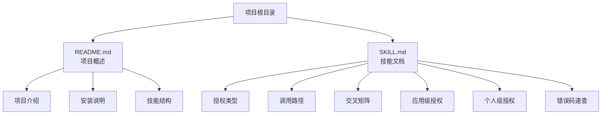
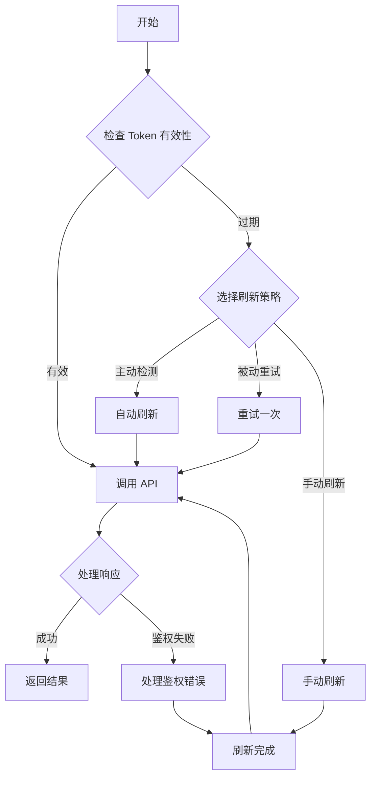
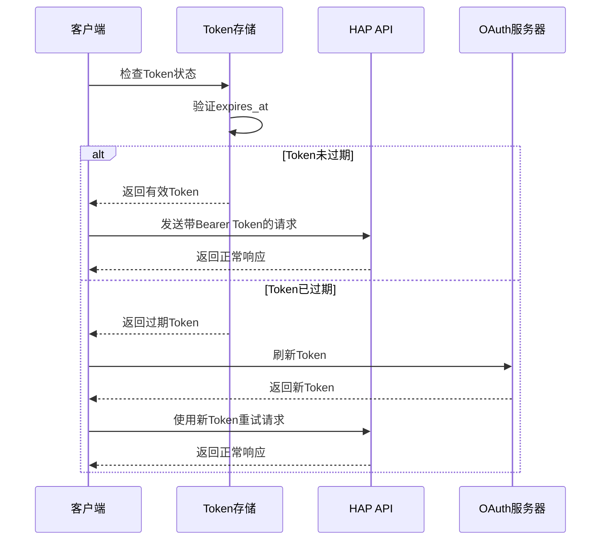
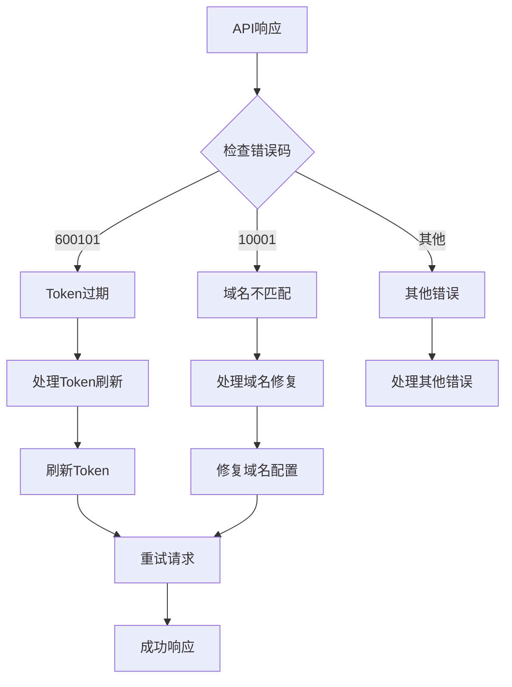
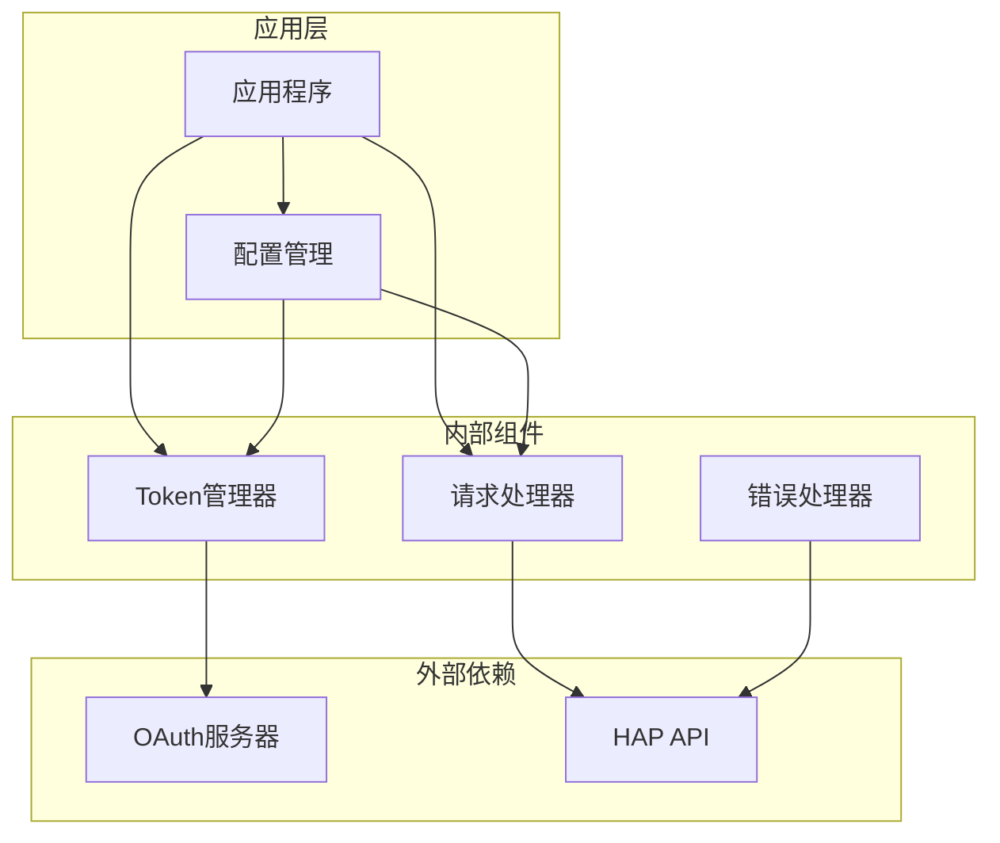

# Token 过期与刷新

<cite>
**本文档引用的文件**
- [README.md](file://README.md)
- [SKILL.md](file://SKILL.md)
</cite>

## 目录
1. [简介](#简介)
2. [项目结构](#项目结构)
3. [核心组件](#核心组件)
4. [架构概览](#架构概览)
5. [详细组件分析](#详细组件分析)
6. [依赖关系分析](#依赖关系分析)
7. [性能考虑](#性能考虑)
8. [故障排除指南](#故障排除指南)
9. [结论](#结论)

## 简介

本文档专注于明道云 HAP 应用的 OAuth Bearer Token 过期与刷新机制。根据项目文档，Bearer Token 的有效期约为 1 天，在过期后会导致个人级授权的 MCP 调用出现鉴权失败。本文将深入解释 Token 过期的表现形式、三种刷新策略的实现方法，以及如何区分 Token 刷新与重新授权的区别。

## 项目结构

该项目采用简洁的文档结构，主要包含两个核心文件：

**图表来源**
- [README.md:1-53](file://README.md#L1-L53)
- [SKILL.md:1-436](file://SKILL.md#L1-L436)

**章节来源**
- [README.md:1-53](file://README.md#L1-L53)
- [SKILL.md:1-436](file://SKILL.md#L1-L436)

## 核心组件

### Bearer Token 生命周期管理

根据文档，Bearer Token 具有以下生命周期特征：

- **有效期**：约 1 天
- **过期处理**：需要实现自动刷新机制
- **适用场景**：个人级授权，受用户权限约束

### 鉴权失败的典型表现

当 Token 过期时，系统会返回以下特征：

- `isError: true` + `error_code: 600101`
- 响应包含 `token无效` / `token过期` / `Authorization failed` 等关键词
- `success: false`

### 三种刷新策略

#### 主动检测策略
- **描述**：调用前检查 token 的 `expires_at` / `refreshed_at`，提前刷新
- **适用场景**：定时任务、长时间运行的脚本
- **实现要点**：需要维护 Token 的过期时间戳，设置合理的提前刷新阈值

#### 被动重试策略
- **描述**：调用返回鉴权失败时，自动刷新 token 并重试一次
- **适用场景**：简单脚本、交互式工具
- **实现要点**：实现幂等的重试机制，避免无限循环

#### 手动刷新策略
- **描述**：使用相关技能重新生成 MCP 配置
- **适用场景**：偶尔使用、调试
- **实现要点**：通过官方技能工具重新完成授权流程

**章节来源**
- [SKILL.md:211-229](file://SKILL.md#L211-L229)

## 架构概览

**图表来源**
- [SKILL.md:211-229](file://SKILL.md#L211-L229)

## 详细组件分析

### Token 过期检测机制

**图表来源**
- [SKILL.md:211-229](file://SKILL.md#L211-L229)

### 错误码区分机制

**图表来源**
- [SKILL.md:378-398](file://SKILL.md#L378-L398)

### 刷新策略对比分析

| 策略类型 | 实现复杂度 | 性能影响 | 可靠性 | 适用场景 |
|---------|-----------|----------|--------|----------|
| 主动检测 | 中等 | 低 | 高 | 定时任务、长时间运行脚本 |
| 被动重试 | 低 | 中等 | 中等 | 简单脚本、交互式工具 |
| 手动刷新 | 低 | 低 | 高 | 调试、偶发使用 |

**章节来源**
- [SKILL.md:211-229](file://SKILL.md#L211-L229)

## 依赖关系分析

**图表来源**
- [SKILL.md:211-229](file://SKILL.md#L211-L229)

**章节来源**
- [SKILL.md:211-229](file://SKILL.md#L211-L229)

## 性能考虑

### 刷新时机优化

1. **提前刷新策略**：在 Token 到期前 5-10 分钟进行刷新，避免在高峰期出现过期
2. **并发安全**：实现分布式锁，防止多个实例同时刷新同一个 Token
3. **缓存策略**：合理设置 Token 缓存时间，平衡新鲜度和性能

### 错误处理优化

1. **指数退避重试**：对于临时性错误，采用指数退避策略减少服务器压力
2. **超时控制**：为刷新请求设置合理的超时时间，避免阻塞主流程
3. **监控告警**：建立 Token 刷新成功率监控，及时发现异常

## 故障排除指南

### 常见问题诊断

#### 问题1：频繁出现 600101 错误
**可能原因**：
- Token 刷新逻辑存在缺陷
- 系统时间不同步
- 并发刷新导致 Token 状态冲突

**解决方案**：
- 检查 Token 刷新时间戳计算
- 同步系统时间
- 实现互斥刷新机制

#### 问题2：10001 错误与 600101 混淆
**诊断方法**：
- 检查 OAuth App 的域名白名单配置
- 验证请求域名与白名单是否一致
- 区分 Token 本身问题和域名配置问题

**解决方案**：
- 确保使用正确的 API 域名
- 配置 OAuth App 时添加正确的域名白名单

#### 问题3：刷新后仍出现鉴权失败
**排查步骤**：
1. 验证新 Token 的有效性
2. 检查 Token 注入方式
3. 确认请求头格式正确

**章节来源**
- [SKILL.md:378-398](file://SKILL.md#L378-L398)

## 结论

明道云 HAP 应用的 OAuth Bearer Token 过期与刷新机制涉及多个层面的技术考量。通过实现合适的刷新策略、建立完善的错误处理机制，可以有效避免因 Token 过期导致的服务中断。

关键要点总结：

1. **理解 Token 生命周期**：Bearer Token 约 1 天过期，需要实现自动刷新
2. **选择合适刷新策略**：根据应用场景选择主动检测、被动重试或手动刷新
3. **正确区分错误码**：600101 表示 Token 过期，10001 表示域名白名单问题
4. **实现健壮的错误处理**：建立幂等的重试机制和监控告警
5. **关注性能优化**：合理设置刷新时机和缓存策略

通过遵循本文档的最佳实践，开发者可以构建稳定可靠的 HAP 应用集成方案，为用户提供持续的服务体验。