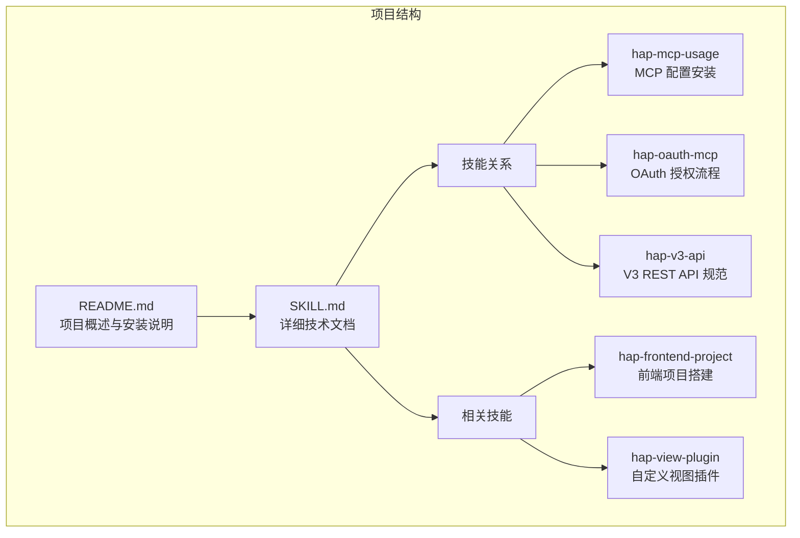
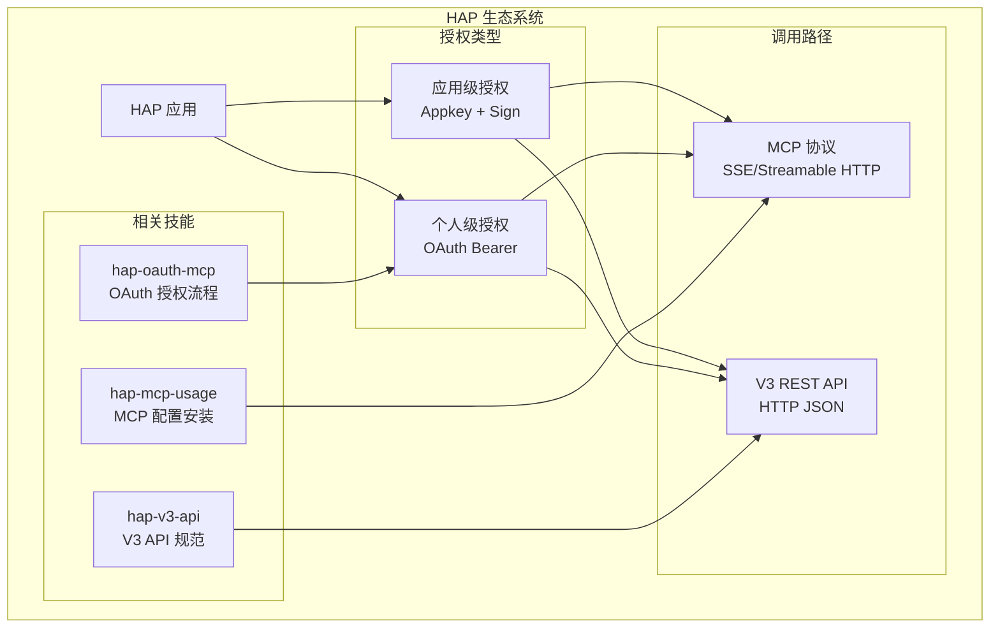
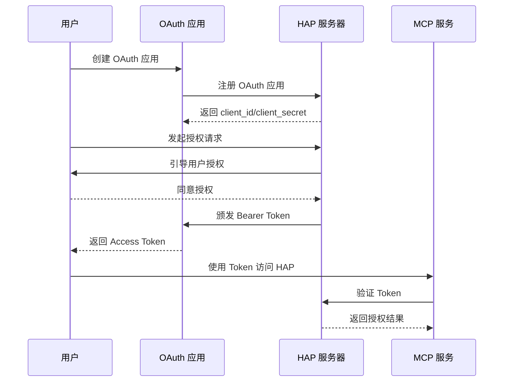
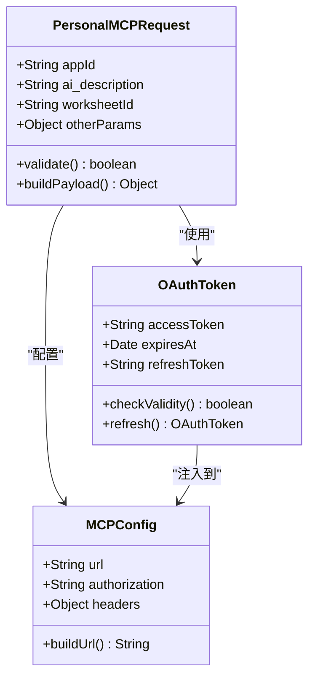
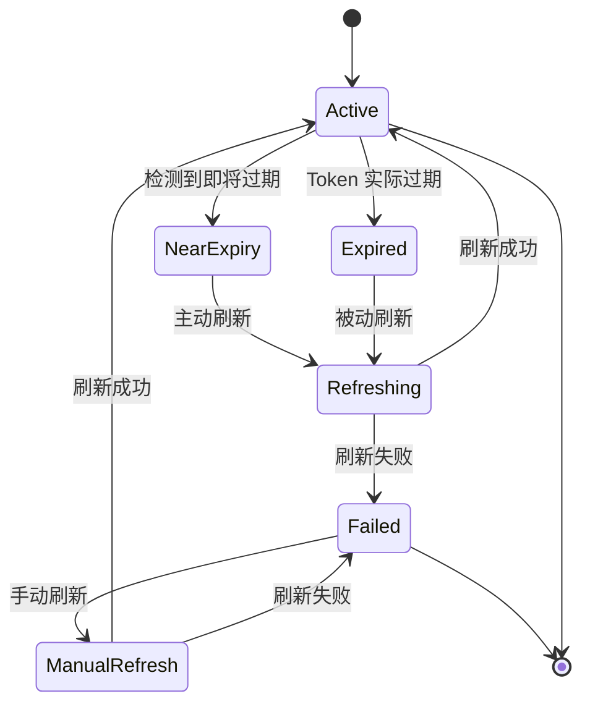
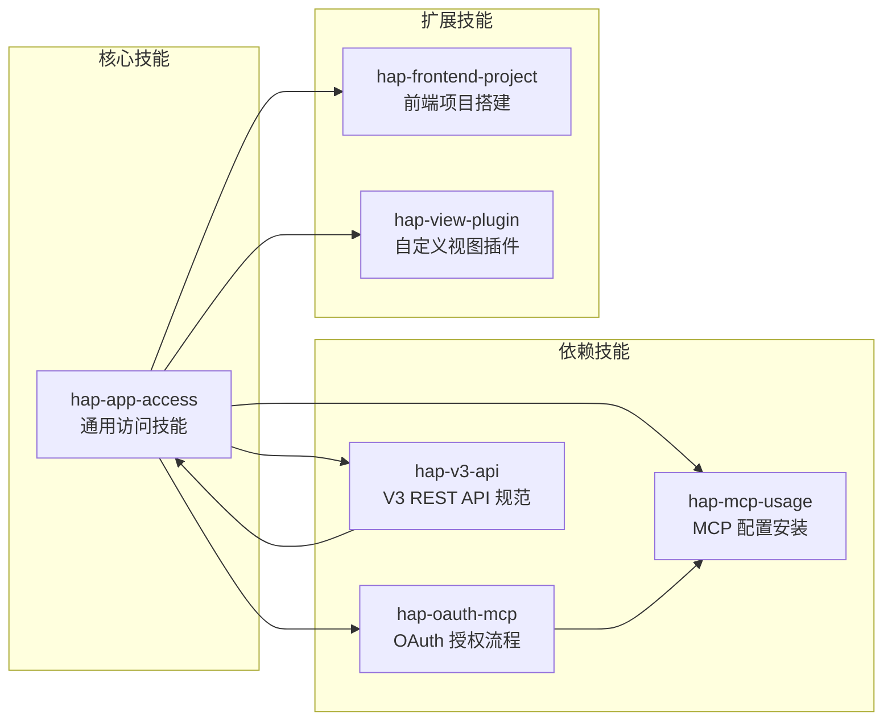
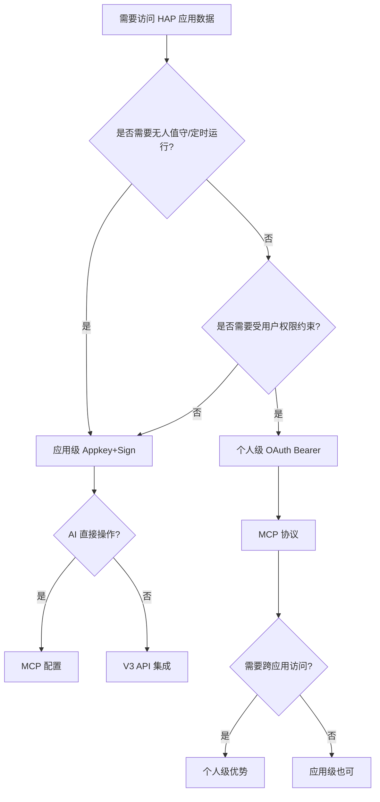

# 个人级授权：OAuth Bearer

<cite>
**本文引用的文件**
- [README.md](file://README.md)
- [SKILL.md](file://SKILL.md)
</cite>

## 目录
1. [简介](#简介)
2. [项目结构](#项目结构)
3. [核心组件](#核心组件)
4. [架构概览](#架构概览)
5. [详细组件分析](#详细组件分析)
6. [依赖分析](#依赖分析)
7. [性能考虑](#性能考虑)
8. [故障排除指南](#故障排除指南)
9. [结论](#结论)
10. [附录](#附录)

## 简介

明道云 HAP 应用的个人级授权（OAuth Bearer）是 HAP 应用访问技能中的重要组成部分，它允许以个人身份访问 HAP 应用数据，权限范围受限于当前登录用户的权限。本文档深入解释 OAuth Bearer Token 的获取流程、配置方法和使用模式，特别关注在 MCP 协议中的应用。

个人级授权与应用级授权相比，具有以下特点：
- 身份：个人身份（等同于登录用户）
- 凭证：Bearer Token（约 1 天过期）
- 权限范围：当前登录用户在应用中可见的数据
- 适用场景：个人数据查询、以用户视角读写数据

## 项目结构

该项目采用技能文档的形式，主要包含两个核心文件：



**图表来源**
- [README.md: 1-53:1-53](file://README.md#L1-L53)
- [SKILL.md: 39-49:39-49](file://SKILL.md#L39-L49)

**章节来源**
- [README.md: 1-53:1-53](file://README.md#L1-L53)
- [SKILL.md: 1-436:1-436](file://SKILL.md#L1-L436)

## 核心组件

### 授权类型对比

个人级授权与应用级授权的核心差异体现在以下几个维度：

| 维度 | 应用级授权（Appkey+Sign） | 个人级授权（OAuth Bearer） |
|------|--------------------------|---------------------------|
| 身份 | 应用身份（不受人约束） | 个人身份（等同于登录用户） |
| 凭证 | Appkey + Sign（长期有效） | Bearer Token（约 1 天过期） |
| 权限范围 | 应用内 API 开关控制的全部数据 | 当前登录用户在应用中可见的数据 |
| 跨应用 | 只能访问所属应用 | 可跨应用访问用户有权限的所有应用 |
| 适用场景 | 后台定时任务、服务间同步、脚本自动化 | 个人数据查询、以用户视角读写数据 |
| 过期 | 不过期（除非在 HAP 后台重置） | 约 1 天，需要刷新机制 |
| 获取位置 | HAP 后台 → 应用 → API 开发 → API 密钥 | OAuth 授权流程 |

**章节来源**
- [SKILL.md: 13-31:13-31](file://SKILL.md#L13-L31)

### 调用路径选择

个人级授权支持两种调用路径，但各有不同的适用场景：

| 维度 | MCP 协议（SSE/Streamable HTTP） | V3 REST API（HTTP JSON） |
|------|-------------------------------|-------------------------|
| 协议 | MCP（Model Context Protocol） | 标准 HTTPS + JSON |
| 端点 | `https://api.mingdao.com/mcp` | `https://api.mingdao.com/v3/open/...` |
| 鉴权注入 | URL query 参数或 SSE Header | HTTP 请求头 |
| 工具发现 | 自动暴露 40~70 个工具 | 需查 API 文档 |
| 调用方式 | AI 工具原生支持 | 代码中 `fetch`/`requests` 等 |
| 适合谁 | AI 助手直接操作数据 | 开发者在代码中集成 |
| 分页 | `pageSize` 上限 **90** | `pageSize` 上限 **1000** |
| 响应大小 | 单次约 **256KB** 缓冲上限 | 无此限制 |

**章节来源**
- [SKILL.md: 35-53:35-53](file://SKILL.md#L35-L53)

## 架构概览

个人级授权在 HAP 生态系统中的位置和关系如下：



**图表来源**
- [SKILL.md: 39-49:39-49](file://SKILL.md#L39-L49)
- [SKILL.md: 57-64:57-64](file://SKILL.md#L57-L64)

## 详细组件分析

### OAuth Bearer Token 获取流程

个人级授权的核心是获取和管理 Bearer Token。根据文档，Token 获取流程包括以下步骤：

1. **创建 OAuth 应用**：在 HAP 组织管理后台创建 OAuth 应用，获取 `client_id` / `client_secret`
2. **授权流程**：通过 OAuth 授权码流程或资源所有者密码凭据流程获取 Bearer Token
3. **自动化工具**：使用 `hap-oauth-mcp` 技能自动完成授权 + 生成 MCP 配置



**图表来源**
- [SKILL.md: 170-175:170-175](file://SKILL.md#L170-L175)

**章节来源**
- [SKILL.md: 168-175:168-175](file://SKILL.md#L168-L175)

### MCP 协议中的 Bearer Token 配置

在 MCP 协议中，个人级授权的配置相对简单，主要通过 URL 查询参数传递：

```mermaid
flowchart TD
A[开始配置] --> B[获取 Bearer Token]
B --> C[构建 MCP URL]
C --> D[添加 Authorization 参数]
D --> E[配置 AI 工具]
E --> F[验证连接]
F --> G[开始使用工具]
H[配置示例] --> I[URL: https://api.mingdao.com/mcp]
I --> J[参数: Authorization=Bearer <Token>
J --> K[应用: HAP-Personal-MCP]
L[可用工具] --> M[get_app_info]
L --> N[get_record_list]
L --> O[create_record]
L --> P[批量操作]
L --> Q[跨应用访问]
```

**图表来源**
- [SKILL.md: 176-191:176-191](file://SKILL.md#L176-L191)

**章节来源**
- [SKILL.md: 176-191:176-191](file://SKILL.md#L176-L191)

### Personal MCP 调用参数要求

与应用级 MCP 不同，个人级 MCP 的每次工具调用都需要额外的参数：

| 参数 | 类型 | 必填 | 描述 |
|------|------|------|------|
| `appId` | String | 是 | 标识访问哪个应用，否则返回 401 |
| `ai_description` | String | 是 | HAP 服务端用于审计和鉴权校验，否则返回 401 |
| `worksheetId` | String | 是 | 工作表 ID |
| 其他参数 | Any | 视具体工具而定 | 业务相关参数 |



**图表来源**
- [SKILL.md: 193-210:193-210](file://SKILL.md#L193-L210)

**章节来源**
- [SKILL.md: 193-210:193-210](file://SKILL.md#L193-L210)

### Token 过期与刷新机制

Bearer Token 有效期约为 1 天，需要有效的刷新策略：



**图表来源**
- [SKILL.md: 211-229:211-229](file://SKILL.md#L211-L229)

**章节来源**
- [SKILL.md: 211-229:211-229](file://SKILL.md#L211-L229)

### 错误处理与故障排除

个人级授权中常见的错误类型和处理方法：

| 错误码 | 含义 | 典型表现 | 解决方案 |
|--------|------|----------|----------|
| `600101` | 授权已失效 | `isError: true` + `error_code: 600101` | 刷新 token |
| `600100` | token 无效/缺失 | `token无效` / `token过期` | 检查 Authorization 头 |
| `10001` | HTTP Headers 验证失败 | `10001 Http Headers verification failed` | 确认使用 `api.mingdao.com` |
| `4` | 权限不足 | 当前身份无该操作权限 | 检查授权类型和用户权限 |
| `-1` | 通用失败 | 查看 `error_msg` | 按 error_msg 排查 |

**章节来源**
- [SKILL.md: 378-398:378-398](file://SKILL.md#L378-L398)

## 依赖分析

个人级授权技能与其他 HAP 技能的依赖关系：



**图表来源**
- [SKILL.md: 422-431:422-431](file://SKILL.md#L422-L431)

**章节来源**
- [SKILL.md: 422-431:422-431](file://SKILL.md#L422-L431)

## 性能考虑

### MCP 协议限制

个人级授权在 MCP 协议中有一些重要的性能限制：

1. **响应大小限制**：单次响应约 256KB 缓冲上限
2. **分页限制**：`pageSize` 上限为 90
3. **推荐实践**：大表建议使用 50 的 page_size

### V3 REST API 对比

与 MCP 相比，V3 REST API 在性能方面有明显优势：

- **响应大小**：无缓冲限制
- **分页限制**：`pageSize` 上限为 1000
- **推荐实践**：建议使用 100-500 的 page_size

**章节来源**
- [SKILL.md: 280-288:280-288](file://SKILL.md#L280-L288)

## 故障排除指南

### 常见问题及解决方案

#### 1. OAuth Bearer 域名白名单问题

**问题**：调用 `api2.mingdao.com` 返回 `error_code: 10001 Http Headers verification failed`

**原因**：OAuth App 的 Bearer Token 只对创建该 App 时配置的域名鉴权有效

**解决方案**：确保使用 `api.mingdao.com` 域名

#### 2. Token 过期处理

**问题**：调用返回 `error_code: 600101 授权已失效`

**解决方案**：
- 主动检测：调用前检查 token 的 `expires_at` / `refreshed_at`
- 被动重试：调用返回鉴权失败时自动刷新 token 并重试一次
- 手动刷新：使用 `hap-oauth-mcp` 技能重新生成 MCP 配置

#### 3. Personal MCP 参数缺失

**问题**：返回 401 错误

**原因**：缺少必需的 `appId` 或 `ai_description` 参数

**解决方案**：确保每次调用都提供这两个参数

**章节来源**
- [SKILL.md: 335-343:335-343](file://SKILL.md#L335-L343)
- [SKILL.md: 211-229:211-229](file://SKILL.md#L211-L229)
- [SKILL.md: 372-375:372-375](file://SKILL.md#L372-L375)

### 陷阱清单

个人级授权中常见的陷阱和注意事项：

1. **选项字段写入**：必须使用 option key（UUID）而不是显示文本
2. **关联字段丢失**：`get_record_list` 可能返回空字符串，需要额外调用补全
3. **_owner 字段**：列表中返回空字符串但 filter 仍然有效
4. **caid filter 不稳定**：对数组的 `in` 操作支持有限
5. **MCP 响应大小限制**：单次约 256KB，超出会抛异常

**章节来源**
- [SKILL.md: 301-376:301-376](file://SKILL.md#L301-L376)

## 结论

个人级授权（OAuth Bearer）为明道云 HAP 应用提供了灵活的个人身份访问能力。通过本文档，我们可以总结出以下要点：

1. **适用场景明确**：个人数据查询、以用户视角读写数据
2. **配置相对简单**：主要通过 URL 查询参数传递 Bearer Token
3. **需要 Token 管理**：约 1 天的有效期需要有效的刷新策略
4. **MCP 专用**：Bearer Token 仅适用于 MCP 协议，不支持 V3 REST API
5. **参数要求严格**：Personal MCP 每次调用必须提供 `appId` 和 `ai_description`

对于初学者，建议从简单的 MCP 配置开始，逐步理解 Token 生命周期管理。对于有经验的开发者，可以在此基础上实现更复杂的 Token 刷新和错误处理机制。

## 附录

### 快速决策流程



**图表来源**
- [SKILL.md: 401-418:401-418](file://SKILL.md#L401-L418)

### API Host 一览

| 产品线 | API Host | MCP URL 示例 |
|--------|----------|-------------|
| 明道云 HAP | `https://api.mingdao.com` | `https://api.mingdao.com/mcp?...` |
| Nocoly HAP | `https://www.nocoly.com` | `https://www.nocoly.com/mcp?...` |
| 私有部署 | `https://<域名>/api` | `https://<域名>/mcp?...` |

**章节来源**
- [SKILL.md: 236-247:236-247](file://SKILL.md#L236-L247)