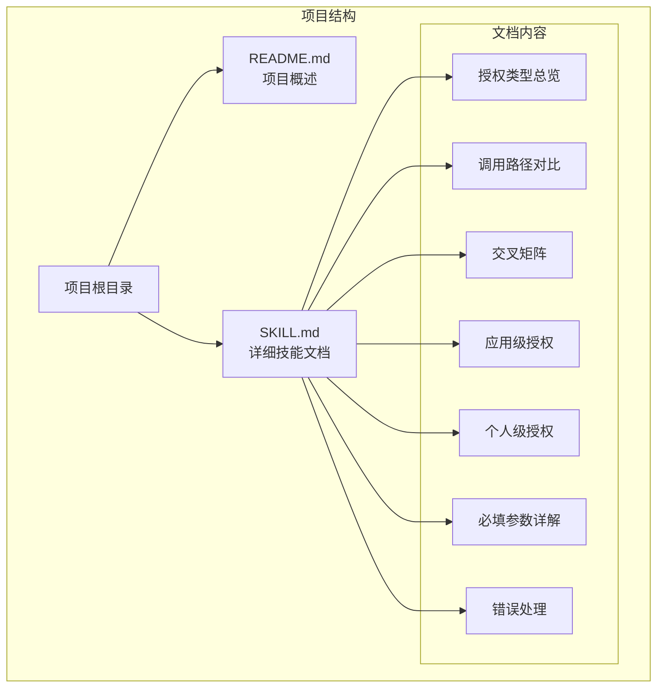
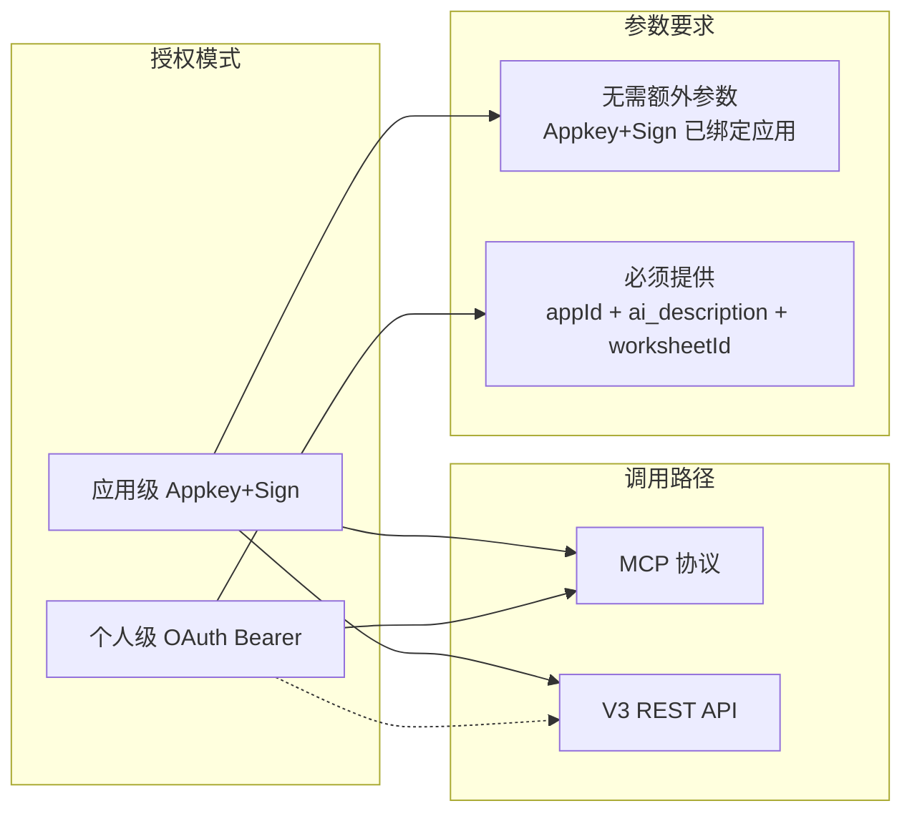
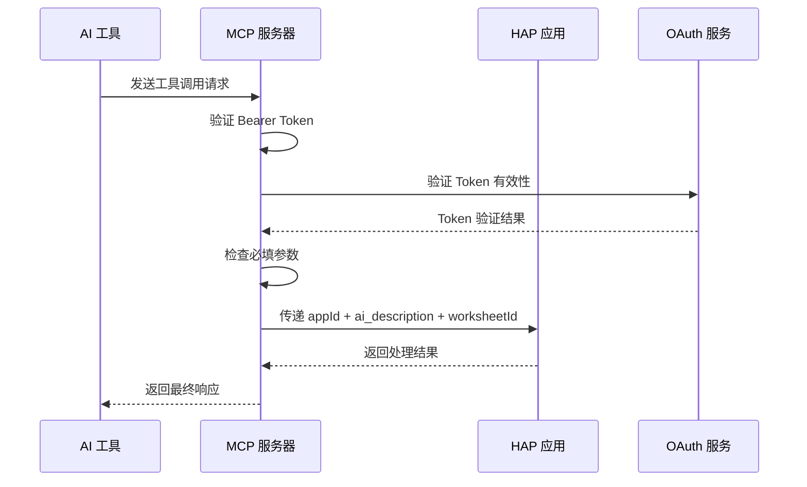
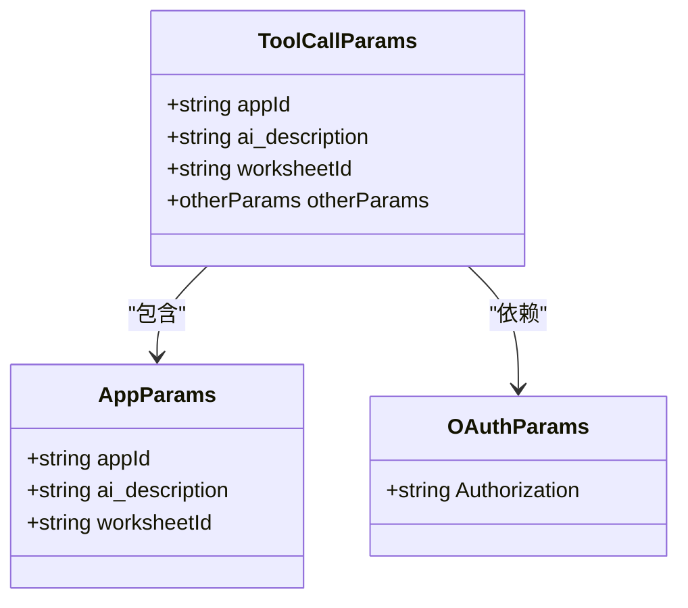
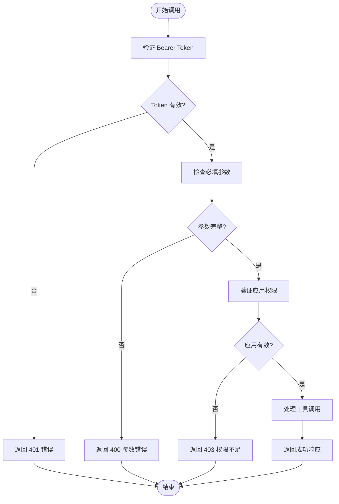
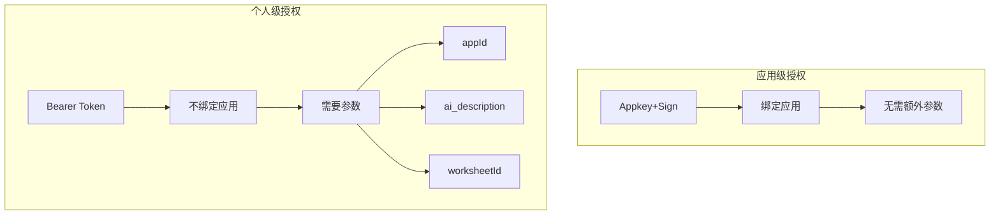
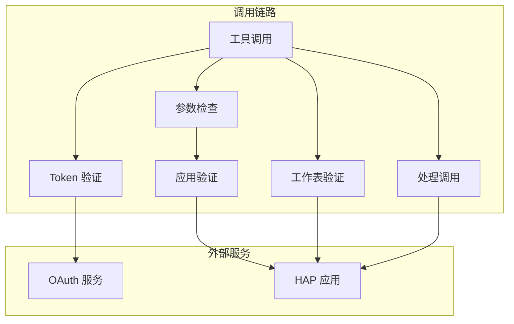

# 调用必填参数

<cite>
**本文引用的文件**
- [README.md](file://README.md)
- [SKILL.md](file://SKILL.md)
</cite>

## 目录
1. [简介](#简介)
2. [项目结构](#项目结构)
3. [核心组件](#核心组件)
4. [架构概览](#架构概览)
5. [详细组件分析](#详细组件分析)
6. [依赖关系分析](#依赖关系分析)
7. [性能考虑](#性能考虑)
8. [故障排除指南](#故障排除指南)
9. [结论](#结论)
10. [附录](#附录)

## 简介

本文档专注于明道云 HAP 应用在 OAuth Bearer 授权模式下的 MCP（Model Context Protocol）调用必填参数。重点解释 Personal MCP 每次工具调用必须提供的三个核心参数：`appId`、`ai_description` 和 `worksheetId`，以及这些参数的作用、重要性和验证规则。

明道云 HAP 应用提供两种授权类型：应用级 Appkey+Sign 和个人级 OAuth Bearer。对于 OAuth Bearer 授权，MCP 协议是唯一支持的调用路径，而 V3 REST API 只认 Appkey+Sign。在 Personal MCP 模式下，由于 OAuth Token 本身不包含应用绑定信息，因此每次工具调用都需要显式提供应用标识和上下文信息。

## 项目结构

该项目采用技能文档的形式，提供明道云 HAP 应用的通用访问方法论：

**图表来源**
- [README.md:1-53](file://README.md#L1-L53)
- [SKILL.md:1-436](file://SKILL.md#L1-L436)

**章节来源**
- [README.md:1-53](file://README.md#L1-L53)
- [SKILL.md:1-436](file://SKILL.md#L1-L436)

## 核心组件

### OAuth Bearer 授权模式

在 OAuth Bearer 授权模式下，Personal MCP 调用具有以下特点：

- **Token 类型**：Bearer Token，有效期约 1 天
- **调用路径**：仅支持 MCP 协议，不支持 V3 REST API
- **参数要求**：每次工具调用必须提供三个核心参数
- **权限范围**：受当前登录用户权限约束，可跨应用访问

### 三个必填参数详解

#### appId 参数

**作用**：标识访问的目标应用，用于确定具体的 HAP 应用实例。

**格式要求**：
- 类型：字符串
- 格式：应用标识符
- 必填性：必需

**验证规则**：
- 必须指向有效的 HAP 应用
- 应用必须存在且可访问
- 与 OAuth Token 的权限范围相匹配

#### ai_description 参数

**作用**：描述本次调用的用途，用于服务端审计和鉴权校验。

**格式要求**：
- 类型：字符串
- 内容：简要描述调用目的
- 必填性：必需

**验证规则**：
- 必须提供合理的用途描述
- 用于审计日志记录
- 影响服务端的鉴权决策

#### worksheetId 参数

**作用**：指定具体的工作表 ID，用于定位要操作的数据表。

**格式要求**：
- 类型：字符串
- 格式：工作表标识符
- 必填性：必需

**验证规则**：
- 必须指向有效的 HAP 工作表
- 工作表必须属于目标应用
- 用户必须对该工作表有访问权限

**章节来源**
- [SKILL.md:193-210](file://SKILL.md#L193-L210)

## 架构概览

### 授权模式对比

**图表来源**
- [SKILL.md:17-31](file://SKILL.md#L17-L31)
- [SKILL.md:39-53](file://SKILL.md#L39-L53)
- [SKILL.md:64](file://SKILL.md#L64)

### 参数传递流程

**图表来源**
- [SKILL.md:193-210](file://SKILL.md#L193-L210)
- [SKILL.md:213-228](file://SKILL.md#L213-L228)

## 详细组件分析

### 参数格式规范

#### JSON 结构示例

**图表来源**
- [SKILL.md:197-204](file://SKILL.md#L197-L204)

#### 参数验证流程

**图表来源**
- [SKILL.md:206-208](file://SKILL.md#L206-L208)
- [SKILL.md:223-227](file://SKILL.md#L223-L227)

### 参数差异原因分析

#### 应用级 vs 个人级的区别

| 维度 | 应用级 Appkey+Sign | 个人级 OAuth Bearer |
|------|-------------------|---------------------|
| **绑定关系** | Appkey+Sign 直接绑定应用 | Token 不包含应用绑定信息 |
| **参数需求** | 无需额外参数 | 必须提供 appId |
| **权限范围** | 应用内 API 开关控制 | 用户权限约束 |
| **调用路径** | MCP/V3 均可 | 仅 MCP |
| **过期机制** | 不过期 | 约 1 天 |

#### 技术实现差异

**图表来源**
- [SKILL.md:209](file://SKILL.md#L209)

**章节来源**
- [SKILL.md:17-31](file://SKILL.md#L17-L31)
- [SKILL.md:193-210](file://SKILL.md#L193-L210)

## 依赖关系分析

### 外部依赖

#### OAuth 服务依赖

Personal MCP 调用依赖于 OAuth 服务进行身份验证：

- **Token 验证**：OAuth 服务验证 Bearer Token 的有效性
- **权限检查**：OAuth 服务检查用户权限范围
- **域名白名单**：OAuth 应用配置的域名白名单

#### HAP 应用依赖

调用过程涉及多个 HAP 组件：

- **应用服务**：验证应用标识和权限
- **工作表服务**：验证工作表存在性和访问权限
- **审计服务**：记录 ai_description 信息

### 内部依赖关系

**图表来源**
- [SKILL.md:206-208](file://SKILL.md#L206-L208)
- [SKILL.md:213-228](file://SKILL.md#L213-L228)

**章节来源**
- [SKILL.md:335-343](file://SKILL.md#L335-L343)
- [SKILL.md:372-375](file://SKILL.md#L372-L375)

## 性能考虑

### 参数验证性能

- **Token 验证**：通常在毫秒级别完成
- **参数检查**：简单的字符串验证，性能开销极小
- **应用权限验证**：可能涉及数据库查询，需要适当的缓存策略

### 错误处理优化

- **早期失败**：在参数验证阶段尽早发现并报告错误
- **批量验证**：可以考虑批量验证多个参数，减少重复检查
- **缓存策略**：对频繁访问的应用和工作表信息进行缓存

## 故障排除指南

### 常见错误及解决方案

#### 401 未授权错误

**症状**：
- 返回 401 未授权
- 错误信息包含 "Authorization failed" 或 "token invalid"
- `error_code: 600101`

**原因分析**：
- Bearer Token 过期或无效
- 缺少必填参数
- Token 域名不在白名单

**解决方案**：
1. 刷新 OAuth Token
2. 确保提供完整的三个必填参数
3. 验证 MCP URL 使用正确的域名

#### 400 参数错误

**症状**：
- 返回 400 参数错误
- 错误信息提示参数缺失或格式错误

**原因分析**：
- 缺少 `appId`、`ai_description` 或 `worksheetId`
- 参数格式不符合要求
- 参数值不在有效范围内

**解决方案**：
1. 检查所有必填参数是否提供
2. 验证参数格式和类型
3. 确认参数值的有效性

#### 403 权限不足

**症状**：
- 返回 403 权限不足
- 错误信息提示无权访问目标应用或工作表

**原因分析**：
- 用户对目标应用没有访问权限
- 用户对目标工作表没有访问权限
- 应用级权限配置限制

**解决方案**：
1. 确认用户对目标应用有访问权限
2. 检查用户对目标工作表的权限
3. 联系应用管理员调整权限设置

### 调试建议

#### 日志记录

建议在调用过程中记录以下信息：
- 请求时间戳
- 参数值（敏感信息脱敏）
- 响应状态码和错误信息
- Token 验证结果

#### 参数验证清单

调用前进行参数验证：
- [ ] appId 格式正确
- [ ] ai_description 内容合理
- [ ] worksheetId 存在且有效
- [ ] Token 未过期
- [ ] 域名在白名单中

**章节来源**
- [SKILL.md:223-227](file://SKILL.md#L223-L227)
- [SKILL.md:378-398](file://SKILL.md#L378-L398)

## 结论

明道云 HAP 应用在 OAuth Bearer 授权模式下的 Personal MCP 调用，通过三个核心参数实现了灵活的应用级访问控制：

1. **appId** 提供了明确的应用标识，解决了 Token 不包含应用绑定的问题
2. **ai_description** 提供了审计和用途说明，增强了系统的可追溯性
3. **worksheetId** 精确定位了具体的工作表，确保了精确的数据操作

这三个参数的设计体现了明道云在个人级授权模式下对安全性和可控性的重视。相比应用级授权的简单直接，个人级授权通过显式参数的方式，为每个工具调用提供了细粒度的控制和审计能力。

对于开发者而言，理解这些参数的作用和验证规则，是成功集成明道云 HAP 应用的关键。建议在生产环境中实现完善的参数验证和错误处理机制，确保系统的稳定性和安全性。

## 附录

### 参数参考表

| 参数名称 | 类型 | 必填 | 说明 | 示例值 |
|----------|------|------|------|--------|
| appId | string | 是 | 目标应用标识符 | "app_123456" |
| ai_description | string | 是 | 调用用途描述 | "AI助手查询销售数据" |
| worksheetId | string | 是 | 工作表标识符 | "ws_abcdef" |

### 最佳实践

1. **参数验证**：在发送请求前验证所有参数的有效性
2. **错误处理**：实现完善的错误处理和重试机制
3. **日志记录**：记录关键的调用信息用于调试和审计
4. **安全考虑**：避免在日志中记录敏感的认证信息
5. **性能优化**：合理设置参数值，避免不必要的网络往返