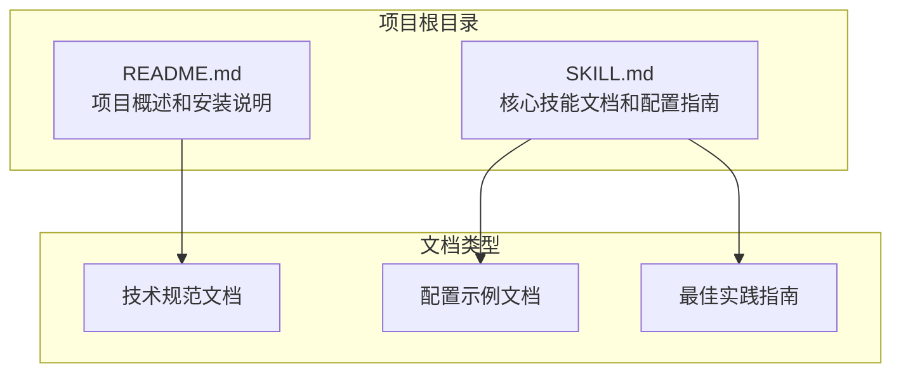
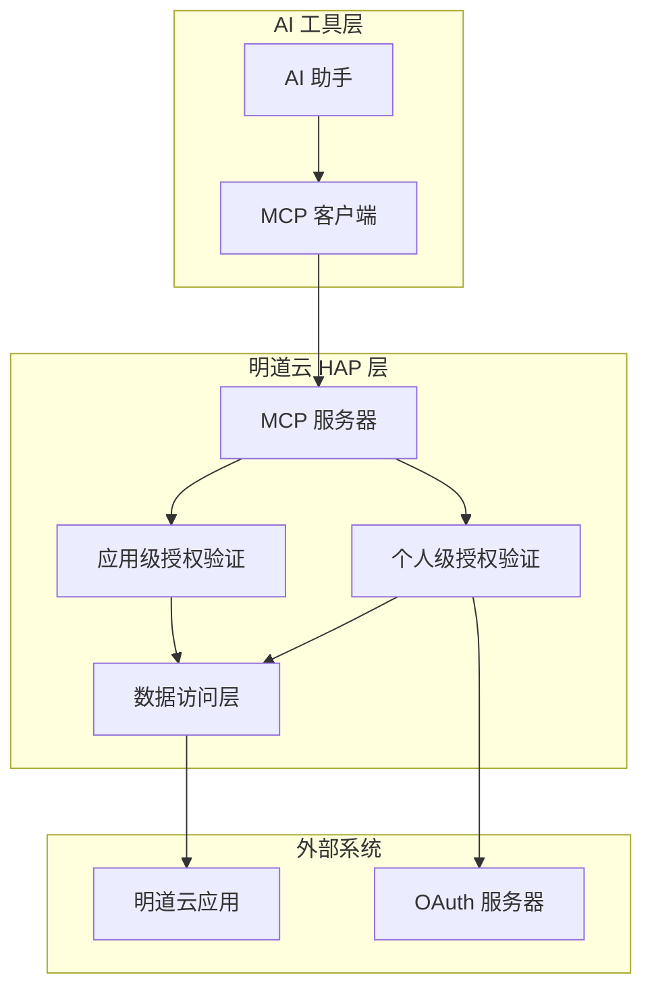
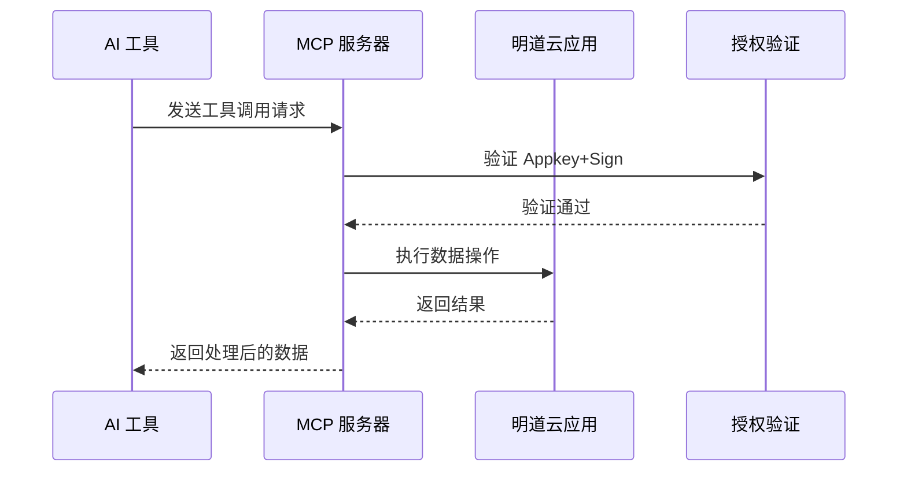
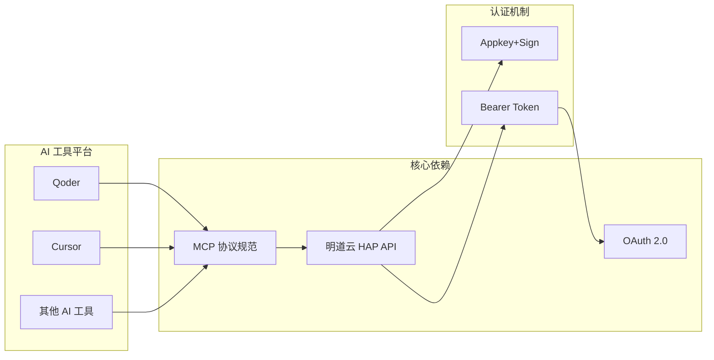
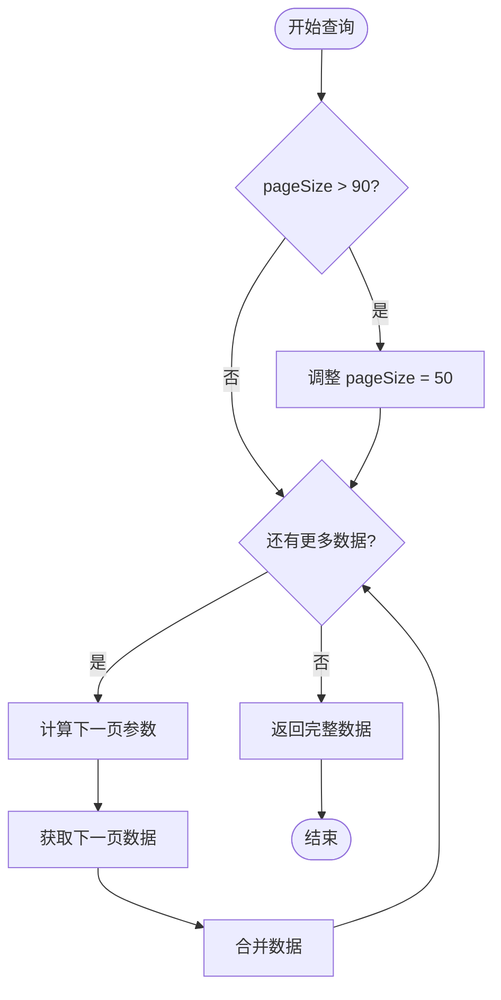
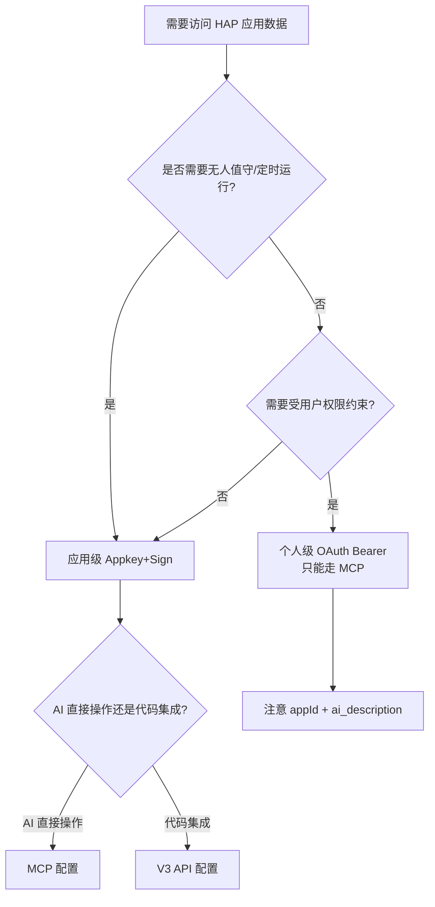

# MCP 协议配置

<cite>
**本文档引用的文件**
- [README.md](file://README.md)
- [SKILL.md](file://SKILL.md)
</cite>

## 目录
1. [简介](#简介)
2. [项目结构](#项目结构)
3. [核心组件](#核心组件)
4. [架构概览](#架构概览)
5. [详细组件分析](#详细组件分析)
6. [依赖关系分析](#依赖关系分析)
7. [性能考虑](#性能考虑)
8. [故障排除指南](#故障排除指南)
9. [结论](#结论)
10. [附录](#附录)

## 简介

明道云 HAP 应用的 MCP（Model Context Protocol）协议配置文档，专注于应用级授权在 MCP 协议中的配置方法。本文档深入解释如何在 AI 工具的 MCP 配置中正确设置 Appkey+Sign 凭证，提供来自实际代码库的具体配置示例，展示 JSON 配置格式和参数设置。

MCP 协议作为一种新兴的模型上下文协议，为 AI 工具提供了直接操作数据的能力，特别适用于需要在对话中直接访问和操作明道云应用数据的场景。

## 项目结构

该项目采用极简的结构设计，专注于提供清晰的技术文档和配置指导：



**图表来源**
- [README.md:1-53](file://README.md#L1-L53)
- [SKILL.md:1-436](file://SKILL.md#L1-L436)

**章节来源**
- [README.md:1-53](file://README.md#L1-L53)
- [SKILL.md:1-436](file://SKILL.md#L1-L436)

## 核心组件

### 授权类型对比

明道云 HAP 应用提供两种核心授权类型，每种都有其特定的使用场景和配置要求：

| 维度 | 应用级授权（Appkey+Sign） | 个人级授权（OAuth Bearer） |
|------|--------------------------|---------------------------|
| 身份 | 应用身份（不受人约束） | 个人身份（等同于登录用户） |
| 凭证 | Appkey + Sign（长期有效） | Bearer Token（约 1 天过期） |
| 权限范围 | 应用内 API 开关控制的全部数据 | 当前登录用户在应用中可见的数据 |
| 跨应用 | 只能访问所属应用 | 可跨应用访问用户有权限的所有应用 |
| 适用场景 | 后台定时任务、服务间同步、脚本自动化 | 个人数据查询、以用户视角读写数据 |
| 过期 | 不过期（除非在 HAP 后台重置） | 约 1 天，需要刷新机制 |

### 调用路径对比

两种调用路径各有特点，适用于不同的使用场景：

| 维度 | MCP 协议（SSE/Streamable HTTP） | V3 REST API（HTTP JSON） |
|------|-------------------------------|-------------------------|
| 协议 | MCP（Model Context Protocol） | 标准 HTTPS + JSON |
| 端点 | `https://api.mingdao.com/mcp` | `https://api.mingdao.com/v3/open/...` |
| 鉴权注入 | URL query 参数或 SSE Header | HTTP 请求头 |
| 工具发现 | 自动暴露 40~70 个工具 | 需查 API 文档 |
| 调用方式 | AI 工具原生支持（如 Qoder/Cursor 的 MCP 集成） | 代码中 `fetch`/`requests` 等 |
| 适合谁 | AI 助手直接操作数据 | 开发者在代码中集成 |
| 分页 | `pageSize` 上限 **90** | `pageSize` 上限 **1000** |
| 响应大小 | 单次约 **256KB** 缓冲上限 | 无此限制 |

**章节来源**
- [SKILL.md:13-53](file://SKILL.md#L13-L53)

## 架构概览

### MCP 协议架构



**图表来源**
- [SKILL.md:35-65](file://SKILL.md#L35-L65)

### 应用级授权流程



**图表来源**
- [SKILL.md:76-97](file://SKILL.md#L76-L97)

## 详细组件分析

### MCP 配置详解

#### JSON 配置格式

在 AI 工具的 MCP 配置中，应用级授权的 JSON 配置格式如下：

```json
{
  "mcpServers": {
    "hap-mcp-<应用名>": {
      "url": "https://api.mingdao.com/mcp?HAP-Appkey=<Appkey>&HAP-Sign=<Sign>"
    }
  }
}
```

关键配置项说明：

- **mcpServers**: MCP 服务器配置对象
- **hap-mcp-<应用名>**: 服务器实例名称，建议包含应用标识
- **url**: MCP 服务器端点，包含认证参数

#### 认证参数设置

应用级授权使用以下查询参数进行认证：

- **HAP-Appkey**: 应用密钥标识符
- **HAP-Sign**: 基于 Appkey 和请求内容生成的签名

#### 支持的工具列表

配置完成后，MCP 服务器会自动暴露以下工具（约 40-70 个）：

**基础数据操作工具**:
- `get_app_info`: 获取应用信息
- `get_app_worksheets_list`: 获取工作表列表
- `get_worksheet_structure`: 获取工作表结构

**记录操作工具**:
- `get_record_list`: 获取记录列表
- `get_record_details`: 获取记录详情
- `get_record_pivot_data`: 获取记录透视数据

**CRUD 操作工具**:
- `create_record`: 创建记录
- `update_record`: 更新记录
- `delete_record`: 删除记录

**批量操作工具**:
- `batch_create_records`: 批量创建记录
- `batch_update_records`: 批量更新记录
- `batch_delete_records`: 批量删除记录

**章节来源**
- [SKILL.md:76-97](file://SKILL.md#L76-L97)

### 个人级授权配置

#### OAuth Bearer Token 配置

个人级授权使用 OAuth Bearer Token 进行认证：

```json
{
  "mcpServers": {
    "HAP-Personal-MCP": {
      "url": "https://api.mingdao.com/mcp?Authorization=Bearer%20<Token>"
    }
  }
}
```

#### 必填参数要求

个人级 MCP 调用必须提供以下参数：

```json
{
  "appId": "<目标应用的 AppID>",
  "ai_description": "<本次调用的用途描述>",
  "worksheetId": "<工作表 ID>",
  "...": "其他业务参数"
}
```

关键参数说明：
- **appId**: 必填，标识访问的应用
- **ai_description**: 必填，用于审计和鉴权校验
- **worksheetId**: 必填，指定操作的工作表

**章节来源**
- [SKILL.md:168-233](file://SKILL.md#L168-L233)

### API Host 配置

不同产品线和部署环境使用不同的 API 主机：

| 产品线 | API Host | MCP URL 示例 |
|--------|----------|-------------|
| 明道云 HAP | `https://api.mingdao.com` | `https://api.mingdao.com/mcp?...` |
| Nocoly HAP | `https://www.nocoly.com` | `https://www.nocoly.com/mcp?...` |
| 私有部署 | `https://<域名>/api` | `https://<域名>/mcp?...` |

**章节来源**
- [SKILL.md:236-247](file://SKILL.md#L236-L247)

## 依赖关系分析

### 技术栈依赖



**图表来源**
- [SKILL.md:44-46](file://SKILL.md#L44-L46)

### 组件耦合度分析

- **高内聚**: 每个授权类型和调用路径都有明确的功能边界
- **低耦合**: 不同授权方式可以独立配置和使用
- **可扩展性**: 支持多种 AI 工具平台的 MCP 集成

**章节来源**
- [SKILL.md:39-53](file://SKILL.md#L39-L53)

## 性能考虑

### 响应大小限制

MCP 协议具有约 256KB 的单次响应缓冲上限，这会影响大数据集的处理：

- **MCP `get_record_list`**: `pageSize` 上限 **90**
- **V3 API `rows/list`**: `pageSize` 上限 **1000**

**优化建议**:
- 大表查询时使用较小的 `pageSize`（推荐 50）
- 实施分页策略获取完整数据
- 考虑使用 V3 REST API 处理大量数据

### 分页策略



**图表来源**
- [SKILL.md:280-288](file://SKILL.md#L280-L288)

## 故障排除指南

### 常见配置错误及解决方案

#### 错误码对照表

| 错误码 | 含义 | 典型原因 | 解决方案 |
|--------|------|---------|---------|
| `1` | 成功 | — | — |
| `-1` | 通用失败 | 查看 `error_msg` | 按 error_msg 排查 |
| `4` | 权限不足 | 当前身份无该操作权限 | 检查授权类型和用户权限 |
| `10` | 参数错误 | 参数缺失或格式错误 | 检查参数名（驼峰）和值格式 |
| `10001` | HTTP Headers 验证失败 | OAuth token 域名不在白名单 | 确认使用 `api.mingdao.com` |
| `600101` | 授权已失效 | Bearer token 过期 | 刷新 token |
| `600100` | token 无效/缺失 | token 为空或格式错误 | 检查 Authorization 头 |

#### 10001 vs 600101 区分

| 表现 | 含义 | 路径 |
|------|------|------|
| `10001 Http Headers verification failed` | 域名/scope 层白名单不匹配 | HAP V3 代理层拦截 |
| `600101 授权已失效` / `invalid_token` | token 本身过期或无效 | OAuth introspection 服务拦截 |

**章节来源**
- [SKILL.md:378-398](file://SKILL.md#L378-L398)

### 具体问题诊断

#### OAuth Bearer 域名白名单问题

**问题症状**:
- 调用 `api.mingdao.com` 正常
- 调用 `api2.mingdao.com` 返回 `error_code: 10001`

**解决方法**:
确保 MCP URL 中的域名与 OAuth App 白名单一致（使用 `api.mingdao.com`）

#### MCP 响应大小限制

**问题症状**:
- 返回 `Exceeded limit on max bytes to buffer`

**解决方法**:
降低 `pageSize`（大表推荐 50），或改用 V3 REST API

#### 个人级 MCP 缺少必需参数

**问题症状**:
- 返回 401 错误

**解决方法**:
确保每次调用都提供 `appId` 和 `ai_description` 参数

**章节来源**
- [SKILL.md:335-349](file://SKILL.md#L335-L349)

## 结论

明道云 HAP 应用的 MCP 协议配置为 AI 工具提供了强大的数据访问能力。通过正确配置 Appkey+Sign 凭证，开发者可以在各种 AI 工具中直接操作明道云应用数据。

关键要点总结：

1. **选择合适的授权方式**: 根据使用场景选择应用级或个人级授权
2. **正确配置 MCP 服务器**: 确保 JSON 配置格式和认证参数正确
3. **遵循性能限制**: 注意 MCP 协议的响应大小和分页限制
4. **处理常见错误**: 了解并解决常见的配置和认证问题
5. **监控和维护**: 定期检查令牌状态和配置有效性

该配置方案为明道云 HAP 应用的 AI 集成提供了标准化的方法，既适合初学者快速上手，也为经验丰富的开发者提供了充分的技术深度。

## 附录

### 快速决策流程



**图表来源**
- [SKILL.md:401-418](file://SKILL.md#L401-L418)

### 相关技能链接

- `hap-mcp-usage`: MCP 配置的自动化安装（9 种 AI 工具平台）
- `hap-oauth-mcp`: OAuth 授权流程 + Bearer Token 获取/刷新
- `hap-v3-api`: V3 REST API 的完整使用规范

**章节来源**
- [README.md:39-49](file://README.md#L39-L49)
- [SKILL.md:422-431](file://SKILL.md#L422-L431)