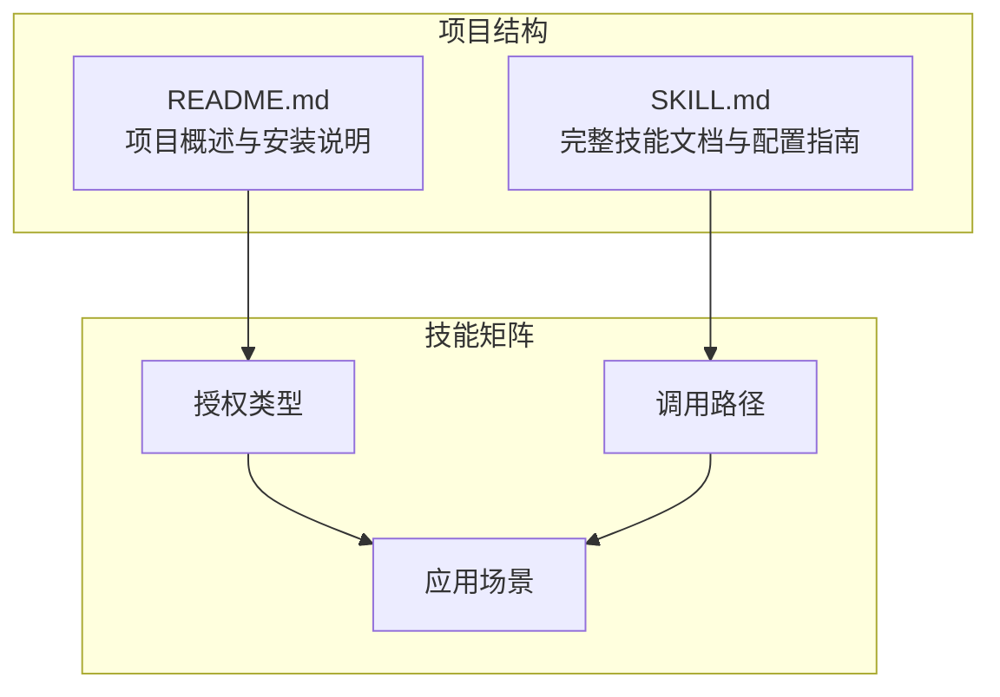
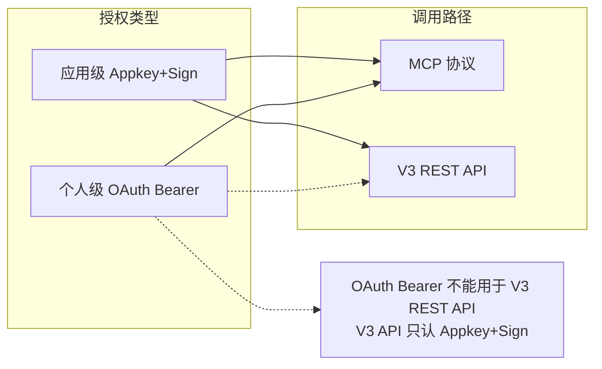
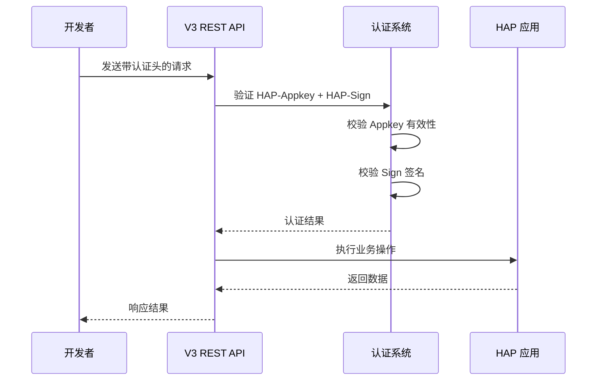
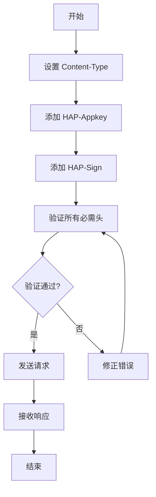
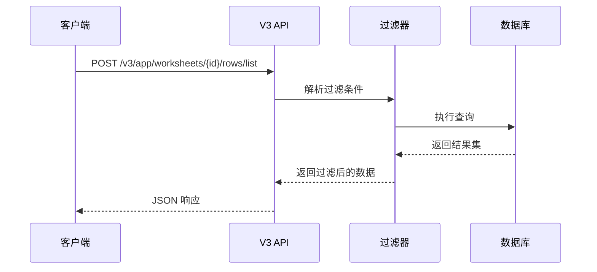
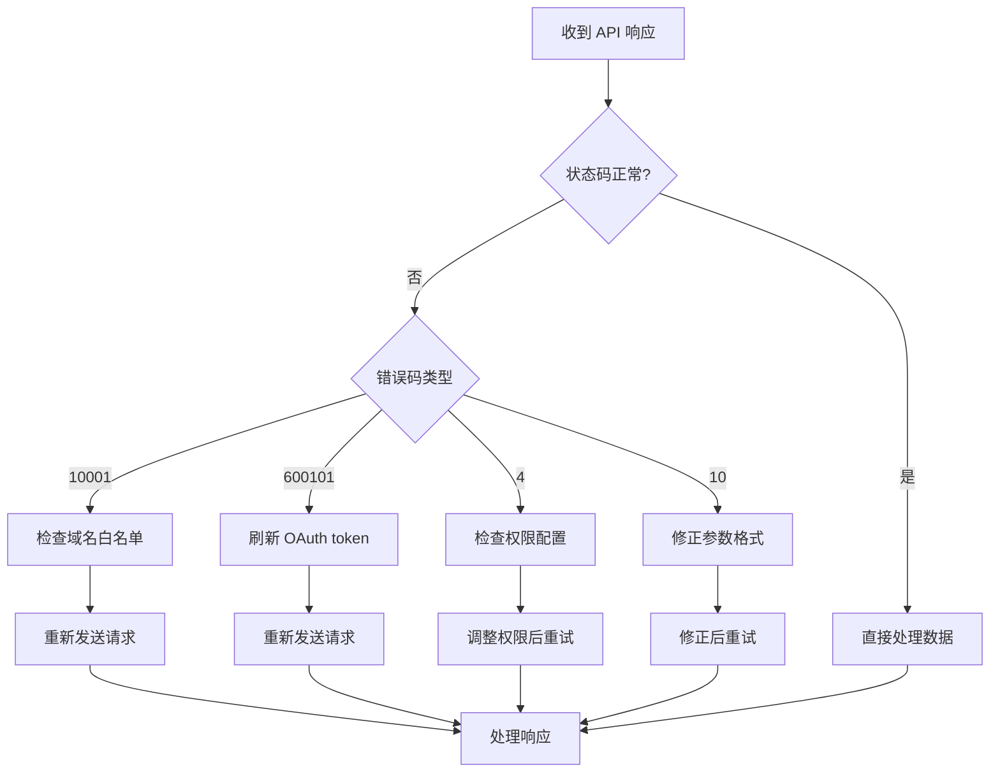
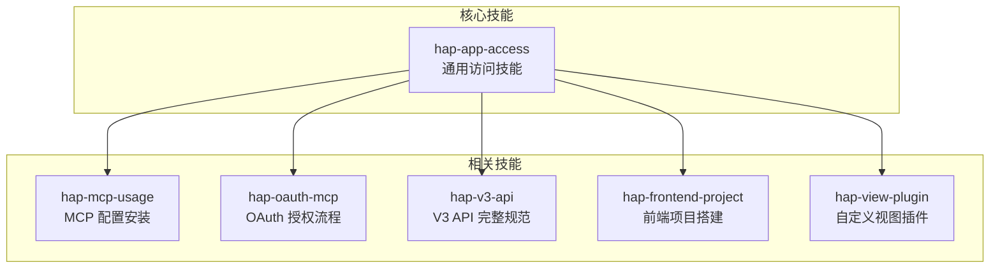
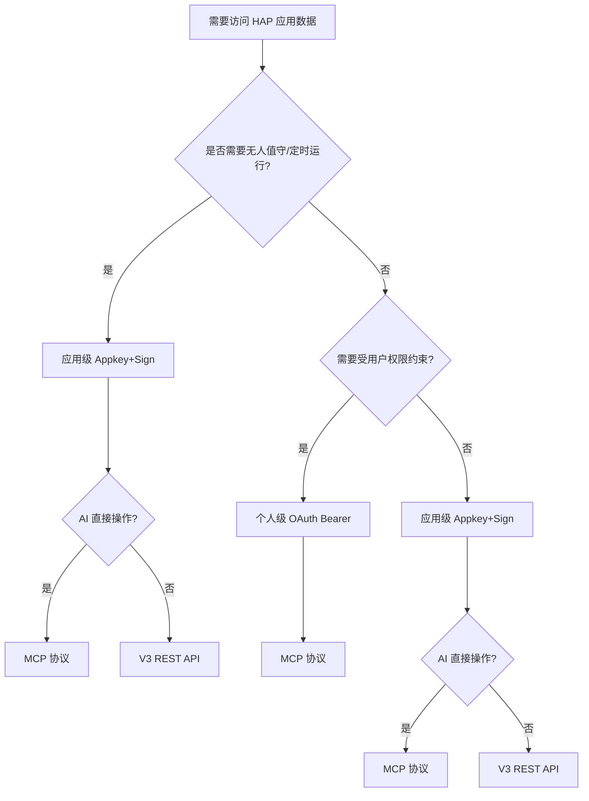
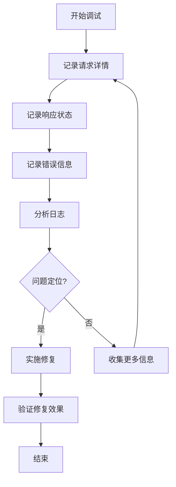

# V3 REST API 配置

<cite>
**本文档引用的文件**
- [README.md](file://README.md)
- [SKILL.md](file://SKILL.md)
</cite>

## 目录
1. [简介](#简介)
2. [项目结构](#项目结构)
3. [核心组件](#核心组件)
4. [架构概览](#架构概览)
5. [详细组件分析](#详细组件分析)
6. [依赖关系分析](#依赖关系分析)
7. [性能考虑](#性能考虑)
8. [故障排除指南](#故障排除指南)
9. [结论](#结论)

## 简介

明道云 HAP 应用的 V3 REST API 配置文档为开发者提供了完整的应用级授权配置指南。本文档专注于如何在 V3 REST API 调用中正确使用 Appkey+Sign 凭证，包含请求头设置、常用端点、API 调用模式以及错误处理的最佳实践。

该技能包覆盖了两种授权类型（应用级 Appkey+Sign 与个人级 OAuth Bearer）与两种调用路径（MCP 协议与 V3 REST API）的交叉组合，为不同场景下的开发者提供清晰的选择指导。

## 项目结构

该项目采用简洁的双文件结构，专注于知识传递和最佳实践分享：

**图表来源**
- [README.md:1-53](file://README.md#L1-L53)
- [SKILL.md:1-436](file://SKILL.md#L1-L436)

**章节来源**
- [README.md:1-53](file://README.md#L1-L53)
- [SKILL.md:23-37](file://SKILL.md#L23-L37)

## 核心组件

### 应用级授权（Appkey+Sign）

应用级授权是明道云 HAP 应用访问的核心机制，具有以下特点：

- **身份特征**：应用身份（不受人约束）
- **凭证组成**：Appkey + Sign（长期有效）
- **权限范围**：应用内 API 开关控制的全部数据
- **过期特性**：不自动过期（除非在 HAP 后台重置）

### V3 REST API 特性

V3 REST API 作为代码集成的首选方案，具备以下优势：

- **协议标准**：标准 HTTPS + JSON 协议
- **端点规范**：`https://api.mingdao.com/v3/open/...`
- **鉴权方式**：HTTP 请求头认证
- **工具发现**：需要查阅 API 文档
- **分页限制**：`pageSize` 上限 **1000**
- **响应大小**：无缓冲限制

**章节来源**
- [SKILL.md:17-31](file://SKILL.md#L17-L31)
- [SKILL.md:39-53](file://SKILL.md#L39-L53)
- [SKILL.md:68-165](file://SKILL.md#L68-L165)

## 架构概览

### 授权与调用路径矩阵

**图表来源**
- [SKILL.md:57-65](file://SKILL.md#L57-L65)

### API 调用流程

**图表来源**
- [SKILL.md:100-106](file://SKILL.md#L100-L106)
- [SKILL.md:110-126](file://SKILL.md#L110-L126)

## 详细组件分析

### 请求头配置

V3 REST API 的认证完全依赖于 HTTP 请求头，这是与 MCP 协议的重要区别：

#### 必需请求头

| 请求头名称 | 类型 | 必填 | 说明 |
|------------|------|------|------|
| Content-Type | String | 是 | `application/json` |
| HAP-Appkey | String | 是 | 应用密钥 |
| HAP-Sign | String | 是 | 签名值 |

#### 请求头设置示例

**图表来源**
- [SKILL.md:100-106](file://SKILL.md#L100-L106)

**章节来源**
- [SKILL.md:100-106](file://SKILL.md#L100-L106)

### 常用 API 端点

#### 应用信息管理

| 操作 | HTTP 方法 | 端点路径 | 用途 |
|------|-----------|----------|------|
| 获取应用信息 | GET | `/v3/app/info` | 获取应用基本信息 |
| 获取工作表列表 | GET | `/v3/app/worksheets` | 获取应用内所有工作表 |
| 获取工作表字段 | GET | `/v3/app/worksheet/getFields` | 获取指定工作表字段定义 |

#### 记录操作

| 操作 | HTTP 方法 | 端点路径 | 用途 |
|------|-----------|----------|------|
| 查询记录 | POST | `/v3/app/worksheets/{id}/rows/list` | 查询工作表记录 |
| 获取记录详情 | GET | `/v3/app/worksheets/{id}/rows/{rowId}` | 获取单条记录详情 |
| 创建记录 | POST | `/v3/app/worksheets/{id}/rows` | 创建新记录 |
| 更新记录 | PUT | `/v3/app/worksheets/{id}/rows/{rowId}` | 更新现有记录 |
| 删除记录 | DELETE | `/v3/app/worksheets/{id}/rows/{rowId}` | 删除记录 |
| 批量创建 | POST | `/v3/app/worksheets/{id}/rows/batch` | 批量创建记录 |
| 批量更新 | PUT | `/v3/app/worksheets/{id}/rows/batch` | 批量更新记录 |
| 批量删除 | DELETE | `/v3/app/worksheets/{id}/rows/batch` | 批量删除记录 |

#### 关联数据操作

| 操作 | HTTP 方法 | 端点路径 | 用途 |
|------|-----------|----------|------|
| 获取关联记录 | GET | `/v3/app/worksheets/{id}/rows/{rowId}/relations/{fieldId}` | 获取关联记录数据 |

#### 用户与部门管理

| 操作 | HTTP 方法 | 端点路径 | 用途 |
|------|-----------|----------|------|
| 查找用户 | POST | `/v3/users/lookup` | 根据条件查找用户 |
| 查找部门 | POST | `/v3/departments/lookup` | 根据条件查找部门 |

**章节来源**
- [SKILL.md:110-126](file://SKILL.md#L110-L126)

### API 调用模式

#### 查询记录的标准流程

**图表来源**
- [SKILL.md:127-162](file://SKILL.md#L127-L162)

#### 批量操作优化

V3 API 支持批量操作，显著提高数据处理效率：

- **批量创建**：减少网络往返次数
- **批量更新**：原子性操作保证
- **批量删除**：高效清理数据

**章节来源**
- [SKILL.md:120-122](file://SKILL.md#L120-L122)

### 错误处理机制

#### 常见错误类型

| 错误码 | 含义 | 典型原因 | 解决方案 |
|--------|------|----------|----------|
| `1` | 成功 | 无错误 | 正常处理 |
| `-1` | 通用失败 | 未知错误 | 查看 `error_msg` |
| `4` | 权限不足 | 身份无权限 | 检查授权类型 |
| `10` | 参数错误 | 参数缺失或格式错误 | 检查参数格式 |
| `10001` | HTTP Headers 验证失败 | OAuth token 域名不在白名单 | 确认使用 `api.mingdao.com` |
| `600101` | 授权已失效 | Bearer token 过期 | 刷新 token |
| `600100` | token 无效/缺失 | token 为空或格式错误 | 检查 Authorization 头 |

#### 错误处理最佳实践

**图表来源**
- [SKILL.md:378-398](file://SKILL.md#L378-L398)

**章节来源**
- [SKILL.md:378-398](file://SKILL.md#L378-L398)

## 依赖关系分析

### 技能包关系

**图表来源**
- [README.md:39-49](file://README.md#L39-L49)
- [SKILL.md:422-431](file://SKILL.md#L422-L431)

### 授权与路径选择决策树

**图表来源**
- [SKILL.md:401-418](file://SKILL.md#L401-L418)

**章节来源**
- [SKILL.md:401-418](file://SKILL.md#L401-L418)

## 性能考虑

### 分页策略

V3 API 的分页设计充分考虑了性能优化：

- **pageSize 上限**：**1000**（相比 MCP 的 90 限制有显著提升）
- **推荐值**：100~500（平衡网络开销和内存使用）
- **翻页获取**：必须完整遍历所有页面，不可依赖单页数据进行全局统计

### 响应大小优化

- **无缓冲限制**：V3 API 无单次响应大小限制
- **大数据集处理**：建议使用批量操作和合理的分页策略
- **内存管理**：避免一次性加载大量数据到内存

### 网络优化建议

- **连接复用**：使用持久连接减少握手开销
- **压缩传输**：启用 gzip 压缩（如服务器支持）
- **并发控制**：合理控制并发请求数量

## 故障排除指南

### 常见配置错误

#### 1. 认证头缺失或格式错误

**症状**：
- HTTP 401 未授权
- 错误码 `600100`（token 无效/缺失）

**解决方法**：
- 确保包含所有必需的认证头
- 验证 `HAP-Appkey` 和 `HAP-Sign` 的正确性
- 检查请求头格式是否符合标准

#### 2. 域名白名单问题

**症状**：
- 错误码 `10001`（HTTP Headers verification failed）
- 响应包含 `Http Headers verification failed`

**解决方法**：
- 确保使用 `api.mingdao.com` 作为 API 主机
- 检查 OAuth 应用的域名白名单配置
- 避免使用非标准域名（如 `api2.mingdao.com`）

#### 3. 参数格式错误

**症状**：
- 错误码 `10`（参数错误）
- 响应包含具体的参数错误信息

**解决方法**：
- 检查参数命名是否使用驼峰格式
- 验证参数值的数据类型
- 确认必需参数是否完整

#### 4. 权限不足

**症状**：
- 错误码 `4`（权限不足）
- 无法执行某些操作

**解决方法**：
- 检查应用级授权的 API 开关配置
- 验证 Appkey 的权限范围
- 确认用户在应用中的角色权限

### 调试技巧

#### 1. 日志记录

#### 2. 逐步验证

1. **基础验证**：先测试应用信息接口
2. **权限验证**：确认 Appkey 有足够权限
3. **功能验证**：逐个测试核心功能
4. **边界验证**：测试异常情况和边界条件

**章节来源**
- [SKILL.md:301-376](file://SKILL.md#L301-L376)

## 结论

明道云 HAP 应用的 V3 REST API 配置为开发者提供了强大而灵活的数据访问能力。通过正确配置 Appkey+Sign 凭证和遵循标准的 API 调用模式，开发者可以构建稳定可靠的应用集成解决方案。

### 关键要点总结

1. **认证机制**：V3 API 严格要求使用 `HAP-Appkey` 和 `HAP-Sign` 请求头
2. **调用路径**：代码集成场景下，V3 API 是首选方案
3. **错误处理**：建立完善的错误处理和重试机制
4. **性能优化**：合理使用分页和批量操作提升性能
5. **安全考虑**：妥善保管 Appkey 和 Sign，避免泄露

### 最佳实践建议

- 建立标准化的 API 调用封装层
- 实施完善的错误监控和告警机制
- 使用连接池和适当的超时配置
- 定期审查和更新认证凭证
- 建立完整的测试和验证流程

通过遵循本文档提供的配置指南和最佳实践，开发者可以高效地集成明道云 HAP 应用的各项功能，构建高质量的企业级应用解决方案。