# 凭证获取与配置

<cite>
**本文引用的文件**
- [README.md](file://README.md)
- [SKILL.md](file://SKILL.md)
</cite>

## 目录
1. [简介](#简介)
2. [项目结构](#项目结构)
3. [核心组件](#核心组件)
4. [架构概览](#架构概览)
5. [详细组件分析](#详细组件分析)
6. [依赖关系分析](#依赖关系分析)
7. [性能考量](#性能考量)
8. [故障排除指南](#故障排除指南)
9. [结论](#结论)
10. [附录](#附录)

## 简介

本文件详细阐述明道云 HAP 应用的应用级授权凭证（Appkey+Sign）获取与配置方法。该技能文档涵盖了两种授权类型（应用级 Appkey+Sign 与个人级 OAuth Bearer）与两种调用路径（MCP 协议与 V3 REST API）的交叉组合，为开发者提供完整的访问方法论与最佳实践指导。

明道云 HAP 应用提供两种核心授权方式：
- **应用级授权（Appkey+Sign）**：长期有效的应用身份认证，适用于无人值守运行和后台任务
- **个人级授权（OAuth Bearer）**：基于用户身份的短期令牌认证，适用于需要用户权限约束的场景

## 项目结构

该项目采用极简的文档结构设计：

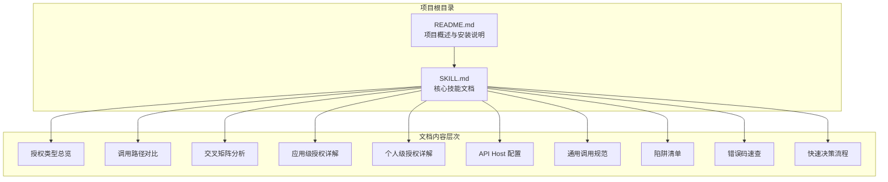

**图表来源**
- [README.md:1-53](file://README.md#L1-L53)
- [SKILL.md:1-436](file://SKILL.md#L1-L436)

**章节来源**
- [README.md:1-53](file://README.md#L1-L53)
- [SKILL.md:23-38](file://SKILL.md#L23-L38)

## 核心组件

### 授权类型对比矩阵

| 维度 | 应用级授权（Appkey+Sign） | 个人级授权（OAuth Bearer） |
|------|--------------------------|---------------------------|
| 身份 | 应用身份（不受人约束） | 个人身份（等同于登录用户） |
| 凭证 | Appkey + Sign（长期有效） | Bearer Token（约 1 天过期） |
| 权限范围 | 应用内 API 开关控制的全部数据 | 当前登录用户在应用中可见的数据 |
| 跨应用 | 只能访问所属应用 | 可跨应用访问用户有权限的所有应用 |
| 适用场景 | 后台定时任务、服务间同步、脚本自动化 | 个人数据查询、以用户视角读写数据 |
| 过期 | 不过期（除非在 HAP 后台重置） | 约 1 天，需要刷新机制 |
| 获取位置 | HAP 后台 → 应用 → API 开发 → API 密钥 | OAuth 授权流程（见 §2.2） |

**章节来源**
- [SKILL.md:13-32](file://SKILL.md#L13-L32)

### 选择原则

- **需要无人值守运行** → 应用级（Appkey+Sign）
- **需要受用户权限约束** → 个人级（OAuth Bearer）
- **需要跨多个应用** → 个人级（一个 token 覆盖多应用）
- **两者都可用** → 优先应用级（无过期风险）

## 架构概览

### 2×2 交叉矩阵

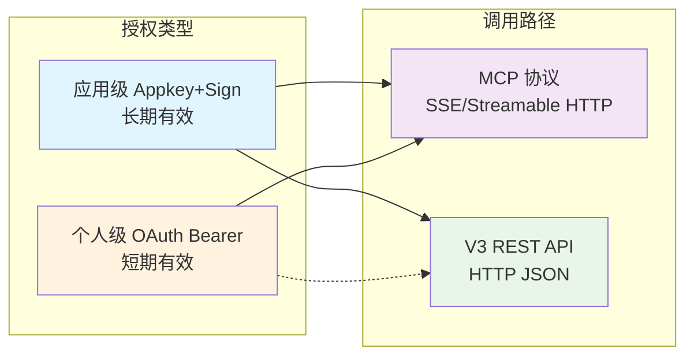

**图表来源**
- [SKILL.md:57-65](file://SKILL.md#L57-L65)

### 关键限制说明

> **OAuth Bearer Token 不能用于 V3 REST API 直连，只能用于 MCP 协议调用。V3 API 只认 Appkey+Sign。**

这一限制决定了授权方式与调用路径的严格对应关系，开发者在选择时必须考虑后续的调用方式。

**章节来源**
- [SKILL.md:64](file://SKILL.md#L64)

## 详细组件分析

### 应用级授权：Appkey+Sign

#### 凭证获取流程

应用级授权的凭证获取过程相对简单直接：

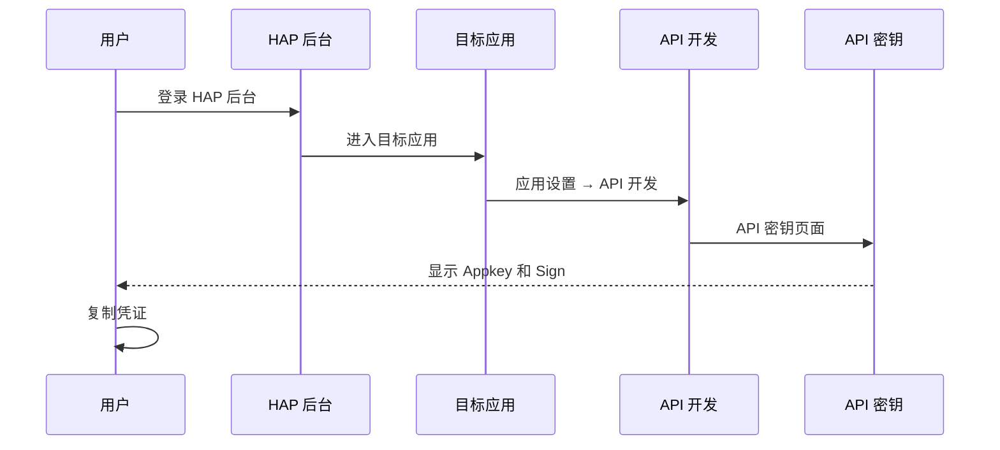

**图表来源**
- [SKILL.md:70-75](file://SKILL.md#L70-L75)

**获取步骤详解**：
1. 登录 HAP → 进入目标应用 → **应用设置** → **API 开发** → **API 密钥**
2. 复制 `Appkey` 和 `Sign`
3. 或复制 MCP URL：`https://api.mingdao.com/mcp?HAP-Appkey=<Appkey>&HAP-Sign=<Sign>`

#### MCP 路径配置

应用级授权在 MCP 协议中的配置最为简洁：

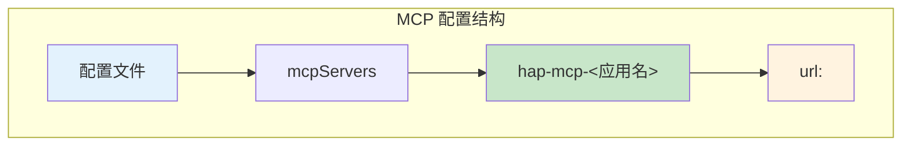

**图表来源**
- [SKILL.md:76-97](file://SKILL.md#L76-L97)

配置要点：
- **URL 结构**：`https://api.mingdao.com/mcp?HAP-Appkey=<Appkey>&HAP-Sign=<Sign>`
- **应用范围**：仅能访问所属应用的数据
- **权限控制**：受应用内 API 开关控制

#### V3 REST API 路径

应用级授权在 V3 REST API 中的使用方式：

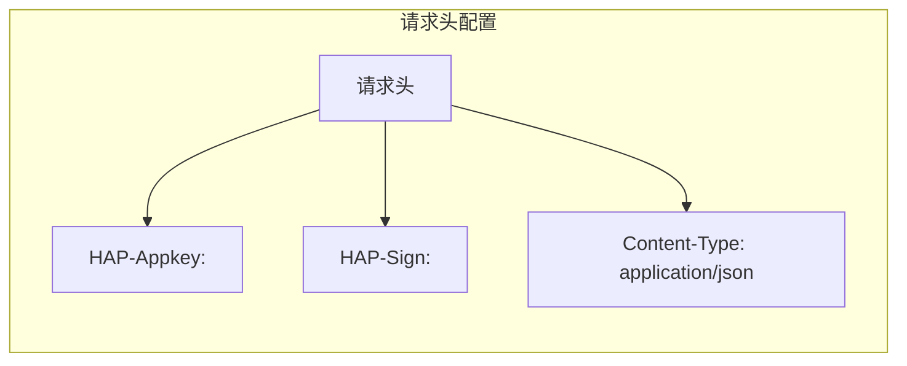

**图表来源**
- [SKILL.md:98-165](file://SKILL.md#L98-L165)

**请求头规范**：
- `Content-Type: application/json`
- `HAP-Appkey: <Appkey>`
- `HAP-Sign: <Sign>`

**章节来源**
- [SKILL.md:68-165](file://SKILL.md#L68-L165)

### 个人级授权：OAuth Bearer

#### 获取 Token 流程

个人级授权涉及更复杂的 OAuth 流程：

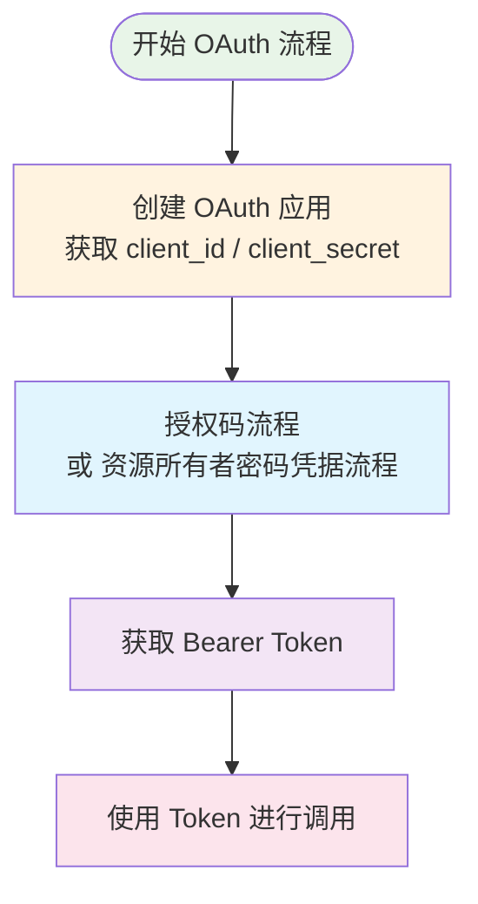

**图表来源**
- [SKILL.md:170-175](file://SKILL.md#L170-L175)

#### MCP 路径配置

个人级授权在 MCP 协议中的配置需要额外参数：

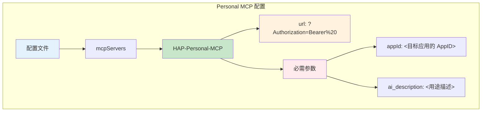

**图表来源**
- [SKILL.md:176-210](file://SKILL.md#L176-L210)

**必需参数说明**：
- `appId`：必填，标识访问哪个应用
- `ai_description`：必填，用于审计和鉴权校验

#### Token 过期与刷新

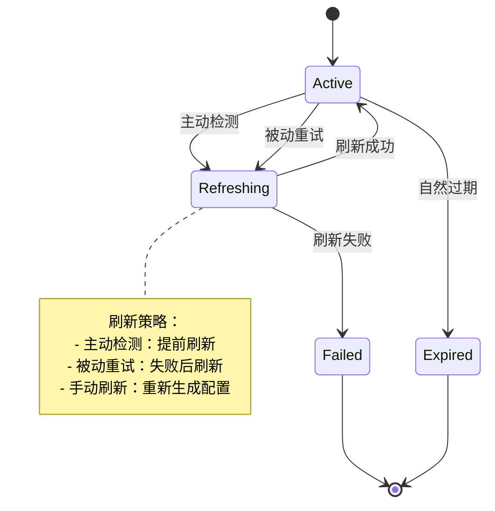

**图表来源**
- [SKILL.md:211-229](file://SKILL.md#L211-L229)

**章节来源**
- [SKILL.md:168-233](file://SKILL.md#L168-L233)

## 依赖关系分析

### 技能模块关系

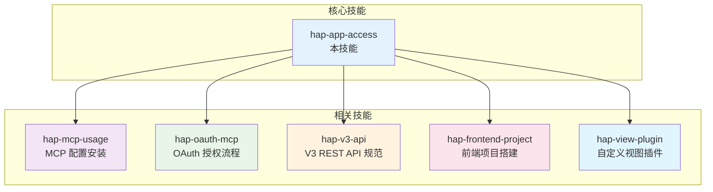

**图表来源**
- [README.md:39-49](file://README.md#L39-L49)
- [SKILL.md:422-431](file://SKILL.md#L422-L431)

### 调用路径依赖

| 技能名称 | 依赖关系 | 用途说明 |
|----------|----------|----------|
| hap-mcp-usage | 依赖 hap-app-access | MCP 配置的自动化安装（9 种 AI 工具平台） |
| hap-oauth-mcp | 依赖 hap-app-access | OAuth 授权流程 + Bearer Token 获取/刷新 |
| hap-v3-api | 依赖 hap-app-access | V3 REST API 的完整使用规范 |
| hap-frontend-project | 依赖 hap-app-access | 使用 HAP 作为后端搭建独立网站 |
| hap-view-plugin | 依赖 hap-app-access | 开发 HAP 自定义视图插件 |

**章节来源**
- [README.md:39-49](file://README.md#L39-L49)

## 性能考量

### 调用路径性能对比

| 维度 | MCP 协议 | V3 REST API |
|------|----------|-------------|
| 协议 | MCP（Model Context Protocol） | 标准 HTTPS + JSON |
| 端点 | `https://api.mingdao.com/mcp` | `https://api.mingdao.com/v3/open/...` |
| 鉴权注入 | URL query 参数或 SSE Header | HTTP 请求头 |
| 工具发现 | 自动暴露 40~70 个工具 | 需查 API 文档 |
| 调用方式 | AI 工具原生支持 | 代码中 `fetch`/`requests` 等 |
| 适合场景 | AI 助手直接操作数据 | 开发者在代码中集成 |
| 分页上限 | **90** | **1000** |
| 响应大小 | 单次约 **256KB** 缓冲上限 | 无此限制 |

**章节来源**
- [SKILL.md:35-54](file://SKILL.md#L35-L54)

### 分页策略建议

- **MCP 路径**：推荐 `pageSize` 为 50，避免超过 256KB 缓冲上限
- **V3 API 路径**：推荐 `pageSize` 为 100~500，平衡性能与效率

## 故障排除指南

### 常见错误与解决方案

#### 错误码对照表

| 错误码 | 含义 | 典型原因 | 解决方案 |
|--------|------|---------|----------|
| `1` | 成功 | — | — |
| `-1` | 通用失败 | 查看 `error_msg` | 按 error_msg 排查 |
| `4` | 权限不足 | 当前身份无该操作权限 | 检查授权类型和用户权限 |
| `10` | 参数错误 | 参数缺失或格式错误 | 检查参数名（驼峰）和值格式 |
| `10001` | HTTP Headers 验证失败 | OAuth token 域名不在白名单 | 确认使用 `api.mingdao.com` |
| `600101` | 授权已失效 | Bearer token 过期 | 刷新 token |
| `600100` | token 无效/缺失 | token 为空或格式错误 | 检查 Authorization 头 |

#### 10001 vs 600101 区分

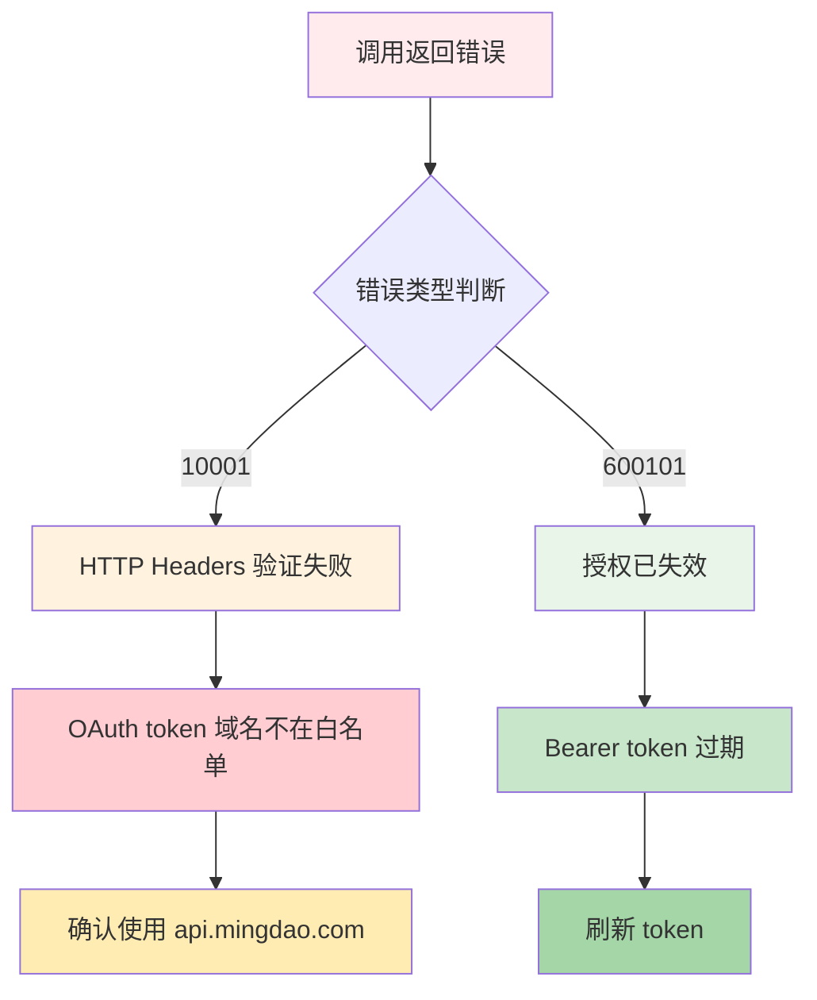

**图表来源**
- [SKILL.md:390-398](file://SKILL.md#L390-L398)

### 陷阱清单

#### 选项字段写入必须用 key

写入 SingleSelect / MultipleSelect 字段时，value 必须传 **option key（UUID）** 的数组，不能传显示文本。

#### 关联字段 get_record_list 可能丢失

`get_record_list` 对部分 Relation 字段可能返回空字符串 `""`，需要额外调用 `get_record_details(rowId)` 补全。

#### _owner 字段响应为空但 filter 有效

`_owner` 字段在记录列表/详情中永远返回 `""`，但 `filter.ownerid` 筛选仍然有效。

**章节来源**
- [SKILL.md:301-376](file://SKILL.md#L301-L376)

## 结论

明道云 HAP 应用的授权体系提供了灵活而强大的访问控制机制。应用级授权（Appkey+Sign）适合需要长期稳定访问的场景，而个人级授权（OAuth Bearer）则满足需要用户权限约束的个性化需求。

关键要点总结：
1. **选择原则明确**：根据是否需要无人值守运行和用户权限约束来选择授权方式
2. **调用路径清晰**：MCP 协议适合 AI 直接操作，V3 REST API 适合代码集成
3. **安全考虑周全**：凭证的存储和传输都有明确的安全要求
4. **错误处理完善**：提供了详细的错误码对照和故障排除指南

对于初学者，建议从应用级授权开始，因为它配置简单且长期有效；对于有复杂权限需求的场景，可以考虑个人级授权配合 OAuth 流程。

## 附录

### 快速决策流程

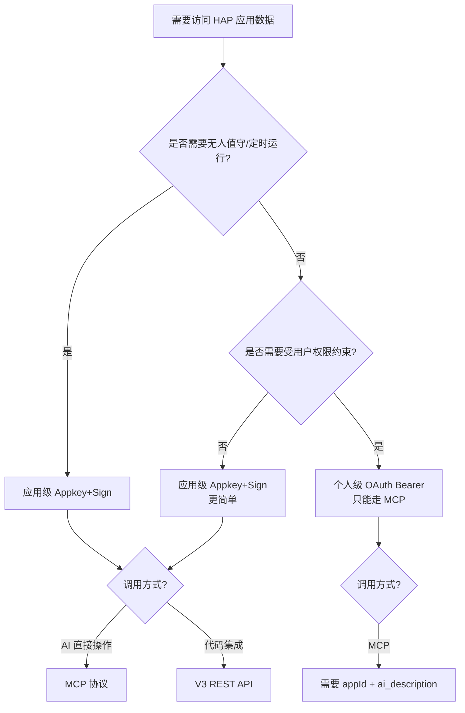

**图表来源**
- [SKILL.md:401-418](file://SKILL.md#L401-L418)

### API Host 配置

| 产品线 | API Host | MCP URL 示例 |
|--------|----------|-------------|
| 明道云 HAP | `https://api.mingdao.com` | `https://api.mingdao.com/mcp?...` |
| Nocoly HAP | `https://www.nocoly.com` | `https://www.nocoly.com/mcp?...` |
| 私有部署 | `https://<域名>/api` | `https://<域名>/mcp?...` |

**章节来源**
- [SKILL.md:236-247](file://SKILL.md#L236-L247)