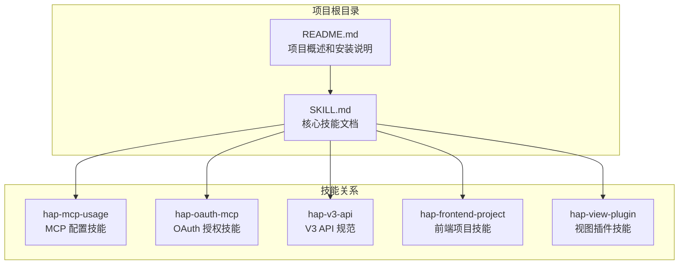
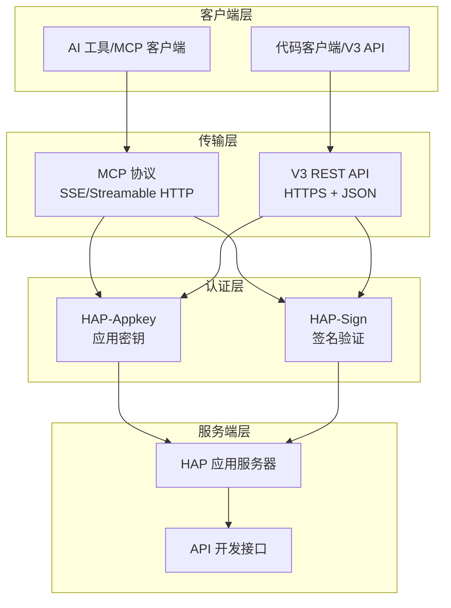
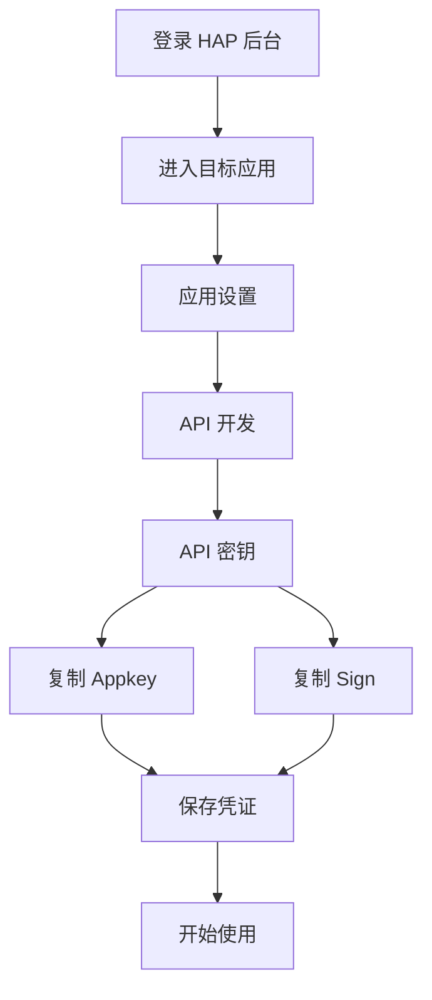
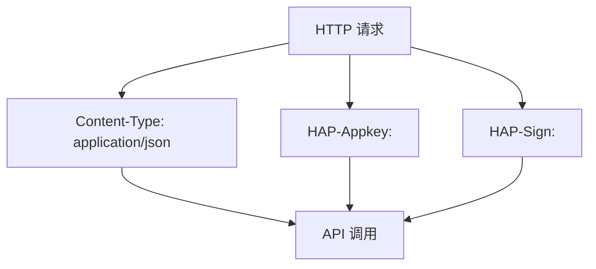
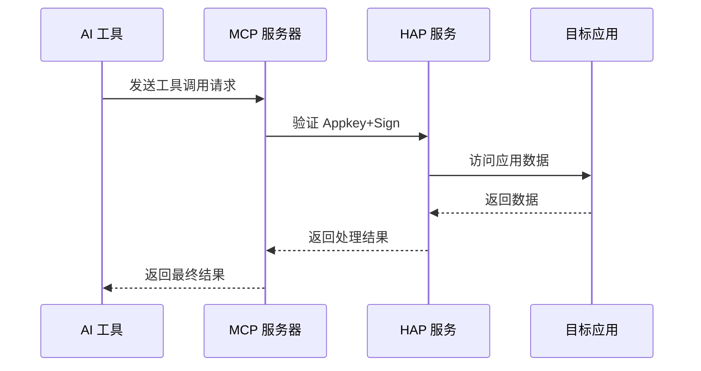
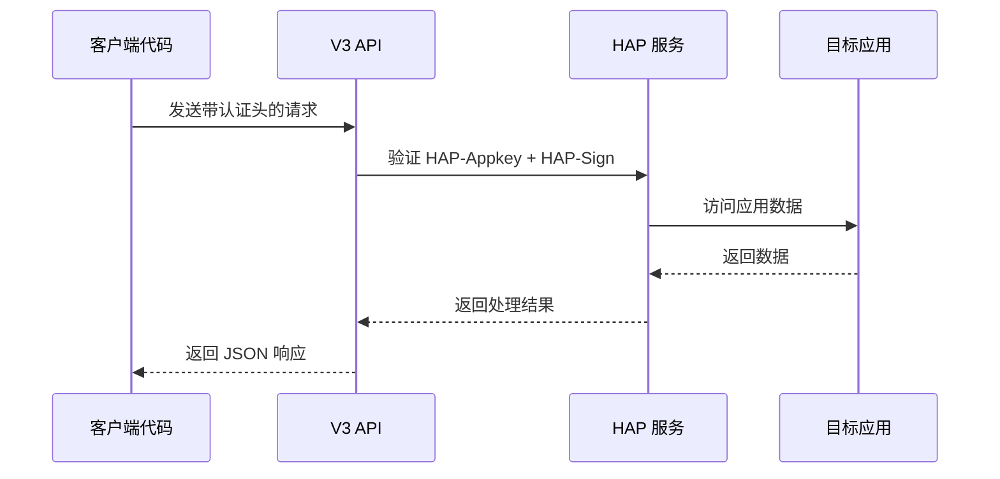
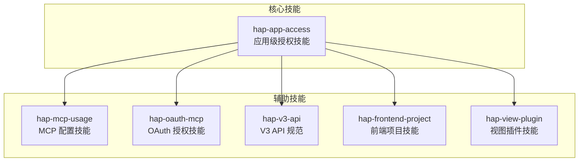
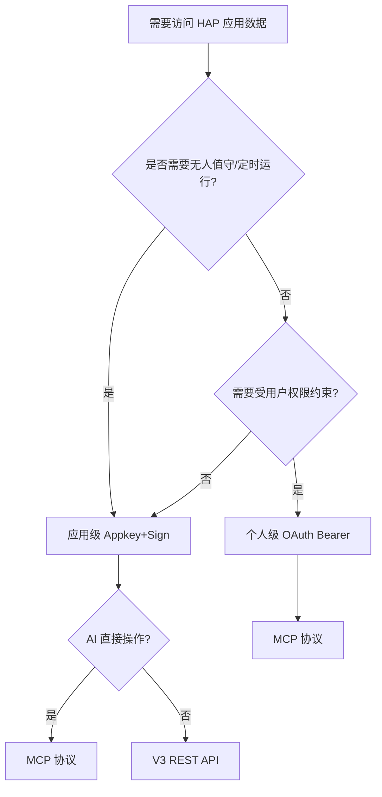

# 应用级授权：Appkey+Sign

<cite>
**本文档引用的文件**
- [README.md](file://README.md)
- [SKILL.md](file://SKILL.md)
</cite>

## 目录
1. [简介](#简介)
2. [项目结构](#项目结构)
3. [核心组件](#核心组件)
4. [架构概览](#架构概览)
5. [详细组件分析](#详细组件分析)
6. [依赖关系分析](#依赖关系分析)
7. [性能考虑](#性能考虑)
8. [故障排除指南](#故障排除指南)
9. [结论](#结论)
10. [附录](#附录)

## 简介

明道云 HAP 应用的**应用级授权**（Appkey+Sign）是一种无需用户介入的长期有效授权方式，适用于后台定时任务、服务间同步和脚本自动化等场景。本文档深入解释了 Appkey 和 Sign 凭证的获取流程、配置方法和使用模式，并展示了如何在 MCP 协议和 V3 REST API 中正确使用 Appkey+Sign 进行认证。

应用级授权的核心优势在于其长期有效性（除非在 HAP 后台重置），不需要复杂的 OAuth 流程，且可以访问应用内的全部数据。这种授权方式特别适合需要无人值守运行的场景。

## 项目结构

该项目采用极简的文档结构设计，专注于提供通用的访问技能知识：

**图表来源**
- [README.md: 39-49:39-49](file://README.md#L39-L49)
- [SKILL.md: 422-431:422-431](file://SKILL.md#L422-L431)

**章节来源**
- [README.md: 1-53:1-53](file://README.md#L1-L53)
- [SKILL.md: 1-10:1-10](file://SKILL.md#L1-L10)

## 核心组件

### 凭证组件

应用级授权的核心凭证由两个部分组成：

**Appkey（应用密钥）**
- 应用级别的唯一标识符
- 在 HAP 后台应用设置中获取
- 用于标识访问的应用实例

**Sign（签名）**
- 基于 Appkey 和请求内容生成的安全签名
- 用于验证请求的完整性和真实性
- 与 Appkey 配合提供双重安全保障

### 鉴权组件

系统提供了两种鉴权注入方式：

**MCP 协议鉴权**
- 通过 URL 查询参数传递：`HAP-Appkey` 和 `HAP-Sign`
- 适用于 AI 工具直接操作数据的场景
- 单次响应有约 256KB 的缓冲上限

**V3 REST API 鉴权**
- 通过 HTTP 请求头传递：`HAP-Appkey` 和 `HAP-Sign`
- 适用于代码集成和批量操作场景
- 无响应大小限制，支持更大的数据集

**章节来源**
- [SKILL.md: 17-25:17-25](file://SKILL.md#L17-L25)
- [SKILL.md: 68-165:68-165](file://SKILL.md#L68-L165)

## 架构概览

应用级授权的整体架构分为三个层次：

**图表来源**
- [SKILL.md: 35-54:35-54](file://SKILL.md#L35-L54)
- [SKILL.md: 68-165:68-165](file://SKILL.md#L68-L165)

## 详细组件分析

### 凭证获取流程

#### 后台配置步骤

应用级授权的凭证获取需要在 HAP 后台进行配置：

**图表来源**
- [SKILL.md: 70-75:70-75](file://SKILL.md#L70-L75)

#### 凭证存储最佳实践

- 将 Appkey 和 Sign 存储在安全的环境变量中
- 避免将凭证硬编码在源代码中
- 定期轮换凭证以提高安全性
- 为不同环境（开发、测试、生产）使用不同的凭证

**章节来源**
- [SKILL.md: 70-75:70-75](file://SKILL.md#L70-L75)

### MCP 协议配置

#### 配置结构

MCP 协议的 Appkey+Sign 配置采用 JSON 格式：

**图表来源**
- [SKILL.md: 76-88:76-88](file://SKILL.md#L76-L88)

#### 可用工具列表

配置完成后，可使用以下工具进行数据操作：

| 工具类别 | 工具名称 | 功能描述 |
|---------|---------|----------|
| 应用信息 | `get_app_info` | 获取应用基本信息 |
| 工作表管理 | `get_app_worksheets_list` | 获取工作表列表 |
| 结构查询 | `get_worksheet_structure` | 获取工作表结构 |
| 记录查询 | `get_record_list` | 查询记录列表 |
| 记录详情 | `get_record_details` | 获取记录详情 |
| 记录操作 | `create_record` | 创建记录 |
| 记录更新 | `update_record` | 更新记录 |
| 记录删除 | `delete_record` | 删除记录 |
| 批量操作 | `batch_create_records` | 批量创建记录 |

**章节来源**
- [SKILL.md: 76-96:76-96](file://SKILL.md#L76-L96)

### V3 REST API 配置

#### 请求头配置

V3 REST API 使用标准的 HTTP 请求头进行认证：

**图表来源**
- [SKILL.md: 100-106:100-106](file://SKILL.md#L100-L106)

#### 常用端点

| 操作类型 | HTTP 方法 | 端点路径 | 功能描述 |
|---------|----------|----------|----------|
| 应用信息 | GET | `/v3/app/info` | 获取应用基本信息 |
| 工作表列表 | GET | `/v3/app/worksheets` | 获取工作表列表 |
| 字段信息 | GET | `/v3/app/worksheet/getFields` | 获取工作表字段 |
| 记录查询 | POST | `/v3/app/worksheets/{id}/rows/list` | 查询记录列表 |
| 记录详情 | GET | `/v3/app/worksheets/{id}/rows/{rowId}` | 获取记录详情 |
| 创建记录 | POST | `/v3/app/worksheets/{id}/rows` | 创建新记录 |
| 更新记录 | PUT | `/v3/app/worksheets/{id}/rows/{rowId}` | 更新记录 |
| 删除记录 | DELETE | `/v3/app/worksheets/{id}/rows/{rowId}` | 删除记录 |
| 批量创建 | POST | `/v3/app/worksheets/{id}/rows/batch` | 批量创建记录 |
| 批量更新 | PUT | `/v3/app/worksheets/{id}/rows/batch` | 批量更新记录 |
| 批量删除 | DELETE | `/v3/app/worksheets/{id}/rows/batch` | 批量删除记录 |
| 关联记录 | GET | `/v3/app/worksheets/{id}/rows/{rowId}/relations/{fieldId}` | 获取关联记录 |
| 用户查找 | POST | `/v3/users/lookup` | 查找用户信息 |
| 部门查找 | POST | `/v3/departments/lookup` | 查找部门信息 |

**章节来源**
- [SKILL.md: 108-126:108-126](file://SKILL.md#L108-L126)

### 使用模式对比

#### MCP 协议使用模式

MCP 协议适用于 AI 工具直接操作数据的场景：

**图表来源**
- [SKILL.md: 39-53:39-53](file://SKILL.md#L39-L53)

#### V3 REST API 使用模式

V3 REST API 适用于代码集成场景：

**图表来源**
- [SKILL.md: 39-53:39-53](file://SKILL.md#L39-L53)

**章节来源**
- [SKILL.md: 35-65:35-65](file://SKILL.md#L35-L65)

## 依赖关系分析

### 技能依赖关系

应用级授权技能与其他 HAP 技能存在明确的依赖关系：

**图表来源**
- [README.md: 39-49:39-49](file://README.md#L39-L49)
- [SKILL.md: 422-431:422-431](file://SKILL.md#L422-L431)

### 组件耦合度分析

应用级授权技能具有以下特点：

- **低耦合性**：主要依赖外部系统（HAP 服务）
- **高内聚性**：专注于授权和认证功能
- **可扩展性**：支持多种调用路径和协议
- **兼容性**：支持明道云、Nocoly 和私有部署

**章节来源**
- [README.md: 39-49:39-49](file://README.md#L39-L49)

## 性能考虑

### MCP 协议性能特征

MCP 协议具有以下性能特点：

- **响应大小限制**：单次响应约 256KB 缓冲上限
- **分页限制**：`pageSize` 上限为 90
- **并发能力**：适合实时交互场景
- **延迟特性**：较低的网络延迟

### V3 REST API 性能特征

V3 REST API 具有以下性能特点：

- **无响应限制**：无缓冲大小限制
- **分页灵活**：`pageSize` 上限为 1000
- **批量操作**：支持高效的批量数据处理
- **缓存友好**：适合大规模数据查询

### 性能优化建议

1. **MCP 场景**：
   - 使用较小的 `pageSize`（推荐 50）
   - 实现增量加载策略
   - 避免一次性请求大量数据

2. **V3 API 场景**：
   - 合理设置 `pageSize`（100-500）
   - 实现分页遍历策略
   - 使用批量操作减少请求次数

**章节来源**
- [SKILL.md: 280-287:280-287](file://SKILL.md#L280-L287)

## 故障排除指南

### 常见问题及解决方案

#### 10001 错误码

**问题描述**：`10001 Http Headers verification failed`

**原因分析**：
- OAuth token 域名不在白名单
- 请求头验证失败

**解决方案**：
- 确保使用 `api.mingdao.com` 域名
- 检查请求头格式是否正确
- 验证 token 是否在有效期内

#### 600101 错误码

**问题描述**：`600101 授权已失效`

**原因分析**：
- Bearer token 过期
- Appkey+Sign 凭证被重置

**解决方案**：
- 重新获取新的 Appkey+Sign
- 检查凭证的有效性
- 实现凭证轮换机制

#### 401 未授权错误

**问题描述**：访问被拒绝

**原因分析**：
- 凭证错误或过期
- 应用权限不足
- 请求格式不正确

**解决方案**：
- 验证 Appkey+Sign 的正确性
- 检查应用的 API 开关设置
- 确认请求头格式符合要求

### 调试技巧

1. **日志记录**：记录完整的请求和响应
2. **分步验证**：逐个验证凭证和请求参数
3. **最小化测试**：使用简单的请求验证基本功能
4. **环境隔离**：在测试环境中验证后再部署到生产环境

**章节来源**
- [SKILL.md: 378-398:378-398](file://SKILL.md#L378-L398)

## 结论

应用级授权（Appkey+Sign）为明道云 HAP 应用提供了一种简单而强大的认证方式。通过本文档的学习，您应该能够：

1. **正确获取和配置** Appkey+Sign 凭证
2. **理解两种调用路径**（MCP 协议和 V3 REST API）的特点和适用场景
3. **掌握正确的配置方法**和使用模式
4. **解决常见的认证问题**和故障排除
5. **根据具体需求选择合适的授权方式**

应用级授权特别适合需要无人值守运行的场景，如后台定时任务、服务间同步和脚本自动化。相比个人级授权，它提供了更好的稳定性和更低的维护成本。

## 附录

### 快速决策流程

### 相关技能索引

- **hap-mcp-usage**：MCP 配置的自动化安装
- **hap-oauth-mcp**：OAuth 授权流程 + Bearer Token 获取/刷新  
- **hap-v3-api**：V3 REST API 的完整使用规范
- **hap-frontend-project**：使用 HAP 作为后端搭建独立网站
- **hap-view-plugin**：开发 HAP 自定义视图插件

**章节来源**
- [SKILL.md: 401-418:401-418](file://SKILL.md#L401-L418)
- [SKILL.md: 422-431:422-431](file://SKILL.md#L422-L431)