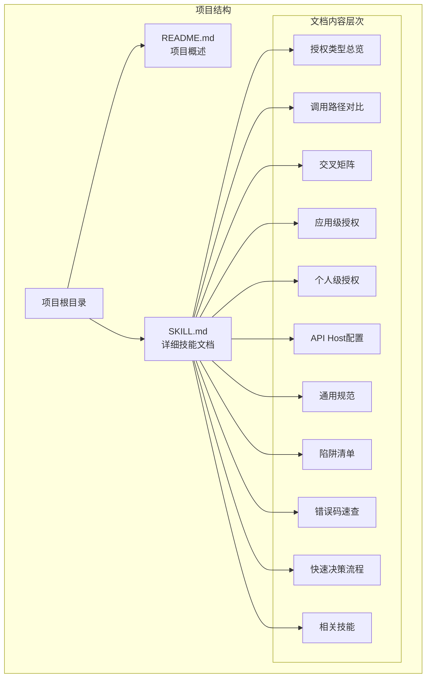
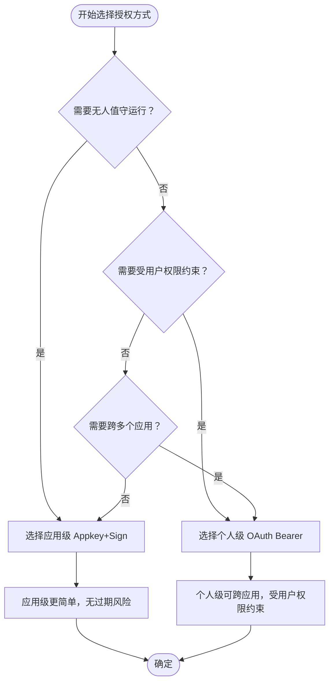
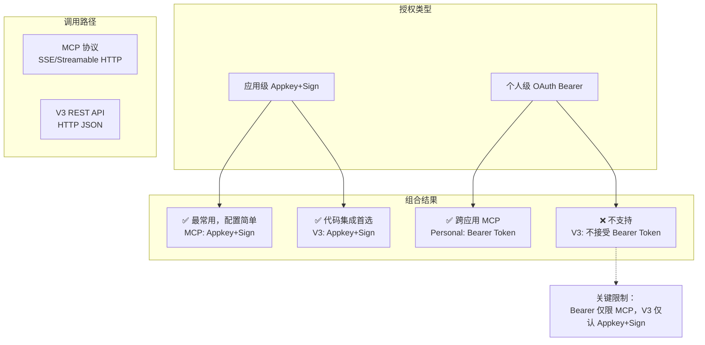
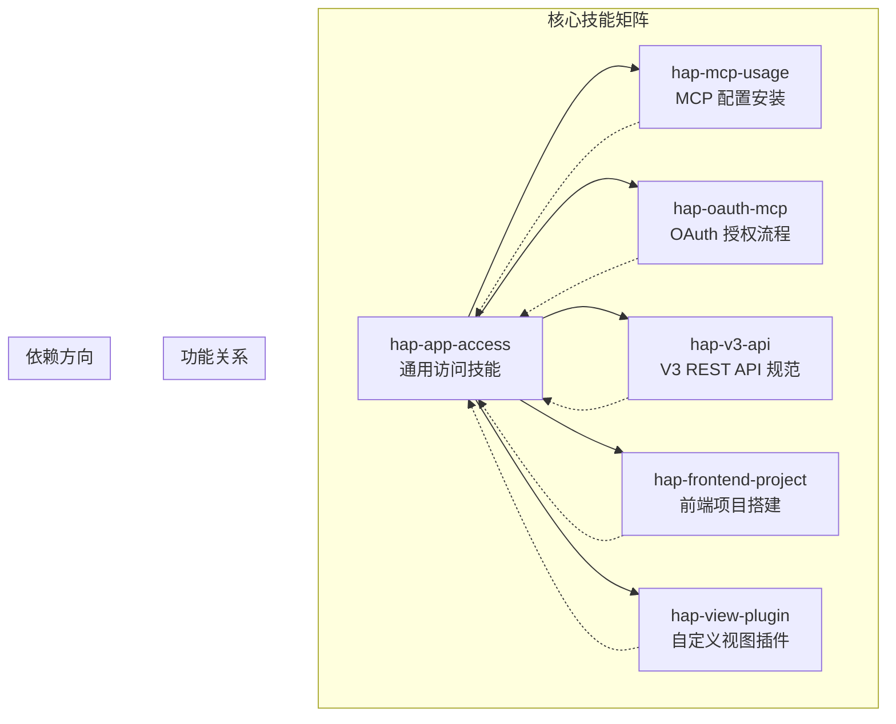
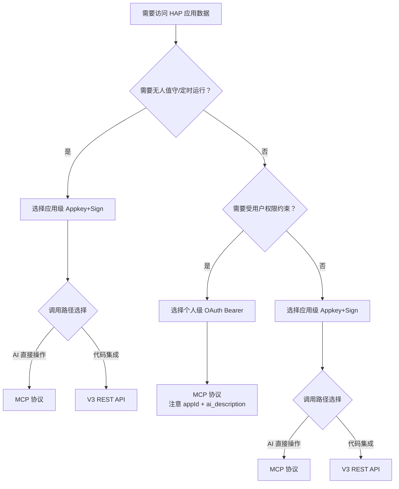

# 授权类型详解

<cite>
**本文档引用的文件**
- [README.md](file://README.md)
- [SKILL.md](file://SKILL.md)
</cite>

## 目录
1. [简介](#简介)
2. [项目结构](#项目结构)
3. [核心组件](#核心组件)
4. [架构概览](#架构概览)
5. [详细组件分析](#详细组件分析)
6. [依赖关系分析](#依赖关系分析)
7. [性能考虑](#性能考虑)
8. [故障排除指南](#故障排除指南)
9. [结论](#结论)
10. [附录](#附录)

## 简介

明道云 HAP 应用授权类型详解文档深入解析了两种核心授权方式：应用级 Appkey+Sign 和个人级 OAuth Bearer。该文档不仅涵盖了授权机制的技术实现细节，还包括了调用关系、接口规范、使用模式以及与相关组件的集成关系。

本项目提供了一个完整的授权类型矩阵，帮助开发者在不同场景下做出正确的授权选择。文档特别强调了两种授权方式在身份约束、权限范围、过期机制和适用场景方面的根本差异。

## 项目结构

该项目采用极简的文档结构设计，专注于知识传递而非代码实现：



**图表来源**
- [README.md:1-53](file://README.md#L1-L53)
- [SKILL.md:1-436](file://SKILL.md#L1-L436)

**章节来源**
- [README.md:1-53](file://README.md#L1-L53)
- [SKILL.md:1-436](file://SKILL.md#L1-L436)

## 核心组件

### 授权类型对比矩阵

两种授权方式的核心差异体现在以下几个维度：

| 维度 | 应用级授权（Appkey+Sign） | 个人级授权（OAuth Bearer） |
|------|--------------------------|---------------------------|
| 身份 | 应用身份（不受人约束） | 个人身份（等同于登录用户） |
| 凭证 | Appkey + Sign（长期有效） | Bearer Token（约 1 天过期） |
| 权限范围 | 应用内 API 开关控制的全部数据 | 当前登录用户在应用中可见的数据 |
| 跨应用 | 只能访问所属应用 | 可跨应用访问用户有权限的所有应用 |
| 适用场景 | 后台定时任务、服务间同步、脚本自动化 | 个人数据查询、以用户视角读写数据 |
| 过期 | 不过期（除非在 HAP 后台重置） | 约 1 天，需要刷新机制 |

### 选择原则



**图表来源**
- [SKILL.md:27-31](file://SKILL.md#L27-L31)

**章节来源**
- [SKILL.md:13-32](file://SKILL.md#L13-L32)

## 架构概览

### 2×2 交叉矩阵

四种授权与调用路径的组合形成了完整的访问矩阵：



**图表来源**
- [SKILL.md:57-64](file://SKILL.md#L57-L64)

### 调用路径对比

两种调用路径各有特色：

| 维度 | MCP 协议（SSE/Streamable HTTP） | V3 REST API（HTTP JSON） |
|------|-------------------------------|-------------------------|
| 协议 | MCP（Model Context Protocol） | 标准 HTTPS + JSON |
| 端点 | `https://api.mingdao.com/mcp` | `https://api.mingdao.com/v3/open/...` |
| 鉴权注入 | URL query 参数或 SSE Header | HTTP 请求头 |
| 工具发现 | 自动暴露 40~70 个工具 | 需查 API 文档 |
| 调用方式 | AI 工具原生支持（如 Qoder/Cursor 的 MCP 集成） | 代码中 `fetch`/`requests` 等 |
| 适合场景 | AI 助手直接操作数据 | 开发者在代码中集成 |
| 分页限制 | `pageSize` 上限 **90** | `pageSize` 上限 **1000** |
| 响应大小 | 单次约 **256KB** 缓冲上限 | 无此限制 |

**章节来源**
- [SKILL.md:35-54](file://SKILL.md#L35-L54)

## 详细组件分析

### 应用级授权：Appkey+Sign

#### 凭证获取流程

应用级授权的凭证获取过程相对简单直接：

1. 登录 HAP → 进入目标应用 → **应用设置** → **API 开发** → **API 密钥**
2. 复制 `Appkey` 和 `Sign`
3. 或复制 MCP URL：`https://api.mingdao.com/mcp?HAP-Appkey=<Appkey>&HAP-Sign=<Sign>`

#### MCP 路径配置

在 AI 工具的 MCP 配置中，应用级授权的配置格式如下：

```json
{
  "mcpServers": {
    "hap-mcp-<应用名>": {
      "url": "https://api.mingdao.com/mcp?HAP-Appkey=<Appkey>&HAP-Sign=<Sign>"
    }
  }
}
```

配置后可用的典型工具包括：
- `get_app_info` / `get_app_worksheets_list` / `get_worksheet_structure`
- `get_record_list` / `get_record_details` / `get_record_pivot_data`
- `create_record` / `update_record` / `delete_record`
- `batch_create_records` / `batch_update_records` / `batch_delete_records`

#### V3 REST API 路径

应用级授权在 V3 REST API 中的使用方式：

**请求头配置**：
- `Content-Type: application/json`
- `HAP-Appkey: <Appkey>`
- `HAP-Sign: <Sign>`

**常用端点**：
- 获取应用信息：`GET /v3/app/info`
- 获取工作表列表：`GET /v3/app/worksheets`
- 查询记录：`POST /v3/app/worksheets/{id}/rows/list`
- 创建记录：`POST /v3/app/worksheets/{id}/rows`
- 更新记录：`PUT /v3/app/worksheets/{id}/rows/{rowId}`
- 删除记录：`DELETE /v3/app/worksheets/{id}/rows/{rowId}`

**章节来源**
- [SKILL.md:68-165](file://SKILL.md#L68-L165)

### 个人级授权：OAuth Bearer

#### Token 获取流程

个人级授权的 Token 获取涉及 OAuth 授权流程：

1. 在 HAP 组织管理后台创建 **OAuth 应用**（获取 `client_id` / `client_secret`）
2. 通过 OAuth 授权码流程或资源所有者密码凭据流程获取 Bearer Token
3. 或使用 `hap-oauth-mcp` 技能自动完成授权 + 生成 MCP 配置

#### MCP 路径配置

个人级授权在 MCP 中的配置格式：

```json
{
  "mcpServers": {
    "HAP-Personal-MCP": {
      "url": "https://api.mingdao.com/mcp?Authorization=Bearer%20<Token>"
    }
  }
}
```

配置后可用的工具包括应用级的全部工具，以及：
- `get_org_list`（组织列表）
- 跨应用数据访问等
- 受用户权限约束：只能看到用户有权限的应用和工作表

#### MCP 调用必填参数

Personal MCP 的**每次工具调用**必须额外提供：

```json
{
  "appId": "<目标应用的 AppID>",
  "ai_description": "<本次调用的用途描述>",
  "worksheetId": "<工作表 ID>",
  "...": "其他业务参数"
}
```

关键参数说明：
- `appId`：必填，标识访问哪个应用，否则返回 401
- `ai_description`：必填，HAP 服务端用于审计和鉴权校验，否则返回 401

**章节来源**
- [SKILL.md:168-234](file://SKILL.md#L168-L234)

### Token 过期与刷新机制

Bearer Token 有效期约 **1 天**，过期后所有 Personal MCP 调用返回鉴权失败。

#### 刷新策略

| 策略 | 描述 | 适合场景 |
|------|------|---------|
| 主动检测 | 调用前检查 token 的 `expires_at` / `refreshed_at`，提前刷新 | 定时任务、长时间运行的脚本 |
| 被动重试 | 调用返回鉴权失败时，自动刷新 token 并重试一次 | 简单脚本、交互式工具 |
| 手动刷新 | 使用 `hap-oauth-mcp` 技能重新生成 MCP 配置 | 偶尔使用、调试 |

#### 鉴权失败的典型表现

- `isError: true` + `error_code: 600101`（授权已失效）
- 响应包含 `token无效` / `token过期` / `Authorization failed` 等关键词
- `success: false`

**章节来源**
- [SKILL.md:211-229](file://SKILL.md#L211-L229)

## 依赖关系分析

### 相关技能组件

该项目与多个 HAP 技能形成互补关系：



**图表来源**
- [README.md:39-48](file://README.md#L39-L48)

### 技能定位关系

| 技能 | 定位 | 作用 |
|------|------|------|
| **hap-app-access**（本技能） | 上层方法论：选授权、选路径、避坑 | 提供授权类型选择指导 |
| hap-mcp-usage | MCP 配置安装（9 种 AI 工具平台） | 实现 MCP 配置的具体安装 |
| hap-oauth-mcp | OAuth 授权流程 + Bearer Token 获取/刷新 | 完整的 OAuth 实现参考 |
| hap-v3-api | V3 REST API 完整规范 | V3 API 的详细使用规范 |
| hap-frontend-project | HAP 作为后端搭建独立网站 | 前端项目集成指导 |
| hap-view-plugin | HAP 自定义视图插件开发 | 视图插件开发规范 |

**章节来源**
- [README.md:39-48](file://README.md#L39-L48)

## 性能考虑

### 分页策略

两种调用路径在分页方面有不同的限制：

| 路径 | pageSize 上限 | 推荐值 | 说明 |
|------|-------------|--------|------|
| MCP `get_record_list` | **90** | 50 | 单次响应有 ~256KB 缓冲上限，大表必须降 page_size |
| V3 API `rows/list` | **1000** | 100~500 | 无缓冲限制，但不宜过大 |

### 响应大小限制

MCP 协议的单次响应有约 256KB 的缓冲上限，超出会抛出 `Exceeded limit on max bytes to buffer` 错误。

**解法**：
- 降低 `pageSize`（大表推荐 50）
- 或改用 V3 REST API

### 性能优化建议

1. **合理设置分页大小**：根据数据量和响应大小调整 `pageSize`
2. **避免一次性获取大量数据**：使用分页循环获取
3. **选择合适的调用路径**：大数据量场景优先考虑 V3 API
4. **缓存策略**：对于频繁查询但不经常变化的数据进行缓存

## 故障排除指南

### 常见错误码及处理

| 错误码 | 含义 | 典型原因 | 解法 |
|--------|------|---------|------|
| `1` | 成功 | — | — |
| `-1` | 通用失败 | 查看 `error_msg` | 按 error_msg 排查 |
| `4` | 权限不足 | 当前身份无该操作权限 | 检查授权类型和用户权限 |
| `10` | 参数错误 | 参数缺失或格式错误 | 检查参数名（驼峰）和值格式 |
| `10001` | HTTP Headers 验证失败 | OAuth token 域名不在白名单 | 确认使用 `api.mingdao.com` |
| `600101` | 授权已失效 | Bearer token 过期 | 刷新 token |
| `600100` | token 无效/缺失 | token 为空或格式错误 | 检查 Authorization 头 |

### 10001 vs 600101 区分

| 表现 | 含义 | 路径 |
|------|------|------|
| `10001 Http Headers verification failed` | 域名/scope 层白名单不匹配 | HAP V3 代理层拦截 |
| `600101 授权已失效` / `invalid_token` | token 本身过期或无效 | OAuth introspection 服务拦截 |

### OAuth Bearer 域名白名单问题

OAuth App 的 Bearer Token 只对**创建该 App 时配置的域名**鉴权有效。当前明道云默认只对 `api.mingdao.com` 白名单。

**解法**：确保 MCP URL 中的域名与 OAuth App 白名单一致（用 `api.mingdao.com`）。

### 陷阱清单

#### 选项字段写入必须用 key

写入 SingleSelect / MultipleSelect 字段时，value 必须传 **option key（UUID）** 的数组，不能传显示文本。

#### 关联字段 get_record_list 可能丢失

`get_record_list` 对部分 Relation 字段可能返回空字符串 `""`，即使后端确实挂了关联。

**解法**：对空值关联字段，额外调 `get_record_details(rowId)` 补全。

#### _owner 字段响应为空但 filter 有效

`_owner` 字段在记录列表/详情中永远返回 `""`，但 `filter.ownerid` 筛选仍然有效。

**解法**：需要 owner 信息时，从 `_createdBy.accountId` 或工作流回推获取；筛选照用 `ownerid`。

#### caid 服务端 filter 的 in 操作不稳定

服务端 `filter.field_id=caid` 对数组的 `in` 操作支持有限。

**解法**：客户端过滤——先拉全量再按 `_createdBy.accountId` 在客户端筛选。

**章节来源**
- [SKILL.md:378-398](file://SKILL.md#L378-L398)
- [SKILL.md:301-376](file://SKILL.md#L301-L376)

## 结论

明道云 HAP 应用的授权体系通过应用级 Appkey+Sign 和个人级 OAuth Bearer 两种方式，为不同的使用场景提供了灵活的解决方案。应用级授权适用于无人值守的后台任务和自动化场景，而个人级授权则更适合需要用户权限约束的交互式应用。

关键要点总结：

1. **授权选择**：根据是否需要无人值守运行和用户权限约束来选择授权方式
2. **调用路径**：AI 直接操作选择 MCP，代码集成选择 V3 API
3. **组合限制**：OAuth Bearer 仅适用于 MCP，V3 API 仅认 Appkey+Sign
4. **性能考虑**：合理设置分页大小，避免一次性获取大量数据
5. **故障排除**：熟悉常见错误码和对应的解决策略

通过遵循本文档的指导原则和最佳实践，开发者可以有效地选择和实现合适的授权方案，确保应用的安全性和性能。

## 附录

### 快速决策流程



### API Host 配置

HAP 支持多个产品线和私有部署，API Host 不同：

| 产品线 | API Host | MCP URL 示例 |
|--------|----------|-------------|
| 明道云 HAP | `https://api.mingdao.com` | `https://api.mingdao.com/mcp?...` |
| Nocoly HAP | `https://www.nocoly.com` | `https://www.nocoly.com/mcp?...` |
| 私有部署 | `https://<域名>/api` | `https://<域名>/mcp?...` |

**私有部署注意事项**：私有部署的 V3 API 路径需在域名后加 `/api`（如 `https://p-demo.mingdaoyun.cn/api/v3/...`），MCP 端点则直接挂在根域名下。

**章节来源**
- [SKILL.md:401-418](file://SKILL.md#L401-L418)
- [SKILL.md:236-246](file://SKILL.md#L236-L246)