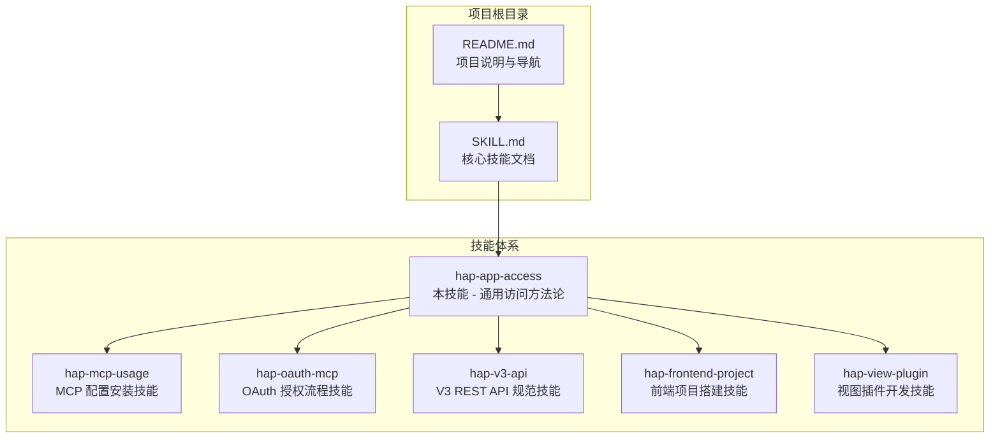
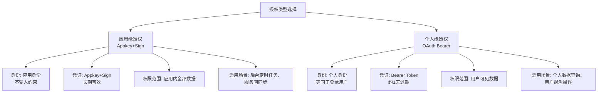
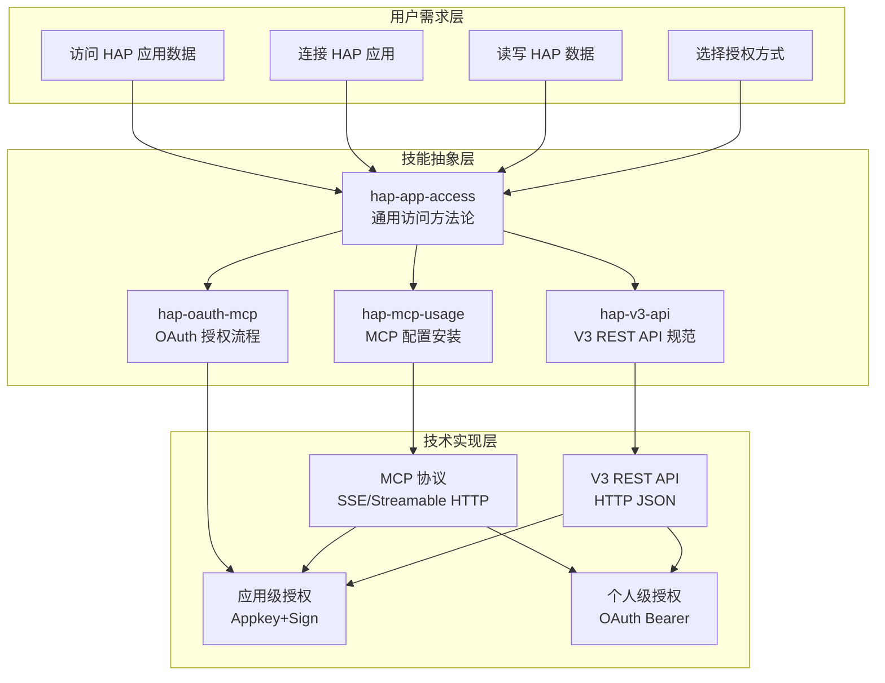
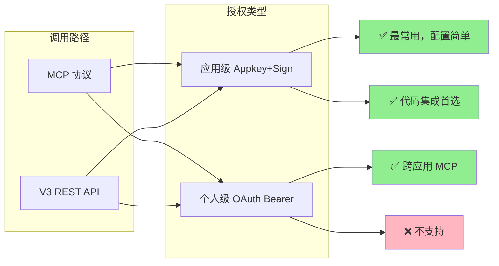
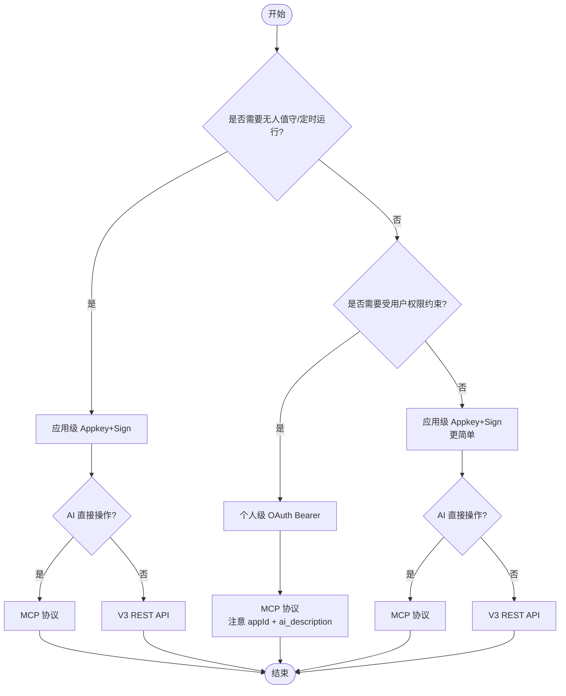
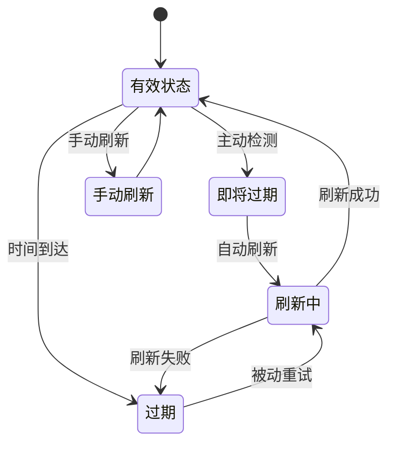
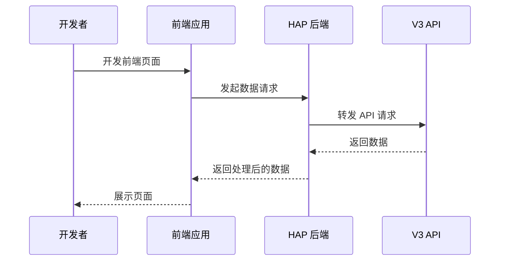
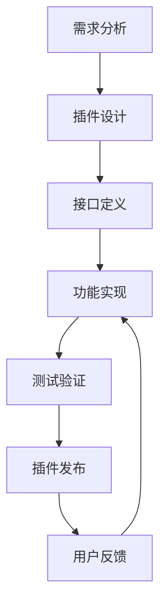
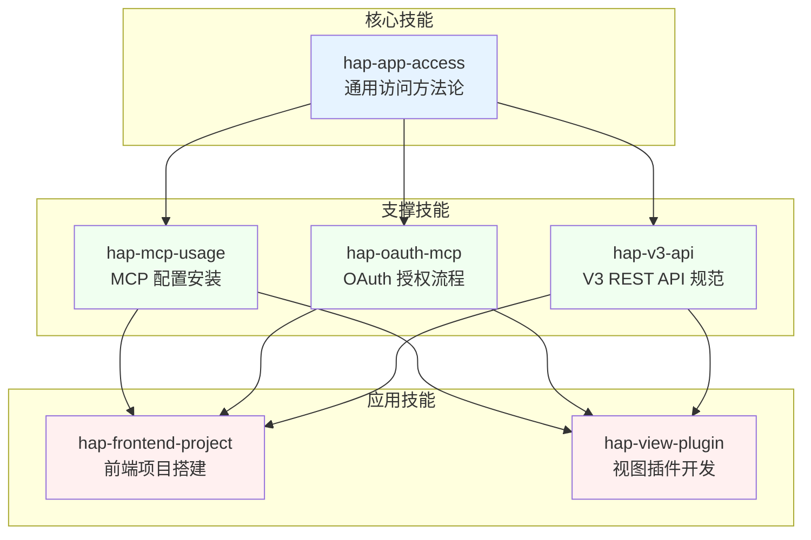

# 相关技能链接

<cite>
**本文档引用的文件**
- [README.md](file://README.md)
- [SKILL.md](file://SKILL.md)
</cite>

## 目录
1. [简介](#简介)
2. [项目结构](#项目结构)
3. [核心组件](#核心组件)
4. [架构概览](#架构概览)
5. [详细组件分析](#详细组件分析)
6. [依赖关系分析](#依赖关系分析)
7. [性能考虑](#性能考虑)
8. [故障排除指南](#故障排除指南)
9. [结论](#结论)

## 简介

明道云 HAP 应用技能体系是一个专门为明道云（HAP）应用开发设计的技能链接文档系统。该体系涵盖了两种授权类型（应用级 Appkey+Sign / 个人级 OAuth Bearer）与两种调用路径（MCP 协议 / V3 REST API）的交叉组合，为开发者提供了完整的访问方法论和最佳实践指导。

本技能文档的核心价值在于：
- 提供通用的授权、连接、调用方法论
- 建立完整的技能知识体系
- 明确各技能间的依赖关系和使用场景
- 帮助开发者快速选择合适的技能组合

## 项目结构

该项目采用极简的文件结构设计，专注于技能文档的清晰呈现：

**图表来源**
- [README.md: 1-53:1-53](file://README.md#L1-L53)
- [SKILL.md: 1-436:1-436](file://SKILL.md#L1-L436)

**章节来源**
- [README.md: 1-53:1-53](file://README.md#L1-L53)
- [SKILL.md: 1-436:1-436](file://SKILL.md#L1-L436)

## 核心组件

### 技能体系概述

明道云 HAP 技能体系由六个核心技能组成，每个技能都有明确的定位和适用场景：

| 技能名称 | 核心功能 | 适用场景 | 关键特性 |
|---------|---------|---------|---------|
| **hap-app-access** | 通用访问方法论 | 所有 HAP 应用访问场景 | 2×2 授权×路径矩阵、决策流程、陷阱清单 |
| hap-mcp-usage | MCP 配置安装 | AI 工具平台集成 | 9种 AI 工具平台支持、自动化配置 |
| hap-oauth-mcp | OAuth 授权流程 | 个人级访问场景 | Token 获取/刷新、跨应用访问 |
| hap-v3-api | V3 REST API 规范 | 代码集成场景 | 完整 API 规范、批量操作支持 |
| hap-frontend-project | 前端项目搭建 | 独立网站开发 | HAP 作为后端服务 |
| hap-view-plugin | 视图插件开发 | 自定义视图扩展 | 插件开发框架 |

### 授权类型对比

系统定义了两种核心授权类型，每种都有其独特的适用场景：

**图表来源**
- [SKILL.md: 13-32:13-32](file://SKILL.md#L13-L32)
- [SKILL.md: 168-233:168-233](file://SKILL.md#L168-L233)

**章节来源**
- [SKILL.md: 13-32:13-32](file://SKILL.md#L13-L32)
- [SKILL.md: 168-233:168-233](file://SKILL.md#L168-L233)

## 架构概览

### 技能组合架构

明道云 HAP 技能体系采用模块化设计，各技能既可独立使用，又可通过组合实现复杂功能：

**图表来源**
- [README.md: 39-48:39-48](file://README.md#L39-L48)
- [SKILL.md: 401-418:401-418](file://SKILL.md#L401-L418)

### 交叉矩阵分析

系统通过 2×2 的交叉矩阵清晰展示了四种组合的可行性：

**图表来源**
- [SKILL.md: 57-64:57-64](file://SKILL.md#L57-L64)

**章节来源**
- [SKILL.md: 57-64:57-64](file://SKILL.md#L57-L64)

## 详细组件分析

### 通用访问技能（本技能）

#### 核心定位与价值

hap-app-access 作为整个技能体系的"上层方法论"，为开发者提供了统一的选择标准和决策框架。它不包含具体业务逻辑，专注于：

- **授权类型选择**：应用级 vs 个人级的决策依据
- **调用路径选择**：MCP vs V3 API 的适用场景  
- **陷阱规避**：常见问题的预防和解决方案

#### 决策流程设计

系统提供了清晰的决策树，帮助开发者快速确定最适合的技能组合：

**图表来源**
- [SKILL.md: 401-418:401-418](file://SKILL.md#L401-L418)

**章节来源**
- [SKILL.md: 401-418:401-418](file://SKILL.md#L401-L418)

### MCP 协议技能

#### 技能特点

hap-mcp-usage 专注于 MCP 协议的配置和安装，支持 9 种主流 AI 工具平台：

- **自动化配置**：减少手动配置错误
- **平台兼容性**：覆盖主要 AI 开发环境
- **工具发现**：自动暴露 40-70 个数据操作工具

#### 工具集概览

MCP 协议提供的典型工具包括：

| 工具类别 | 典型工具 | 功能描述 |
|---------|---------|---------|
| 应用信息 | `get_app_info` | 获取应用基本信息 |
| 工作表管理 | `get_app_worksheets_list` | 获取工作表列表 |
| 记录查询 | `get_record_list` | 查询记录列表 |
| 记录操作 | `create_record` | 创建新记录 |
| 批量操作 | `batch_create_records` | 批量创建记录 |

**章节来源**
- [SKILL.md: 90-96:90-96](file://SKILL.md#L90-L96)

### OAuth MCP 技能

#### 授权流程

hap-oauth-mcp 提供完整的 OAuth 授权流程，包括：

- **Token 获取**：授权码流程或资源所有者密码凭据流程
- **Token 刷新**：主动检测、被动重试、手动刷新三种策略
- **跨应用访问**：个人级授权支持跨应用数据访问

#### Token 生命周期管理

**图表来源**
- [SKILL.md: 211-228:211-228](file://SKILL.md#L211-L228)

**章节来源**
- [SKILL.md: 211-228:211-228](file://SKILL.md#L211-L228)

### V3 REST API 技能

#### API 规范

hap-v3-api 提供完整的 REST API 使用规范，包括：

- **Filter 结构**：复杂的查询条件构建
- **字段类型**：各种数据类型的处理
- **批量操作**：高效的数据批量处理
- **分页机制**：大规模数据的分页查询

#### 常用端点

| 操作类型 | HTTP 方法 | 端点路径 | 功能描述 |
|---------|---------|---------|---------|
| 应用信息 | GET | `/v3/app/info` | 获取应用基本信息 |
| 工作表列表 | GET | `/v3/app/worksheets` | 获取工作表列表 |
| 记录查询 | POST | `/v3/app/worksheets/{id}/rows/list` | 查询记录列表 |
| 记录创建 | POST | `/v3/app/worksheets/{id}/rows` | 创建新记录 |
| 记录更新 | PUT | `/v3/app/worksheets/{id}/rows/{rowId}` | 更新记录 |
| 批量操作 | POST | `/v3/app/worksheets/{id}/rows/batch` | 批量操作 |

**章节来源**
- [SKILL.md: 108-126:108-126](file://SKILL.md#L108-L126)

### 前端项目技能

#### 技术栈

hap-frontend-project 专注于使用 HAP 作为后端服务搭建独立网站：

- **后端服务**：HAP 应用作为数据源
- **前端框架**：支持主流前端技术栈
- **数据交互**：通过 V3 API 进行数据通信

#### 开发模式

**图表来源**
- [README.md: 47](file://README.md#L47)

**章节来源**
- [README.md: 47](file://README.md#L47)

### 视图插件技能

#### 插件架构

hap-view-plugin 提供自定义视图插件的开发框架：

- **插件接口**：标准化的插件开发接口
- **视图扩展**：支持自定义数据展示方式
- **交互增强**：提供丰富的用户交互体验

#### 开发流程

**图表来源**
- [README.md: 48](file://README.md#L48)

**章节来源**
- [README.md: 48](file://README.md#L48)

## 依赖关系分析

### 技能依赖矩阵

明道云 HAP 技能体系中的技能存在明确的依赖关系：

**图表来源**
- [README.md: 39-48:39-48](file://README.md#L39-L48)

### 学习路径建议

基于技能依赖关系，推荐以下学习路径：

#### 路径一：MCP 协议开发
1. **hap-app-access** - 理解整体架构和选择原则
2. **hap-mcp-usage** - 掌握 MCP 配置和安装
3. **hap-oauth-mcp** - 学习 OAuth 授权流程
4. **hap-view-plugin** - 开发自定义视图插件

#### 路径二：V3 API 开发
1. **hap-app-access** - 理解整体架构和选择原则
2. **hap-v3-api** - 掌握 V3 API 规范
3. **hap-frontend-project** - 搭建前端项目
4. **hap-view-plugin** - 开发自定义视图插件

#### 路径三：综合应用
1. **hap-app-access** - 核心方法论
2. **hap-mcp-usage** + **hap-oauth-mcp** - 授权方案
3. **hap-v3-api** - API 规范
4. **hap-frontend-project** + **hap-view-plugin** - 应用开发

**章节来源**
- [README.md: 39-48:39-48](file://README.md#L39-L48)

## 性能考虑

### 调用路径性能对比

| 维度 | MCP 协议 | V3 REST API |
|------|---------|------------|
| **响应大小** | 单次约 256KB 缓冲上限 | 无此限制 |
| **分页上限** | pageSize 最大 90 | pageSize 最大 1000 |
| **工具数量** | 约 40-70 个工具 | 需查 API 文档 |
| **调用方式** | AI 工具原生支持 | 需要代码集成 |
| **适合场景** | AI 直接操作数据 | 开发者代码集成 |

### 优化建议

1. **大数据量处理**
   - MCP：降低 pageSize（推荐 50），避免 256KB 限制
   - V3 API：合理设置 pageSize（100-500），避免网络拥塞

2. **Token 管理**
   - 应用级：无需考虑过期问题
   - 个人级：实现主动检测或被动重试机制

3. **错误处理**
   - 建立完善的错误码映射和处理流程
   - 实现重试机制和降级策略

## 故障排除指南

### 常见问题及解决方案

#### 授权相关问题

| 问题现象 | 可能原因 | 解决方案 |
|---------|---------|---------|
| `10001` 错误 | OAuth token 域名不在白名单 | 确保使用 `api.mingdao.com` |
| `600101` 错误 | token 过期或无效 | 实施 token 刷新机制 |
| `600100` 错误 | token 缺失或格式错误 | 检查 Authorization 头设置 |
| `4` 错误 | 权限不足 | 检查用户权限和授权类型 |

#### 技术限制问题

| 问题现象 | 可能原因 | 解决方案 |
|---------|---------|---------|
| MCP 响应超限 | 超过 256KB 缓冲上限 | 降低 pageSize 或改用 V3 API |
| 关联字段丢失 | get_record_list 可能返回空字符串 | 调用 get_record_details 补全 |
| 数值类型不一致 | 读写类型不匹配 | 注意类型转换 |

#### 域名配置问题

| 问题现象 | 可能原因 | 解决方案 |
|---------|---------|---------|
| `tools/list` 通过但 `tools/call` 失败 | 域名白名单不匹配 | 确认使用正确的 API Host |
| OAuth 授权失败 | 域名不在白名单 | 在 OAuth App 中添加正确域名 |

**章节来源**
- [SKILL.md: 378-398:378-398](file://SKILL.md#L378-L398)
- [SKILL.md: 301-376:301-376](file://SKILL.md#L301-L376)

## 结论

明道云 HAP 应用技能体系通过模块化的技能设计和清晰的依赖关系，为开发者提供了一个完整的知识框架。该体系的核心价值体现在：

### 主要成就

1. **方法论统一**：通过 hap-app-access 提供统一的选择标准和决策框架
2. **技能互补**：各技能相互补充，形成完整的开发能力链
3. **场景适配**：针对不同使用场景提供专门的技能支持
4. **最佳实践**：总结了大量实际开发中的经验和教训

### 学习建议

1. **从基础开始**：优先掌握 hap-app-access 的核心方法论
2. **按需选择**：根据具体应用场景选择相应的技能组合
3. **实践结合**：理论学习与实际项目相结合
4. **持续更新**：关注技能体系的演进和最佳实践的发展

### 未来发展

随着明道云生态的不断发展，该技能体系也将持续演进，为开发者提供更好的支持和服务。建议开发者：
- 关注官方文档和社区动态
- 积极参与技能体系的改进和完善
- 分享自己的使用经验和最佳实践

通过系统性的学习和实践，开发者可以构建起完整的明道云 HAP 应用开发能力体系，在实际项目中发挥更大的价值。