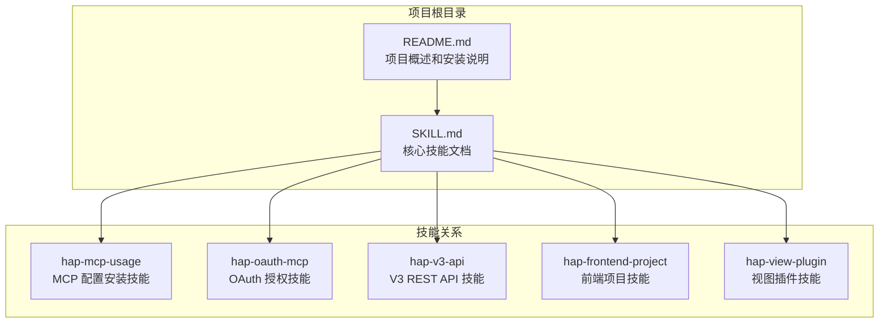
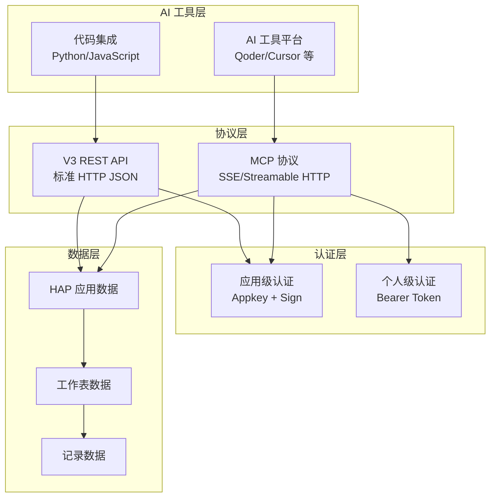
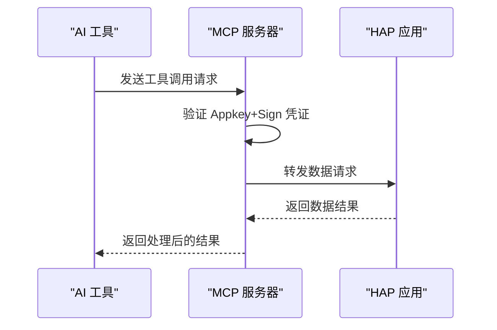
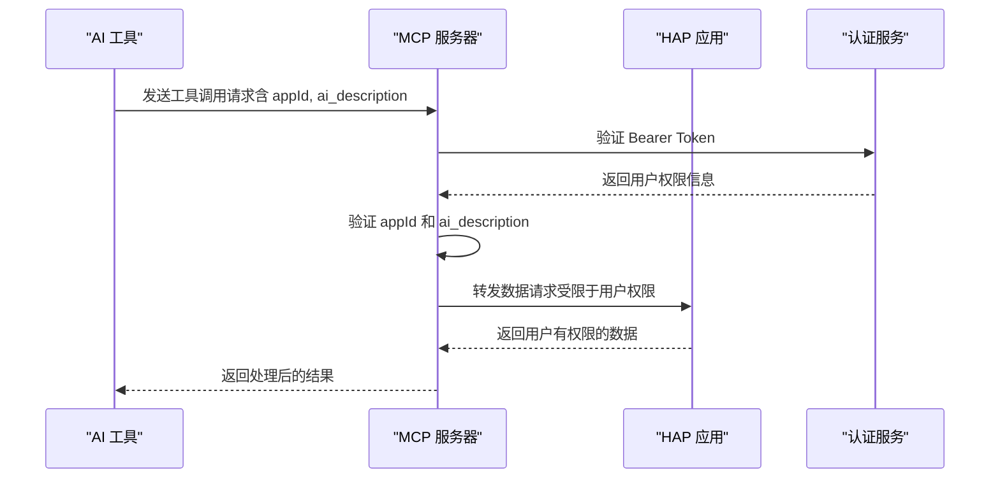
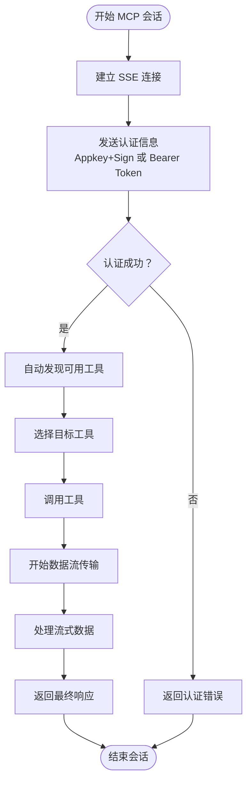
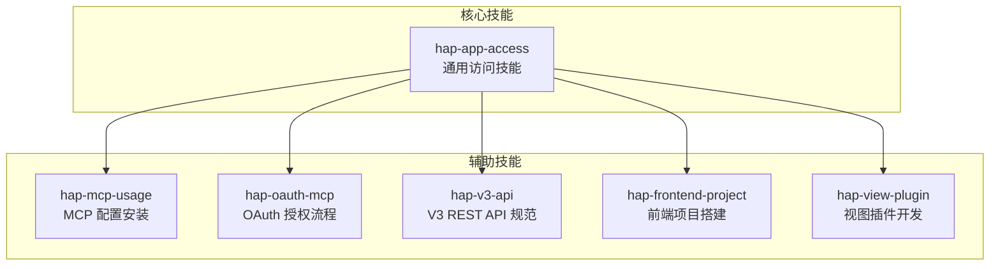
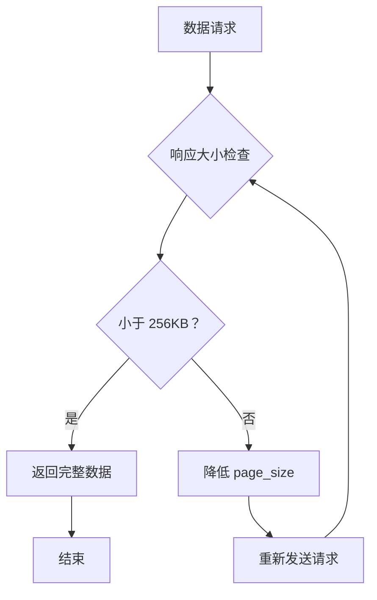
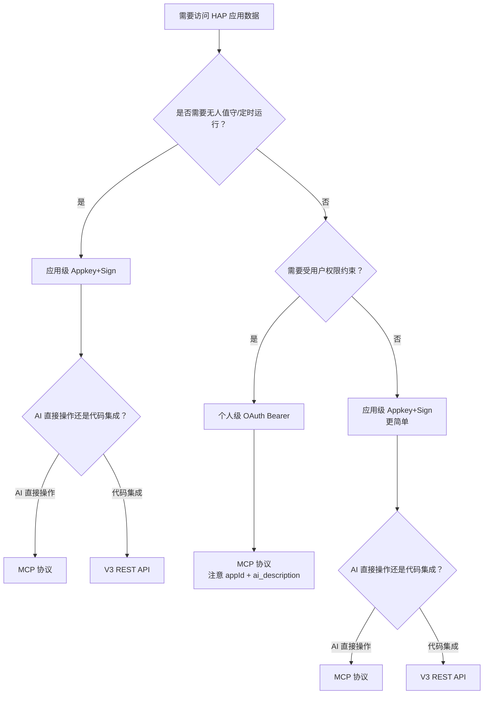

# MCP 协议详解

<cite>
**本文引用的文件**
- [README.md](file://README.md)
- [SKILL.md](file://SKILL.md)
</cite>

## 目录
1. [简介](#简介)
2. [项目结构](#项目结构)
3. [核心组件](#核心组件)
4. [架构概览](#架构概览)
5. [详细组件分析](#详细组件分析)
6. [依赖关系分析](#依赖关系分析)
7. [性能考虑](#性能考虑)
8. [故障排除指南](#故障排除指南)
9. [结论](#结论)
10. [附录](#附录)

## 简介

明道云 HAP 应用的 MCP（Model Context Protocol）协议是一个强大的数据访问和操作接口，允许 AI 工具直接与 HAP 应用进行交互。本协议支持两种授权类型（应用级 Appkey+Sign 和个人级 OAuth Bearer）与两种调用路径（MCP 协议和 V3 REST API）的交叉组合，为不同场景下的数据访问需求提供了灵活的解决方案。

MCP 协议基于 SSE（Server-Sent Events）/Streamable HTTP 特性，提供了实时的数据流传输能力，特别适合 AI 助手在对话过程中直接操作 HAP 应用数据。与传统的 REST API 相比，MCP 协议具有工具发现机制、原生 AI 集成支持等优势。

## 项目结构

该项目采用简洁的双文件结构，专注于提供明道云 HAP 应用的通用访问方法论：



**图表来源**
- [README.md: 1-53:1-53](file://README.md#L1-L53)
- [SKILL.md: 40-48:40-48](file://SKILL.md#L40-L48)

**章节来源**
- [README.md: 1-53:1-53](file://README.md#L1-L53)
- [SKILL.md: 23-48:23-48](file://SKILL.md#L23-L48)

## 核心组件

### 授权类型对比

MCP 协议支持两种主要的授权类型，每种都有其特定的使用场景和限制：

| 维度 | 应用级授权（Appkey+Sign） | 个人级授权（OAuth Bearer） |
|------|--------------------------|---------------------------|
| 身份 | 应用身份（不受人约束） | 个人身份（等同于登录用户） |
| 凭证 | Appkey + Sign（长期有效） | Bearer Token（约 1 天过期） |
| 权限范围 | 应用内 API 开关控制的全部数据 | 当前登录用户在应用中可见的数据 |
| 跨应用 | 只能访问所属应用 | 可跨应用访问用户有权限的所有应用 |
| 适用场景 | 后台定时任务、服务间同步、脚本自动化 | 个人数据查询、以用户视角读写数据 |
| 过期 | 不过期（除非在 HAP 后台重置） | 约 1 天，需要刷新机制 |

**章节来源**
- [SKILL.md: 13-31:13-31](file://SKILL.md#L13-L31)

### 调用路径对比

MCP 协议与 V3 REST API 提供了两种不同的调用方式，各有其优势和适用场景：

| 维度 | MCP 协议（SSE/Streamable HTTP） | V3 REST API（HTTP JSON） |
|------|-------------------------------|-------------------------|
| 协议 | MCP（Model Context Protocol） | 标准 HTTPS + JSON |
| 端点 | `https://api.mingdao.com/mcp` | `https://api.mingdao.com/v3/open/...` |
| 鉴权注入 | URL query 参数或 SSE Header | HTTP 请求头 |
| 工具发现 | 自动暴露 40~70 个工具 | 需查 API 文档 |
| 调用方式 | AI 工具原生支持（如 Qoder/Cursor 的 MCP 集成） | 代码中 `fetch`/`requests` 等 |
| 适合谁 | AI 助手直接操作数据 | 开发者在代码中集成 |
| 分页 | `pageSize` 上限 **90** | `pageSize` 上限 **1000** |
| 响应大小 | 单次约 **256KB** 缓冲上限 | 无此限制 |

**章节来源**
- [SKILL.md: 35-53:35-53](file://SKILL.md#L35-L53)

### 交叉矩阵组合

四种授权类型与调用路径的组合提供了完整的访问方案：

|  | MCP 协议 | V3 REST API |
|--|---------|-------------|
| **应用级 Appkey+Sign** | ✅ 最常用，配置简单 | ✅ 代码集成首选 |
| **个人级 OAuth Bearer** | ✅ 跨应用 MCP | ❌ 不支持（Bearer 仅限 MCP 鉴权） |

**关键限制**：OAuth Bearer Token **不能**用于 V3 REST API 直连，只能用于 MCP 协议调用。V3 API 只认 Appkey+Sign。

**章节来源**
- [SKILL.md: 57-64:57-64](file://SKILL.md#L57-L64)

## 架构概览

MCP 协议的架构设计体现了现代 AI 工具集成的需求，提供了灵活的授权和调用机制：



**图表来源**
- [SKILL.md: 35-64:35-64](file://SKILL.md#L35-L64)

## 详细组件分析

### 应用级授权（Appkey+Sign）

应用级授权是最常用的访问方式，适用于无人值守的自动化场景：

#### 凭证获取流程

1. 登录 HAP → 进入目标应用 → **应用设置** → **API 开发** → **API 密钥**
2. 复制 `Appkey` 和 `Sign`
3. 或复制 MCP URL：`https://api.mingdao.com/mcp?HAP-Appkey=<Appkey>&HAP-Sign=<Sign>`

#### MCP 配置示例



**图表来源**
- [SKILL.md: 76-96:76-96](file://SKILL.md#L76-L96)

#### V3 API 配置

应用级授权同样支持 V3 REST API 调用：

**请求头配置**：
```
Content-Type: application/json
HAP-Appkey: <Appkey>
HAP-Sign: <Sign>
```

**常用端点**：
- 获取应用信息：GET `/v3/app/info`
- 获取工作表列表：GET `/v3/app/worksheets`
- 查询记录：POST `/v3/app/worksheets/{id}/rows/list`

**章节来源**
- [SKILL.md: 68-164:68-164](file://SKILL.md#L68-L164)

### 个人级授权（OAuth Bearer）

个人级授权提供了基于用户权限的数据访问能力，特别适合需要跨应用访问的场景：

#### Token 获取流程

1. 在 HAP 组织管理后台创建 **OAuth 应用**（获取 `client_id` / `client_secret`）
2. 通过 OAuth 授权码流程或资源所有者密码凭据流程获取 Bearer Token
3. 或使用 `hap-oauth-mcp` 技能自动完成授权 + 生成 MCP 配置

#### MCP 配置示例



**图表来源**
- [SKILL.md: 168-233:168-233](file://SKILL.md#L168-L233)

#### 必填参数说明

Personal MCP 的**每次工具调用**必须额外提供：

- `appId`：必填，标识访问哪个应用，否则返回 401
- `ai_description`：必填，HAP 服务端用于审计和鉴权校验，否则返回 401

**章节来源**
- [SKILL.md: 168-229:168-229](file://SKILL.md#L168-L229)

### 工具发现机制

MCP 协议的一个重要特性是自动工具发现机制：

#### 应用级工具（约 40 个）
- `get_app_info` / `get_app_worksheets_list` / `get_worksheet_structure`
- `get_record_list` / `get_record_details` / `get_record_pivot_data`
- `create_record` / `update_record` / `delete_record`
- `batch_create_records` / `batch_update_records` / `batch_delete_records`

#### 个人级工具（约 60-70 个）
- 涵盖应用级的全部工具
- 额外包含：`get_org_list`（组织列表）、跨应用数据访问等
- 受用户权限约束：只能看到用户有权限的应用和工作表

**章节来源**
- [SKILL.md: 90-191:90-191](file://SKILL.md#L90-L191)

### SSE/Streamable HTTP 特性

MCP 协议基于 SSE（Server-Sent Events）和 Streamable HTTP 特性，提供了实时的数据流传输能力：



**图表来源**
- [SKILL.md: 39-48:39-48](file://SKILL.md#L39-L48)

**章节来源**
- [SKILL.md: 35-53:35-53](file://SKILL.md#L35-L53)

## 依赖关系分析

### 技能依赖关系

该项目与其他 HAP 技能形成了完整的生态系统：



**图表来源**
- [README.md: 39-48:39-48](file://README.md#L39-L48)
- [SKILL.md: 422-431:422-431](file://SKILL.md#L422-L431)

### 外部依赖

MCP 协议依赖于以下外部系统和服务：

1. **明道云 API 服务**：提供核心的数据访问功能
2. **OAuth 认证服务**：处理个人级授权的令牌管理
3. **AI 工具平台**：如 Qoder、Cursor 等，提供 MCP 协议的原生支持
4. **网络基础设施**：支持 SSE/Streamable HTTP 的实时通信

**章节来源**
- [README.md: 39-48:39-48](file://README.md#L39-L48)
- [SKILL.md: 422-431:422-431](file://SKILL.md#L422-L431)

## 性能考虑

### 响应大小限制

MCP 协议存在重要的性能限制：

- **单次响应限制**：约 256KB 缓冲上限
- **分页限制**：`pageSize` 上限为 **90**
- **推荐值**：大表推荐使用 50 的 `pageSize`



**图表来源**
- [SKILL.md: 344-348:344-348](file://SKILL.md#L344-L348)

### 分页策略

不同调用路径有不同的分页限制：

| 路径 | pageSize 上限 | 推荐值 | 说明 |
|------|-------------|--------|------|
| MCP `get_record_list` | **90** | 50 | 单次响应有 ~256KB 缓冲上限，大表必须降 page_size |
| V3 API `rows/list` | **1000** | 100~500 | 无缓冲限制，但不宜过大 |

**章节来源**
- [SKILL.md: 280-287:280-287](file://SKILL.md#L280-L287)

### 性能优化建议

1. **合理设置分页大小**：根据数据量和响应大小调整 `pageSize`
2. **使用过滤条件**：通过精确的过滤条件减少不必要的数据传输
3. **选择合适的调用路径**：大数据量场景优先考虑 V3 API
4. **缓存策略**：对于频繁查询的数据建立适当的缓存机制

## 故障排除指南

### 常见错误及解决方案

#### OAuth Bearer 域名白名单问题

**问题现象**：
- 调用 `api.mingdao.com` → 正常
- 调用 `api2.mingdao.com` → 返回 `error_code: 10001 Http Headers verification failed`

**解决方案**：
- 确保 MCP URL 中的域名与 OAuth App 白名单一致（使用 `api.mingdao.com`）

#### 授权失效问题

**问题现象**：
- `isError: true` + `error_code: 600101`（授权已失效）
- 响应包含 `token无效` / `token过期` / `Authorization failed` 等关键词

**解决方案**：
- 实施主动检测或被动重试的 Token 刷新策略
- 使用 `hap-oauth-mcp` 技能重新生成 MCP 配置

#### 256KB 响应限制

**问题现象**：
- 超出 256KB 缓冲上限时抛出异常

**解决方案**：
- 降低 `pageSize`（大表推荐 50）
- 改用 V3 REST API
- 优化查询条件减少响应数据量

**章节来源**
- [SKILL.md: 335-348:335-348](file://SKILL.md#L335-L348)
- [SKILL.md: 378-398:378-398](file://SKILL.md#L378-L398)

### 陷阱清单

#### 选项字段写入必须用 key

写入 SingleSelect / MultipleSelect 字段时，value 必须传 **option key（UUID）** 的数组，不能传显示文本。

#### 关联字段 get_record_list 可能丢失

`get_record_list` 对部分 Relation 字段可能返回空字符串 `""`，需要额外调用 `get_record_details(rowId)` 补全。

#### _owner 字段响应为空但 filter 有效

`_owner` 字段在记录列表/详情中永远返回 `""`，但 `filter.ownerid` 筛选仍然有效。

**章节来源**
- [SKILL.md: 301-376:301-376](file://SKILL.md#L301-L376)

### 错误码速查

| 错误码 | 含义 | 典型原因 | 解法 |
|--------|------|---------|------|
| `1` | 成功 | — | — |
| `-1` | 通用失败 | 查看 `error_msg` | 按 error_msg 排查 |
| `4` | 权限不足 | 当前身份无该操作权限 | 检查授权类型和用户权限 |
| `10` | 参数错误 | 参数缺失或格式错误 | 检查参数名（驼峰）和值格式 |
| `10001` | HTTP Headers 验证失败 | OAuth token 域名不在白名单 | 确认使用 `api.mingdao.com` |
| `600101` | 授权已失效 | Bearer token 过期 | 刷新 token |
| `600100` | token 无效/缺失 | token 为空或格式错误 | 检查 Authorization 头 |

**章节来源**
- [SKILL.md: 378-398:378-398](file://SKILL.md#L378-L398)

## 结论

明道云 HAP 应用的 MCP 协议为 AI 工具与企业应用数据的集成提供了强大而灵活的解决方案。通过支持两种授权类型和两种调用路径，MCP 协议能够满足从简单的数据查询到复杂的业务流程自动化等各种场景需求。

关键优势包括：
- **灵活的授权机制**：支持应用级和个人级两种授权模式
- **实时数据流**：基于 SSE/Streamable HTTP 的实时通信能力
- **智能工具发现**：自动暴露可用工具，简化集成过程
- **广泛的适用性**：支持多种 AI 工具平台和开发环境

在实际使用中，开发者需要根据具体的业务需求选择合适的授权类型和调用路径，同时注意协议的性能限制和最佳实践，以确保系统的稳定性和效率。

## 附录

### 快速决策流程



**图表来源**
- [SKILL.md: 401-418:401-418](file://SKILL.md#L401-L418)

### API Host 支持

HAP 支持多个产品线和私有部署，API Host 不同：

| 产品线 | API Host | MCP URL 示例 |
|--------|----------|-------------|
| 明道云 HAP | `https://api.mingdao.com` | `https://api.mingdao.com/mcp?...` |
| Nocoly HAP | `https://www.nocoly.com` | `https://www.nocoly.com/mcp?...` |
| 私有部署 | `https://<域名>/api` | `https://<域名>/mcp?...` |

**章节来源**
- [SKILL.md: 236-246:236-246](file://SKILL.md#L236-L246)