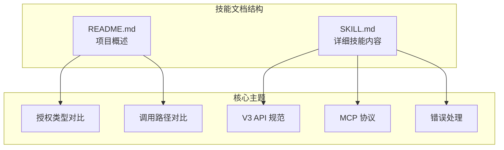
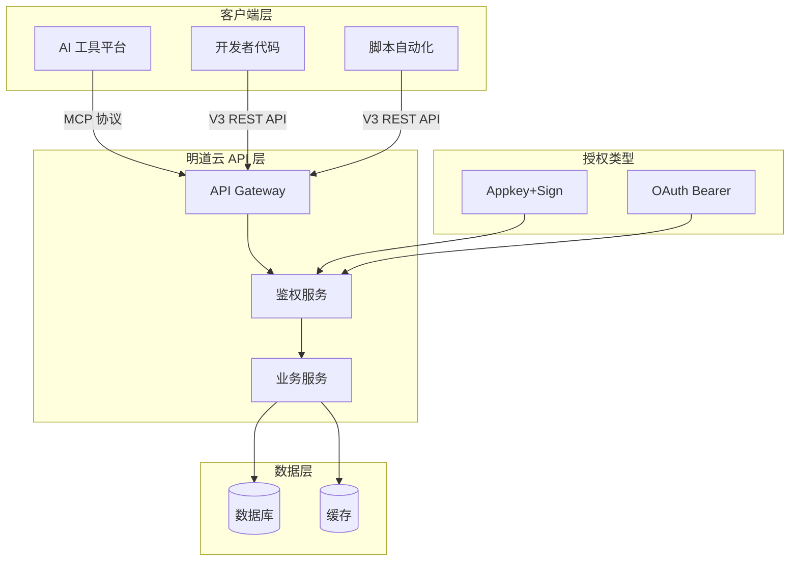
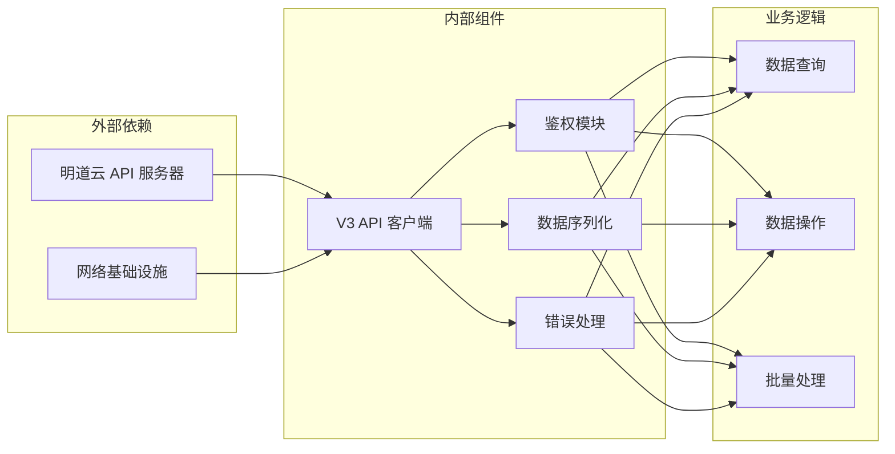
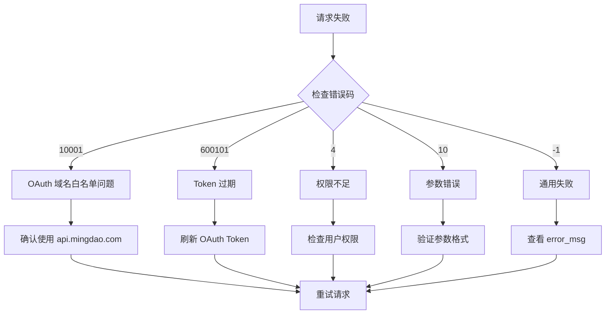
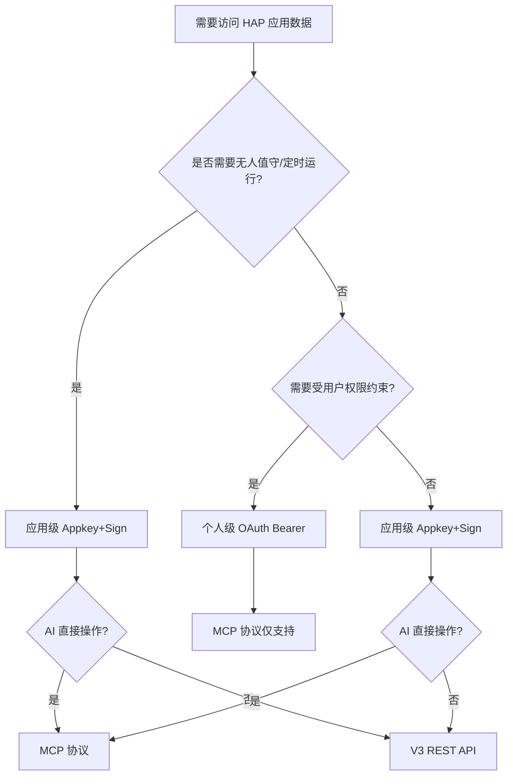

# V3 REST API 详解

<cite>
**本文档引用的文件**
- [README.md](file://README.md)
- [SKILL.md](file://SKILL.md)
</cite>

## 目录
1. [简介](#简介)
2. [项目结构](#项目结构)
3. [核心组件](#核心组件)
4. [架构概览](#架构概览)
5. [详细组件分析](#详细组件分析)
6. [依赖关系分析](#依赖关系分析)
7. [性能考虑](#性能考虑)
8. [故障排除指南](#故障排除指南)
9. [结论](#结论)
10. [附录](#附录)

## 简介

明道云 HAP 应用的 V3 REST API 是一套标准化的 HTTPS + JSON 协议接口，为开发者提供直接的代码集成能力。本文档深入解释了标准 HTTPS + JSON 协议规范、请求头格式、端点结构和调用方式，并提供了来自实际代码库的具体示例。

V3 REST API 与 MCP 协议形成互补：MCP 提供 AI 工具原生支持的流式协议，而 V3 API 则专注于代码中的 HTTP JSON 调用。两者都支持应用级 Appkey+Sign 授权，但 OAuth Bearer Token 仅适用于 MCP 协议。

## 项目结构

该项目采用技能文档的形式，提供明道云 HAP 应用访问的通用方法论：



**图表来源**
- [README.md:1-53](file://README.md#L1-L53)
- [SKILL.md:1-436](file://SKILL.md#L1-L436)

**章节来源**
- [README.md:1-53](file://README.md#L1-L53)
- [SKILL.md:1-436](file://SKILL.md#L1-L436)

## 核心组件

### 授权体系

V3 REST API 采用两种授权类型：

#### 应用级授权（Appkey+Sign）
- **身份**：应用身份（不受人约束）
- **凭证**：Appkey + Sign（长期有效）
- **权限范围**：应用内 API 开关控制的全部数据
- **适用场景**：后台定时任务、服务间同步、脚本自动化

#### 个人级授权（OAuth Bearer）
- **身份**：个人身份（等同于登录用户）
- **凭证**：Bearer Token（约 1 天过期）
- **权限范围**：当前登录用户在应用中可见的数据
- **适用场景**：个人数据查询、以用户视角读写数据

**章节来源**
- [SKILL.md:13-31](file://SKILL.md#L13-L31)
- [SKILL.md:168-233](file://SKILL.md#L168-L233)

### 调用路径对比

| 维度 | MCP 协议（SSE/Streamable HTTP） | V3 REST API（HTTP JSON） |
|------|-------------------------------|-------------------------|
| 协议 | MCP（Model Context Protocol） | 标准 HTTPS + JSON |
| 端点 | `https://api.mingdao.com/mcp` | `https://api.mingdao.com/v3/open/...` |
| 鉴权注入 | URL query 参数或 SSE Header | HTTP 请求头 |
| 工具发现 | 自动暴露 40~70 个工具 | 需查 API 文档 |
| 调用方式 | AI 工具原生支持 | 代码中 `fetch`/`requests` 等 |
| 适合谁 | AI 助手直接操作数据 | 开发者在代码中集成 |
| 分页 | `pageSize` 上限 **90** | `pageSize` 上限 **1000** |
| 响应大小 | 单次约 **256KB** 缓冲上限 | 无此限制 |

**章节来源**
- [SKILL.md:35-53](file://SKILL.md#L35-L53)

## 架构概览



**图表来源**
- [SKILL.md:35-53](file://SKILL.md#L35-L53)
- [SKILL.md:68-164](file://SKILL.md#L68-L164)

## 详细组件分析

### 请求头规范

V3 REST API 的标准请求头格式：

```http
Content-Type: application/json
HAP-Appkey: <Appkey>
HAP-Sign: <Sign>
```

**章节来源**
- [SKILL.md:100-106](file://SKILL.md#L100-L106)

### 端点结构

#### 应用级端点

| 操作 | 方法 | 路径 |
|------|------|------|
| 获取应用信息 | GET | `/v3/app/info` |
| 获取工作表列表 | GET | `/v3/app/worksheets` |
| 获取工作表字段 | GET | `/v3/app/worksheet/getFields` |
| 查询记录 | POST | `/v3/app/worksheets/{id}/rows/list` |
| 获取记录详情 | GET | `/v3/app/worksheets/{id}/rows/{rowId}` |
| 创建记录 | POST | `/v3/app/worksheets/{id}/rows` |
| 更新记录 | PUT | `/v3/app/worksheets/{id}/rows/{rowId}` |
| 删除记录 | DELETE | `/v3/app/worksheets/{id}/rows/{rowId}` |
| 批量创建 | POST | `/v3/app/worksheets/{id}/rows/batch` |
| 批量更新 | PUT | `/v3/app/worksheets/{id}/rows/batch` |
| 批量删除 | DELETE | `/v3/app/worksheets/{id}/rows/batch` |
| 获取关联记录 | GET | `/v3/app/worksheets/{id}/rows/{rowId}/relations/{fieldId}` |
| 查找用户 | POST | `/v3/users/lookup` |
| 查找部门 | POST | `/v3/departments/lookup` |

**章节来源**
- [SKILL.md:108-126](file://SKILL.md#L108-L126)

### 数据模型

#### Filter 结构

```json
{
  "filter": {
    "type": "group",
    "logic": "AND",
    "children": [
      {
        "type": "condition",
        "field": "<fieldId 或 alias>",
        "operator": "eq",
        "value": ["<值>"]
      }
    ]
  }
}
```

**规则**：
- 顶层必须是 `group`
- 最多两层嵌套：`group → group → condition`
- `operator` 是字符串：`"eq"` / `"in"` / `"between"` / `"contains"` / `"belongsto"` 等

**章节来源**
- [SKILL.md:256-273](file://SKILL.md#L256-L273)

### 分页策略

| 路径 | pageSize 上限 | 推荐值 | 说明 |
|------|-------------|--------|------|
| MCP `get_record_list` | **90** | 50 | 单次响应有 ~256KB 缓冲上限，大表必须降 page_size |
| V3 API `rows/list` | **1000** | 100~500 | 无缓冲限制，但不宜过大 |

**章节来源**
- [SKILL.md:280-288](file://SKILL.md#L280-L288)

### 字段标识符

| 场景 | 用什么 |
|------|--------|
| Filter 的 `field` | fieldId（UUID）或 alias 均可 |
| 写入（create/update）的 key | fieldId 或 alias 均可 |
| `get_record_list(useFieldIdAsKey=True)` 返回的 key | **强制替换为 fieldId（UUID）**，即使字段有 alias |

**章节来源**
- [SKILL.md:289-297](file://SKILL.md#L289-L297)

### 代码集成示例

以下是一个完整的查询记录示例的代码结构：

```python
import requests

headers = {
    "Content-Type": "application/json",
    "HAP-Appkey": "<Appkey>",
    "HAP-Sign": "<Sign>",
}

payload = {
    "pageSize": 50,
    "pageIndex": 1,
    "useFieldIdAsKey": True,
    "filter": {
        "type": "group",
        "logic": "AND",
        "children": [
            {
                "type": "condition",
                "field": "<fieldId>",
                "operator": "eq",
                "value": ["<value>"],
            }
        ],
    },
}

resp = requests.post(
    "https://api.mingdao.com/v3/app/worksheets/<worksheetId>/rows/list",
    headers=headers,
    json=payload,
)
data = resp.json()
```

**章节来源**
- [SKILL.md:127-162](file://SKILL.md#L127-L162)

## 依赖关系分析



**图表来源**
- [SKILL.md:68-164](file://SKILL.md#L68-L164)

### 授权依赖

| 组件 | 依赖项 | 作用 |
|------|--------|------|
| V3 API 客户端 | Appkey+Sign | 身份验证和权限控制 |
| 鉴权模块 | OAuth Bearer | 个人级授权（仅 MCP） |
| 数据序列化 | JSON 格式 | 请求/响应数据交换 |
| 错误处理 | 错误码映射 | 异常情况处理 |

**章节来源**
- [SKILL.md:13-31](file://SKILL.md#L13-L31)
- [SKILL.md:168-233](file://SKILL.md#L168-L233)

## 性能考虑

### 响应时间优化

1. **合理设置分页大小**：
   - 大表建议使用较小的 `pageSize`（如 50-100）
   - 避免一次性获取过多数据导致内存压力

2. **批量操作优化**：
   - 批量操作建议使用 `batch` 端点
   - 控制单次批量操作的记录数量

3. **网络优化**：
   - 使用持久连接减少握手开销
   - 合理设置超时时间

### 内存使用优化

1. **流式处理**：
   - 对于大量数据，考虑流式处理而非一次性加载
   - 使用分页逐步获取数据

2. **数据压缩**：
   - 利用 HTTP 压缩减少传输数据量
   - 适当的数据格式化避免冗余信息

## 故障排除指南

### 常见错误及解决方案

#### 授权相关错误

| 错误码 | 含义 | 典型原因 | 解决方案 |
|--------|------|---------|---------|
| `1` | 成功 | — | — |
| `-1` | 通用失败 | 查看 `error_msg` | 按 error_msg 排查 |
| `4` | 权限不足 | 当前身份无该操作权限 | 检查授权类型和用户权限 |
| `10` | 参数错误 | 参数缺失或格式错误 | 检查参数名（驼峰）和值格式 |
| `10001` | HTTP Headers 验证失败 | OAuth token 域名不在白名单 | 确认使用 `api.mingdao.com` |
| `600101` | 授权已失效 | Bearer token 过期 | 刷新 token |
| `600100` | token 无效/缺失 | token 为空或格式错误 | 检查 Authorization 头 |

**章节来源**
- [SKILL.md:378-398](file://SKILL.md#L378-L398)

#### 特定场景问题

1. **OAuth Bearer 域名白名单问题**
   - **症状**：`10001 Http Headers verification failed`
   - **原因**：OAuth App 的域名白名单限制
   - **解决方案**：确保使用 `api.mingdao.com`

2. **MCP 单次响应 256KB 上限**
   - **症状**：`Exceeded limit on max bytes to buffer`
   - **原因**：MCP 协议的响应大小限制
   - **解决方案**：降低 `pageSize` 或改用 V3 API

3. **数值字段类型不一致**
   - **症状**：写入数字类型，读取返回字符串
   - **原因**：JSON 序列化差异
   - **解决方案**：进行类型转换处理

**章节来源**
- [SKILL.md:335-348](file://SKILL.md#L335-L348)
- [SKILL.md:350-356](file://SKILL.md#L350-L356)

### 诊断流程



**图表来源**
- [SKILL.md:378-398](file://SKILL.md#L378-L398)

## 结论

明道云 HAP 应用的 V3 REST API 提供了一套标准化、可靠的 HTTP JSON 接口，适合开发者在各种编程环境中集成使用。通过理解其授权体系、端点结构和数据模型，可以构建稳定高效的系统集成。

关键要点：
1. **明确授权类型**：根据使用场景选择 Appkey+Sign 或 OAuth Bearer
2. **正确设置请求头**：确保 HAP-Appkey 和 HAP-Sign 的正确配置
3. **遵循分页策略**：合理设置 pageSize 和 pageIndex
4. **处理错误情况**：建立完善的错误处理和重试机制
5. **优化性能**：根据数据规模调整批量大小和查询策略

## 附录

### 快速决策流程



**图表来源**
- [SKILL.md:401-418](file://SKILL.md#L401-L418)

### 相关技能链接

| 技能 | 用途 |
|------|------|
| `hap-mcp-usage` | MCP 配置的自动化安装（9 种 AI 工具平台） |
| `hap-oauth-mcp` | OAuth 授权流程 + Bearer Token 获取/刷新 |
| `hap-v3-api` | V3 REST API 的完整使用规范（Filter、字段类型、批量操作等） |
| `hap-frontend-project` | 使用 HAP 作为后端搭建独立网站 |
| `hap-view-plugin` | 开发 HAP 自定义视图插件 |

**章节来源**
- [README.md:41-48](file://README.md#L41-L48)
- [SKILL.md:422-431](file://SKILL.md#L422-L431)