# 调用路径详解

<cite>
**本文档引用的文件**
- [README.md](file://README.md)
- [SKILL.md](file://SKILL.md)
</cite>

## 目录
1. [简介](#简介)
2. [项目结构](#项目结构)
3. [核心组件](#核心组件)
4. [架构概览](#架构概览)
5. [详细组件分析](#详细组件分析)
6. [依赖关系分析](#依赖关系分析)
7. [性能考虑](#性能考虑)
8. [故障排除指南](#故障排除指南)
9. [结论](#结论)
10. [附录](#附录)

## 简介

明道云 HAP 应用通用访问技能为开发者和 AI 工具提供了访问明道云应用的完整方法论。该技能覆盖了两种授权类型（应用级 Appkey+Sign / 个人级 OAuth Bearer）与两种调用路径（MCP 协议 / V3 REST API）的交叉组合，帮助用户快速判断和实施正确的访问方式。

本技能不包含任何具体业务逻辑，专注于提供通用的授权、连接、调用方法论与陷阱清单，适用于各种 AI 平台和开发环境。

## 项目结构

该项目采用极简的文件结构设计，主要包含两个核心文件：

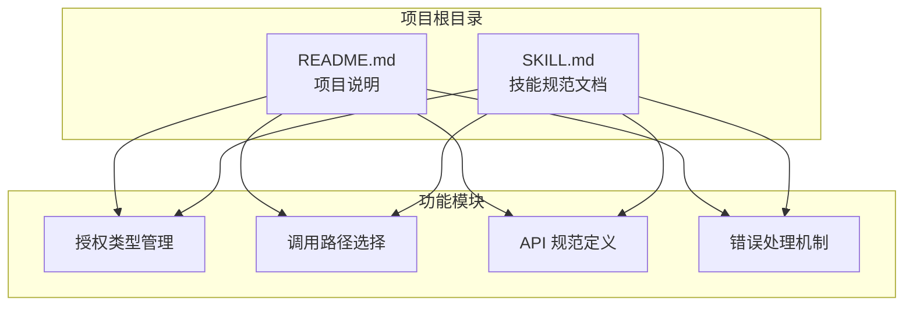

**图表来源**
- [README.md:1-53](file://README.md#L1-L53)
- [SKILL.md:1-436](file://SKILL.md#L1-L436)

**章节来源**
- [README.md:1-53](file://README.md#L1-L53)
- [SKILL.md:1-436](file://SKILL.md#L1-L436)

## 核心组件

### 授权类型组件

系统提供两种核心授权类型，每种都有其独特的应用场景和限制：

#### 应用级授权（Appkey+Sign）

应用级授权提供应用身份访问，具有以下特点：
- **身份特征**：应用身份（不受人约束）
- **凭证类型**：Appkey + Sign（长期有效）
- **权限范围**：应用内 API 开关控制的全部数据
- **跨应用能力**：只能访问所属应用
- **适用场景**：后台定时任务、服务间同步、脚本自动化

#### 个人级授权（OAuth Bearer）

个人级授权提供个人身份访问，具有以下特点：
- **身份特征**：个人身份（等同于登录用户）
- **凭证类型**：Bearer Token（约 1 天过期）
- **权限范围**：当前登录用户在应用中可见的数据
- **跨应用能力**：可跨应用访问用户有权限的所有应用
- **适用场景**：个人数据查询、以用户视角读写数据

**章节来源**
- [SKILL.md:13-32](file://SKILL.md#L13-L32)
- [SKILL.md:168-233](file://SKILL.md#L168-L233)

### 调用路径组件

系统提供两种调用路径，分别针对不同的使用场景：

#### MCP 协议（SSE/Streamable HTTP）

MCP 协议专为 AI 工具设计，具有以下特点：
- **协议类型**：MCP（Model Context Protocol）
- **端点地址**：`https://api.mingdao.com/mcp`
- **鉴权注入**：URL query 参数或 SSE Header
- **工具发现**：自动暴露 40~70 个工具
- **调用方式**：AI 工具原生支持
- **适合场景**：AI 助手直接操作数据

#### V3 REST API（HTTP JSON）

V3 REST API 专为开发者设计，具有以下特点：
- **协议类型**：标准 HTTPS + JSON
- **端点地址**：`https://api.mingdao.com/v3/open/...`
- **鉴权注入**：HTTP 请求头
- **工具发现**：需查 API 文档
- **调用方式**：代码中 `fetch`/`requests` 等
- **适合场景**：开发者在代码中集成

**章节来源**
- [SKILL.md:35-54](file://SKILL.md#L35-L54)
- [SKILL.md:98-165](file://SKILL.md#L98-L165)

## 架构概览

系统采用双路径架构设计，通过授权类型和调用路径的交叉组合形成完整的访问体系：

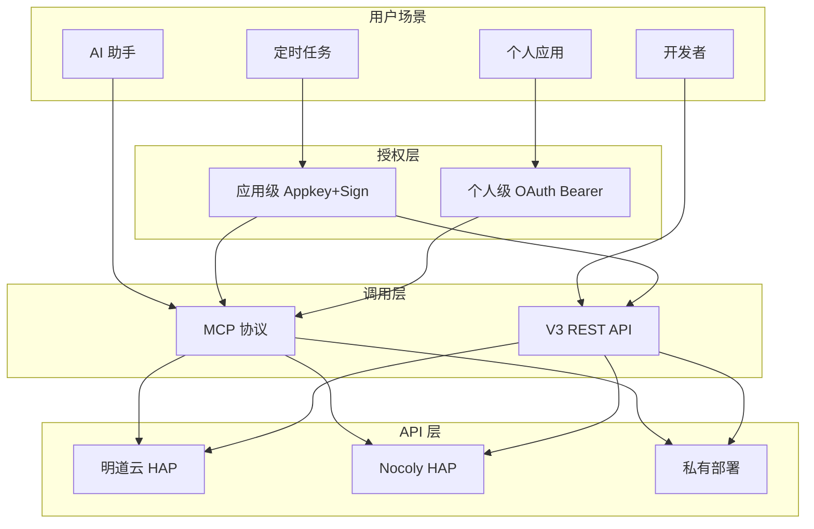

**图表来源**
- [SKILL.md:57-65](file://SKILL.md#L57-L65)
- [SKILL.md:236-247](file://SKILL.md#L236-L247)

### 交叉矩阵分析

四种组合的可行性矩阵如下：

|  | MCP 协议 | V3 REST API |
|---|---------|-------------|
| **应用级 Appkey+Sign** | ✅ 最常用，配置简单 | ✅ 代码集成首选 |
| **个人级 OAuth Bearer** | ✅ 跨应用 MCP | ❌ 不支持（Bearer 仅限 MCP 鉴权） |

**关键限制**：OAuth Bearer Token 不能用于 V3 REST API 直连，只能用于 MCP 协议调用。V3 API 只认 Appkey+Sign。

**章节来源**
- [SKILL.md:57-65](file://SKILL.md#L57-L65)

## 详细组件分析

### 应用级授权组件

#### 凭证获取流程

应用级授权的凭证获取遵循标准化流程：

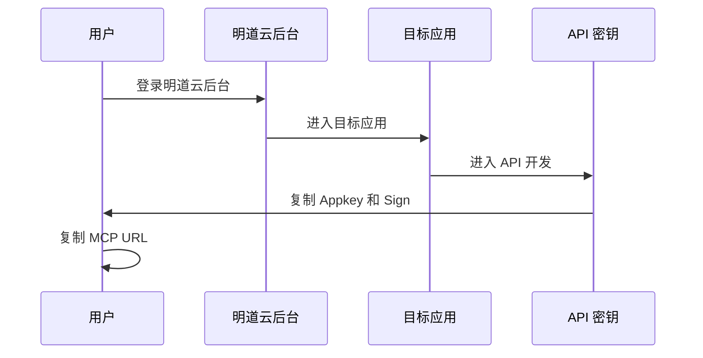

**图表来源**
- [SKILL.md:70-75](file://SKILL.md#L70-L75)

#### MCP 配置组件

应用级 MCP 配置采用 JSON 格式，支持多服务器配置：

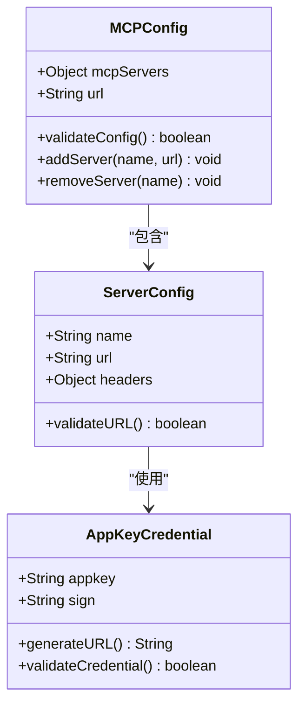

**图表来源**
- [SKILL.md:76-97](file://SKILL.md#L76-L97)
- [SKILL.md:100-106](file://SKILL.md#L100-L106)

#### V3 API 组件

应用级 V3 API 采用标准 HTTP 请求头认证：

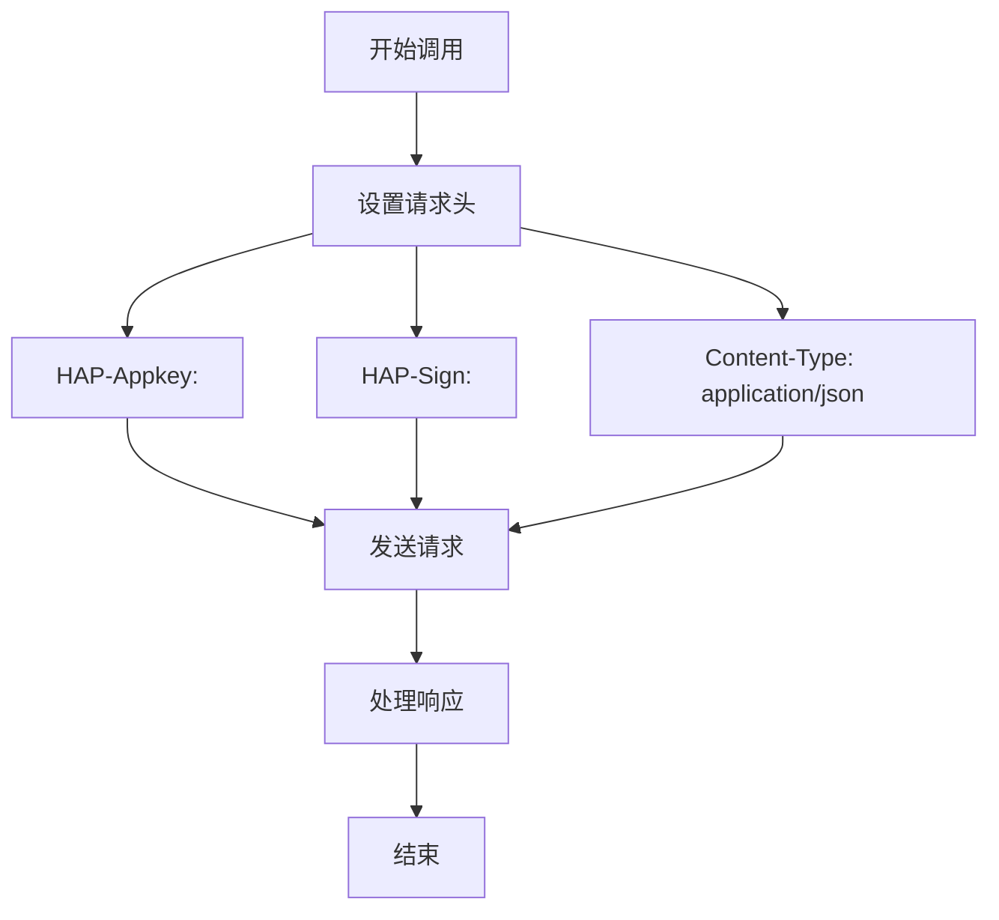

**图表来源**
- [SKILL.md:98-165](file://SKILL.md#L98-L165)

**章节来源**
- [SKILL.md:68-165](file://SKILL.md#L68-L165)

### 个人级授权组件

#### Token 获取流程

个人级授权的 Token 获取遵循 OAuth 标准流程：

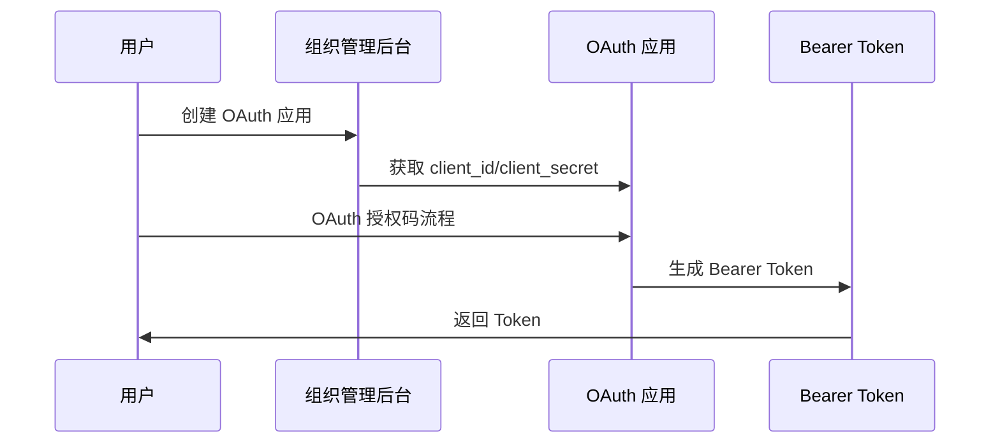

**图表来源**
- [SKILL.md:170-175](file://SKILL.md#L170-L175)

#### MCP 调用参数组件

个人级 MCP 调用需要额外的参数验证：

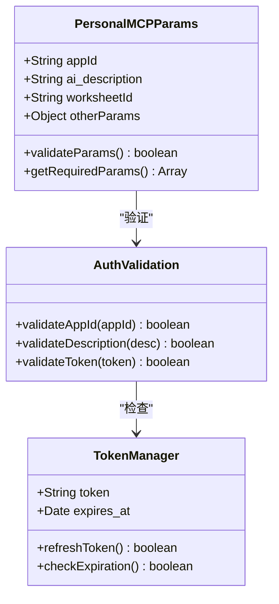

**图表来源**
- [SKILL.md:193-210](file://SKILL.md#L193-L210)
- [SKILL.md:211-229](file://SKILL.md#L211-L229)

#### Token 过期处理组件

Token 过期处理提供三种策略：

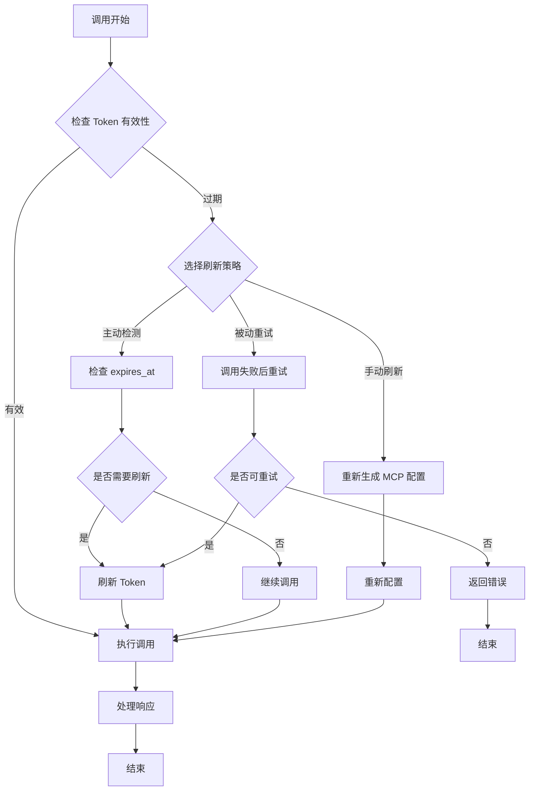

**图表来源**
- [SKILL.md:211-229](file://SKILL.md#L211-L229)

**章节来源**
- [SKILL.md:168-233](file://SKILL.md#L168-L233)

### API 规范组件

#### 通用调用规范

系统提供统一的调用规范，确保不同路径的一致性：

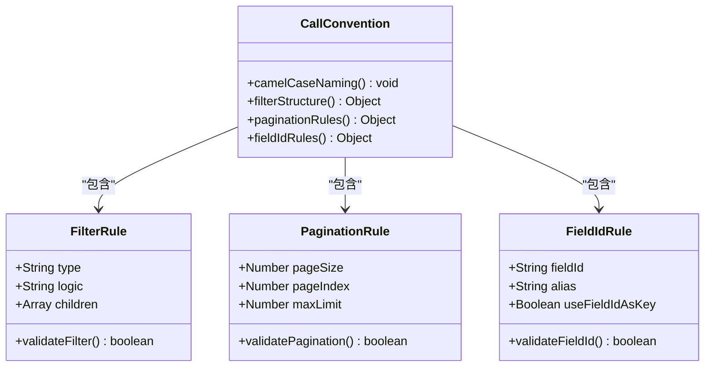

**图表来源**
- [SKILL.md:250-298](file://SKILL.md#L250-L298)

#### API Host 组件

支持多产品线和私有部署的 API Host 配置：

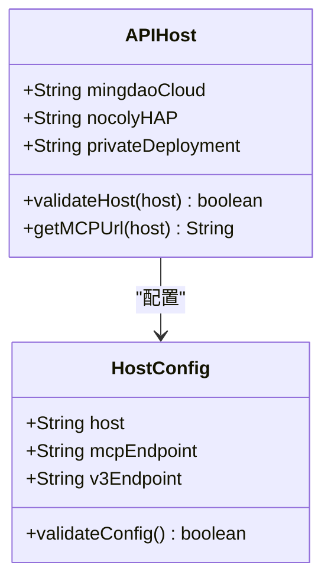

**图表来源**
- [SKILL.md:236-247](file://SKILL.md#L236-L247)

**章节来源**
- [SKILL.md:250-298](file://SKILL.md#L250-L298)
- [SKILL.md:236-247](file://SKILL.md#L236-L247)

## 依赖关系分析

系统采用松耦合的设计，各组件之间通过清晰的接口进行交互：

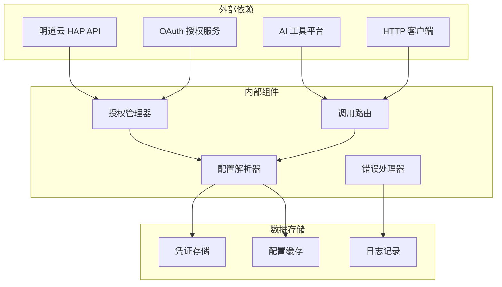

**图表来源**
- [SKILL.md:39-49](file://SKILL.md#L39-L49)

### 组件耦合度分析

- **授权管理器** 与 **调用路由** 保持低耦合，通过统一接口交互
- **配置解析器** 独立于具体实现，便于扩展新的调用路径
- **错误处理器** 提供统一的错误处理机制，减少重复代码

**章节来源**
- [SKILL.md:39-49](file://SKILL.md#L39-L49)

## 性能考虑

### 分页策略

不同调用路径有不同的分页限制：

| 路径 | pageSize 上限 | 推荐值 | 说明 |
|------|-------------|--------|------|
| MCP `get_record_list` | **90** | 50 | 单次响应有 ~256KB 缓冲上限，大表必须降 page_size |
| V3 API `rows/list` | **1000** | 100~500 | 无缓冲限制，但不宜过大 |

### 响应大小优化

MCP 协议存在 256KB 的单次响应缓冲上限，需要通过以下方式优化：
- 降低 `pageSize`（大表推荐 50）
- 使用 V3 REST API 替代
- 实施分批处理策略

### 并发控制

建议实施合理的并发控制策略：
- MCP 调用：避免同时发起过多请求
- V3 API：合理设置请求间隔
- Token 刷新：避免频繁刷新导致的性能问题

## 故障排除指南

### 常见错误码及解决方案

| 错误码 | 含义 | 典型原因 | 解法 |
|--------|------|---------|------|
| `1` | 成功 | — | — |
| `-1` | 通用失败 | 查看 `error_msg` | 按 error_msg 排查 |
| `4` | 权限不足 | 当前身份无该操作权限 | 检查授权类型和用户权限 |
| `10` | 参数错误 | 参数缺失或格式错误 | 检查参数名（驼峰）和值格式 |
| `10001` | HTTP Headers 验证失败 | OAuth token 域名不在白名单 | 确认使用 `api.mingdao.com` |
| `600101` | 授权已失效 | Bearer token 过期 | 刷新 token |
| `600100` | token 无效/缺失 | token 为空或格式错误 | 检查 Authorization 头 |

### 特定问题诊断

#### OAuth Bearer 域名白名单问题

**问题现象**：调用 `api2.mingdao.com` 返回 `error_code: 10001 Http Headers verification failed`

**诊断步骤**：
1. 检查 OAuth App 创建时配置的域名
2. 确认 MCP URL 中使用的域名与白名单一致
3. 验证请求头中的域名一致性

**解决方案**：确保使用 `api.mingdao.com` 作为域名

#### MCP 响应超限问题

**问题现象**：MCP 协议返回 `Exceeded limit on max bytes to buffer`

**诊断步骤**：
1. 检查当前 `pageSize` 设置
2. 确认响应数据量大小
3. 验证字段数量和复杂度

**解决方案**：
- 降低 `pageSize` 至 50
- 考虑改用 V3 REST API
- 实施分批处理策略

**章节来源**
- [SKILL.md:378-398](file://SKILL.md#L378-L398)
- [SKILL.md:335-343](file://SKILL.md#L335-L343)
- [SKILL.md:344-348](file://SKILL.md#L344-L348)

### 陷阱清单

系统总结了 10 个高频陷阱，需要特别注意：

1. **选项字段写入**：必须使用 option key（UUID）而非显示文本
2. **关联字段丢失**：`get_record_list` 可能返回空字符串，需补调详情
3. **_owner 字段**：响应为空但 filter 有效，需从其他字段获取
4. **caid filter 不稳定**：服务端对数组 in 操作支持有限
5. **数值字段类型不一致**：写入数字，读取返回字符串
6. **日期过滤时区偏移**：可能 ±1 天，需放宽窗口
7. **triggerWorkflow 参数**：正常业务默认 true，批量操作设为 false
8. **Personal MCP 必填参数**：每次调用必须提供 appId 和 ai_description

**章节来源**
- [SKILL.md:301-376](file://SKILL.md#L301-L376)

## 结论

明道云 HAP 应用通用访问技能为开发者和 AI 工具提供了完整的访问方法论。通过明确的授权类型选择和调用路径规划，用户可以快速实施正确的访问方式。

关键成功因素包括：
- 正确选择授权类型（应用级 vs 个人级）
- 合理选择调用路径（MCP vs V3 API）
- 严格遵守 API 规范和限制
- 实施有效的错误处理和性能优化策略

该技能的核心价值在于提供了标准化的方法论和最佳实践，帮助用户避免常见的陷阱和错误，提高开发效率和系统稳定性。

## 附录

### 快速决策流程

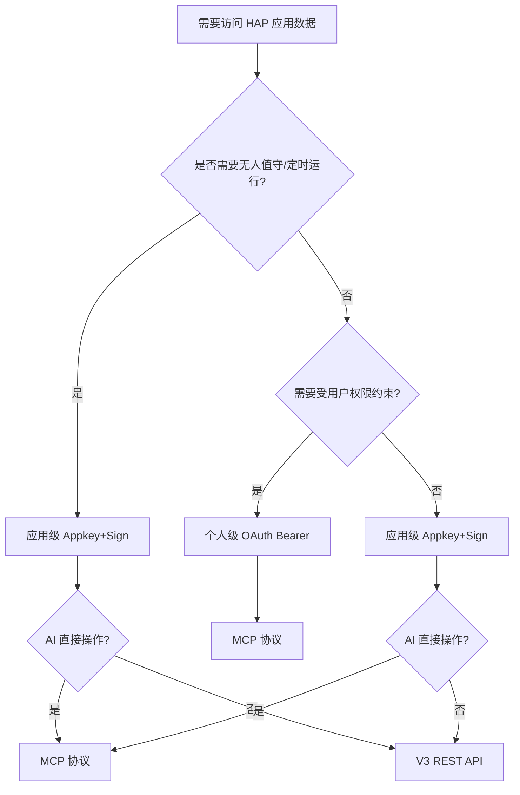

**图表来源**
- [SKILL.md:401-418](file://SKILL.md#L401-L418)

### 相关技能索引

| 技能名称 | 用途描述 |
|----------|----------|
| `hap-mcp-usage` | MCP 配置的自动化安装（9 种 AI 工具平台） |
| `hap-oauth-mcp` | OAuth 授权流程 + Bearer Token 获取/刷新 |
| `hap-v3-api` | V3 REST API 的完整使用规范（Filter、字段类型、批量操作等） |
| `hap-frontend-project` | 使用 HAP 作为后端搭建独立网站 |
| `hap-view-plugin` | 开发 HAP 自定义视图插件 |

**章节来源**
- [README.md:39-49](file://README.md#L39-L49)
- [SKILL.md:422-431](file://SKILL.md#L422-L431)