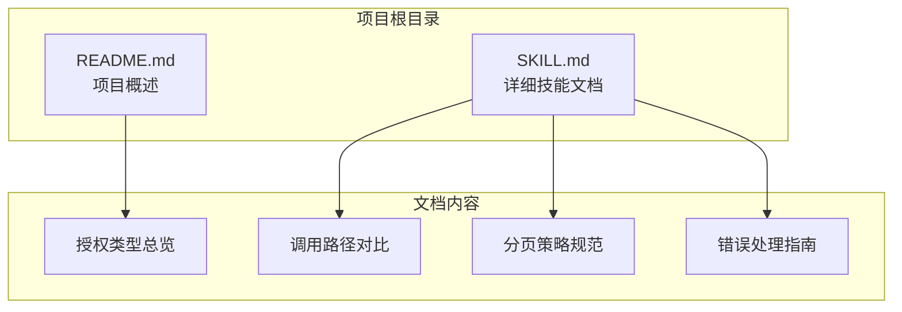
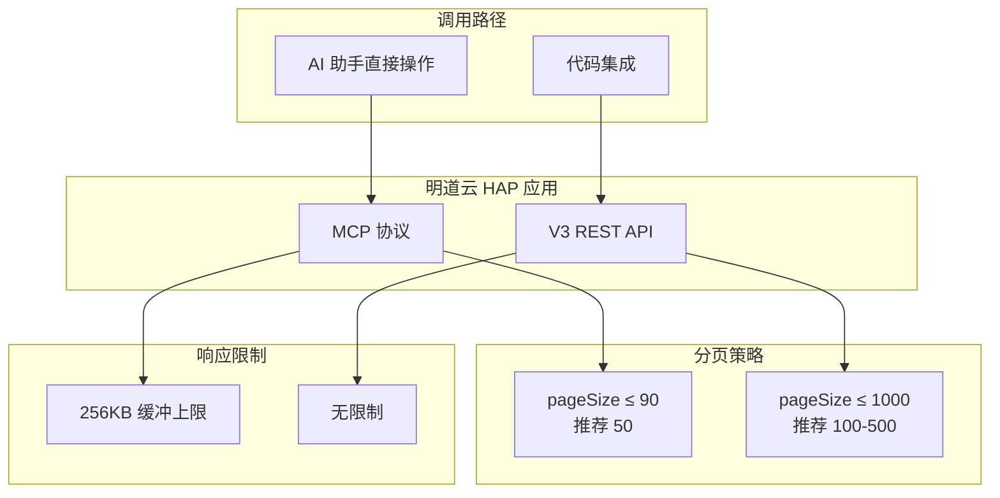
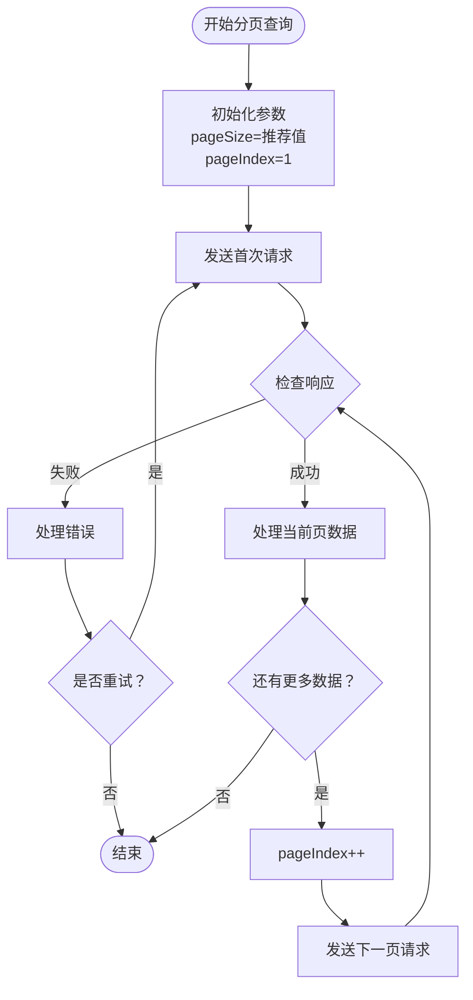
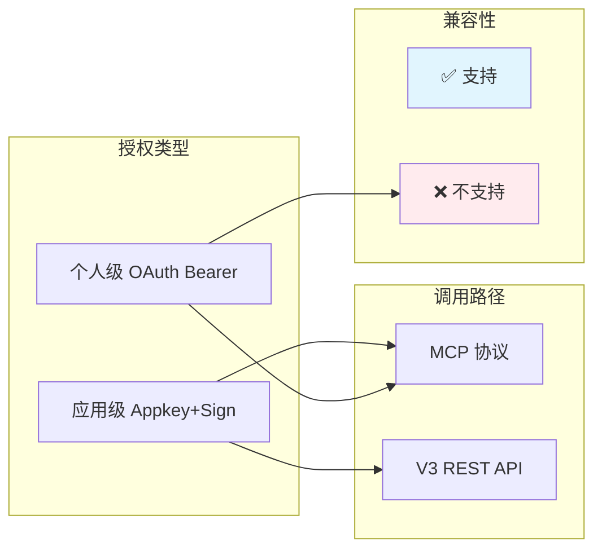
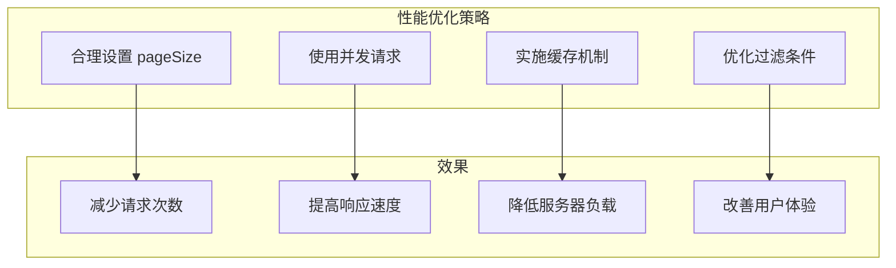

# 分页策略规范

<cite>
**本文引用的文件**
- [README.md](file://README.md)
- [SKILL.md](file://SKILL.md)
</cite>

## 目录
1. [简介](#简介)
2. [项目结构](#项目结构)
3. [核心组件](#核心组件)
4. [架构概览](#架构概览)
5. [详细组件分析](#详细组件分析)
6. [依赖分析](#依赖分析)
7. [性能考虑](#性能考虑)
8. [故障排除指南](#故障排除指南)
9. [结论](#结论)

## 简介

本文档为明道云 HAP 应用创建详细的分页策略规范，重点说明不同调用路径下的分页参数设置。根据明道云 HAP 应用的两种主要调用路径，文档详细阐述了 MCP 协议的 pageSize 上限 90 和 V3 API 的 1000 上限，并提供推荐的分页值（MCP 推荐 50，V3 API 推荐 100-500）以及完整的分页实现示例。

明道云 HAP 应用提供两种主要的调用路径：
- **MCP 协议（SSE/Streamable HTTP）**：适用于 AI 助手直接操作数据的场景
- **V3 REST API（HTTP JSON）**：适用于开发者在代码中集成的场景

## 项目结构

该项目采用简洁的文档结构，专注于提供明道云 HAP 应用的通用访问技能：

**图表来源**
- [README.md:1-53](file://README.md#L1-L53)
- [SKILL.md:1-436](file://SKILL.md#L1-L436)

**章节来源**
- [README.md:1-53](file://README.md#L1-L53)
- [SKILL.md:1-436](file://SKILL.md#L1-L436)

## 核心组件

### 分页参数规范

根据明道云 HAP 应用的官方规范，分页参数在两种调用路径中有不同的限制和推荐值：

| 路径 | pageSize 上限 | 推荐值 | 说明 |
|------|-------------|--------|------|
| MCP `get_record_list` | **90** | 50 | 单次响应有 ~256KB 缓冲上限，大表必须降 page_size |
| V3 API `rows/list` | **1000** | 100~500 | 无缓冲限制，但不宜过大 |

### 分页参数要求

所有分页参数均使用驼峰命名法：
- `pageSize`：每页记录数量
- `pageIndex`：当前页码（从 1 开始）
- `useFieldIdAsKey`：字段 ID 使用开关

### 必须翻页获取全部记录

重要提醒：**不可用单页数据做全局统计**。必须通过翻页机制获取全部记录，因为：
1. 单页数据存在容量限制
2. 单页数据无法反映完整业务情况
3. 可能导致统计数据不准确

**章节来源**
- [SKILL.md:280-288](file://SKILL.md#L280-L288)

## 架构概览

明道云 HAP 应用的分页策略架构基于两种不同的调用路径：

**图表来源**
- [SKILL.md:39-49](file://SKILL.md#L39-L49)
- [SKILL.md:280-288](file://SKILL.md#L280-L288)

## 详细组件分析

### MCP 协议分页策略

#### 参数限制与推荐值

MCP 协议由于单次响应的 256KB 缓冲上限限制，pageSize 上限为 90。推荐使用 50 作为默认值，以确保稳定的响应时间和避免缓冲溢出。

#### 实现要点

1. **小批量获取**：建议每次获取 50 条记录
2. **逐步翻页**：使用 pageIndex 从 1 开始递增
3. **错误处理**：监控缓冲溢出错误并适当降低 pageSize
4. **性能优化**：对于大表查询，考虑使用更精确的过滤条件

#### 适用场景

- AI 助手在对话中直接操作数据
- 需要实时响应的场景
- 数据量相对较小的查询

**章节来源**
- [SKILL.md:47](file://SKILL.md#L47)
- [SKILL.md:280-288](file://SKILL.md#L280-L288)

### V3 REST API 分页策略

#### 参数限制与推荐值

V3 REST API 无单次响应大小限制，pageSize 上限为 1000。推荐使用 100-500 之间的值，平衡性能和内存使用。

#### 实现要点

1. **合理批量**：建议每次获取 100-500 条记录
2. **并发控制**：对于大量数据，考虑使用并发请求
3. **内存管理**：注意累积数据的内存占用
4. **超时处理**：设置合理的请求超时时间

#### 适用场景

- 后台定时任务
- 数据同步和迁移
- 批量数据处理

**章节来源**
- [SKILL.md:47](file://SKILL.md#L47)
- [SKILL.md:280-288](file://SKILL.md#L280-L288)

### 分页实现流程

**图表来源**
- [SKILL.md:280-288](file://SKILL.md#L280-L288)

## 依赖分析

### 调用路径依赖关系

**图表来源**
- [SKILL.md:57-64](file://SKILL.md#L57-L64)

### 分页参数依赖

分页策略依赖于以下因素：

1. **协议特性**：MCP 的 256KB 限制 vs V3 API 的无限制
2. **应用场景**：实时操作 vs 批量处理
3. **数据规模**：小数据集 vs 大数据集
4. **系统资源**：内存限制 vs 处理能力

**章节来源**
- [SKILL.md:39-49](file://SKILL.md#L39-L49)
- [SKILL.md:280-288](file://SKILL.md#L280-L288)

## 性能考虑

### 内存使用优化

| 路径 | pageSize 上限 | 推荐值 | 内存影响 |
|------|-------------|--------|----------|
| MCP | 90 | 50 | 低 |
| V3 API | 1000 | 100-500 | 中高 |

### 网络带宽考虑

- **MCP**：单次响应约 256KB，适合实时交互
- **V3 API**：无带宽限制，适合大数据传输

### 处理延迟优化

## 故障排除指南

### 常见分页问题

#### 1. 缓冲溢出错误

**症状**：MCP 协议出现 "Exceeded limit on max bytes to buffer" 错误

**解决方案**：
- 降低 pageSize 至 50
- 优化查询条件减少返回数据量
- 考虑使用 V3 API 替代

#### 2. 数据截断问题

**症状**：单页数据无法满足业务需求

**解决方案**：
- 实施翻页机制获取全部数据
- 使用更精确的过滤条件
- 考虑分批处理策略

#### 3. 性能问题

**症状**：请求响应缓慢或超时

**解决方案**：
- 调整 pageSize 为推荐值
- 实施适当的并发控制
- 优化网络连接配置

**章节来源**
- [SKILL.md:344-348](file://SKILL.md#L344-L348)
- [SKILL.md:280-288](file://SKILL.md#L280-L288)

## 结论

明道云 HAP 应用的分页策略需要根据具体的调用路径和应用场景进行选择：

1. **MCP 协议**：适用于实时交互场景，pageSize 上限 90，推荐 50
2. **V3 REST API**：适用于批量处理场景，pageSize 上限 1000，推荐 100-500

关键原则：
- **必须翻页获取全部记录**，不可依赖单页数据进行全局统计
- **根据协议特性选择合适的 pageSize**，避免缓冲溢出或性能问题
- **结合业务需求调整分页策略**，平衡性能和准确性

通过遵循这些分页策略规范，可以确保明道云 HAP 应用的数据访问既高效又稳定。