# 参数命名规范

<cite>
**本文档引用的文件**
- [README.md](file://README.md)
- [SKILL.md](file://SKILL.md)
</cite>

## 目录
1. [简介](#简介)
2. [项目结构](#项目结构)
3. [核心组件](#核心组件)
4. [架构概览](#架构概览)
5. [详细组件分析](#详细组件分析)
6. [依赖关系分析](#依赖关系分析)
7. [性能考虑](#性能考虑)
8. [故障排除指南](#故障排除指南)
9. [结论](#结论)

## 简介

本文档详细阐述明道云 HAP 应用的参数命名规范，重点关注驼峰命名法的使用规则。该规范适用于两种调用路径：MCP 协议和 V3 REST API，确保在不同技术栈中的参数一致性。

明道云 HAP 应用提供两种授权类型与两种调用路径的交叉组合，为开发者和 AI 工具提供灵活的访问方式。本文档的核心目标是建立统一的参数命名标准，避免常见的命名错误，提高代码的可维护性和一致性。

## 项目结构

该项目采用简洁的文档结构，主要包含两个核心文件：

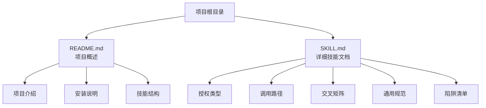

**图表来源**
- [README.md:1-53](file://README.md#L1-L53)
- [SKILL.md:1-436](file://SKILL.md#L1-L436)

**章节来源**
- [README.md:1-53](file://README.md#L1-L53)
- [SKILL.md:1-436](file://SKILL.md#L1-L436)

## 核心组件

### 驼峰命名规范

明道云 HAP 应用严格遵循驼峰命名法（camelCase），这是参数命名的核心原则：

#### 标准驼峰命名参数

| 参数名称 | 类型 | 用途 | 示例值 |
|---------|------|------|--------|
| pageSize | number | 每页记录数 | 50, 100, 200 |
| pageIndex | number | 页码索引 | 1, 2, 3 |
| useFieldIdAsKey | boolean | 使用字段ID作为键 | true, false |
| worksheetId | string | 工作表ID | "xxxx-xxxx-xxxx" |

#### 错误的命名方式

以下命名方式是不被接受的：

- `page_size` → 应使用 `pageSize`
- `page_index` → 应使用 `pageIndex`  
- `use_field_id_as_key` → 应使用 `useFieldIdAsKey`
- `worksheet_id` → 应使用 `worksheetId`

**章节来源**
- [SKILL.md:250-255](file://SKILL.md#L250-L255)

### 调用路径兼容性

驼峰命名规范在两种调用路径中保持一致：

#### MCP 协议中的参数使用

在 MCP 协议中，工具调用参数同样遵循驼峰命名：

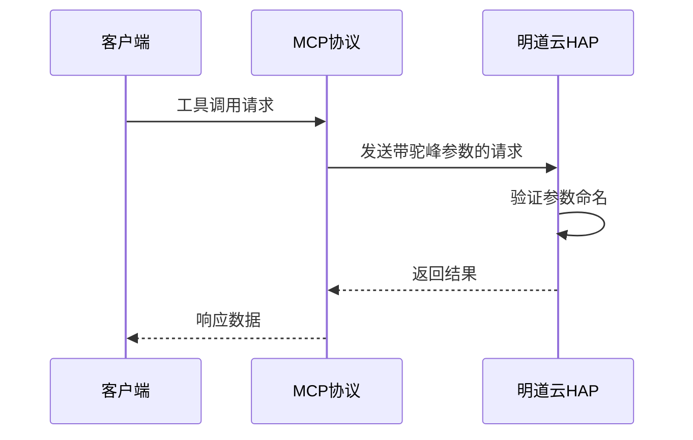

#### V3 REST API 中的参数使用

在 V3 REST API 中，请求体参数同样使用驼峰命名：

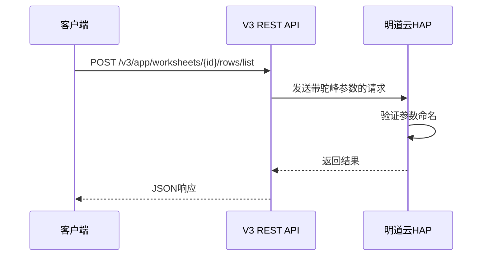

**章节来源**
- [SKILL.md:127-162](file://SKILL.md#L127-L162)

## 架构概览

### 参数命名一致性架构

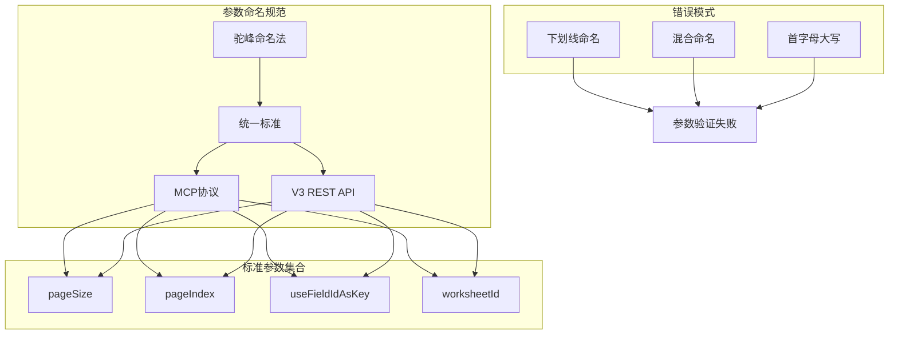

**图表来源**
- [SKILL.md:250-255](file://SKILL.md#L250-L255)
- [SKILL.md:127-162](file://SKILL.md#L127-L162)

### 参数命名验证流程

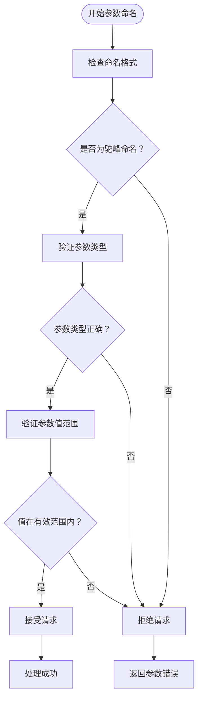

## 详细组件分析

### 标准参数详解

#### pageSize 参数

**用途**：控制每次请求返回的记录数量

**使用场景**：
- 大数据集分页查询
- 性能优化和内存管理
- 响应时间控制

**最佳实践**：
- MCP 协议：建议使用 50（单次响应约 256KB 上限）
- V3 REST API：建议使用 100-500（无缓冲限制）

**错误示例**：
- ❌ `page_size: 100` → 应使用 `pageSize: 100`
- ❌ `page-size: 50` → 应使用 `pageSize: 50`

#### pageIndex 参数

**用途**：指定要获取的页码

**使用场景**：
- 分页数据遍历
- 无限滚动加载
- 数据导出和备份

**注意事项**：
- 从 1 开始计数（非 0）
- 需要与 pageSize 配合使用
- 越界时返回空数据

**错误示例**：
- ❌ `page_index: 0` → 应使用 `pageIndex: 1`
- ❌ `PageIndex: 1` → 应使用 `pageIndex: 1`

#### useFieldIdAsKey 参数

**用途**：控制返回数据的键使用字段ID还是别名

**使用场景**：
- 字段ID与别名混用
- 数据迁移和同步
- API 兼容性处理

**重要说明**：
- 当启用时，返回数据的键强制使用字段ID（UUID）
- 这是避免数据错配的关键参数

**错误示例**：
- ❌ `use_field_id_as_key: true` → 应使用 `useFieldIdAsKey: true`
- ❌ `UseFieldIdAsKey: false` → 应使用 `useFieldIdAsKey: false`

#### worksheetId 参数

**用途**：标识具体的工作表

**使用场景**：
- 多工作表数据操作
- 工作表切换
- 数据隔离

**格式要求**：
- 必须是有效的 UUID 格式
- 区分大小写
- 不能包含特殊字符

**错误示例**：
- ❌ `worksheet_id: "xxx"` → 应使用 `worksheetId: "xxx"`
- ❌ `WorksheetId: "xxx"` → 应使用 `worksheetId: "xxx"`

### 参数命名错误类型

#### 常见错误类型

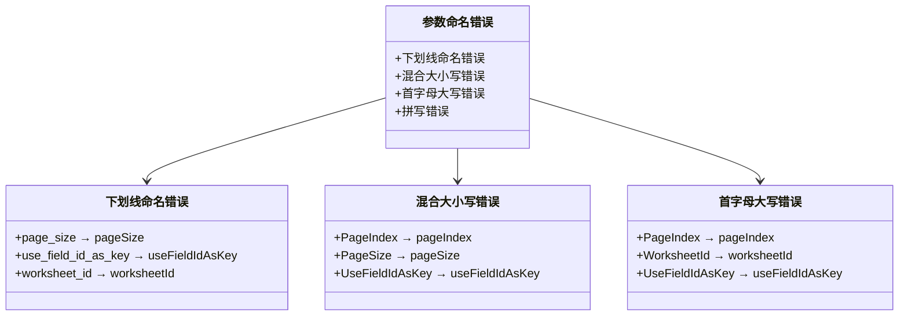

**图表来源**
- [SKILL.md:250-255](file://SKILL.md#L250-L255)

#### 错误影响分析

| 错误类型 | 影响程度 | 常见表现 | 解决方案 |
|---------|---------|---------|---------|
| 下划线命名 | 高 | 参数被忽略，返回默认值 | 统一改为驼峰命名 |
| 混合大小写 | 中 | 部分参数生效，部分不生效 | 严格遵循驼峰命名规则 |
| 首字母大写 | 低 | 个别参数不识别 | 遵循小驼峰命名 |
| 拼写错误 | 高 | 参数验证失败，返回错误 | 使用标准参数名 |

**章节来源**
- [SKILL.md:380-389](file://SKILL.md#L380-L389)

### 调用路径中的参数一致性

#### MCP 协议参数使用

在 MCP 协议中，工具调用参数同样遵循驼峰命名：

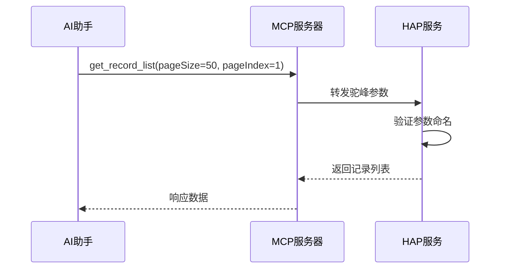

#### V3 REST API 参数使用

在 V3 REST API 中，请求体参数使用驼峰命名：

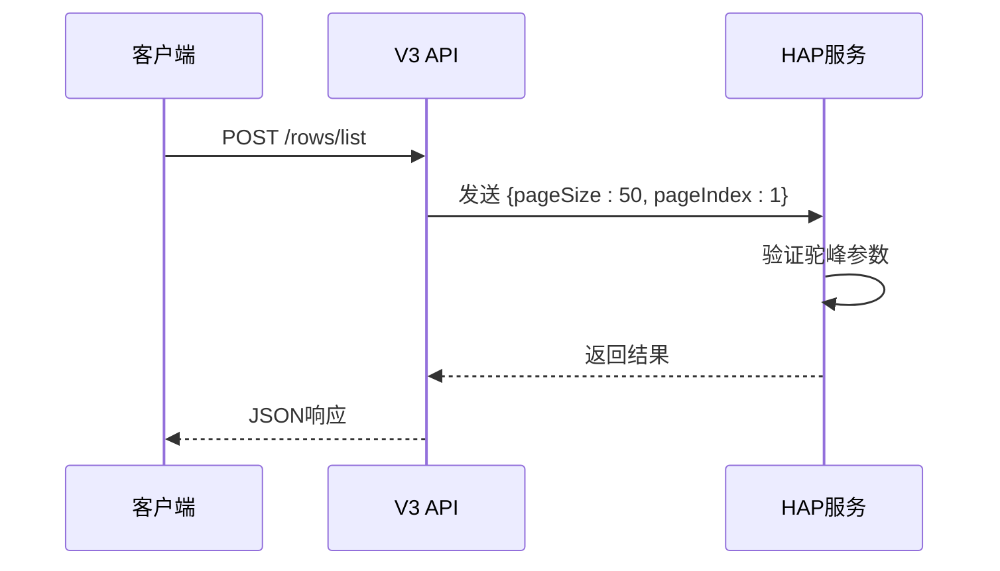

**章节来源**
- [SKILL.md:127-162](file://SKILL.md#L127-L162)

## 依赖关系分析

### 参数命名依赖关系

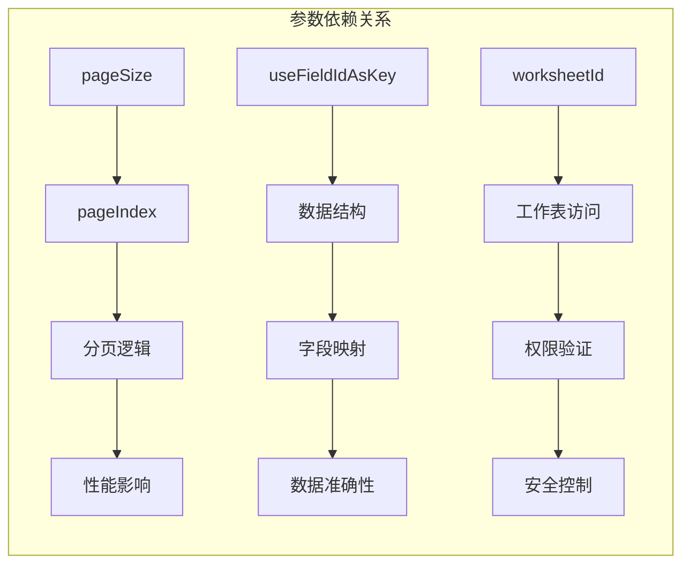

### 参数验证依赖

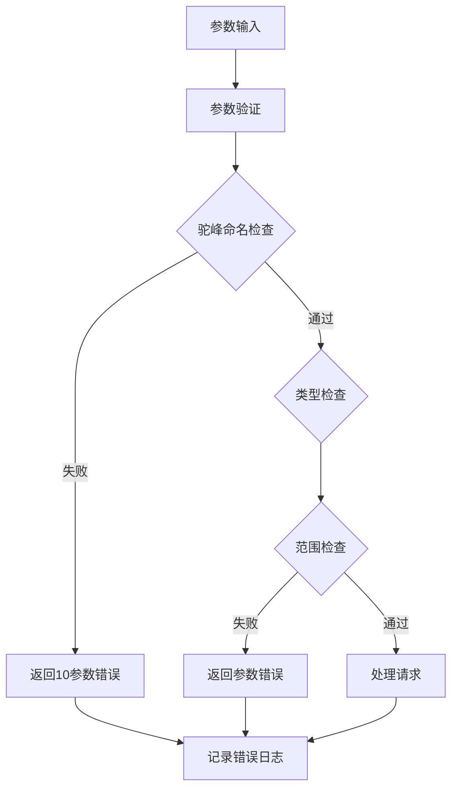

**图表来源**
- [SKILL.md:380-389](file://SKILL.md#L380-L389)

**章节来源**
- [SKILL.md:280-288](file://SKILL.md#L280-L288)

## 性能考虑

### 参数命名对性能的影响

虽然参数命名本身不影响计算性能，但错误的命名会导致：

1. **请求失败**：参数被忽略，需要重新发送
2. **额外网络开销**：重复请求增加网络负载
3. **处理延迟**：错误处理和重试增加响应时间

### 最佳实践建议

- 在代码中统一使用驼峰命名常量
- 建立参数命名检查机制
- 使用 IDE 插件或 ESLint 规则自动检查
- 在 API 文档中明确参数命名规范

## 故障排除指南

### 常见参数命名错误排查

#### 错误代码 10（参数错误）

当出现参数错误时，检查以下方面：

1. **参数命名**：确认使用驼峰命名而非下划线
2. **参数类型**：确认数值参数使用数字而非字符串
3. **参数范围**：确认 pageSize 在允许范围内
4. **参数完整性**：确认必需参数均已提供

#### 调试步骤

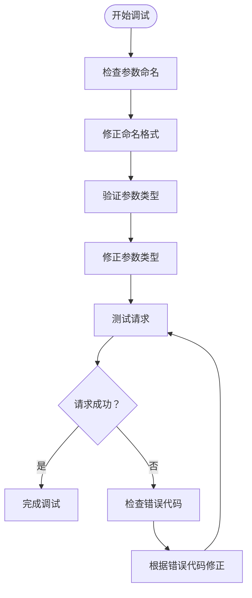

#### 错误代码对照表

| 错误代码 | 含义 | 解决方案 |
|---------|------|---------|
| 10 | 参数错误 | 检查参数命名和类型 |
| 10001 | HTTP Headers 验证失败 | 检查 OAuth 域名白名单 |
| 600101 | 授权已失效 | 刷新 Bearer Token |

**章节来源**
- [SKILL.md:378-398](file://SKILL.md#L378-L398)

## 结论

明道云 HAP 应用的参数命名规范以驼峰命名法为核心，确保在 MCP 协议和 V3 REST API 两种调用路径中的一致性。通过严格执行参数命名标准，可以：

1. **提高代码质量**：统一的命名规范减少歧义和错误
2. **增强系统稳定性**：避免因参数命名错误导致的请求失败
3. **提升开发效率**：减少调试和错误排查时间
4. **保证 API 兼容性**：确保不同调用路径的参数一致性

建议开发者在项目初期就建立参数命名规范，并在团队内部推广使用。通过代码审查和自动化检查工具，确保规范得到严格执行。