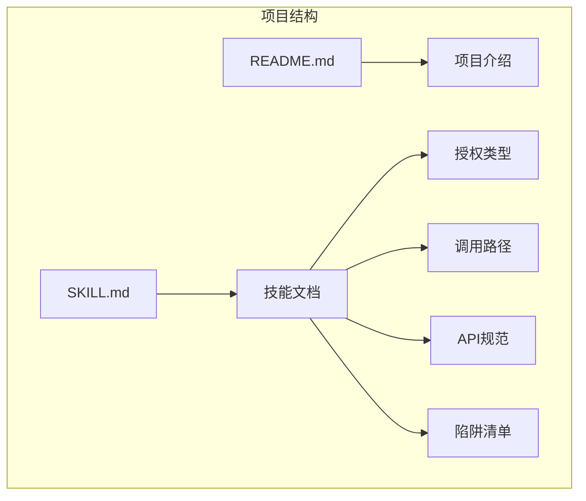
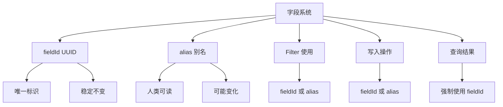
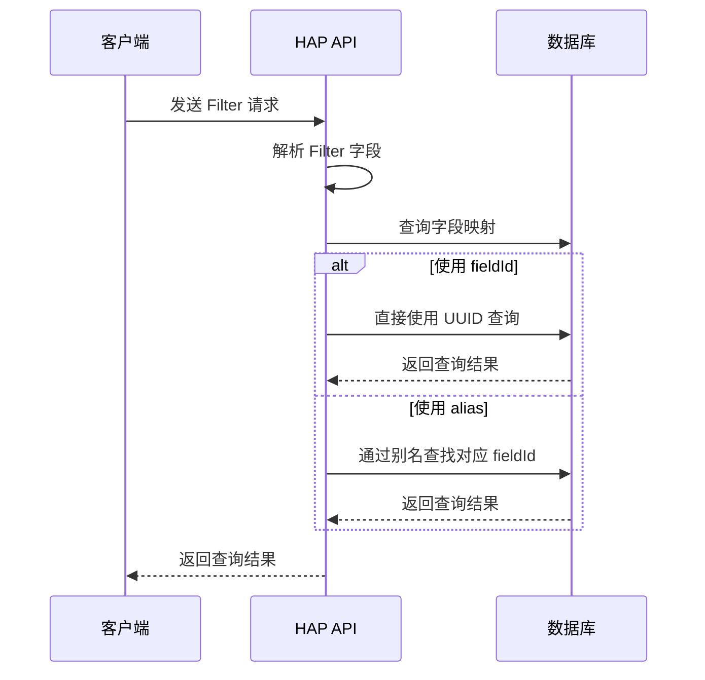
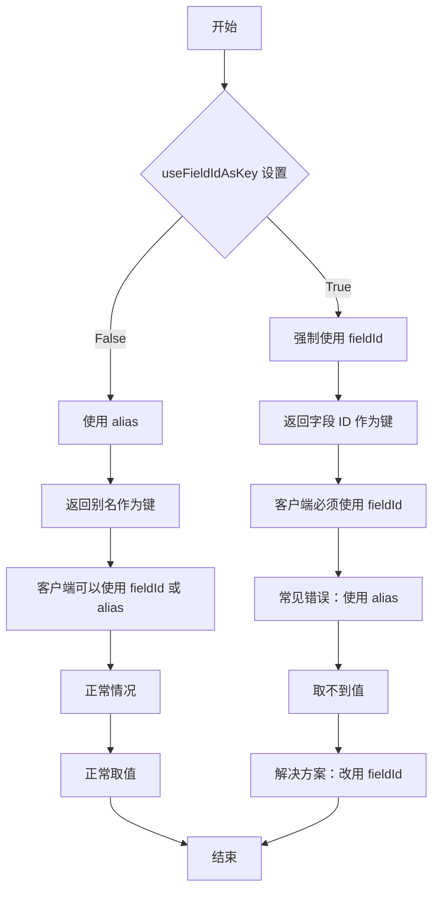
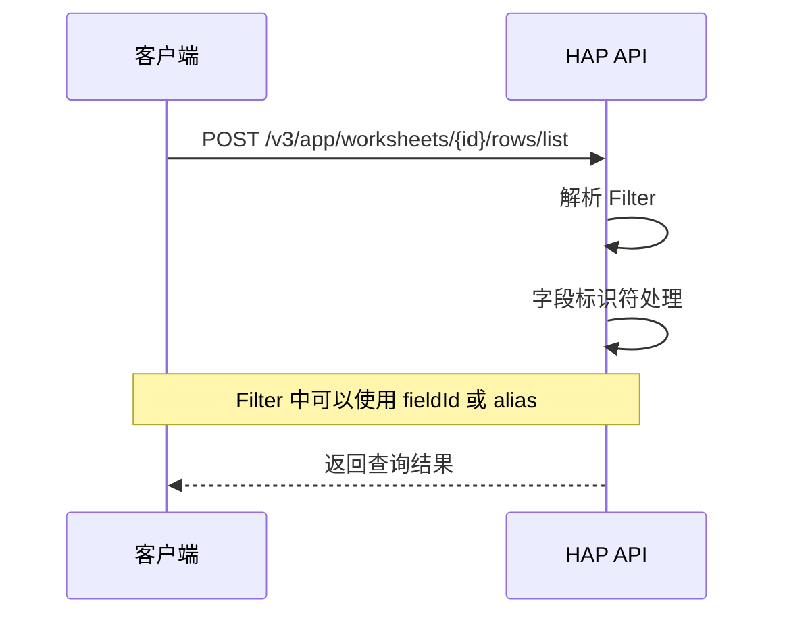
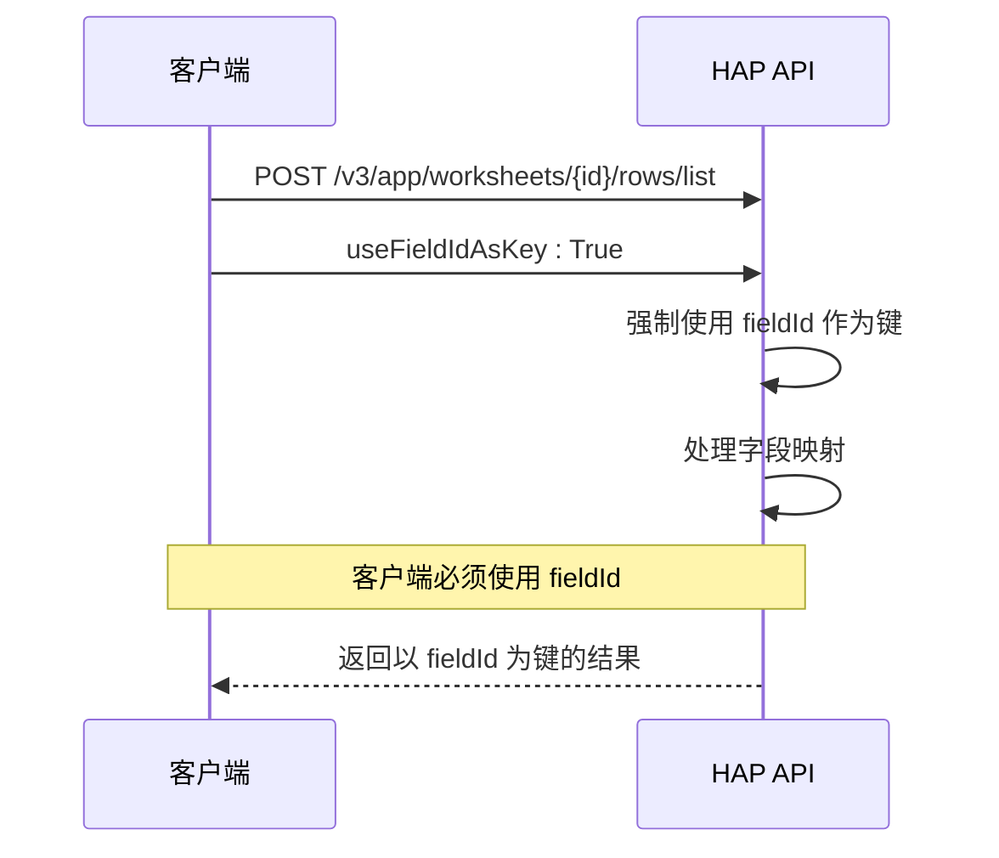
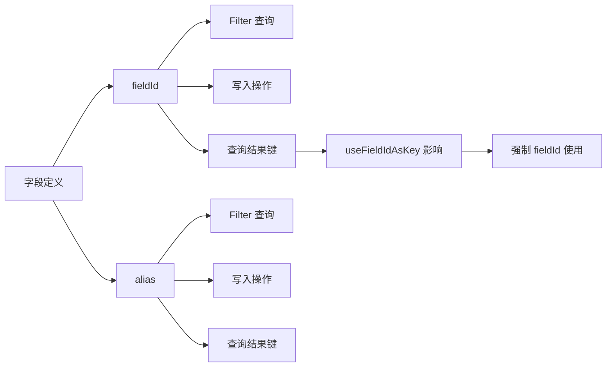
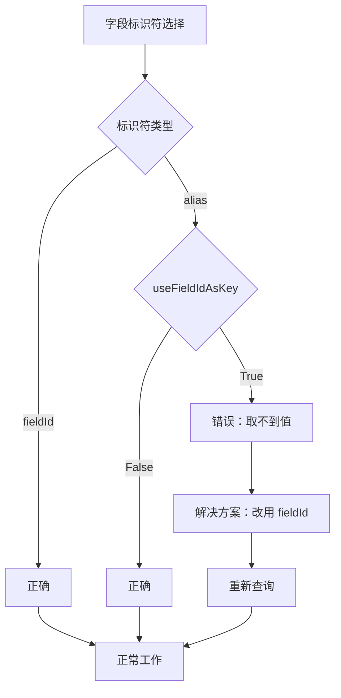

# 字段 ID 管理

<cite>
**本文引用的文件**
- [README.md](file://README.md)
- [SKILL.md](file://SKILL.md)
</cite>

## 目录
1. [简介](#简介)
2. [项目结构](#项目结构)
3. [核心组件](#核心组件)
4. [架构概览](#架构概览)
5. [详细组件分析](#详细组件分析)
6. [依赖关系分析](#依赖关系分析)
7. [性能考虑](#性能考虑)
8. [故障排除指南](#故障排除指南)
9. [结论](#结论)

## 简介

本文档专注于明道云 HAP 应用中的字段 ID 管理，详细说明 fieldId（UUID）与 alias 的区别和使用场景。重点解释在不同操作中应该使用哪种标识符，特别是 `get_record_list` 使用 `useFieldIdAsKey=True` 时必须强制使用 fieldId 的重要性。

明道云 HAP（Harmony Application Platform）是一个企业级低代码平台，提供强大的数据管理和业务流程自动化能力。在 HAP 应用中，字段是数据模型的基本单元，每个字段都有唯一的标识符。

## 项目结构

该项目采用技能文档的形式，提供明道云 HAP 应用的通用访问方法论：

**图表来源**
- [README.md:1-53](file://README.md#L1-L53)
- [SKILL.md:1-436](file://SKILL.md#L1-L436)

**章节来源**
- [README.md:1-53](file://README.md#L1-L53)
- [SKILL.md:1-436](file://SKILL.md#L1-L436)

## 核心组件

### 字段标识符类型

在明道云 HAP 应用中，字段有两种标识符类型：

1. **fieldId（UUID）**：字段的唯一标识符，格式为 UUID v4
2. **alias（别名）**：字段的自定义别名，便于人类阅读

### 字段标识符使用场景对比

| 场景 | 用 fieldId | 用 alias | 说明 |
|------|------------|----------|------|
| Filter 的 `field` | ✅ 支持 | ✅ 支持 | 两种均可使用 |
| 写入（create/update）的 key | ✅ 支持 | ✅ 支持 | 两种均可使用 |
| `get_record_list(useFieldIdAsKey=True)` 返回的 key | ❌ 不支持 | ❌ 不支持 | **必须使用 fieldId** |

**章节来源**
- [SKILL.md:289-298](file://SKILL.md#L289-L298)

## 架构概览

明道云 HAP 应用的字段管理系统采用双标识符架构：

**图表来源**
- [SKILL.md:289-298](file://SKILL.md#L289-L298)

## 详细组件分析

### 字段 ID 与别名的区别

#### fieldId（UUID）特性
- **唯一性**：全球唯一标识符，永不重复
- **稳定性**：字段删除后，其 ID 也不会被重新分配
- **技术性**：机器可读，适合程序使用
- **格式**：标准 UUID v4 格式

#### alias（别名）特性
- **可读性**：便于人类理解和记忆
- **灵活性**：可以随时修改而不影响功能
- **易变性**：别名变更会影响依赖它的代码
- **本地化**：支持多语言显示

### Filter 中的字段使用

在 Filter 结构中，字段标识符可以使用两种形式：

**图表来源**
- [SKILL.md:256-273](file://SKILL.md#L256-L273)

### get_record_list 中的 useFieldIdAsKey

这是最复杂的场景，也是最容易出错的地方：

**图表来源**
- [SKILL.md:289-298](file://SKILL.md#L289-L298)

### 字段 ID 获取方法

虽然仓库中没有具体的字段 ID 获取代码，但根据文档可以总结以下方法：

1. **通过工作表结构 API 获取**
   - 使用 `/v3/app/worksheet/getFields` 端点
   - 返回包含所有字段的详细信息

2. **通过工作表结构缓存**
   - 在应用启动时获取并缓存字段映射
   - 避免频繁的 API 调用

3. **通过 HAP 后台界面**
   - 在 HAP 应用后台查看字段详情
   - 复制字段的 UUID

**章节来源**
- [SKILL.md:114](file://SKILL.md#L114)

### 实际使用示例

#### 示例场景一：Filter 查询

**图表来源**
- [SKILL.md:127-162](file://SKILL.md#L127-L162)

#### 示例场景二：使用 useFieldIdAsKey

**图表来源**
- [SKILL.md:138-162](file://SKILL.md#L138-L162)

## 依赖关系分析

### 字段标识符依赖关系

**图表来源**
- [SKILL.md:289-298](file://SKILL.md#L289-L298)

### 错误处理依赖

当使用错误的字段标识符时，系统会返回相应的错误：

**图表来源**
- [SKILL.md:289-298](file://SKILL.md#L289-L298)

**章节来源**
- [SKILL.md:289-298](file://SKILL.md#L289-L298)

## 性能考虑

### 字段标识符选择对性能的影响

1. **fieldId vs alias 性能差异**
   - fieldId：直接查询，性能最优
   - alias：需要额外的映射查找，有轻微性能开销

2. **useFieldIdAsKey 的性能影响**
   - 查询性能：无显著影响
   - 内存使用：可能增加少量内存占用
   - 客户端处理：需要额外的字段映射处理

3. **最佳实践建议**
   - 在生产环境中统一使用 fieldId
   - 缓存字段映射关系
   - 避免频繁的字段 ID 查询

## 故障排除指南

### 常见陷阱和解决方案

#### 陷阱一：useFieldIdAsKey 使用错误
**问题描述**：设置了 `useFieldIdAsKey=True` 但仍然使用 alias 作为键名

**解决方案**：
1. 检查 `useFieldIdAsKey` 设置
2. 确保使用 fieldId 作为键名
3. 验证字段映射关系

#### 陷阱二：字段别名变更导致的问题
**问题描述**：字段别名被修改后，原有代码无法正常工作

**解决方案**：
1. 使用 fieldId 替代别名
2. 建立字段映射缓存
3. 实施向后兼容机制

#### 陷阱三：Filter 中字段标识符混淆
**问题描述**：在 Filter 中混用 fieldId 和 alias

**解决方案**：
1. 建立统一的字段标识符管理策略
2. 在团队内部制定规范
3. 使用代码审查确保一致性

**章节来源**
- [SKILL.md:301-376](file://SKILL.md#L301-L376)

## 结论

明道云 HAP 应用的字段 ID 管理是一个关键的技术细节，直接影响数据操作的正确性和可靠性。通过理解 fieldId 与 alias 的区别，以及在不同场景下的使用规范，可以避免大多数常见的字段标识符相关问题。

### 关键要点总结

1. **统一使用 fieldId**：在生产环境中建议统一使用 fieldId，避免别名变更带来的风险
2. **正确处理 useFieldIdAsKey**：当设置为 True 时，必须使用 fieldId 作为键名
3. **建立缓存机制**：缓存字段映射关系，提高查询效率
4. **制定团队规范**：在团队内部建立统一的字段标识符使用规范
5. **实施监控机制**：监控字段标识符使用情况，及时发现和解决问题

通过遵循这些最佳实践，可以确保明道云 HAP 应用中字段 ID 管理的准确性和可靠性，为业务系统的稳定运行提供坚实基础。