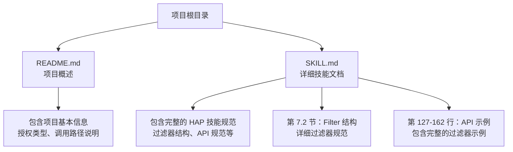
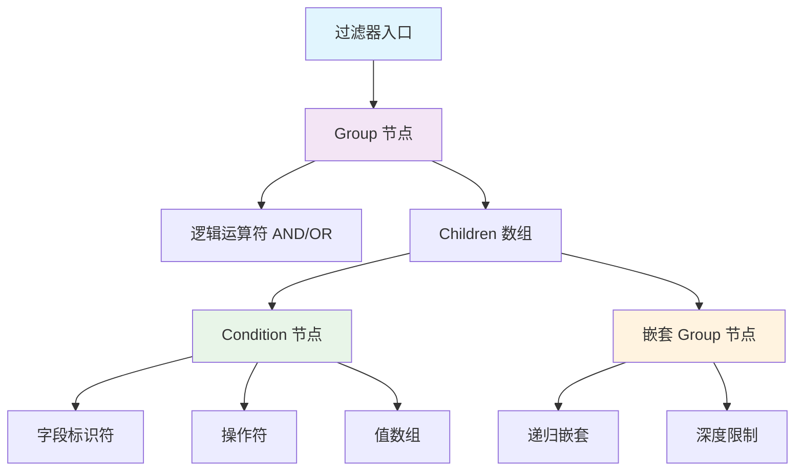
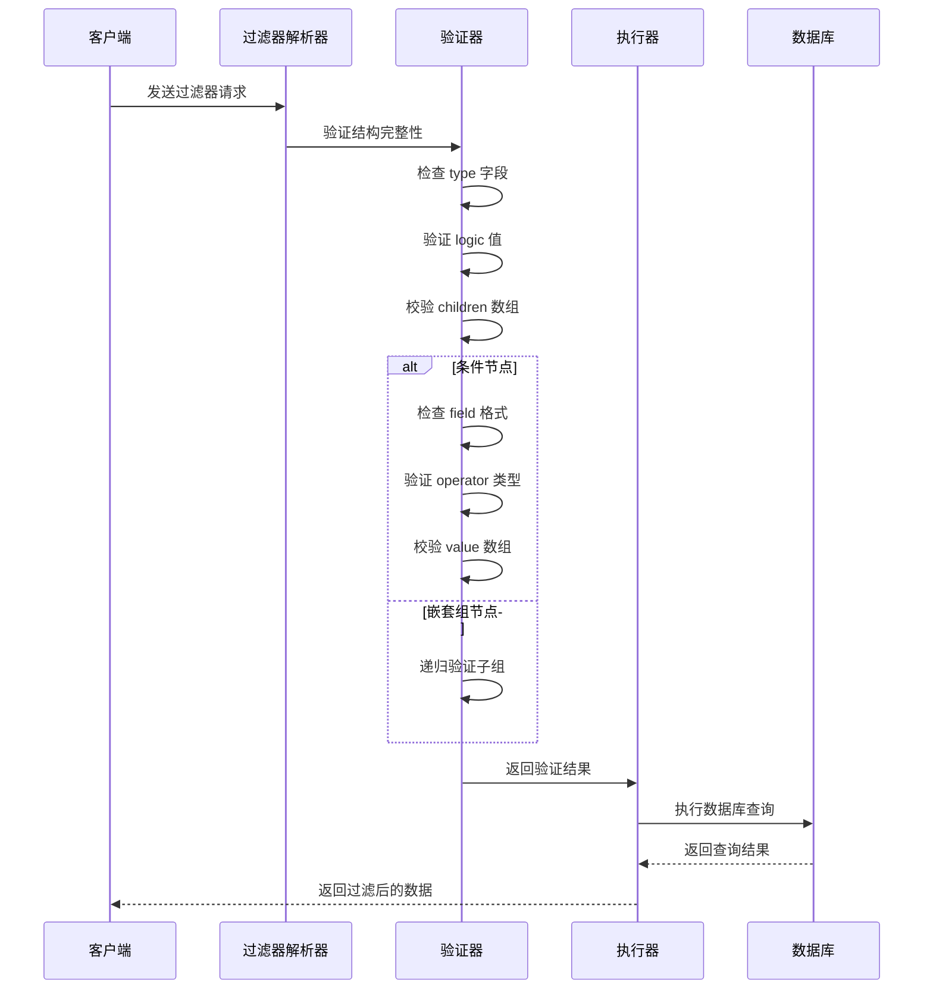
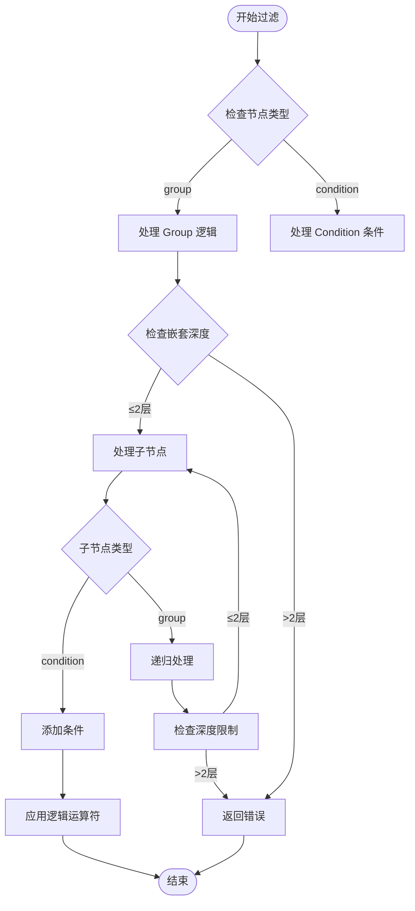
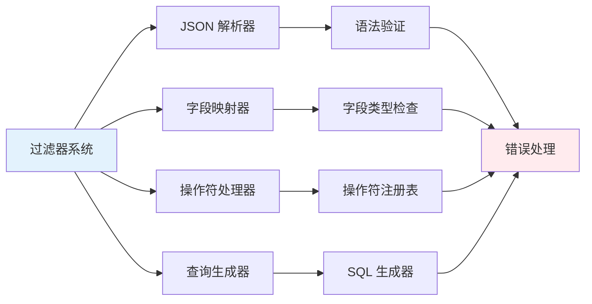

# 过滤器结构规范

<cite>
**本文档引用的文件**
- [README.md](file://README.md)
- [SKILL.md](file://SKILL.md)
</cite>

## 目录
1. [简介](#简介)
2. [项目结构](#项目结构)
3. [核心组件](#核心组件)
4. [架构概览](#架构概览)
5. [详细组件分析](#详细组件分析)
6. [依赖关系分析](#依赖关系分析)
7. [性能考虑](#性能考虑)
8. [故障排除指南](#故障排除指南)
9. [结论](#结论)

## 简介

本文档为明道云 HAP 应用创建过滤器结构规范的详细文档。明道云 HAP（Harmony Application Platform）是一个企业级应用开发平台，提供强大的数据管理和业务流程自动化能力。过滤器功能是 HAP 应用中用于数据查询和筛选的核心组件，支持复杂的嵌套条件和多种操作符，为用户提供灵活的数据检索能力。

本规范详细说明了 Filter 的 JSON 结构，包括 type、logic、children 等字段的使用规则，并提供完整的过滤器示例，涵盖 group → condition 的嵌套结构、operator 的各种取值（eq、in、between、contains、belongsto 等）。同时解释过滤器在不同字段类型中的使用方法和注意事项。

## 项目结构

该项目采用简洁的文档结构，主要包含两个核心文件：

**图表来源**
- [README.md:1-53](file://README.md#L1-L53)
- [SKILL.md:250-273](file://SKILL.md#L250-L273)

**章节来源**
- [README.md:1-53](file://README.md#L1-L53)
- [SKILL.md:1-436](file://SKILL.md#L1-L436)

## 核心组件

### 过滤器基础结构

明道云 HAP 应用的过滤器系统基于 JSON 结构设计，采用递归的组-条件模型。每个过滤器都必须遵循严格的层次结构和字段规范。

#### 基础字段规范

过滤器对象包含以下核心字段：

| 字段名 | 类型 | 必填 | 说明 |
|--------|------|------|------|
| type | string | 是 | 过滤器类型，必须为 "group" |
| logic | string | 是 | 逻辑运算符，支持 "AND" 或 "OR" |
| children | array | 是 | 子节点数组，包含条件或嵌套组 |

#### 条件节点规范

条件节点用于定义具体的过滤条件，具有以下结构：

| 字段名 | 类型 | 必填 | 说明 |
|--------|------|------|------|
| type | string | 是 | 节点类型，必须为 "condition" |
| field | string | 是 | 字段标识符，可以是 fieldId 或别名 |
| operator | string | 是 | 操作符类型 |
| value | array | 是 | 值数组，包含过滤条件的值 |

**章节来源**
- [SKILL.md:256-279](file://SKILL.md#L256-L279)

## 架构概览

明道云 HAP 应用的过滤器系统采用分层架构设计，支持多层级嵌套和复杂逻辑组合：

**图表来源**
- [SKILL.md:256-279](file://SKILL.md#L256-L279)

### 过滤器处理流程

过滤器系统遵循严格的处理流程，确保数据查询的准确性和效率：

**图表来源**
- [SKILL.md:256-279](file://SKILL.md#L256-L279)

## 详细组件分析

### 过滤器类型系统

#### Group 节点

Group 节点是过滤器系统的根节点，必须满足以下要求：

- **type 字段**：必须严格等于 "group"
- **logic 字段**：支持 "AND" 或 "OR" 两种逻辑运算符
- **children 字段**：必须是非空数组，包含至少一个子节点

#### Condition 节点

Condition 节点定义具体的过滤条件，包含以下要素：

- **type 字段**：必须严格等于 "condition"
- **field 字段**：可以使用 fieldId（UUID 格式）或字段别名
- **operator 字段**：定义比较操作的类型
- **value 字段**：必须是数组格式，包含过滤值

**章节来源**
- [SKILL.md:256-279](file://SKILL.md#L256-L279)

### 操作符详解

明道云 HAP 应用支持多种操作符，每种操作符适用于不同的数据类型和使用场景：

#### 基础比较操作符

| 操作符 | 用途 | 值类型 | 示例场景 |
|--------|------|--------|----------|
| eq | 等于 | 任意类型 | 精确匹配特定值 |
| ne | 不等于 | 任意类型 | 排除特定值 |
| gt | 大于 | 数值/日期 | 时间范围筛选 |
| gte | 大于等于 | 数值/日期 | 上限值比较 |
| lt | 小于 | 数值/日期 | 下限值比较 |
| lte | 小于等于 | 数值/日期 | 日期截止时间 |

#### 集合操作符

| 操作符 | 用途 | 值类型 | 示例场景 |
|--------|------|--------|----------|
| in | 在集合中 | 数组 | 多值选择筛选 |
| nin | 不在集合中 | 数组 | 排除多个值 |
| contains | 包含 | 字符串/数组 | 模糊匹配文本 |
| ncontains | 不包含 | 字符串/数组 | 排除特定文本 |

#### 特殊操作符

| 操作符 | 用途 | 值类型 | 示例场景 |
|--------|------|--------|----------|
| between | 范围内 | 数组[2] | 日期范围/数值区间 |
| isnull | 为空 | null | 空值检查 |
| notnull | 不为空 | null | 非空值检查 |
| belongsto | 归属关系 | 关联ID | 关联字段筛选 |

**章节来源**
- [SKILL.md:275-279](file://SKILL.md#L275-L279)

### 嵌套结构规范

过滤器系统支持最多两层嵌套的复杂查询结构：

**图表来源**
- [SKILL.md:275-279](file://SKILL.md#L275-L279)

**章节来源**
- [SKILL.md:275-279](file://SKILL.md#L275-L279)

### 字段类型适配

#### 数值字段

数值字段支持所有比较操作符，包括精确比较和范围比较：

- **支持的操作符**：eq、ne、gt、gte、lt、lte、between、in、nin
- **值格式**：数字类型，支持小数和整数
- **注意事项**：读取时可能返回字符串格式，需要进行类型转换

#### 日期字段

日期字段具有特殊的时间处理特性：

- **支持的操作符**：eq、gt、gte、lt、lte、between、in
- **值格式**：ISO 8601 日期字符串
- **时区考虑**：可能存在 ±1 天的时区偏移

#### 字符串字段

字符串字段支持文本匹配和集合操作：

- **支持的操作符**：eq、contains、in、between
- **值格式**：字符串类型
- **大小写敏感**：通常不区分大小写

#### 关联字段

关联字段用于跨表查询：

- **支持的操作符**：eq、in、belongsto
- **值格式**：关联记录的 ID
- **性能考虑**：复杂关联查询可能影响性能

**章节来源**
- [SKILL.md:301-362](file://SKILL.md#L301-L362)

## 依赖关系分析

### 技术依赖

明道云 HAP 应用的过滤器系统依赖于以下核心技术组件：

**图表来源**
- [SKILL.md:256-279](file://SKILL.md#L256-L279)

### 数据流依赖

过滤器系统遵循清晰的数据流向：

1. **输入阶段**：客户端发送 JSON 过滤器
2. **解析阶段**：系统解析并验证结构
3. **映射阶段**：字段标识符映射到实际列名
4. **执行阶段**：生成并执行数据库查询
5. **输出阶段**：返回过滤后的结果集

**章节来源**
- [SKILL.md:256-279](file://SKILL.md#L256-L279)

## 性能考虑

### 查询优化

明道云 HAP 应用的过滤器系统在设计时充分考虑了性能因素：

#### 索引利用

- **字段索引**：经常用于过滤的字段应该建立适当的数据库索引
- **复合索引**：对于多条件查询，考虑建立复合索引
- **前缀索引**：对于长文本字段，考虑使用前缀索引

#### 查询限制

- **嵌套深度**：限制最大嵌套深度为 2 层，防止查询复杂度过高
- **结果集大小**：配合分页机制，避免一次性返回大量数据
- **超时控制**：为复杂查询设置合理的超时时间

#### 缓存策略

- **热点数据**：对频繁查询的过滤条件进行缓存
- **查询计划**：缓存常用的查询执行计划
- **结果缓存**：对静态数据的查询结果进行缓存

### 内存管理

- **流式处理**：大数据集查询采用流式处理方式
- **分批处理**：避免一次性加载所有数据到内存
- **垃圾回收**：及时释放不再使用的查询对象

## 故障排除指南

### 常见错误及解决方案

#### 结构验证错误

**错误表现**：
- type 字段值不正确
- logic 字段值不在允许范围内
- children 字段格式错误

**解决方法**：
- 确保 type 字段严格等于 "group" 或 "condition"
- logic 字段只能是 "AND" 或 "OR"
- children 必须是非空数组

#### 字段标识符错误

**错误表现**：
- field 字段值不存在
- 字段类型不匹配
- 字段权限不足

**解决方法**：
- 使用正确的 fieldId（UUID 格式）
- 确认字段在目标工作表中存在
- 检查用户对该字段的访问权限

#### 操作符不支持

**错误表现**：
- 操作符在当前字段类型上不支持
- 值类型与操作符不匹配

**解决方法**：
- 参考字段类型支持的操作符列表
- 确保值类型符合操作符要求
- 对于字符串匹配使用 contains 操作符

#### 嵌套深度超限

**错误表现**：
- 过滤器嵌套超过 2 层
- 查询执行时间过长

**解决方法**：
- 简化过滤条件，减少嵌套层级
- 使用更精确的查询条件
- 考虑分步查询策略

**章节来源**
- [SKILL.md:301-362](file://SKILL.md#L301-L362)

### 调试技巧

#### 日志记录

- **请求日志**：记录原始过滤器请求
- **解析日志**：记录过滤器解析过程
- **执行日志**：记录最终生成的 SQL 查询

#### 性能监控

- **执行时间**：监控查询执行时间
- **内存使用**：监控内存消耗情况
- **数据库负载**：监控数据库查询负载

#### 错误分类

- **语法错误**：过滤器结构不符合规范
- **语义错误**：过滤器逻辑有问题但结构正确
- **执行错误**：数据库查询执行失败

## 结论

明道云 HAP 应用的过滤器系统提供了一个强大而灵活的数据查询框架。通过严格的 JSON 结构规范、丰富的操作符支持和智能的嵌套处理机制，用户可以构建复杂的查询条件来满足各种业务需求。

### 关键优势

1. **结构化设计**：基于 JSON 的标准化结构，易于理解和维护
2. **灵活性强**：支持多层级嵌套和复杂逻辑组合
3. **类型安全**：针对不同字段类型提供相应的操作符支持
4. **性能优化**：通过深度限制和查询优化确保系统性能

### 最佳实践建议

1. **合理使用嵌套**：避免超过 2 层嵌套，保持查询简洁高效
2. **选择合适操作符**：根据字段类型和业务需求选择最合适的操作符
3. **性能优先**：优先考虑查询性能，避免不必要的复杂查询
4. **错误处理**：建立完善的错误处理和监控机制

### 未来发展

随着业务需求的不断增长，过滤器系统将继续演进，可能包括：
- 更高级的聚合查询支持
- 实时查询优化
- 更智能的查询建议
- 增强的性能监控和分析功能

通过遵循本规范，开发者可以充分利用明道云 HAP 应用的过滤器功能，构建高效、可靠的业务应用。