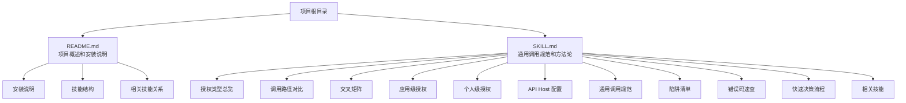
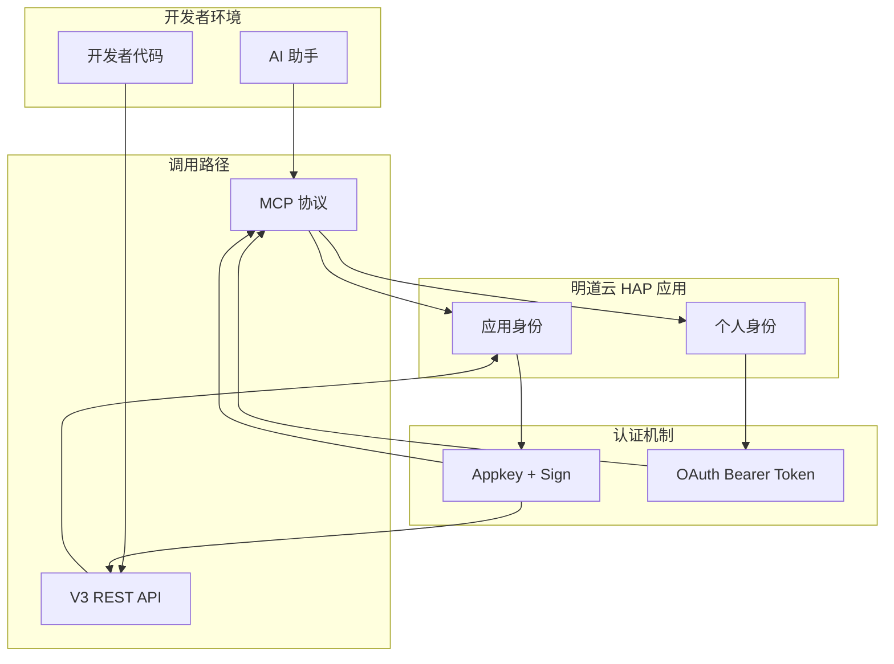
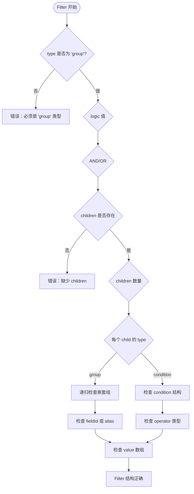
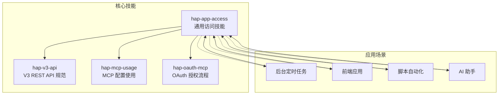

# 通用调用规范

<cite>
**本文档引用的文件**
- [README.md](file://README.md)
- [SKILL.md](file://SKILL.md)
</cite>

## 目录
1. [简介](#简介)
2. [项目结构](#项目结构)
3. [核心组件](#核心组件)
4. [架构概览](#架构概览)
5. [详细组件分析](#详细组件分析)
6. [依赖关系分析](#依赖关系分析)
7. [性能考虑](#性能考虑)
8. [故障排除指南](#故障排除指南)
9. [结论](#结论)

## 简介

明道云 HAP 应用通用访问技能为开发者提供了访问明道云（HAP）应用的**通用方法论**。该技能覆盖两种授权类型（应用级 Appkey+Sign / 个人级 OAuth Bearer）与两种调用路径（MCP 协议 / V3 REST API）的交叉组合，帮助开发者快速判断和实施正确的访问方式。

本技能专注于提供通用的授权、连接、调用方法论与陷阱清单，不包含任何具体业务逻辑。它适用于需要"访问明道云应用"、"连接 HAP 应用"、"读写 HAP 数据"、"选择授权方式"、"MCP 和 API 怎么选"等场景的开发者和 AI 助手。

## 项目结构

该项目采用简洁的文档结构，主要包含以下文件：



**图表来源**
- [README.md:1-53](file://README.md#L1-L53)
- [SKILL.md:1-436](file://SKILL.md#L1-L436)

**章节来源**
- [README.md:1-53](file://README.md#L1-L53)
- [SKILL.md:1-436](file://SKILL.md#L1-L436)

## 核心组件

### 授权类型体系

明道云 HAP 应用提供两种基本授权类型，决定了**谁能访问**和**能访问什么**：

| 维度 | 应用级授权（Appkey+Sign） | 个人级授权（OAuth Bearer） |
|------|--------------------------|---------------------------|
| 身份 | 应用身份（不受人约束） | 个人身份（等同于登录用户） |
| 凭证 | Appkey + Sign（长期有效） | Bearer Token（约 1 天过期） |
| 权限范围 | 应用内 API 开关控制的全部数据 | 当前登录用户在应用中可见的数据 |
| 跨应用 | 只能访问所属应用 | 可跨应用访问用户有权限的所有应用 |
| 适用场景 | 后台定时任务、服务间同步、脚本自动化 | 个人数据查询、以用户视角读写数据 |
| 过期 | 不过期（除非在 HAP 后台重置） | 约 1 天，需要刷新机制 |

**选择原则**：
- 需要**无人值守运行** → 应用级（Appkey+Sign）
- 需要**受用户权限约束** → 个人级（OAuth Bearer）
- 需要跨多个应用 → 个人级（一个 token 覆盖多应用）
- 两者都可用 → 优先应用级（无过期风险）

### 调用路径对比

拿到授权后，开发者有两种路径调用 HAP：

| 维度 | MCP 协议（SSE/Streamable HTTP） | V3 REST API（HTTP JSON） |
|------|-------------------------------|-------------------------|
| 协议 | MCP（Model Context Protocol） | 标准 HTTPS + JSON |
| 端点 | `https://api.mingdao.com/mcp` | `https://api.mingdao.com/v3/open/...` |
| 鉴权注入 | URL query 参数或 SSE Header | HTTP 请求头 |
| 工具发现 | 自动暴露 40~70 个工具 | 需查 API 文档 |
| 调用方式 | AI 工具原生支持（如 Qoder/Cursor 的 MCP 集成） | 代码中 `fetch`/`requests` 等 |
| 适合谁 | AI 助手直接操作数据 | 开发者在代码中集成 |
| 分页 | `pageSize` 上限 **90** | `pageSize` 上限 **1000** |
| 响应大小 | 单次约 **256KB** 缓冲上限 | 无此限制 |

**选择原则**：
- AI 在对话中直接操作数据 → MCP
- 写代码（前端/后端/脚本）集成 HAP → V3 REST API
- 两者都能用 → AI 场景用 MCP，代码场景用 V3 API

**章节来源**
- [SKILL.md:13-53](file://SKILL.md#L13-L53)

## 架构概览



**图表来源**
- [SKILL.md:27-64](file://SKILL.md#L27-L64)

## 详细组件分析

### 通用调用规范

#### 驼峰命名规范

所有参数必须使用驼峰命名法，这是明道云 HAP API 的统一标准：

- ✅ 正确：`pageSize`、`pageIndex`、`useFieldIdAsKey`、`worksheetId`
- ❌ 错误：`page_size`、`page_index`、`use_field_id_as_key`

这种命名约定适用于所有 API 调用，包括 MCP 协议和 V3 REST API。

#### Filter 结构规范

Filter 是明道云 HAP API 的核心查询机制，具有严格的结构要求：



**图表来源**
- [SKILL.md:256-273](file://SKILL.md#L256-L273)

Filter 结构的关键规则：
- 顶层必须是 `group` 类型
- 最多两层嵌套：`group → group → condition`
- `operator` 必须是字符串形式，如 `"eq"`、`"in"`、`"between"`、`"contains"`、`"belongsto"` 等

#### 分页策略规范

明道云 HAP API 提供了两种不同的分页策略，取决于调用路径：

| 路径 | pageSize 上限 | 推荐值 | 说明 |
|------|-------------|--------|------|
| MCP `get_record_list` | **90** | 50 | 单次响应有 ~256KB 缓冲上限，大表必须降 page_size |
| V3 API `rows/list` | **1000** | 100~500 | 无缓冲限制，但不宜过大 |

**重要原则**：
- 必须翻页获取全部记录，**不可用单页数据做全局统计**
- 大表查询时，MCP 路径建议使用 50 的 page_size
- V3 API 路径可根据需要调整，但建议保持在 100~500 之间

#### 字段 ID 管理

字段 ID 管理是明道云 HAP API 的一个重要概念，涉及三种不同的使用场景：

| 场景 | 使用什么 | 说明 |
|------|--------|------|
| Filter 的 `field` | fieldId（UUID）或 alias 均可 | 两种方式都可以正常工作 |
| 写入（create/update）的 key | fieldId 或 alias 均可 | 两种方式都可以正常工作 |
| `get_record_list(useFieldIdAsKey=True)` 返回的 key | **强制替换为 fieldId（UUID）** | 即使字段有 alias，也必须使用 UUID |

**关键陷阱**：
- 当 `useFieldIdAsKey=True` 时，读取时必须用 UUID 做 key，否则取不到值
- 这是明道云 HAP API 最常见的踩坑点之一

**章节来源**
- [SKILL.md:250-298](file://SKILL.md#L250-L298)

### 应用级授权（Appkey+Sign）

#### 凭证获取流程

应用级授权是最常用的授权方式，适用于无人值守运行和后台任务：

1. 登录 HAP → 进入目标应用 → **应用设置** → **API 开发** → **API 密钥**
2. 复制 `Appkey` 和 `Sign`
3. 或复制 MCP URL：`https://api.mingdao.com/mcp?HAP-Appkey=<Appkey>&HAP-Sign=<Sign>`

#### MCP 路径配置

在 AI 工具的 MCP 配置中写入：

```json
{
  "mcpServers": {
    "hap-mcp-<应用名>": {
      "url": "https://api.mingdao.com/mcp?HAP-Appkey=<Appkey>&HAP-Sign=<Sign>"
    }
  }
}
```

配置后可用的典型工具（约 40 个）：
- `get_app_info` / `get_app_worksheets_list` / `get_worksheet_structure`
- `get_record_list` / `get_record_details` / `get_record_pivot_data`
- `create_record` / `update_record` / `delete_record`
- `batch_create_records` / `batch_update_records` / `batch_delete_records`

#### V3 REST API 路径

**请求头**：
```
Content-Type: application/json
HAP-Appkey: <Appkey>
HAP-Sign: <Sign>
```

**常用端点**：
- 获取应用信息：`GET /v3/app/info`
- 获取工作表列表：`GET /v3/app/worksheets`
- 获取工作表字段：`GET /v3/app/worksheet/getFields`
- 查询记录：`POST /v3/app/worksheets/{id}/rows/list`
- 获取记录详情：`GET /v3/app/worksheets/{id}/rows/{rowId}`
- 创建记录：`POST /v3/app/worksheets/{id}/rows`
- 更新记录：`PUT /v3/app/worksheets/{id}/rows/{rowId}`
- 删除记录：`DELETE /v3/app/worksheets/{id}/rows/{rowId}`
- 批量创建：`POST /v3/app/worksheets/{id}/rows/batch`
- 批量更新：`PUT /v3/app/worksheets/{id}/rows/batch`
- 批量删除：`DELETE /v3/app/worksheets/{id}/rows/batch`
- 获取关联记录：`GET /v3/app/worksheets/{id}/rows/{rowId}/relations/{fieldId}`
- 查找用户：`POST /v3/users/lookup`
- 查找部门：`POST /v3/departments/lookup`

**章节来源**
- [SKILL.md:68-164](file://SKILL.md#L68-L164)

### 个人级授权（OAuth Bearer）

#### Token 获取流程

个人级授权适用于需要受用户权限约束的场景：

1. 在 HAP 组织管理后台创建 **OAuth 应用**（获取 `client_id` / `client_secret`）
2. 通过 OAuth 授权码流程或资源所有者密码凭据流程获取 Bearer Token
3. 或使用 `hap-oauth-mcp` 技能自动完成授权 + 生成 MCP 配置

#### MCP 路径配置

```json
{
  "mcpServers": {
    "HAP-Personal-MCP": {
      "url": "https://api.mingdao.com/mcp?Authorization=Bearer%20<Token>"
    }
  }
}
```

配置后可用的典型工具（约 60~70 个）：
- 涵盖应用级的全部工具
- 额外包含：`get_org_list`（组织列表）、跨应用数据访问等
- 受用户权限约束：只能看到用户有权限的应用和工作表

#### MCP 调用必填参数

Personal MCP 的**每次工具调用**必须额外提供：

```json
{
  "appId": "<目标应用的 AppID>",
  "ai_description": "<本次调用的用途描述>",
  "worksheetId": "<工作表 ID>",
  "...": "其他业务参数"
}
```

- `appId`：必填，标识访问哪个应用，否则返回 401
- `ai_description`：必填，HAP 服务端用于审计和鉴权校验，否则返回 401

**章节来源**
- [SKILL.md:168-233](file://SKILL.md#L168-L233)

### API Host 配置

HAP 支持多个产品线和私有部署，API Host 不同：

| 产品线 | API Host | MCP URL 示例 |
|--------|----------|-------------|
| 明道云 HAP | `https://api.mingdao.com` | `https://api.mingdao.com/mcp?...` |
| Nocoly HAP | `https://www.nocoly.com` | `https://www.nocoly.com/mcp?...` |
| 私有部署 | `https://<域名>/api` | `https://<域名>/mcp?...` |

**重要说明**：
- 私有部署的 V3 API 路径需在域名后加 `/api`（如 `https://p-demo.mingdaoyun.cn/api/v3/...`）
- MCP 端点则直接挂在根域名下

**章节来源**
- [SKILL.md:236-246](file://SKILL.md#L236-L246)

## 依赖关系分析



**图表来源**
- [README.md:39-48](file://README.md#L39-L48)
- [SKILL.md:422-431](file://SKILL.md#L422-L431)

**章节来源**
- [README.md:39-48](file://README.md#L39-L48)
- [SKILL.md:422-431](file://SKILL.md#L422-L431)

## 性能考虑

### 响应大小限制

明道云 HAP API 在不同调用路径上有不同的响应大小限制：

- **MCP 协议**：单次响应约 **256KB** 缓冲上限
- **V3 REST API**：无此限制

这意味着：
- 大表查询时，MCP 路径必须使用较小的 `pageSize`（建议 50）
- V3 API 路径可以使用较大的 `pageSize`（建议 100~500）
- 超出限制时，MCP 协议会抛出 `Exceeded limit on max bytes to buffer` 错误

### 分页策略优化

为了获得最佳性能，建议：

1. **MCP 路径**：
   - 大表：使用 `pageSize=50`
   - 中等表：使用 `pageSize=100`
   - 小表：使用 `pageSize=200`

2. **V3 API 路径**：
   - 大表：使用 `pageSize=100~200`
   - 中等表：使用 `pageSize=200~500`
   - 小表：使用 `pageSize=500`

3. **查询优化**：
   - 使用精确的 Filter 条件减少返回数据量
   - 避免不必要的字段查询
   - 合理使用 `useFieldIdAsKey` 参数

## 故障排除指南

### 常见错误码及解决方案

| 错误码 | 含义 | 典型原因 | 解决方案 |
|--------|------|---------|---------|
| `1` | 成功 | — | — |
| `-1` | 通用失败 | 查看 `error_msg` | 按 error_msg 排查 |
| `4` | 权限不足 | 当前身份无该操作权限 | 检查授权类型和用户权限 |
| `10` | 参数错误 | 参数缺失或格式错误 | 检查参数名（驼峰）和值格式 |
| `10001` | HTTP Headers 验证失败 | OAuth token 域名不在白名单 | 确认使用 `api.mingdao.com` |
| `600101` | 授权已失效 | Bearer token 过期 | 刷新 token |
| `600100` | token 无效/缺失 | token 为空或格式错误 | 检查 Authorization 头 |

### 10001 vs 600101 区分

| 表现 | 含义 | 路径 |
|------|------|------|
| `10001 Http Headers verification failed` | 域名/scope 层白名单不匹配 | HAP V3 代理层拦截 |
| `600101 授权已失效` / `invalid_token` | token 本身过期或无效 | OAuth introspection 服务拦截 |

**重要提示**：如果 `tools/list` 能通过但 `tools/call` 返回 10001，通常是 OAuth token 的域名白名单问题，不是 token 本身问题。

### 陷阱清单

#### 选项字段写入必须用 key

写入 SingleSelect / MultipleSelect 字段时，value 必须传 **option key（UUID）** 的数组，不能传显示文本。

#### 关联字段 get_record_list 可能丢失

`get_record_list` 对部分 Relation 字段（典型：多层关联、子表关联）可能返回空字符串 `""`，即使后端确实挂了关联。

**解决方案**：对空值关联字段，额外调 `get_record_details(rowId)` 补全。

#### _owner 字段响应为空但 filter 有效

`_owner` 字段在记录列表/详情中永远返回 `""`，但 `filter.ownerid` 筛选仍然有效。

**解决方案**：需要 owner 信息时，从 `_createdBy.accountId` 或工作流回推获取；筛选照用 `ownerid`。

#### caid 服务端 filter 的 in 操作不稳定

服务端 `filter.field_id=caid` 对数组的 `in` 操作支持有限（部分网关直接忽略数组参数）。

**解决方案**：客户端过滤——先拉全量再按 `_createdBy.accountId` 在客户端筛选。

#### OAuth Bearer 域名白名单

OAuth App 的 Bearer Token 只对**创建该 App 时配置的域名**鉴权有效。当前明道云默认只对 `api.mingdao.com` 白名单。

**解决方案**：确保 MCP URL 中的域名与 OAuth App 白名单一致（用 `api.mingdao.com`）。

#### MCP 单次响应 256KB 上限

MCP 协议的单次响应有约 256KB 的缓冲上限，超出抛 `Exceeded limit on max bytes to buffer`。

**解决方案**：降低 `pageSize`（大表推荐 50），或改用 V3 REST API。

#### 数值字段读写类型不一致

- 写入：传数字类型 `1000000.50`
- 读取：返回字符串 `"1000000.50"`

**解决方案**：比对时需注意类型转换。

#### 日期过滤时区偏移

日期字段可能因服务端时区设置偏移 ±1 天。

**解决方案**：放宽过滤窗口（`start-1 ~ end+1`）+ 客户端二次过滤。

#### triggerWorkflow 参数

创建/更新/删除记录时，`triggerWorkflow` 控制是否触发 HAP 工作流：

| 场景 | 值 |
|------|---|
| 正常业务操作 | `true`（默认） |
| 数据迁移 / 批量同步 / 测试 | `false` |

#### Personal MCP 的 appId 和 ai_description

应用级 MCP 调用不需要这两个参数。**个人级 MCP 的每次调用必须提供**，否则返回 401。

**章节来源**
- [SKILL.md:301-398](file://SKILL.md#L301-L398)

## 结论

明道云 HAP 应用通用访问技能为开发者提供了一个完整的访问方法论框架。通过遵循本文档中的通用调用规范，开发者可以：

1. **正确选择授权方式**：根据应用场景选择应用级或个人级授权
2. **合理选择调用路径**：根据使用场景选择 MCP 或 V3 API
3. **避免常见陷阱**：遵循驼峰命名、Filter 结构、分页策略和字段 ID 管理规范
4. **高效解决问题**：利用错误码速查和陷阱清单快速定位和解决常见问题

这些规范的设计原理基于明道云 HAP API 的实际实现特点，旨在为开发者提供最稳定、最高效的访问体验。建议在实际项目中严格遵守这些规范，以确保系统的稳定性和可维护性。