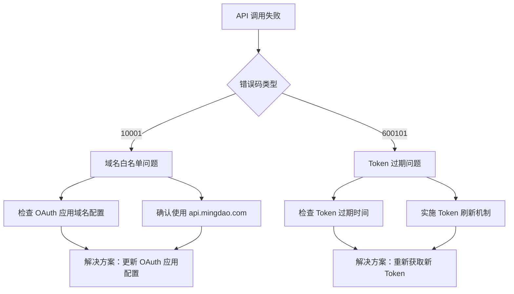
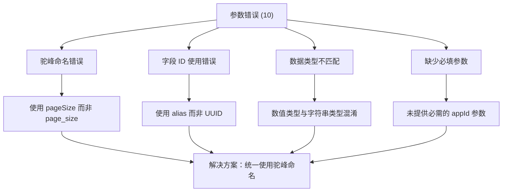
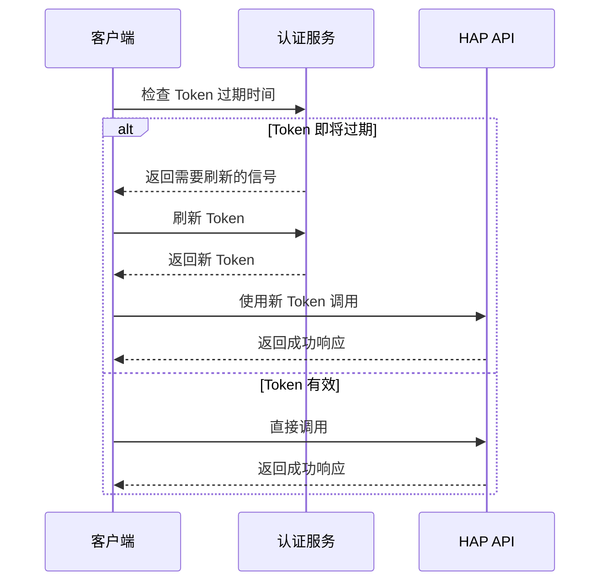
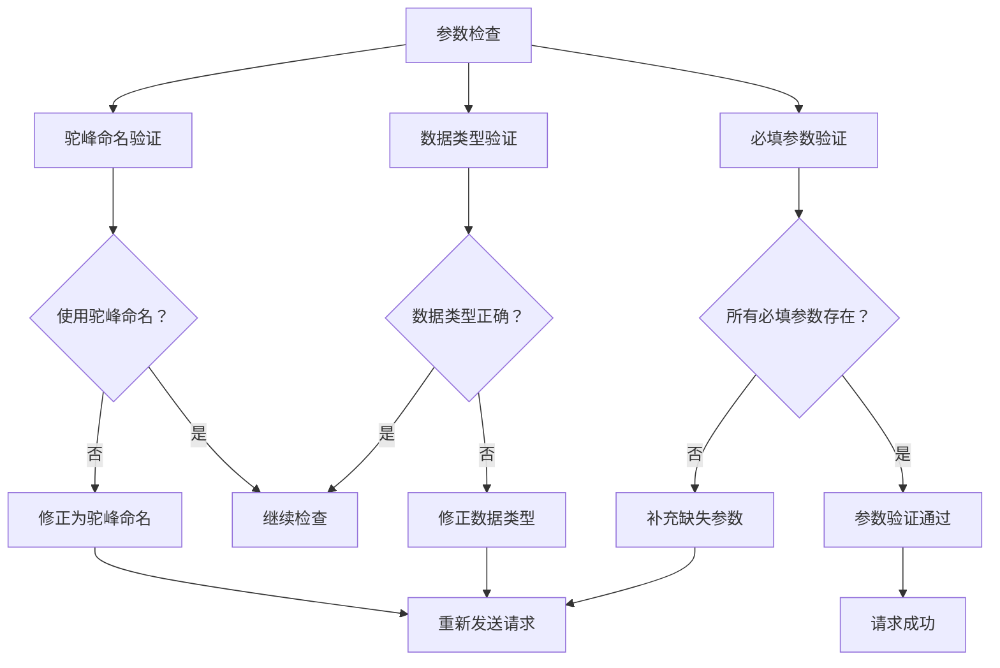
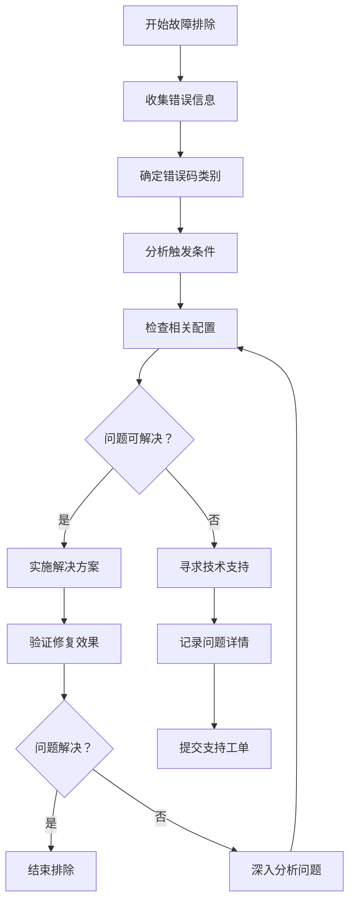

# 错误码速查手册

<cite>
**本文档引用的文件**
- [README.md](file://README.md)
- [SKILL.md](file://SKILL.md)
</cite>

## 目录
1. [简介](#简介)
2. [错误码分类](#错误码分类)
3. [完整错误码对照表](#完整错误码对照表)
4. [错误码详细解析](#错误码详细解析)
5. [常见错误场景分析](#常见错误场景分析)
6. [解决方案指南](#解决方案指南)
7. [配置建议](#配置建议)
8. [故障排除流程](#故障排除流程)
9. [最佳实践](#最佳实践)
10. [总结](#总结)

## 简介

本手册为明道云 HAP 应用提供详细的错误码速查指南，涵盖应用级授权（Appkey+Sign）和个人级授权（OAuth Bearer）两种模式下的所有常见错误码。通过系统化的分类、详细的含义解释、触发条件分析和解决方案指导，帮助开发者快速定位和解决集成过程中的各种问题。

明道云 HAP 应用支持两种主要的授权类型：
- **应用级授权（Appkey+Sign）**：适用于无人值守运行和后台任务
- **个人级授权（OAuth Bearer）**：适用于需要用户权限约束的场景

## 错误码分类

根据错误性质和影响范围，我们将错误码分为以下几类：

### 1. 成功状态码
- **1**：操作成功执行

### 2. 通用错误码
- **-1**：通用失败，需要查看详细错误信息

### 3. 权限相关错误码
- **4**：权限不足，当前身份无相应操作权限

### 4. 参数相关错误码
- **10**：参数错误，参数缺失或格式不正确

### 5. 授权相关错误码
- **10001**：HTTP Headers 验证失败
- **600101**：授权已失效（Token 过期）
- **600100**：Token 无效或缺失

### 6. 系统内部错误码
- **600100**：Token 无效或缺失

## 完整错误码对照表

| 错误码 | 类别 | 含义 | 触发条件 | 解决方案 |
|--------|------|------|----------|----------|
| 1 | 成功状态码 | 操作成功 | 正常执行完成 | 无需处理 |
| -1 | 通用错误码 | 通用失败 | 未指定的具体错误 | 查看 error_msg 获取详细信息 |
| 4 | 权限错误码 | 权限不足 | 当前身份无操作权限 | 检查授权类型和用户权限 |
| 10 | 参数错误码 | 参数错误 | 参数缺失或格式错误 | 检查参数名（驼峰命名）和值格式 |
| 10001 | 授权错误码 | HTTP Headers 验证失败 | OAuth Token 域名不在白名单 | 确认使用 api.mingdao.com |
| 600101 | 授权错误码 | 授权已失效 | Bearer Token 过期 | 刷新 Token |
| 600100 | 授权错误码 | Token 无效/缺失 | Token 为空或格式错误 | 检查 Authorization 头 |

## 错误码详细解析

### 成功状态码 - 1
**含义**：操作成功执行
- **触发条件**：所有正常的 API 调用
- **解决方案**：无需处理，继续后续操作
- **相关配置**：正常的工作表配置和权限设置

### 通用错误码 - -1
**含义**：通用失败，需要查看详细错误信息
- **触发条件**：未指定的具体错误情况
- **解决方案**：仔细查看返回的 error_msg 字段获取详细信息
- **排查要点**：检查网络连接、API 路径、认证信息等

### 权限错误码 - 4
**含义**：权限不足，当前身份无相应操作权限
- **触发条件**：
  - 应用级授权但无相应 API 开关权限
  - 个人级授权但用户无目标应用访问权限
  - 跨应用访问但无相应权限
- **解决方案**：
  - 检查 HAP 后台的 API 开关设置
  - 确认用户在目标应用中的角色权限
  - 验证跨应用访问的授权配置

### 参数错误码 - 10
**含义**：参数错误，参数缺失或格式不正确
- **触发条件**：
  - 缺少必需的请求参数
  - 参数格式不符合要求
  - 字段名称使用了错误的命名约定
- **解决方案**：
  - 检查参数名是否使用驼峰命名（如 pageSize 而非 page_size）
  - 验证参数值的数据类型和格式
  - 确认必填参数均已提供

### 授权错误码 - 10001
**含义**：HTTP Headers 验证失败
- **触发条件**：
  - OAuth Bearer Token 的域名不在白名单中
  - 请求头验证失败
  - 域名与 OAuth 应用配置不匹配
- **解决方案**：
  - 确保使用 api.mingdao.com 域名
  - 检查 OAuth 应用的域名白名单配置
  - 验证 MCP URL 中的域名一致性

### 授权错误码 - 600101
**含义**：授权已失效（Token 过期）
- **触发条件**：
  - OAuth Bearer Token 超过 1 天有效期
  - Token 在服务器端被标记为无效
  - 服务器主动撤销了 Token
- **解决方案**：
  - 实施 Token 刷新机制
  - 检查 Token 的过期时间戳
  - 重新执行 OAuth 授权流程

### 授权错误码 - 600100
**含义**：Token 无效或缺失
- **触发条件**：
  - Authorization 头部缺失或为空
  - Token 格式不正确
  - 请求头格式错误
- **解决方案**：
  - 检查 Authorization 头部的格式
  - 验证 Token 的完整性和格式
  - 确认请求头的正确拼写和格式

## 常见错误场景分析

### 场景一：10001 vs 600101 区分
这是最常见也是最容易混淆的两个错误码，需要特别注意：

**图表来源**
- [SKILL.md:390-398](file://SKILL.md#L390-L398)

### 场景二：参数错误的常见类型

**图表来源**
- [SKILL.md:252-298](file://SKILL.md#L252-L298)

## 解决方案指南

### 授权问题解决方案

#### OAuth Bearer Token 过期处理

**图表来源**
- [SKILL.md:211-228](file://SKILL.md#L211-L228)

#### 域名白名单问题处理
1. **检查 OAuth 应用配置**：确认 OAuth 应用的域名白名单包含 api.mingdao.com
2. **验证 MCP URL**：确保 MCP URL 使用正确的域名
3. **测试连接**：分别测试不同域名的连接情况

### 参数问题解决方案

#### 参数验证清单

**图表来源**
- [SKILL.md:252-298](file://SKILL.md#L252-L298)

## 配置建议

### 授权配置最佳实践

#### 应用级授权配置
- **Appkey 和 Sign 的安全存储**：使用环境变量而非硬编码
- **API 开关验证**：确保目标应用的 API 开关已启用
- **权限范围确认**：明确应用级授权的权限边界

#### 个人级授权配置
- **OAuth 应用创建**：在 HAP 后台正确创建 OAuth 应用
- **域名白名单设置**：确保 api.mingdao.com 在白名单中
- **Token 生命周期管理**：实施合理的 Token 刷新策略

### 网络和连接配置
- **API Host 选择**：根据部署环境选择正确的 API Host
- **超时设置**：合理设置请求超时时间
- **重试机制**：实现适当的重试策略

## 故障排除流程

### 系统化故障排除步骤

### 常见问题诊断表

| 问题类型 | 症状描述 | 可能原因 | 诊断步骤 | 解决方案 |
|----------|----------|----------|----------|----------|
| 授权失败 | 返回 10001 或 600101 | Token 配置问题 | 检查 OAuth 应用配置和 Token 状态 | 重新配置 OAuth 应用或刷新 Token |
| 参数错误 | 返回 10 | 参数格式问题 | 验证参数命名和数据类型 | 修正参数格式并重新发送请求 |
| 权限不足 | 返回 4 | 权限配置问题 | 检查用户角色和 API 开关 | 调整用户权限或启用相应 API 开关 |
| 系统错误 | 返回 -1 | 未知错误 | 查看 error_msg 详细信息 | 根据 error_msg 提供的信息进行针对性处理 |

## 最佳实践

### 开发阶段最佳实践
1. **错误码监控**：建立错误码监控和告警机制
2. **日志记录**：详细记录错误发生的时间、上下文和参数
3. **测试覆盖**：针对常见错误场景编写单元测试
4. **文档维护**：及时更新错误码处理文档

### 生产环境最佳实践
1. **优雅降级**：实现错误的优雅降级和回退机制
2. **用户反馈**：向用户提供友好的错误提示
3. **性能优化**：避免重复的错误请求造成性能问题
4. **安全考虑**：不要在错误信息中泄露敏感信息

### 团队协作最佳实践
1. **知识共享**：定期分享错误码处理经验和最佳实践
2. **培训计划**：对新成员进行错误码处理的培训
3. **工具支持**：开发辅助工具简化错误码处理
4. **持续改进**：根据实际使用情况不断优化错误处理策略

## 总结

本错误码速查手册涵盖了明道云 HAP 应用集成过程中可能遇到的所有常见错误码，提供了详细的分类、含义解释、触发条件分析和解决方案指导。通过系统化的错误码管理和处理策略，可以显著提高开发效率，减少集成过程中的问题和返工。

**关键要点回顾**：
- 正确区分 10001 和 600101 错误码的含义和处理方式
- 重视参数格式和命名规范的重要性
- 建立完善的 Token 管理和刷新机制
- 实施系统化的故障排除流程
- 遵循最佳实践和团队协作标准

通过遵循本手册的指导原则和解决方案，开发者可以更加高效地处理明道云 HAP 应用集成过程中的各种错误情况，确保系统的稳定性和可靠性。