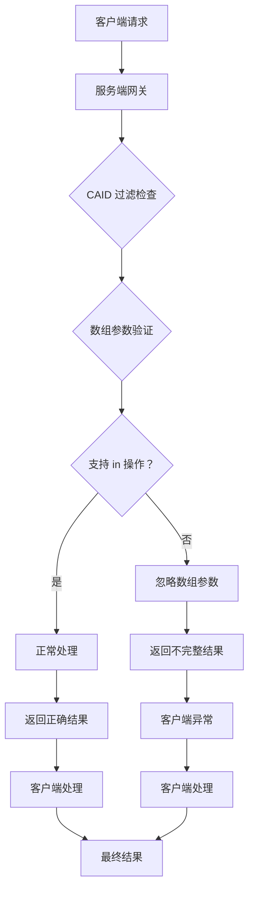
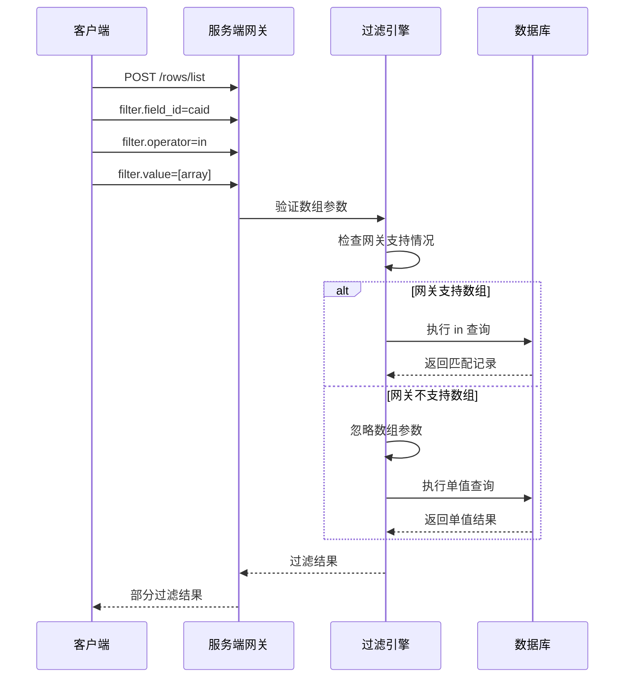
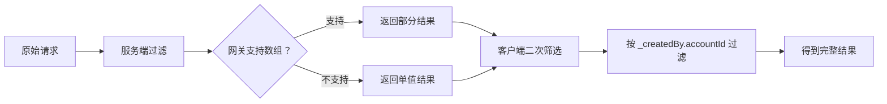
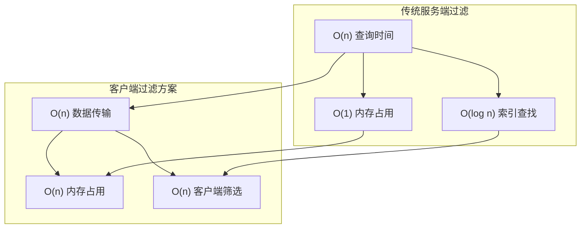

# CAID 过滤器陷阱

<cite>
**本文引用的文件**
- [README.md](file://README.md)
- [SKILL.md](file://SKILL.md)
</cite>

## 目录
1. [简介](#简介)
2. [问题背景](#问题背景)
3. [技术原理分析](#技术原理分析)
4. [客户端过滤解决方案](#客户端过滤解决方案)
5. [适用场景评估](#适用场景评估)
6. [性能考量](#性能考量)
7. [实施指南](#实施指南)
8. [故障排除](#故障排除)
9. [最佳实践建议](#最佳实践建议)
10. [总结](#总结)

## 简介

本文档针对明道云 HAP 应用开发中的 CAID 过滤器陷阱提供详细的预防指南。该问题涉及服务端 filter.field_id=caid 对数组的 in 操作支持有限，部分网关会直接忽略数组参数的技术缺陷。文档将提供完整的解决方案，包括客户端过滤策略、性能优化建议和实施最佳实践。

## 问题背景

在明道云 HAP 应用开发中，开发者经常需要根据创建者（_createdBy.accountId）来筛选数据记录。然而，服务端对于 CAID（创建者账户 ID）字段的过滤存在一个重要的技术限制：

- **服务端过滤限制**：当使用 `filter.field_id=caid` 时，对数组的 `in` 操作支持不完整
- **网关处理差异**：部分网关会直接忽略数组参数，导致过滤条件失效
- **影响范围**：这会影响批量筛选、多用户筛选等常见业务场景

## 技术原理分析

### 服务端过滤架构



**图表来源**
- [SKILL.md:329-334](file://SKILL.md#L329-L334)

### 过滤器执行流程



**图表来源**
- [SKILL.md:329-334](file://SKILL.md#L329-L334)

## 客户端过滤解决方案

### 核心解决策略

针对 CAID 过滤器陷阱，推荐采用"先拉取全量数据，再在客户端进行二次筛选"的策略：



**图表来源**
- [SKILL.md:333](file://SKILL.md#L333)

### 实施步骤

1. **获取全量数据**
   - 使用基础查询获取所有记录
   - 确保分页处理完整数据集

2. **客户端二次筛选**
   - 在内存中按 `_createdBy.accountId` 进行过滤
   - 支持多用户 ID 的批量筛选

3. **结果优化**
   - 只保留满足条件的记录
   - 维护原有的数据结构和字段

## 适用场景评估

### 推荐使用场景

| 场景特征 | 适用性 | 说明 |
|---------|--------|------|
| 小规模数据集 | ⭐⭐⭐⭐⭐ | 客户端内存足够，性能影响小 |
| 需要精确过滤 | ⭐⭐⭐⭐ | 避免服务端网关差异影响 |
| 多用户批量筛选 | ⭐⭐⭐⭐⭐ | 充分利用客户端过滤优势 |
| 实时性要求高 | ⭐⭐ | 需要考虑网络传输成本 |

### 不适用场景

- **超大规模数据集**：客户端内存压力过大
- **实时性极高**：网络传输延迟不可接受
- **内存受限环境**：移动设备或嵌入式系统

## 性能考量

### 时间复杂度分析



### 性能优化策略

1. **分批处理**
   ```javascript
   // 推荐：分批处理大数据集
   const batchSize = 1000;
   let allResults = [];
   
   for (let i = 0; i < totalRecords; i += batchSize) {
       const batch = await fetchBatch(i, batchSize);
       allResults = [...allResults, ...batch];
   }
   ```

2. **内存管理**
   - 及时释放不再使用的数据
   - 使用流式处理减少内存峰值
   - 考虑使用生成器模式

3. **缓存策略**
   - 缓存常用的用户 ID 列表
   - 避免重复的网络请求
   - 实现智能缓存失效机制

## 实施指南

### 基础实现模式

```javascript
// 基础客户端过滤实现
async function getClientFilteredData(userIdList) {
    // 1. 获取全量数据
    const allData = await fetchAllRecords();
    
    // 2. 客户端二次筛选
    const filteredData = allData.filter(record => 
        userIdList.includes(record._createdBy.accountId)
    );
    
    return filteredData;
}
```

### 高级优化实现

```javascript
// 高级实现：支持多种筛选条件
class ClientFilterEngine {
    constructor(data) {
        this.data = data;
        this.cache = new Map();
    }
    
    // 批量用户 ID 过滤
    filterByUserIds(userIdArray) {
        const cacheKey = userIdArray.sort().join(',');
        
        if (this.cache.has(cacheKey)) {
            return this.cache.get(cacheKey);
        }
        
        const result = this.data.filter(record =>
            userIdArray.includes(record._createdBy.accountId)
        );
        
        this.cache.set(cacheKey, result);
        return result;
    }
    
    // 复合条件过滤
    filterByMultipleConditions(filters) {
        let result = this.data;
        
        if (filters.userIds && filters.userIds.length > 0) {
            result = result.filter(record =>
                filters.userIds.includes(record._createdBy.accountId)
            );
        }
        
        // 其他过滤条件...
        return result;
    }
}
```

### 错误处理机制

```javascript
// 健壮的错误处理
async function robustClientFilter(userIdList, options = {}) {
    const { 
        maxRetries = 3, 
        timeout = 30000,
        batchSize = 1000 
    } = options;
    
    let attempts = 0;
    
    while (attempts < maxRetries) {
        try {
            // 获取数据
            const allData = await Promise.race([
                fetchAllRecords(),
                new Promise((_, reject) => 
                    setTimeout(() => reject(new Error('Timeout')), timeout)
                )
            ]);
            
            // 客户端过滤
            const filteredData = allData.filter(record =>
                userIdList.includes(record._createdBy.accountId)
            );
            
            return filteredData;
            
        } catch (error) {
            attempts++;
            if (attempts >= maxRetries) throw error;
            
            // 指数退避重试
            await new Promise(resolve => 
                setTimeout(resolve, Math.pow(2, attempts) * 1000)
            );
        }
    }
}
```

## 故障排除

### 常见问题诊断

| 问题现象 | 可能原因 | 解决方案 |
|---------|---------|---------|
| 过滤结果为空 | 网关完全忽略数组参数 | 使用客户端过滤 |
| 结果数量异常少 | 网关只处理第一个元素 | 手动扩展为多个单值查询 |
| 性能问题 | 大数据集客户端处理 | 实施分批处理和缓存 |
| 内存溢出 | 数据量超过内存限制 | 优化数据结构和清理机制 |

### 调试技巧

1. **日志记录**
   ```javascript
   console.log('原始数据量:', rawResults.length);
   console.log('过滤后数据量:', filteredResults.length);
   console.log('过滤率:', (filteredResults.length/rawResults.length)*100 + '%');
   ```

2. **性能监控**
   ```javascript
   const startTime = performance.now();
   const result = clientFilter(data, userIds);
   const endTime = performance.now();
   console.log('过滤耗时:', endTime - startTime, 'ms');
   ```

3. **边界情况测试**
   - 空数组输入
   - 重复用户 ID
   - 不存在的用户 ID
   - 极大数组

## 最佳实践建议

### 代码组织

```javascript
// 推荐的模块化设计
class HAPClientFilter {
    static async filterByCreator(worksheetId, userIds, options = {}) {
        const { 
            pageSize = 1000, 
            useCache = true,
            enableLogging = false 
        } = options;
        
        try {
            // 1. 获取全量数据
            const allData = await this.fetchAllRecords(
                worksheetId, 
                pageSize, 
                useCache
            );
            
            // 2. 客户端过滤
            const filteredData = this.clientSideFilter(
                allData, 
                userIds, 
                enableLogging
            );
            
            return filteredData;
            
        } catch (error) {
            throw new Error(`CAID 过滤失败: ${error.message}`);
        }
    }
    
    static async fetchAllRecords(worksheetId, pageSize, useCache) {
        // 实现分页获取逻辑
    }
    
    static clientSideFilter(data, userIds, enableLogging) {
        // 实现客户端过滤逻辑
    }
}
```

### 性能优化

1. **智能缓存**
   - 缓存最近使用的用户 ID 列表
   - 实现 LRU 缓存策略
   - 设置合理的缓存失效时间

2. **并发处理**
   ```javascript
   // 并发处理多个过滤请求
   const promises = userIdLists.map(list => 
       HAPClientFilter.filterByCreator(worksheetId, list)
   );
   
   const results = await Promise.all(promises);
   ```

3. **懒加载**
   - 按需加载数据
   - 实现虚拟滚动
   - 分层加载策略

## 总结

CAID 过滤器陷阱是明道云 HAP 应用开发中的一个重要技术限制。通过采用客户端过滤解决方案，开发者可以：

1. **规避服务端限制**：绕过网关对数组参数的支持差异
2. **保证过滤准确性**：确保多用户筛选的完整性
3. **提升用户体验**：提供更可靠的筛选功能

### 关键要点

- **及时性**：客户端过滤会增加网络传输开销，需要权衡
- **内存使用**：大数据集需要谨慎处理内存占用
- **错误处理**：完善的错误处理和重试机制至关重要
- **性能优化**：合理使用缓存和分批处理策略

### 实施建议

1. **评估数据规模**：根据实际数据量选择合适的实施方案
2. **监控性能指标**：持续监控过滤性能和资源使用情况
3. **渐进式迁移**：逐步将现有功能迁移到新的过滤模式
4. **文档记录**：详细记录实现细节和最佳实践

通过遵循本文档的指导原则和实施建议，开发者可以有效避免 CAID 过滤器陷阱，构建更加稳定可靠的明道云 HAP 应用。