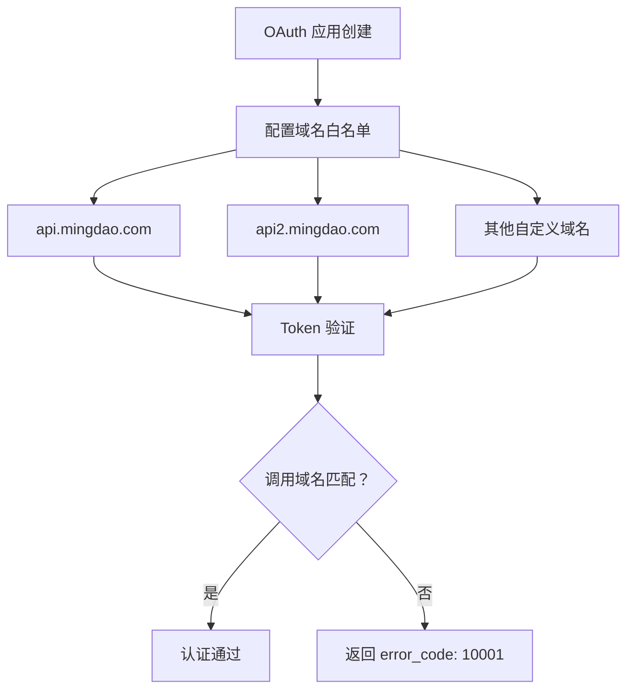
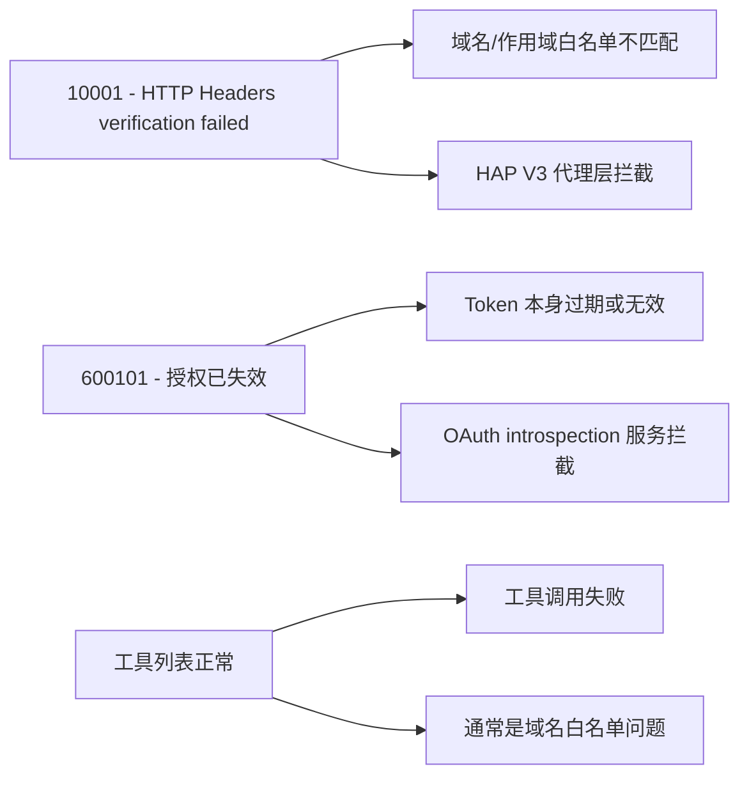
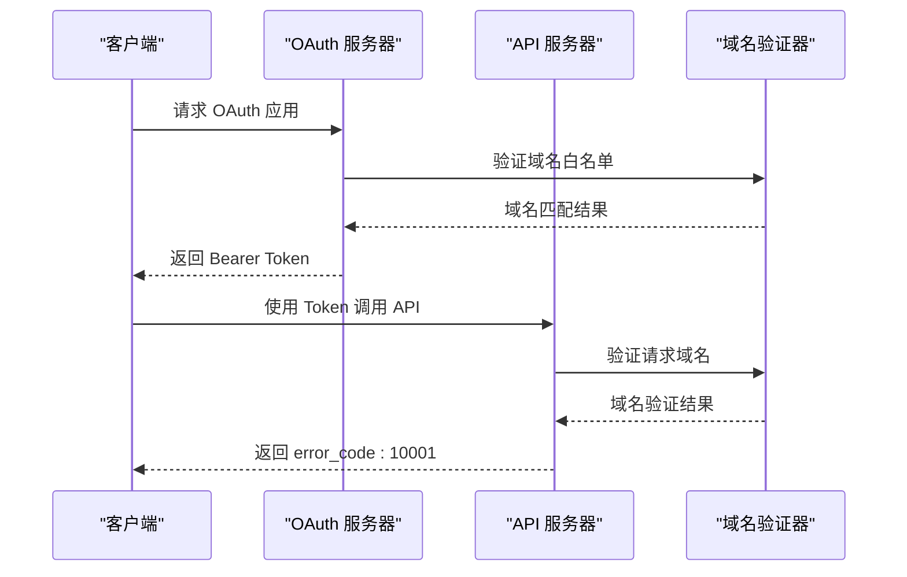
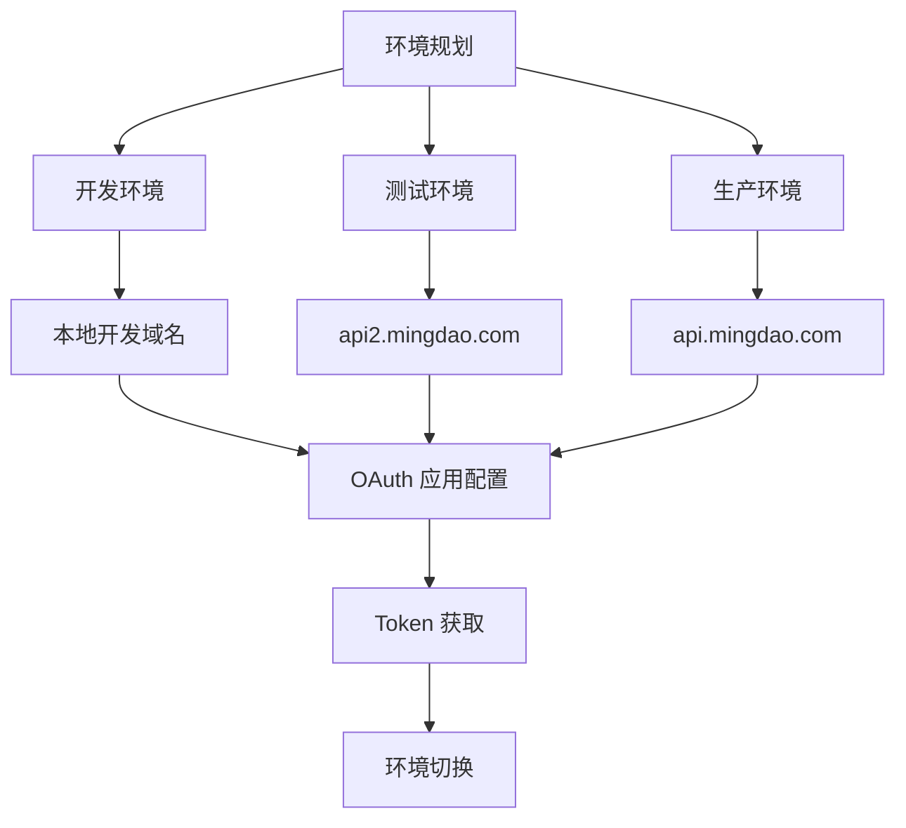
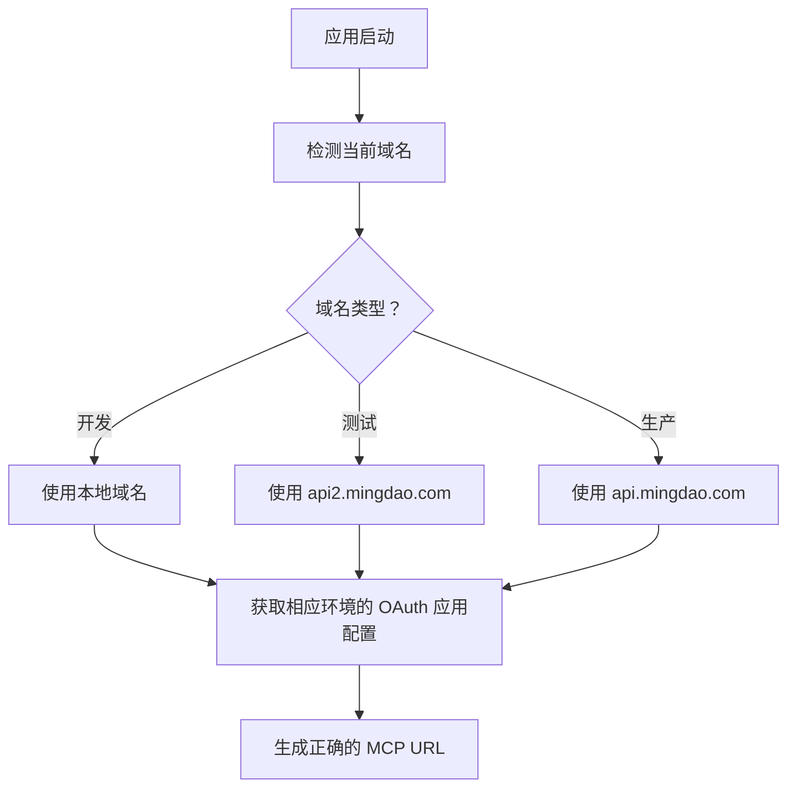
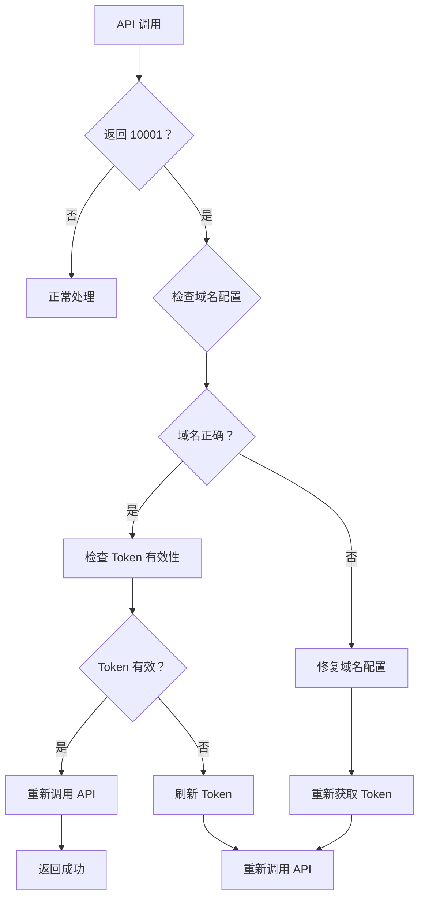
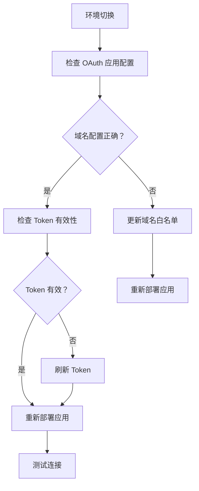
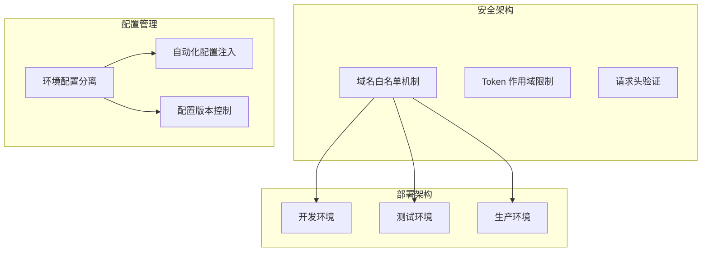

# OAuth 域名白名单陷阱

<cite>
**本文档引用的文件**
- [README.md](file://README.md)
- [SKILL.md](file://SKILL.md)
</cite>

## 目录
1. [简介](#简介)
2. [OAuth 域名白名单陷阱概述](#oauth-域名白名单陷阱概述)
3. [api.mingdao.com 与 api2.mingdao.com 的区别](#apimingdaocom-与-api2mingdaocom-的区别)
4. [error_code 10001 的具体表现](#error_code-10001-的具体表现)
5. [域名白名单陷阱的深层原理](#域名白名单陷阱的深层原理)
6. [预防措施与最佳实践](#预防措施与最佳实践)
7. [故障排除指南](#故障排除指南)
8. [架构层面的考虑](#架构层面的考虑)
9. [总结](#总结)

## 简介

明道云 HAP 应用开发中的 OAuth 域名白名单陷阱是一个常见但容易被忽视的重要安全机制。本文档旨在为开发者提供全面的预防指南，详细说明 OAuth App 的 Bearer Token 只对创建时配置的域名鉴权有效的限制，以及如何避免因域名不匹配而导致的认证失败问题。

## OAuth 域名白名单陷阱概述

OAuth 域名白名单陷阱是指在明道云 HAP 系统中，OAuth 应用创建时配置的域名与实际调用域名不一致导致的认证失败现象。这是一个重要的安全机制，旨在防止 OAuth Token 被滥用到非授权的域名上。

根据项目文档，这一陷阱的核心特征包括：

- OAuth App 的 Bearer Token 只对创建该 App 时配置的域名鉴权有效
- 默认情况下只对 `api.mingdao.com` 白名单有效
- 不同域名（如 `api2.mingdao.com`）会导致认证失败
- 失败时返回 `error_code: 10001 Http Headers verification failed`

**章节来源**
- [SKILL.md:335-343](file://SKILL.md#L335-L343)

## api.mingdao.com 与 api2.mingdao.com 的区别

### 域名白名单机制

明道云 HAP 系统为 OAuth 应用设置了严格的域名白名单机制：

**图表来源**
- [SKILL.md:337-342](file://SKILL.md#L337-L342)

### 默认域名策略

系统默认只对 `api.mingdao.com` 进行白名单验证，这意味着：

- **生产环境**：使用 `api.mingdao.com` 作为默认域名
- **测试环境**：可能需要单独配置 `api2.mingdao.com`
- **私有部署**：需要在 OAuth 应用中添加相应的自定义域名

### 域名变更的影响

当 OAuth 应用的域名配置发生变更时，所有现有的 Bearer Token 都会失效，需要重新获取新的 Token。

**章节来源**
- [SKILL.md:337-342](file://SKILL.md#L337-L342)

## error_code 10001 的具体表现

### 错误码含义

`error_code 10001` 在明道云 HAP 系统中表示"HTTP Headers 验证失败"，这通常意味着：

- OAuth Token 的域名不在白名单中
- 请求头验证过程中发现了不匹配的域名
- 安全机制阻止了跨域的 Token 使用

### 典型错误信息

系统返回的典型错误信息包括：
- `10001 Http Headers verification failed`
- `域名不在白名单中`
- `Token 域名验证失败`

### 与其他错误码的区别

**图表来源**
- [SKILL.md:390-398](file://SKILL.md#L390-L398)

### 错误码对比表

| 错误码 | 含义 | 典型原因 | 解决方案 |
|--------|------|---------|---------|
| `10001` | HTTP Headers 验证失败 | OAuth token 域名不在白名单 | 确认使用正确的域名 |
| `600101` | 授权已失效 | Token 过期或无效 | 刷新 Token |
| `600100` | token 无效/缺失 | Token 为空或格式错误 | 检查 Authorization 头 |

**章节来源**
- [SKILL.md:386-398](file://SKILL.md#L386-L398)

## 域名白名单陷阱的深层原理

### 安全机制设计

OAuth 域名白名单机制的设计目的是：

1. **防止 Token 泄露**：即使 Token 被截获，也无法在其他域名上使用
2. **多租户隔离**：确保不同环境之间的安全隔离
3. **攻击面控制**：限制潜在的安全威胁范围

### 技术实现原理

**图表来源**
- [SKILL.md:335-343](file://SKILL.md#L335-L343)

### 环境隔离机制

不同环境使用不同的域名来实现安全隔离：

- **生产环境**：`api.mingdao.com`
- **测试环境**：`api2.mingdao.com`
- **开发环境**：可能使用本地域名或专用域名

**章节来源**
- [SKILL.md:335-343](file://SKILL.md#L335-L343)

## 预防措施与最佳实践

### 基础预防措施

#### 1. 域名一致性检查

在开发和部署过程中，始终确保以下几点的一致性：

- **OAuth 应用配置**：域名白名单与实际部署域名一致
- **MCP URL 配置**：使用的域名与 OAuth 应用白名单一致
- **API 调用地址**：实际调用的域名与配置的域名一致

#### 2. 环境管理策略

**图表来源**
- [SKILL.md:337-342](file://SKILL.md#L337-L342)

#### 3. 配置管理最佳实践

- **配置分离**：不同环境使用不同的配置文件
- **环境变量**：通过环境变量控制域名配置
- **自动化部署**：在 CI/CD 流程中自动注入正确的域名

### 高级预防策略

#### 1. 动态域名检测

实现自动化的域名检测机制：

**图表来源**
- [SKILL.md:337-342](file://SKILL.md#L337-L342)

#### 2. 多环境支持

为不同环境提供专门的支持：

- **开发环境**：支持本地域名和测试域名
- **测试环境**：专门配置 `api2.mingdao.com`
- **生产环境**：严格限制为 `api.mingdao.com`

#### 3. 错误处理机制

实现智能的错误处理和重试机制：

**图表来源**
- [SKILL.md:335-343](file://SKILL.md#L335-L343)

**章节来源**
- [SKILL.md:335-343](file://SKILL.md#L335-L343)

## 故障排除指南

### 常见问题诊断

#### 1. 10001 错误的根本原因

当遇到 `error_code: 10001` 时，按照以下顺序进行排查：

1. **检查域名一致性**
   - 确认 OAuth 应用配置的域名
   - 确认实际调用的域名
   - 确认 MCP URL 中的域名

2. **验证 Token 有效性**
   - 检查 Token 是否过期
   - 验证 Token 格式是否正确
   - 确认 Token 是否被正确传递

3. **检查网络配置**
   - 确认 DNS 解析正确
   - 验证防火墙设置
   - 检查代理配置

#### 2. 环境切换问题

**图表来源**
- [SKILL.md:335-343](file://SKILL.md#L335-L343)

#### 3. 调试技巧

- **启用详细日志**：记录所有 API 调用的详细信息
- **使用调试工具**：利用浏览器开发者工具或 Postman 进行测试
- **模拟环境**：在本地环境中复现问题

### 解决方案实施

#### 1. 立即解决措施

1. **确认域名配置**
   - 登录 HAP 后台检查 OAuth 应用的域名白名单
   - 确保与实际部署域名完全一致

2. **重新获取 Token**
   - 删除旧的 Token
   - 使用正确的域名重新获取新 Token

3. **更新配置**
   - 修改应用配置文件中的域名
   - 更新环境变量设置

#### 2. 长期解决方案

1. **建立配置管理系统**
   - 实现自动化的配置管理
   - 建立配置变更的审批流程

2. **实施监控告警**
   - 监控 API 调用的成功率
   - 设置异常告警机制

3. **文档化最佳实践**
   - 编写详细的部署指南
   - 建立知识库和 FAQ

**章节来源**
- [SKILL.md:335-343](file://SKILL.md#L335-L343)

## 架构层面的考虑

### 系统设计原则

### 最佳实践建议

#### 1. 配置管理

- **环境分离**：不同环境使用独立的 OAuth 应用
- **配置模板**：使用模板化配置减少人为错误
- **变更审计**：记录所有配置变更的历史

#### 2. 安全加固

- **最小权限原则**：为每个环境配置最小必要的域名
- **定期审查**：定期审查和更新域名白名单
- **监控告警**：建立异常访问的监控机制

#### 3. 开发流程

- **预检清单**：建立部署前的域名检查清单
- **自动化测试**：在 CI/CD 中加入域名验证测试
- **回滚机制**：建立快速回滚的应急机制

**章节来源**
- [SKILL.md:335-343](file://SKILL.md#L335-L343)

## 总结

OAuth 域名白名单陷阱是明道云 HAP 应用开发中的一个重要安全机制，需要开发者给予足够的重视。通过理解其工作原理、实施预防措施、建立完善的故障排除流程，可以有效避免因域名不匹配导致的认证失败问题。

### 关键要点回顾

1. **域名一致性**：OAuth 应用的域名配置必须与实际使用域名完全一致
2. **环境隔离**：不同环境使用不同的域名，避免相互影响
3. **预防为主**：在开发阶段就建立完善的域名管理机制
4. **监控告警**：建立实时监控和异常告警机制
5. **文档化**：将最佳实践形成标准化的文档和流程

### 最终建议

- 在项目开始阶段就明确域名管理策略
- 建立自动化配置管理和部署流程
- 定期进行安全审计和配置审查
- 培训团队成员了解域名白名单的重要性
- 建立完善的应急预案和故障处理流程

通过遵循这些指导原则，可以确保明道云 HAP 应用的 OAuth 认证系统稳定可靠地运行，避免域名白名单陷阱带来的各种问题。