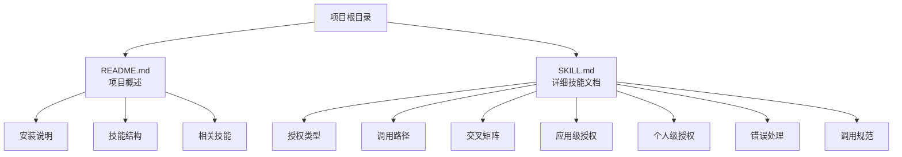
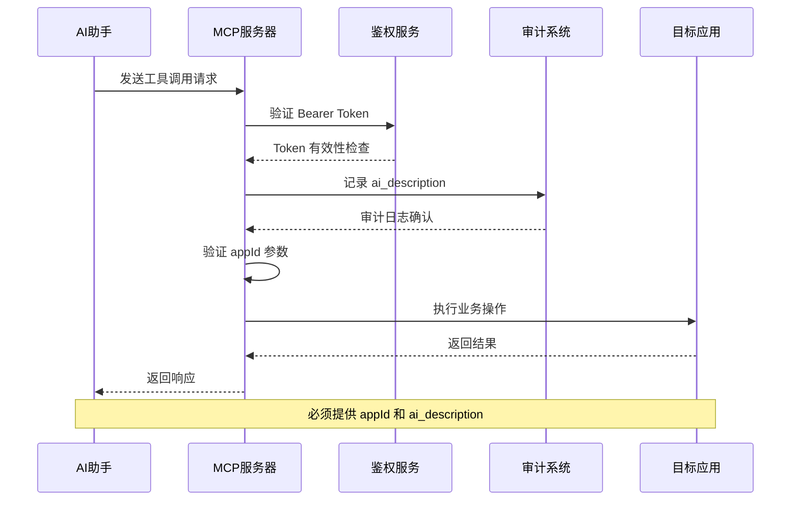
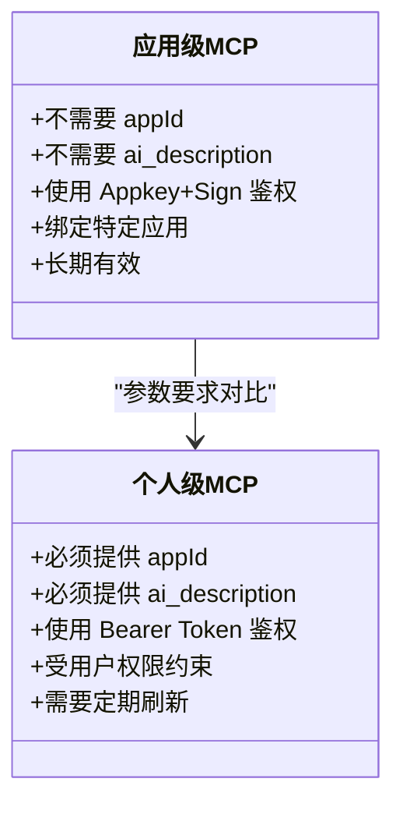
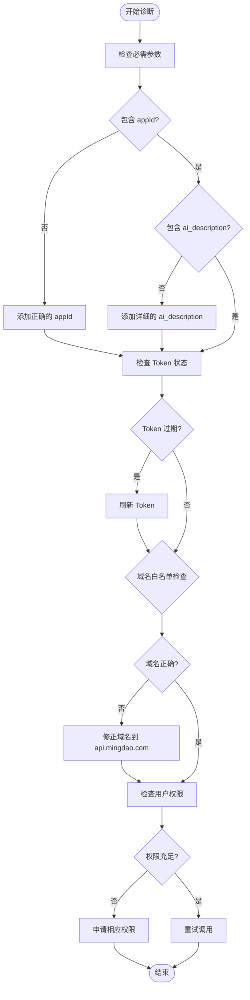
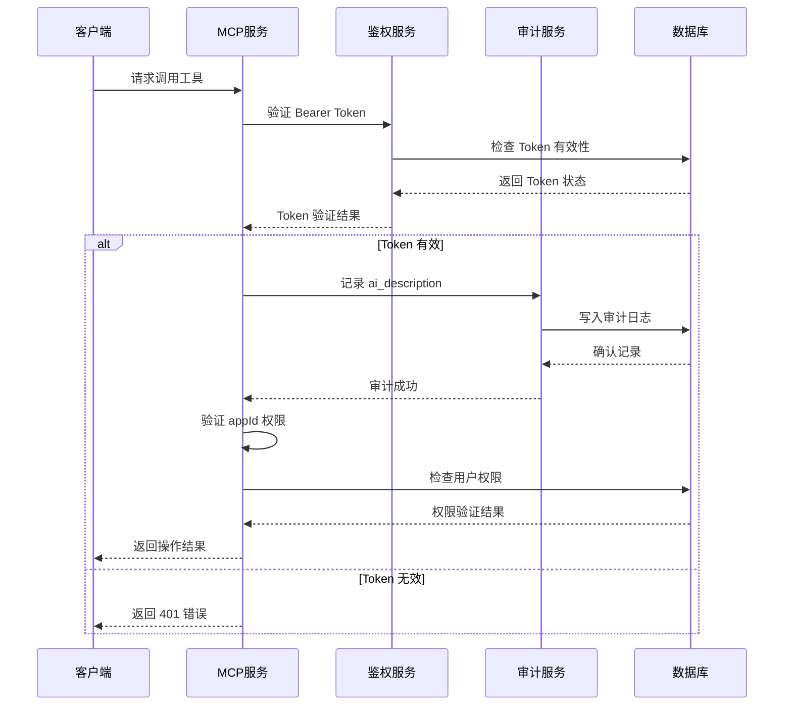
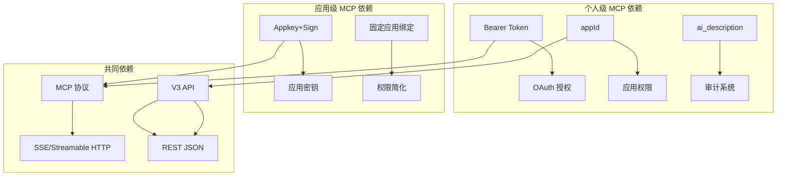

# 个人级 MCP 参数陷阱

<cite>
**本文档引用的文件**
- [README.md](file://README.md)
- [SKILL.md](file://SKILL.md)
</cite>

## 目录
1. [简介](#简介)
2. [项目结构](#项目结构)
3. [核心组件](#核心组件)
4. [架构概览](#架构概览)
5. [详细组件分析](#详细组件分析)
6. [依赖关系分析](#依赖关系分析)
7. [性能考虑](#性能考虑)
8. [故障排除指南](#故障排除指南)
9. [结论](#结论)

## 简介

本文档专注于明道云 HAP 应用开发中的个人级 MCP（Model Context Protocol）调用参数陷阱预防。重点说明应用级 MCP 调用不需要 `appId` 和 `ai_description`，但个人级 MCP 的每次调用必须提供的强制参数。同时解释 401 错误的常见原因和解决方案，以及这些参数在审计和鉴权中的作用。

## 项目结构

本仓库包含两个核心文件：

**图表来源**
- [README.md:1-53](file://README.md#L1-L53)
- [SKILL.md:1-436](file://SKILL.md#L1-L436)

**章节来源**
- [README.md:1-53](file://README.md#L1-L53)
- [SKILL.md:1-436](file://SKILL.md#L1-L436)

## 核心组件

### 授权类型对比

明道云 HAP 应用有两种授权类型，直接影响 MCP 调用的参数要求：

| 维度 | 应用级授权（Appkey+Sign） | 个人级授权（OAuth Bearer） |
|------|--------------------------|---------------------------|
| 身份 | 应用身份（不受人约束） | 个人身份（等同于登录用户） |
| 凭证 | Appkey + Sign（长期有效） | Bearer Token（约 1 天过期） |
| 权限范围 | 应用内 API 开关控制的全部数据 | 当前登录用户在应用中可见的数据 |
| 跨应用 | 只能访问所属应用 | 可跨应用访问用户有权限的所有应用 |

**章节来源**
- [SKILL.md:17-31](file://SKILL.md#L17-L31)

### 调用路径对比

两种调用路径对参数的要求不同：

| 维度 | MCP 协议（SSE/Streamable HTTP） | V3 REST API（HTTP JSON） |
|------|-------------------------------|-------------------------|
| 协议 | MCP（Model Context Protocol） | 标准 HTTPS + JSON |
| 端点 | `https://api.mingdao.com/mcp` | `https://api.mingdao.com/v3/open/...` |
| 鉴权注入 | URL query 参数或 SSE Header | HTTP 请求头 |
| 工具发现 | 自动暴露 40~70 个工具 | 需查 API 文档 |
| 调用方式 | AI 工具原生支持 | 代码中 `fetch`/`requests` 等 |
| 分页 | `pageSize` 上限 **90** | `pageSize` 上限 **1000** |
| 响应大小 | 单次约 **256KB** 缓冲上限 | 无此限制 |

**章节来源**
- [SKILL.md:39-53](file://SKILL.md#L39-L53)

## 架构概览

个人级 MCP 调用的完整架构流程：

**图表来源**
- [SKILL.md:193-210](file://SKILL.md#L193-L210)

## 详细组件分析

### 个人级 MCP 必填参数详解

#### appId 参数

**作用**：标识访问哪个应用，是个人级 MCP 调用的强制参数。

**重要性**：
- 缺少 `appId` 会导致 401 错误
- 用于确定用户在目标应用中的权限范围
- 影响审计日志的准确性

**获取方式**：
- 在 HAP 应用管理后台查看应用信息
- 通过 `get_app_info` 工具获取应用 ID

#### ai_description 参数

**作用**：HAP 服务端用于审计和鉴权校验的用途描述。

**重要性**：
- 缺少 `ai_description` 会导致 401 错误
- 用于记录 AI 助手的操作意图
- 便于后续审计和合规检查

**最佳实践**：
- 描述应该清晰、具体
- 包含操作目的和预期结果
- 避免使用模糊或通用的描述

#### worksheetId 参数

**作用**：指定具体的工作表 ID。

**注意事项**：
- 必须与 `appId` 对应的应用相匹配
- 用于确定具体的数据操作范围
- 影响权限验证的准确性

**章节来源**
- [SKILL.md:195-204](file://SKILL.md#L195-L204)

### 应用级 vs 个人级参数差异

**图表来源**
- [SKILL.md:193-210](file://SKILL.md#L193-L210)

**章节来源**
- [SKILL.md:193-210](file://SKILL.md#L193-L210)

### 401 错误的常见原因和解决方案

#### 常见原因

1. **缺少必需参数**
   - 未提供 `appId`
   - 未提供 `ai_description`

2. **Token 相关问题**
   - Token 过期（约 1 天）
   - Token 无效或格式错误
   - 域名不在白名单中

3. **权限不足**
   - 用户在目标应用中没有相应权限
   - Token 权限范围不匹配

#### 解决方案

**图表来源**
- [SKILL.md:211-228](file://SKILL.md#L211-L228)

**章节来源**
- [SKILL.md:211-228](file://SKILL.md#L211-L228)

### 审计和鉴权中的参数作用

#### 审计日志记录

个人级 MCP 调用会在审计系统中记录以下信息：

1. **ai_description**：操作用途描述
2. **用户身份**：执行操作的个人用户
3. **应用范围**：通过 `appId` 确定
4. **时间戳**：操作发生的时间
5. **IP 地址**：请求来源

#### 鉴权校验流程

**图表来源**
- [SKILL.md:193-207](file://SKILL.md#L193-L207)

**章节来源**
- [SKILL.md:193-207](file://SKILL.md#L193-L207)

## 依赖关系分析

### 技术栈依赖

**图表来源**
- [SKILL.md:17-31](file://SKILL.md#L17-L31)
- [SKILL.md:39-53](file://SKILL.md#L39-L53)

### 参数依赖关系

个人级 MCP 调用的参数之间存在以下依赖关系：

1. **Token 依赖**：必须有效的 Bearer Token
2. **参数依赖**：`appId` 和 `ai_description` 必须同时提供
3. **权限依赖**：用户必须在目标应用中有相应权限
4. **审计依赖**：`ai_description` 用于审计记录

**章节来源**
- [SKILL.md:193-210](file://SKILL.md#L193-L210)

## 性能考虑

### 参数验证开销

个人级 MCP 调用的参数验证包括：

1. **Token 验证**：网络延迟约 50-100ms
2. **权限检查**：数据库查询约 20-50ms
3. **审计记录**：异步写入约 10-30ms
4. **参数解析**：本地处理约 5-15ms

### 优化建议

1. **缓存 Token**：避免频繁验证相同 Token
2. **批量调用**：减少重复的参数验证
3. **参数预验证**：在发送前验证必需参数
4. **错误重试**：合理设置重试间隔和次数

## 故障排除指南

### 常见错误和解决方法

| 错误代码 | 错误类型 | 常见原因 | 解决方案 |
|----------|----------|----------|----------|
| 401 | 未授权 | 缺少必需参数 | 添加 `appId` 和 `ai_description` |
| 600101 | 授权已失效 | Token 过期 | 刷新 Token 或重新获取 |
| 10001 | HTTP 头验证失败 | 域名不在白名单 | 使用 `api.mingdao.com` |
| 600100 | token 无效 | Token 格式错误 | 检查 Authorization 头格式 |

### 调试步骤

1. **验证必需参数**
   - 确认 `appId` 存在且正确
   - 确认 `ai_description` 存在且描述清晰

2. **检查 Token 状态**
   - 验证 Token 是否过期
   - 检查 Token 格式是否正确

3. **确认域名配置**
   - 确保使用正确的 API 域名
   - 检查 OAuth 应用的域名白名单

4. **验证用户权限**
   - 确认用户在目标应用中有相应权限
   - 检查 Token 的权限范围

**章节来源**
- [SKILL.md:378-398](file://SKILL.md#L378-L398)

### 预防措施

1. **参数验证**
   - 在发送请求前验证所有必需参数
   - 使用参数模板确保完整性

2. **Token 管理**
   - 实现自动刷新机制
   - 设置合理的过期时间提醒

3. **错误处理**
   - 实现智能重试逻辑
   - 提供详细的错误信息

4. **审计监控**
   - 记录所有调用的 `ai_description`
   - 监控异常调用模式

**章节来源**
- [SKILL.md:211-228](file://SKILL.md#L211-L228)

## 结论

个人级 MCP 调用的参数陷阱主要集中在 `appId` 和 `ai_description` 两个必需参数上。理解这些参数的作用和正确使用方法，可以有效避免 401 错误和其他鉴权问题。

关键要点：

1. **参数要求**：个人级 MCP 每次调用必须提供 `appId` 和 `ai_description`
2. **审计作用**：`ai_description` 用于审计和合规记录
3. **权限控制**：`appId` 确定用户在目标应用中的权限范围
4. **错误预防**：通过完善的参数验证和错误处理机制预防常见问题

通过遵循本文档的指导和最佳实践，可以显著提高个人级 MCP 调用的成功率和可靠性。