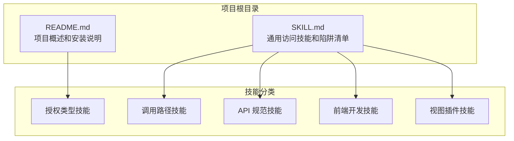
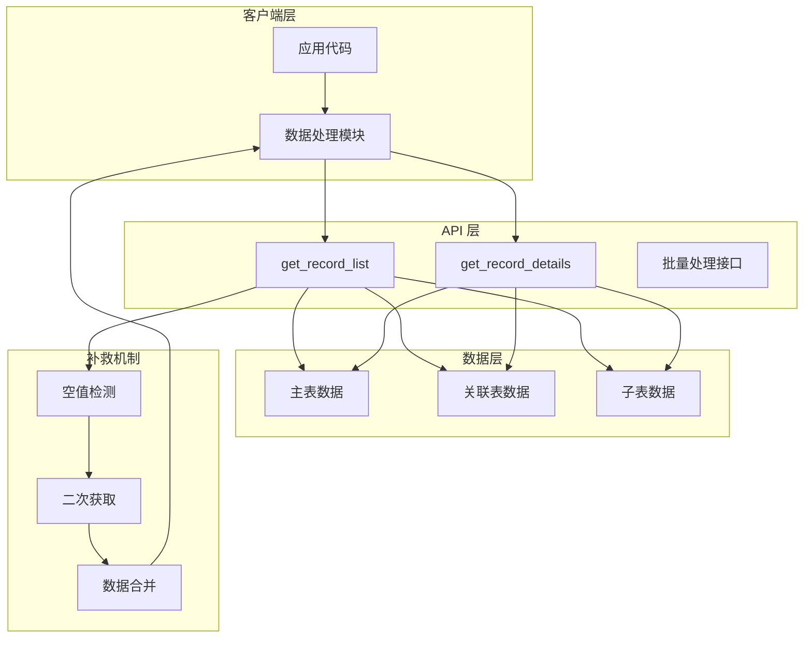
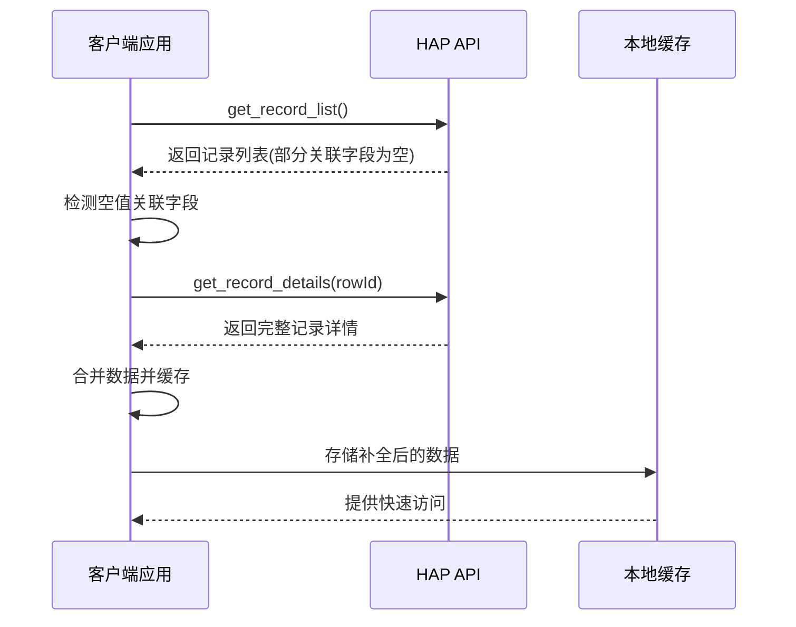
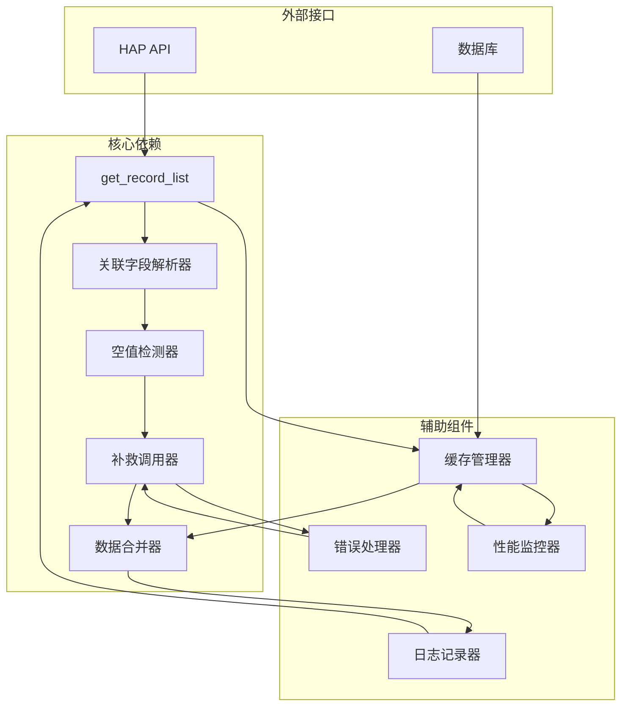

# 关联字段处理陷阱

<cite>
**本文档引用的文件**
- [README.md](file://README.md)
- [SKILL.md](file://SKILL.md)
</cite>

## 目录
1. [简介](#简介)
2. [项目结构](#项目结构)
3. [核心组件](#核心组件)
4. [架构概览](#架构概览)
5. [详细组件分析](#详细组件分析)
6. [依赖关系分析](#依赖关系分析)
7. [性能考虑](#性能考虑)
8. [故障排除指南](#故障排除指南)
9. [结论](#结论)

## 简介

本文档专门针对明道云 HAP 应用开发中的关联字段处理陷阱，重点解决 `get_record_list` 对部分 Relation 字段可能返回空字符串的问题，特别是在多层关联和子表关联场景中。文档提供了完整的补救措施，包括对空值关联字段额外调用 `get_record_details(rowId)` 进行补全的方法，并详细解释了触发条件和适用范围。

明道云 HAP（Harmony Application Platform）是一个企业级低代码平台，支持多种授权类型和调用路径。本文档基于通用访问技能的实践经验，为开发者提供可靠的技术指导和最佳实践建议。

## 项目结构

该项目采用简洁的文档结构，专注于提供明道云 HAP 应用的通用访问技能和最佳实践：



**图表来源**
- [README.md:1-53](file://README.md#L1-L53)
- [SKILL.md:422-431](file://SKILL.md#L422-L431)

**章节来源**
- [README.md:1-53](file://README.md#L1-L53)
- [SKILL.md:1-436](file://SKILL.md#L1-L436)

## 核心组件

### 关联字段处理系统

明道云 HAP 应用中的关联字段处理涉及以下核心组件：

#### 1. 关联字段类型
- **单层关联字段**：直接关联到另一个工作表的字段
- **多层关联字段**：通过中间表关联到目标工作表的字段
- **子表关联字段**：主表中的子记录集合字段

#### 2. 数据获取接口
- `get_record_list`：批量获取记录列表
- `get_record_details`：获取单条记录的详细信息
- `get_record_pivot_data`：获取透视表数据

#### 3. 陷阱识别机制
- 空字符串检测
- 关联字段完整性验证
- 多层关联深度识别

**章节来源**
- [SKILL.md:317-321](file://SKILL.md#L317-L321)

## 架构概览

明道云 HAP 应用的关联字段处理架构采用分层设计，确保数据获取的准确性和完整性：



**图表来源**
- [SKILL.md:317-321](file://SKILL.md#L317-L321)

## 详细组件分析

### 关联字段陷阱识别

#### 触发条件分析

关联字段在 `get_record_list` 中出现空字符串的主要触发条件包括：

1. **多层关联场景**
   - 关联链路超过单层深度
   - 通过中间表进行关联
   - 复杂的层级关系

2. **子表关联场景**
   - 主表包含子记录集合
   - 子表记录数量较多
   - 子表字段复杂度高

3. **性能优化影响**
   - 批量查询时的性能考虑
   - 关联数据的延迟加载
   - 内存使用限制

#### 适用范围界定

该陷阱主要适用于以下场景：

- **工作表规模较大**：记录数超过一定阈值
- **关联关系复杂**：存在多层嵌套关联
- **字段类型特殊**：包含大量关联字段的工作表
- **查询频率较高**：频繁使用 `get_record_list` 的场景

### 补救措施实施

#### 核心解决方案

针对关联字段空值问题，推荐采用以下补救措施：



**图表来源**
- [SKILL.md:317-321](file://SKILL.md#L317-L321)

#### 实施步骤详解

1. **空值检测阶段**
   ```mermaid
flowchart TD
Start([开始处理记录]) --> CheckFields["检查记录中的关联字段"]
CheckFields --> HasEmpty{"是否存在空值关联字段?"}
HasEmpty --> |否| NextRecord["处理下一条记录"]
HasEmpty --> |是| ExtractIds["提取相关 rowId"]
ExtractIds --> BatchCall["批量调用 get_record_details"]
BatchCall --> MergeData["合并补全数据"]
MergeData --> CacheData["缓存补全结果"]
CacheData --> NextRecord
NextRecord --> End([处理完成])
```

2. **数据补全阶段**
   - 识别空值关联字段的具体类型
   - 构建 `get_record_details` 的调用参数
   - 处理批量调用的并发控制
   - 实现数据合并和一致性保证

3. **性能优化策略**
   - 实现智能缓存机制
   - 优化批量调用的分批策略
   - 实现去重和增量更新
   - 设置合理的缓存过期时间

**章节来源**
- [SKILL.md:317-321](file://SKILL.md#L317-L321)

### 错误处理机制

#### 异常情况处理

针对关联字段处理可能出现的异常情况，建议采用以下处理策略：

1. **网络异常处理**
   - 实现重试机制
   - 设置超时控制
   - 处理部分成功的情况

2. **数据一致性保证**
   - 实现事务性更新
   - 处理并发冲突
   - 维护数据完整性

3. **监控和日志**
   - 记录异常发生的时间和上下文
   - 监控补救措施的成功率
   - 分析性能瓶颈

**章节来源**
- [SKILL.md:317-321](file://SKILL.md#L317-L321)

## 依赖关系分析

### 组件间依赖

关联字段处理系统涉及多个组件之间的复杂依赖关系：



**图表来源**
- [SKILL.md:317-321](file://SKILL.md#L317-L321)

### 耦合度分析

- **低耦合设计**：各组件职责明确，便于独立测试和维护
- **接口标准化**：统一的数据格式和调用协议
- **扩展性考虑**：支持新的关联字段类型的处理

**章节来源**
- [SKILL.md:317-321](file://SKILL.md#L317-L321)

## 性能考虑

### 性能优化策略

针对关联字段处理的性能优化，建议采用以下策略：

#### 1. 缓存策略
- **智能缓存**：根据数据变化频率设置不同的缓存策略
- **分层缓存**：内存缓存 + 持久化缓存的组合
- **预加载机制**：预测用户可能访问的关联数据

#### 2. 批量处理优化
- **分批处理**：避免一次性处理过多数据
- **并发控制**：合理控制并发调用的数量
- **去重处理**：避免重复获取相同的数据

#### 3. 内存管理
- **流式处理**：对于大数据集采用流式处理方式
- **垃圾回收**：及时释放不再使用的对象
- **内存监控**：监控内存使用情况

## 故障排除指南

### 常见问题诊断

#### 1. 关联字段始终为空
**症状**：所有关联字段在 `get_record_list` 中都返回空字符串
**可能原因**：
- API 版本不兼容
- 权限配置问题
- 字段映射错误

**解决方案**：
- 检查 API 版本和兼容性
- 验证用户权限和应用权限
- 确认字段 ID 和别名的正确性

#### 2. 部分关联字段为空
**症状**：只有特定类型的关联字段为空
**可能原因**：
- 多层关联的性能限制
- 子表关联的复杂性
- 字段类型的影响

**解决方案**：
- 实施针对性的补救措施
- 优化查询策略
- 调整缓存策略

#### 3. 性能问题
**症状**：补救措施导致性能下降
**可能原因**：
- 批量调用过多
- 缓存策略不当
- 并发控制问题

**解决方案**：
- 优化批量调用的分批策略
- 调整缓存的过期时间和容量
- 实现智能的并发控制

### 调试技巧

1. **日志记录**：详细记录每次调用的参数和返回值
2. **性能监控**：监控 API 调用的响应时间和成功率
3. **数据验证**：定期验证数据的完整性和准确性
4. **异常捕获**：实现完善的异常处理和恢复机制

**章节来源**
- [SKILL.md:317-321](file://SKILL.md#L317-L321)

## 结论

明道云 HAP 应用中的关联字段处理陷阱是一个需要特别关注的技术问题。通过深入理解触发条件、适用范围和补救措施，开发者可以有效避免这一常见陷阱，确保应用的稳定性和可靠性。

### 关键要点总结

1. **问题识别**：多层关联和子表关联场景下的关联字段空值问题是主要陷阱
2. **补救措施**：对空值关联字段额外调用 `get_record_details(rowId)` 是有效的解决方案
3. **性能平衡**：需要在数据完整性与性能之间找到平衡点
4. **监控机制**：建立完善的监控和日志机制是保障系统稳定性的关键

### 最佳实践建议

1. **预防为主**：在设计阶段就考虑到关联字段处理的复杂性
2. **渐进式优化**：从小范围开始实施补救措施，逐步推广到整个系统
3. **持续监控**：建立长期的监控机制，及时发现和解决问题
4. **文档完善**：保持技术文档的及时更新，分享经验和教训

通过遵循本文档提供的指导原则和最佳实践，开发者可以有效规避明道云 HAP 应用中的关联字段处理陷阱，构建更加稳定可靠的业务应用。