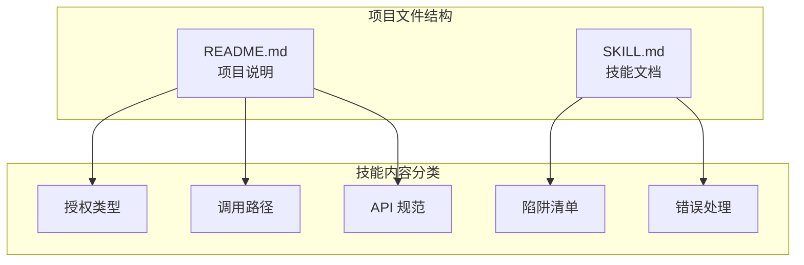
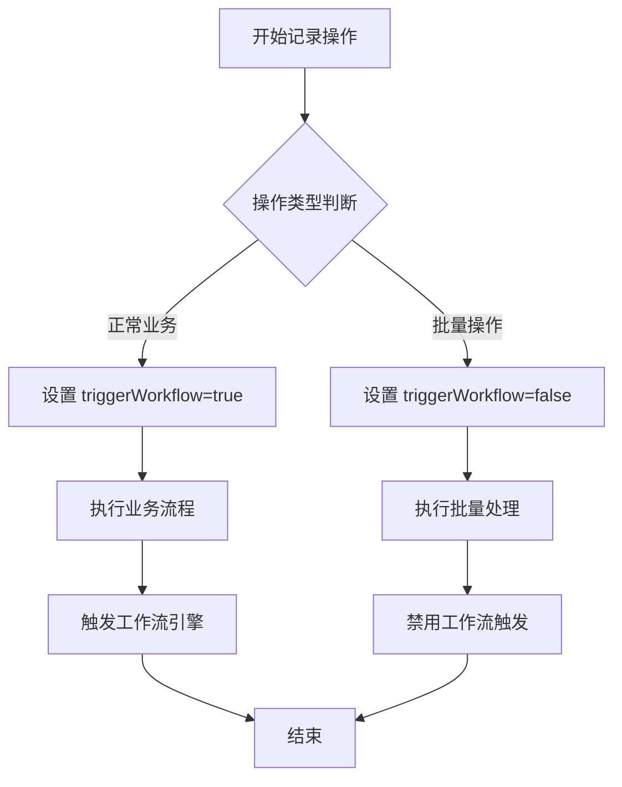
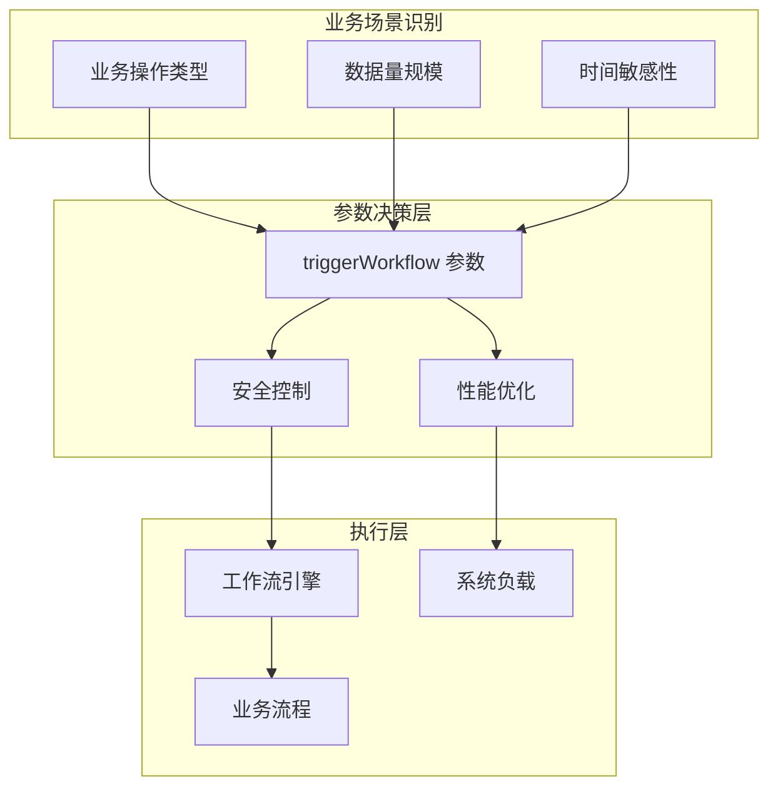
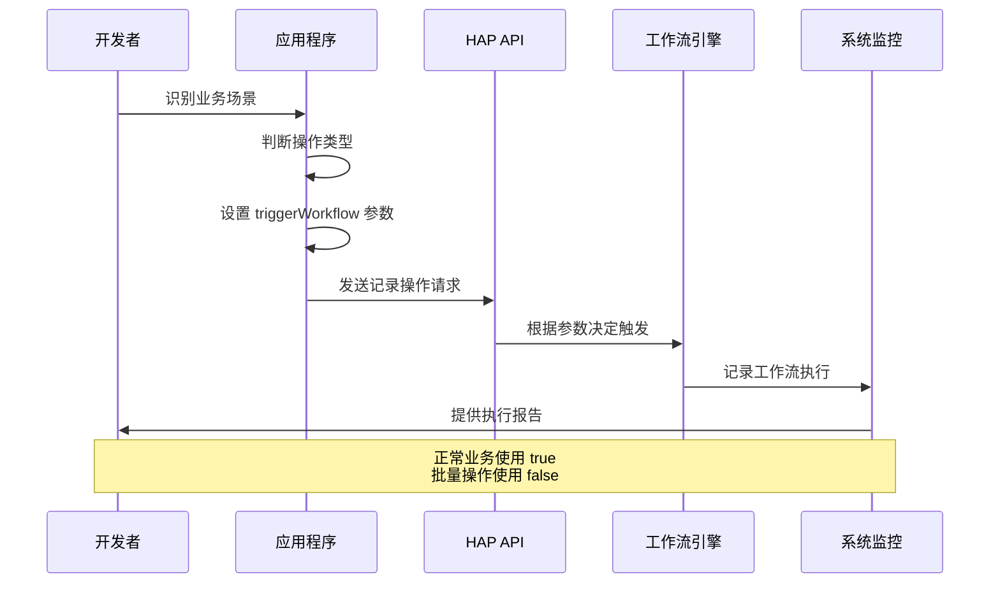
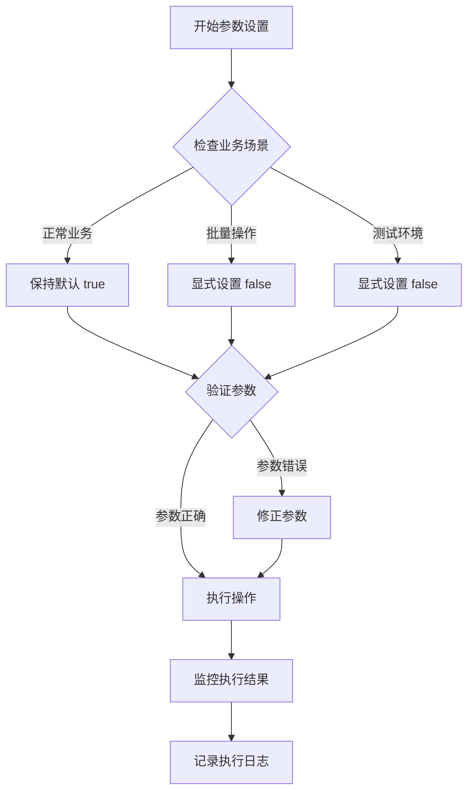
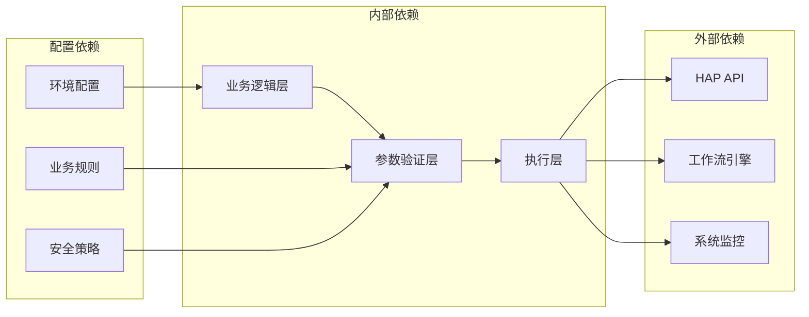
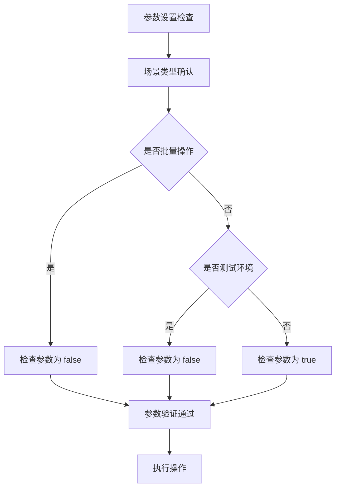

# 工作流触发参数陷阱

<cite>
**本文引用的文件**
- [README.md](file://README.md)
- [SKILL.md](file://SKILL.md)
</cite>

## 目录
1. [简介](#简介)
2. [项目结构](#项目结构)
3. [核心组件](#核心组件)
4. [架构概览](#架构概览)
5. [详细组件分析](#详细组件分析)
6. [依赖分析](#依赖分析)
7. [性能考虑](#性能考虑)
8. [故障排除指南](#故障排除指南)
9. [结论](#结论)

## 简介

本文档专注于明道云 HAP 应用开发中的工作流触发参数陷阱预防指南。重点解决 `triggerWorkflow` 参数在不同业务场景下的正确设置问题，特别是正常业务操作使用 `true`（默认值）与数据迁移/批量同步/测试使用 `false` 的区别。

## 项目结构

该项目是一个专门针对明道云 HAP 应用访问的技能包，主要包含两个核心文件：

**图表来源**
- [README.md:1-53](file://README.md#L1-L53)
- [SKILL.md:1-436](file://SKILL.md#L1-L436)

**章节来源**
- [README.md:1-53](file://README.md#L1-L53)
- [SKILL.md:1-436](file://SKILL.md#L1-L436)

## 核心组件

### 工作流触发参数体系

根据技能文档，工作流触发参数 `triggerWorkflow` 是一个关键的安全控制参数：

| 场景 | 值 | 默认行为 | 适用场景 |
|------|---|----------|----------|
| 正常业务操作 | `true` | 默认值 | 日常业务流程、用户操作 |
| 数据迁移/批量同步/测试 | `false` | 需显式设置 | 系统维护、数据导入导出 |

### 参数验证机制

**图表来源**
- [SKILL.md:363-371](file://SKILL.md#L363-L371)

**章节来源**
- [SKILL.md:363-371](file://SKILL.md#L363-L371)

## 架构概览

### 工作流触发参数决策架构

**图表来源**
- [SKILL.md:363-371](file://SKILL.md#L363-L371)

### 参数设置最佳实践流程

**图表来源**
- [SKILL.md:363-371](file://SKILL.md#L363-L371)

## 详细组件分析

### 场景化最佳实践

#### 正常业务操作场景

**适用条件：**
- 用户实时操作
- 需要工作流自动处理
- 业务流程完整性要求高

**参数设置：**
- `triggerWorkflow = true`（默认值）
- 不需要额外配置

**预期效果：**
- 工作流完整执行
- 业务规则自动验证
- 审计日志完整记录

#### 数据迁移场景

**适用条件：**
- 大批量数据处理
- 系统维护期间
- 数据导入导出

**参数设置：**
- `triggerWorkflow = false`
- 显式配置参数

**预期效果：**
- 避免重复触发工作流
- 提升处理效率
- 减少系统负载

#### 批量同步场景

**适用条件：**
- 定时同步任务
- 跨系统数据同步
- 历史数据补录

**参数设置：**
- `triggerWorkflow = false`
- 批量操作优化

**预期效果：**
- 批量处理性能优化
- 工作流触发控制
- 系统稳定性保障

#### 测试场景

**适用条件：**
- 开发环境测试
- 集成测试验证
- 性能测试评估

**参数设置：**
- `triggerWorkflow = false`
- 测试环境隔离

**预期效果：**
- 测试数据隔离
- 性能指标准确
- 影响最小化

### 参数陷阱识别与预防

**图表来源**
- [SKILL.md:363-371](file://SKILL.md#L363-L371)

## 依赖分析

### 参数设置依赖关系

**图表来源**
- [SKILL.md:363-371](file://SKILL.md#L363-L371)

### 参数影响范围分析

| 影响维度 | 正常场景(true) | 批量场景(false) |
|----------|----------------|-----------------|
| 工作流执行 | 完整触发 | 禁止触发 |
| 系统负载 | 较高 | 较低 |
| 处理速度 | 正常 | 快速 |
| 审计记录 | 完整 | 简化 |
| 业务一致性 | 强制保证 | 需人工保证 |

**章节来源**
- [SKILL.md:363-371](file://SKILL.md#L363-L371)

## 性能考虑

### 参数对系统性能的影响

1. **工作流触发成本**
   - 正常场景：每次操作触发工作流，增加系统开销
   - 批量场景：禁用工作流触发，显著提升处理速度

2. **内存使用优化**
   - 批量操作时减少工作流相关内存占用
   - 正常业务场景需要保留完整的内存结构

3. **并发处理能力**
   - 批量场景可以更好地利用系统并发能力
   - 正常业务场景需要考虑工作流并发限制

## 故障排除指南

### 常见参数陷阱及解决方案

#### 陷阱1：批量操作仍触发工作流
**症状：** 系统负载过高，处理速度慢
**原因：** 未正确设置 `triggerWorkflow = false`
**解决方案：** 显式设置参数为 `false`

#### 陷阱2：正常业务误禁用工作流
**症状：** 业务流程异常，工作流规则未执行
**原因：** 错误地设置了 `triggerWorkflow = false`
**解决方案：** 恢复为 `true` 或默认值

#### 陷阱3：测试环境产生真实业务影响
**症状：** 测试数据影响生产环境
**原因：** 测试场景未禁用工作流触发
**解决方案：** 在测试环境中明确设置 `triggerWorkflow = false`

### 参数验证清单

**图表来源**
- [SKILL.md:363-371](file://SKILL.md#L363-L371)

**章节来源**
- [SKILL.md:363-371](file://SKILL.md#L363-L371)

## 结论

工作流触发参数 `triggerWorkflow` 是明道云 HAP 应用开发中的关键安全控制点。正确理解和使用该参数对于：

1. **业务连续性保障** - 正常业务场景确保工作流完整执行
2. **系统性能优化** - 批量场景避免不必要的工作流开销  
3. **开发效率提升** - 测试场景隔离真实业务影响
4. **系统稳定性维护** - 防止意外的工作流触发

通过建立清晰的场景识别机制和参数设置流程，可以有效预防工作流触发参数相关的陷阱，确保 HAP 应用的稳定可靠运行。