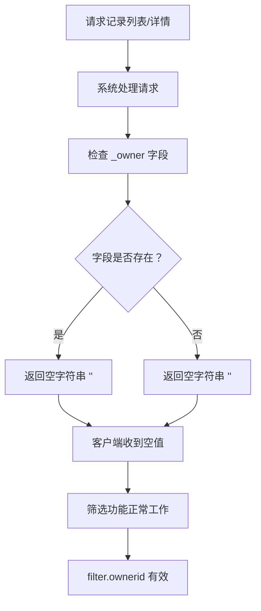
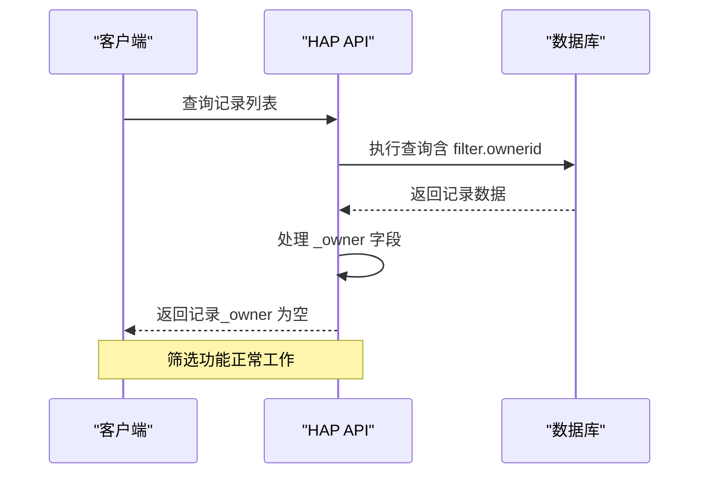
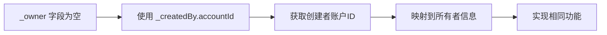
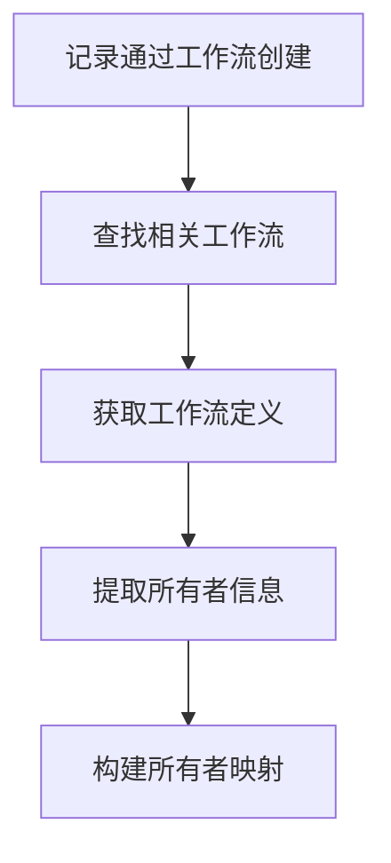
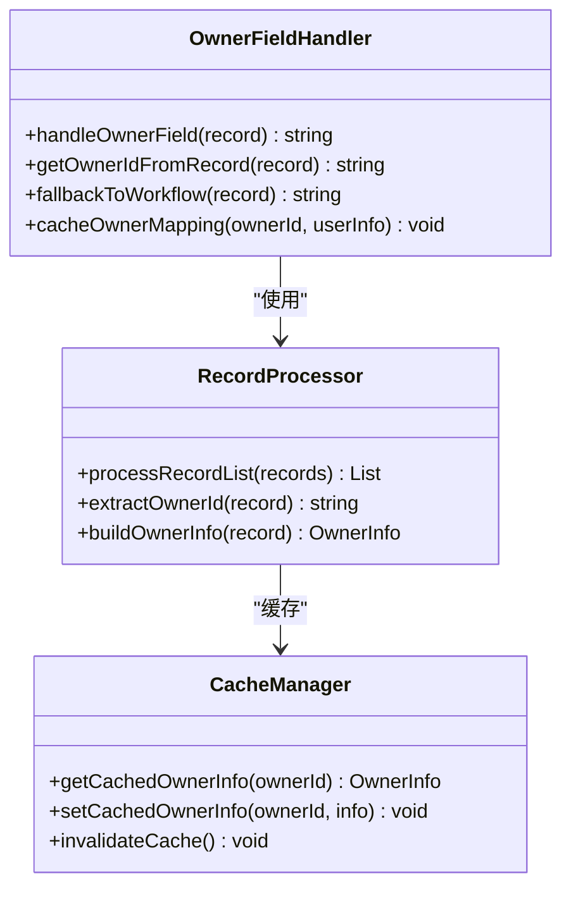
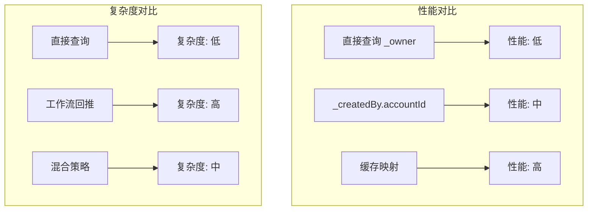
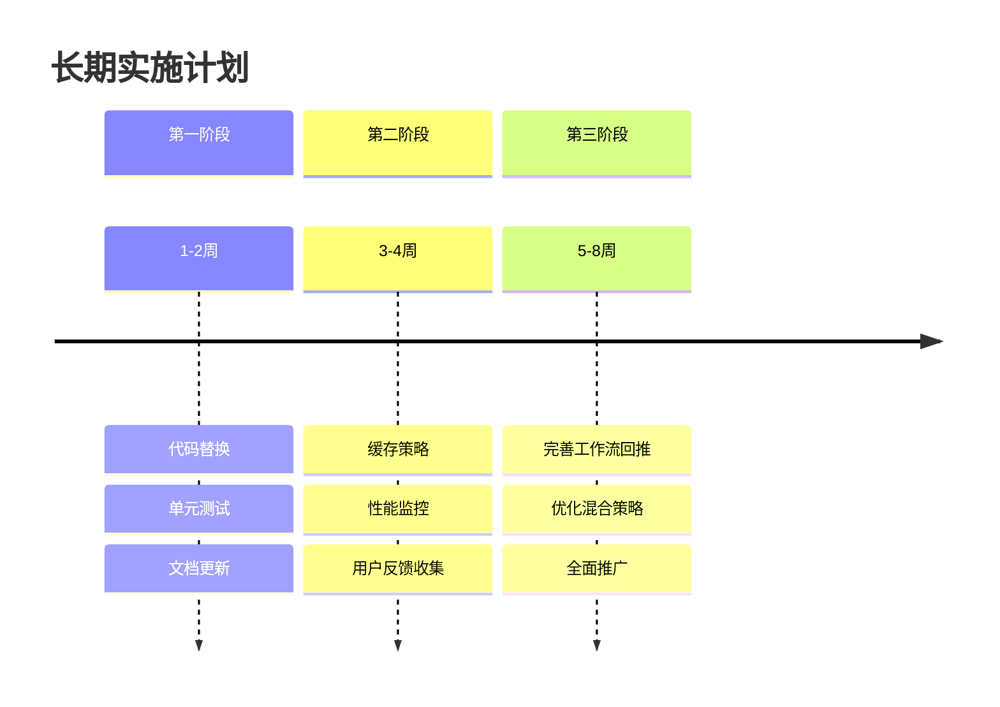
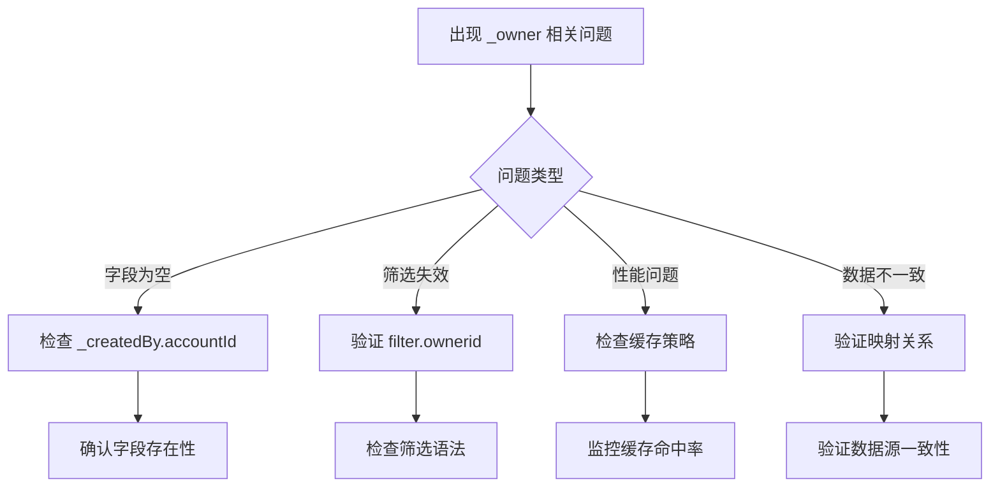
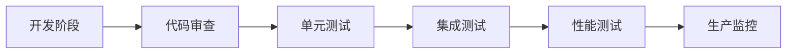

# 所有者字段处理陷阱

<cite>
**本文档引用的文件**
- [README.md](file://README.md)
- [SKILL.md](file://SKILL.md)
</cite>

## 目录
1. [简介](#简介)
2. [问题概述](#问题概述)
3. [陷阱现象分析](#陷阱现象分析)
4. [根本原因解释](#根本原因解释)
5. [解决方案详解](#解决方案详解)
6. [最佳实践建议](#最佳实践建议)
7. [替代方案对比](#替代方案对比)
8. [实施策略](#实施策略)
9. [故障排除指南](#故障排除指南)
10. [总结](#总结)

## 简介

明道云 HAP 应用开发中的 _owner 字段处理陷阱是一个常见但容易被忽视的技术问题。这个问题涉及记录列表和详情中 _owner 字段的特殊行为，以及相应的筛选机制。本文档旨在为开发者提供全面的预防指南，帮助避免在实际开发过程中遇到此类陷阱。

## 问题概述

在明道云 HAP 应用开发中，_owner 字段存在一个特殊的处理行为：

- **响应为空**：在记录列表和详情接口中，_owner 字段永远返回空字符串 ""
- **筛选仍有效**：尽管字段值为空，但 filter.ownerid 筛选功能仍然正常工作
- **信息缺失**：开发者无法直接从 _owner 字段获取所有者信息

## 陷阱现象分析

### 现象描述

**图表来源**
- [SKILL.md:323-327](file://SKILL.md#L323-L327)

### 影响范围

这种陷阱影响以下场景：

1. **记录列表查询**：所有者信息无法直接获取
2. **记录详情查看**：所有者字段为空
3. **前端展示**：UI 层无法显示所有者信息
4. **数据统计**：无法基于所有者进行统计分析

## 根本原因解释

### 设计考量

虽然具体的实现细节未在代码库中详细说明，但从技术角度分析，这种设计可能出于以下考虑：

1. **性能优化**：避免在列表查询中加载所有者详细信息
2. **权限控制**：通过筛选机制而非字段值来控制访问
3. **数据一致性**：确保筛选功能的可靠性

### 技术架构影响

**图表来源**
- [SKILL.md:323-327](file://SKILL.md#L323-L327)

## 解决方案详解

### 方案一：使用 _createdBy.accountId

这是最直接的替代方案：

**图表来源**
- [SKILL.md:327](file://SKILL.md#L327)

### 方案二：工作流回推

对于通过工作流创建的记录，可以通过工作流信息回推所有者：

### 方案三：混合策略

结合多种方法以获得最佳效果：

1. **优先使用 _createdBy.accountId**
2. **回退到工作流信息**
3. **缓存映射关系**

## 最佳实践建议

### 开发阶段预防

1. **文档化约定**：在团队内部明确 _owner 字段的处理约定
2. **代码审查**：重点关注涉及 _owner 字段的代码
3. **单元测试**：编写针对此陷阱的测试用例

### 实施注意事项

**图表来源**
- [SKILL.md:323-327](file://SKILL.md#L323-L327)

## 替代方案对比

### 方案对比表

| 方案 | 优点 | 缺点 | 适用场景 |
|------|------|------|----------|
| _createdBy.accountId | 实现简单、性能好 | 需要额外映射 | 大多数场景 |
| 工作流回推 | 信息完整 | 复杂度高 | 工作流驱动的记录 |
| 缓存策略 | 性能最优 | 内存占用 | 高频访问场景 |

### 性能考量

## 实施策略

### 短期解决方案

1. **立即替换**：将所有 _owner 字段引用替换为 _createdBy.accountId
2. **快速修复**：为现有代码添加兼容层
3. **文档更新**：更新技术文档和 API 文档

### 长期规划

### 团队协作

1. **培训计划**：组织相关技术培训
2. **代码规范**：制定新的编码规范
3. **质量保证**：建立质量检查机制

## 故障排除指南

### 常见问题诊断

### 调试步骤

1. **日志分析**：检查 API 调用日志
2. **数据验证**：验证 _createdBy.accountId 的可用性
3. **性能监控**：监控缓存和查询性能
4. **回归测试**：确保修复不影响其他功能

### 预防措施

## 总结

_ower 字段处理陷阱是明道云 HAP 应用开发中的一个重要技术要点。通过理解其设计原理、掌握替代方案和实施最佳实践，开发者可以有效避免这一陷阱带来的问题。

### 关键要点

1. **认知重要性**：充分认识到 _owner 字段的特殊行为
2. **方案选择**：根据场景选择合适的替代方案
3. **实施策略**：制定分阶段的实施计划
4. **持续改进**：建立监控和优化机制

### 成功要素

- 团队对问题的统一认知
- 完善的实施计划和时间表
- 全面的质量保证措施
- 持续的监控和优化

通过遵循本文档提供的指导原则和最佳实践，开发团队可以有效预防和解决 _owner 字段处理陷阱，提高应用的稳定性和用户体验。