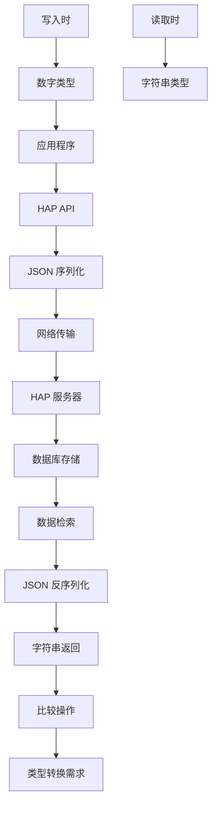

# 数值字段处理陷阱

<cite>
**本文引用的文件**
- [README.md](file://README.md)
- [SKILL.md](file://SKILL.md)
</cite>

## 目录
1. [简介](#简介)
2. [问题概述](#问题概述)
3. [影响范围](#影响范围)
4. [技术原理](#技术原理)
5. [解决方案](#解决方案)
6. [最佳实践](#最佳实践)
7. [类型转换策略](#类型转换策略)
8. [比较操作注意事项](#比较操作注意事项)
9. [性能考虑](#性能考虑)
10. [故障排除指南](#故障排除指南)
11. [总结](#总结)

## 简介

明道云 HAP 应用在数值字段的读写过程中存在一个重要的类型不一致陷阱：写入时传入数字类型，但读取时返回字符串类型。这种设计虽然有其技术原因，但在实际开发中容易导致各种数据处理问题。本文档旨在帮助开发者理解和预防这一陷阱，提供完整的解决方案和最佳实践指导。

## 问题概述

### 核心问题现象

在 HAP 应用中，数值字段存在以下特殊行为：

- **写入时**：可以传入数字类型（如 `1000000.50`）
- **读取时**：返回字符串类型（如 `"1000000.50"`）

这种类型转换在大多数情况下是透明的，但在进行比较操作、数学运算或数据验证时就会出现问题。

### 影响程度

这个问题属于中等严重程度，主要影响：
- 数据比较和条件判断
- 数学运算和计算逻辑
- 数据验证和格式检查
- 前后端数据一致性处理

## 影响范围

### 受影响的数值类型

根据文档描述，受影响的数值类型包括：
- 整数类型（如 `1000000`）
- 浮点数类型（如 `1000000.50`）
- 货币金额（如 `1000000.50`）

### 受影响的操作场景

- 数值比较操作（等于、大于、小于等）
- 数学运算（加减乘除、求和、平均值等）
- 数据验证和格式检查
- 条件筛选和过滤
- 数据导出和格式化

## 技术原理

### 设计原因分析

虽然文档没有详细说明具体的技术原因，但从系统架构角度分析，这种设计可能出于以下考虑：

1. **JSON 序列化兼容性**：JSON 标准中数字类型在传输过程中可能被转换为字符串以确保精度
2. **数据库存储一致性**：统一使用字符串格式便于数据库存储和检索
3. **跨语言兼容性**：避免不同编程语言对数字类型的差异导致的问题
4. **精度保护**：防止浮点数精度丢失问题

### 数据流转过程



**图表来源**
- [SKILL.md:350-356](file://SKILL.md#L350-L356)

## 解决方案

### 立即修复方案

#### 方案一：统一类型转换

在所有涉及数值字段的比较操作中，确保进行显式的类型转换：

```javascript
// ❌ 错误做法
if (record.value === 1000000.50) {
    // 处理逻辑
}

// ✅ 正确做法
if (parseFloat(record.value) === 1000000.50) {
    // 处理逻辑
}

// 或者
if (Number(record.value) === 1000000.50) {
    // 处理逻辑
}
```

#### 方案二：字符串比较

对于精确匹配的场景，可以考虑使用字符串比较：

```javascript
// ✅ 字符串比较
if (record.value === "1000000.50") {
    // 处理逻辑
}
```

### 长期架构改进

#### 建立类型转换中间层

```javascript
class NumericFieldConverter {
    static toNumber(value) {
        if (typeof value === 'number') {
            return value;
        }
        if (typeof value === 'string') {
            const num = parseFloat(value);
            return isNaN(num) ? null : num;
        }
        return null;
    }
    
    static toString(value) {
        if (value === null || value === undefined) {
            return '';
        }
        return String(value);
    }
    
    static compare(a, b) {
        return this.toNumber(a) === this.toNumber(b);
    }
}
```

## 最佳实践

### 1. 建立统一的数据处理规范

#### 命名约定
- 所有数值字段访问前都要进行类型检查
- 建立 `getValueAsNumber()` 和 `getValueAsString()` 方法
- 在数据模型中明确标注数值字段类型

#### 数据验证
```javascript
function validateNumericField(value, fieldName) {
    if (value === null || value === undefined) {
        throw new Error(`${fieldName} 不能为空`);
    }
    
    if (typeof value === 'string') {
        const num = parseFloat(value);
        if (isNaN(num)) {
            throw new Error(`${fieldName} 不是有效的数字格式`);
        }
        return num;
    }
    
    if (typeof value === 'number') {
        return value;
    }
    
    throw new Error(`${fieldName} 类型不支持`);
}
```

### 2. 建立类型转换缓存机制

```javascript
class TypeConverter {
    constructor() {
        this.cache = new Map();
    }
    
    convertToNumber(value) {
        const cacheKey = `${value}_${typeof value}`;
        if (this.cache.has(cacheKey)) {
            return this.cache.get(cacheKey);
        }
        
        let result;
        if (typeof value === 'number') {
            result = value;
        } else if (typeof value === 'string') {
            result = parseFloat(value);
        } else {
            result = NaN;
        }
        
        this.cache.set(cacheKey, result);
        return result;
    }
}
```

### 3. 建立测试覆盖

```javascript
describe('数值字段类型转换', () => {
    test('字符串数字应该正确转换为数值', () => {
        expect(convertToNumber("123.45")).toBe(123.45);
    });
    
    test('数值应该保持不变', () => {
        expect(convertToNumber(123.45)).toBe(123.45);
    });
    
    test('空字符串应该转换为NaN', () => {
        expect(isNaN(convertToNumber(""))).toBe(true);
    });
});
```

## 类型转换策略

### 1. 基础类型转换

#### 数字到字符串转换
```javascript
// 基本转换
const stringValue = String(numberValue);
const stringValue2 = numberValue.toString();

// 格式化转换
const formattedString = numberValue.toFixed(2); // 保留两位小数
```

#### 字符串到数字转换
```javascript
// 基本转换
const numberValue = Number(stringValue);
const numberValue2 = parseFloat(stringValue);

// 安全转换
function safeParseNumber(value) {
    if (value === null || value === undefined || value === '') {
        return null;
    }
    const result = parseFloat(value);
    return isNaN(result) ? null : result;
}
```

### 2. 高级类型转换

#### 数值精度处理
```javascript
class PrecisionConverter {
    static roundToPrecision(value, precision = 2) {
        if (typeof value === 'string') {
            value = parseFloat(value);
        }
        return Math.round((value + Number.EPSILON) * Math.pow(10, precision)) / Math.pow(10, precision);
    }
    
    static compareWithPrecision(a, b, precision = 2) {
        return this.roundToPrecision(a, precision) === this.roundToPrecision(b, precision);
    }
}
```

#### 货币格式转换
```javascript
class MoneyConverter {
    static parseMoney(value) {
        if (typeof value === 'string') {
            // 移除货币符号和千分位分隔符
            const cleanValue = value.replace(/[^\d.-]/g, '');
            return parseFloat(cleanValue);
        }
        return value;
    }
    
    static formatMoney(value, currency = 'CNY') {
        return new Intl.NumberFormat('zh-CN', {
            style: 'currency',
            currency: currency
        }).format(value);
    }
}
```

## 比较操作注意事项

### 1. 数值比较策略

#### 精确比较
```javascript
// 使用 Number() 进行精确比较
function strictEqual(a, b) {
    return Number(a) === Number(b);
}

// 使用 parseFloat() 进行精确比较
function preciseCompare(a, b) {
    return parseFloat(a) === parseFloat(b);
}
```

#### 容差比较
```javascript
// 浮点数容差比较
function approximateEqual(a, b, tolerance = 0.0001) {
    return Math.abs(Number(a) - Number(b)) < tolerance;
}

// 百分比容差比较
function percentageTolerance(a, b, percentage = 0.01) {
    const avg = (Math.abs(Number(a)) + Math.abs(Number(b))) / 2;
    return Math.abs(Number(a) - Number(b)) / avg < percentage;
}
```

### 2. 条件筛选优化

#### 批量数据处理
```javascript
function filterNumericRecords(records, field, operator, value) {
    const numericValue = Number(value);
    
    switch (operator) {
        case 'eq':
            return records.filter(record => Number(record[field]) === numericValue);
        case 'gt':
            return records.filter(record => Number(record[field]) > numericValue);
        case 'gte':
            return records.filter(record => Number(record[field]) >= numericValue);
        case 'lt':
            return records.filter(record => Number(record[field]) < numericValue);
        case 'lte':
            return records.filter(record => Number(record[field]) <= numericValue);
        default:
            return records;
    }
}
```

### 3. 数据聚合处理

#### 聚合函数实现
```javascript
function aggregateNumericField(records, field, operation) {
    const values = records
        .map(record => Number(record[field]))
        .filter(val => !isNaN(val));
    
    switch (operation) {
        case 'sum':
            return values.reduce((a, b) => a + b, 0);
        case 'avg':
            return values.length > 0 ? values.reduce((a, b) => a + b, 0) / values.length : 0;
        case 'min':
            return Math.min(...values);
        case 'max':
            return Math.max(...values);
        default:
            return 0;
    }
}
```

## 性能考虑

### 1. 类型转换性能优化

#### 缓存机制
```javascript
class OptimizedTypeConverter {
    constructor() {
        this.numberCache = new Map();
        this.stringCache = new Map();
    }
    
    convertToNumber(value) {
        // 检查缓存
        if (this.numberCache.has(value)) {
            return this.numberCache.get(value);
        }
        
        let result;
        if (typeof value === 'number') {
            result = value;
        } else if (typeof value === 'string') {
            result = parseFloat(value);
        } else {
            result = NaN;
        }
        
        // 存储到缓存
        this.numberCache.set(value, result);
        return result;
    }
}
```

#### 批量处理优化
```javascript
function batchConvertNumbers(values) {
    const results = new Array(values.length);
    const cache = new Map();
    
    for (let i = 0; i < values.length; i++) {
        const value = values[i];
        if (cache.has(value)) {
            results[i] = cache.get(value);
        } else {
            const converted = Number(value);
            cache.set(value, converted);
            results[i] = converted;
        }
    }
    
    return results;
}
```

### 2. 内存使用优化

#### 懒加载策略
```javascript
class LazyNumericProcessor {
    constructor(data) {
        this.data = data;
        this.conversionCache = new Map();
    }
    
    getValue(field, index) {
        const key = `${field}_${index}`;
        if (!this.conversionCache.has(key)) {
            const rawValue = this.data[index][field];
            const convertedValue = typeof rawValue === 'string' ? Number(rawValue) : rawValue;
            this.conversionCache.set(key, convertedValue);
        }
        return this.conversionCache.get(key);
    }
}
```

## 故障排除指南

### 1. 常见问题诊断

#### 问题：数值比较总是失败
**症状**：`Number(record.value) === 1000000.50` 返回 `false`
**解决**：检查是否有隐藏字符或格式问题
```javascript
console.log('原始值:', record.value);
console.log('原始值长度:', record.value.length);
console.log('去除空白:', record.value.trim());
console.log('ASCII码:', record.value.charCodeAt(0));
```

#### 问题：浮点数精度丢失
**症状**：`0.1 + 0.2 !== 0.3`
**解决**：使用容差比较
```javascript
function safeFloatCompare(a, b, epsilon = 1e-10) {
    return Math.abs(a - b) < epsilon;
}
```

#### 问题：空值处理异常
**症状**：`null` 或 `undefined` 导致错误
**解决**：添加空值检查
```javascript
function safeNumericOperation(value, defaultValue = 0) {
    if (value === null || value === undefined || value === '') {
        return defaultValue;
    }
    return Number(value);
}
```

### 2. 调试技巧

#### 日志记录
```javascript
function debugNumericField(fieldName, value) {
    console.log(`字段 ${fieldName}:`, {
        original: value,
        type: typeof value,
        asNumber: Number(value),
        asString: String(value),
        isNaN: isNaN(Number(value))
    });
}
```

#### 类型验证
```javascript
function validateNumericField(value, fieldName) {
    const result = {
        isValid: true,
        originalType: typeof value,
        convertedValue: null,
        errorMessage: null
    };
    
    try {
        if (value === null || value === undefined) {
            result.isValid = false;
            result.errorMessage = `${fieldName} 为空`;
        } else if (typeof value === 'number') {
            result.convertedValue = value;
        } else if (typeof value === 'string') {
            const parsed = parseFloat(value);
            if (isNaN(parsed)) {
                result.isValid = false;
                result.errorMessage = `${fieldName} 不是有效数字`;
            } else {
                result.convertedValue = parsed;
            }
        } else {
            result.isValid = false;
            result.errorMessage = `${fieldName} 类型不支持`;
        }
    } catch (error) {
        result.isValid = false;
        result.errorMessage = error.message;
    }
    
    return result;
}
```

### 3. 性能监控

#### 转换性能分析
```javascript
function measureConversionPerformance(data, iterations = 1000) {
    const startTime = performance.now();
    
    for (let i = 0; i < iterations; i++) {
        data.forEach(record => {
            Number(record.value);
        });
    }
    
    const endTime = performance.now();
    return (endTime - startTime) / iterations;
}
```

## 总结

数值字段读写类型不一致是明道云 HAP 应用中的一个重要陷阱，需要开发者特别注意。通过建立统一的类型转换策略、实施严格的类型验证、采用缓存机制和性能优化措施，可以有效避免相关问题。

### 关键要点回顾

1. **始终进行显式类型转换**：不要假设数值字段的类型
2. **建立统一的处理规范**：制定团队内部的标准处理流程
3. **实施类型验证**：在数据进入系统时就进行验证
4. **使用容差比较**：避免浮点数精度问题
5. **建立缓存机制**：提高性能并减少重复转换
6. **完善测试覆盖**：确保各种边界情况都被正确处理

### 预防措施清单

- ✅ 在所有数值字段访问前进行类型检查
- ✅ 建立统一的类型转换中间层
- ✅ 实施严格的输入验证
- ✅ 使用容差比较而非精确比较
- ✅ 建立完善的日志和监控机制
- ✅ 编写全面的单元测试和集成测试

通过遵循这些最佳实践，可以有效预防数值字段处理陷阱，确保 HAP 应用的稳定性和可靠性。