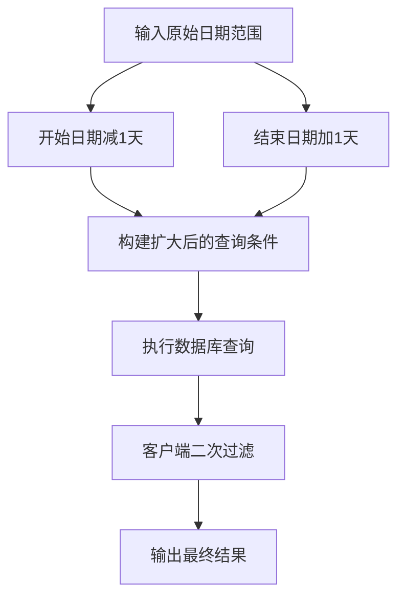
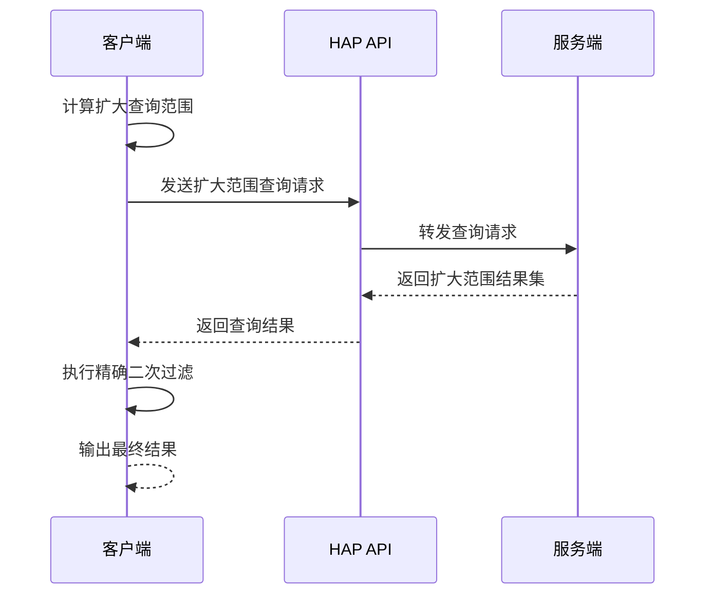
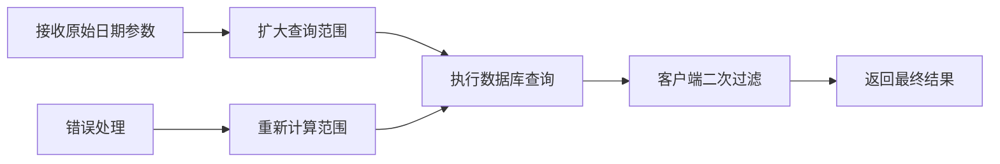

# 日期字段处理陷阱

<cite>
**本文引用的文件**
- [README.md](file://README.md)
- [SKILL.md](file://SKILL.md)
</cite>

## 目录
1. [简介](#简介)
2. [问题背景](#问题背景)
3. [时区偏移陷阱详解](#时区偏移陷阱详解)
4. [解决方案](#解决方案)
5. [最佳实践](#最佳实践)
6. [实施建议](#实施建议)
7. [故障排除指南](#故障排除指南)
8. [总结](#总结)

## 简介

本文档专门针对明道云 HAP 应用开发中的日期字段时区偏移陷阱提供详细的预防指南。该问题可能导致服务端时区设置导致的 ±1 天偏差，影响日期过滤的准确性。文档将提供具体的解决方案，包括放宽过滤窗口和客户端二次过滤的方法，并阐述时区处理的最佳实践。

## 问题背景

在明道云 HAP 应用开发中，日期字段的时区处理是一个常见但容易被忽视的技术陷阱。由于服务端时区设置的不同，可能导致日期过滤出现 ±1 天的偏差，这会直接影响数据查询的准确性和用户体验。

根据项目文档，在第8.5节明确指出："日期字段可能因服务端时区设置偏移 ±1 天"，并提供了相应的解法："放宽过滤窗口（start-1 ~ end+1）+ 客户端二次过滤"。

## 时区偏移陷阱详解

### 问题现象

当使用日期字段进行数据过滤时，可能出现以下情况：

- **时间戳转换差异**：客户端和服务器端对时间戳的处理可能存在时区差异
- **日期边界问题**：在午夜时分（00:00:00）附近的数据查询可能出现偏差
- **夏令时影响**：不同地区的夏令时设置可能导致额外的1小时偏差

### 影响范围

这个问题主要影响以下类型的日期字段操作：

- 日期范围查询（between）
- 特定日期精确匹配（eq）
- 日历视图数据展示
- 报表统计分析

## 解决方案

### 方案一：放宽过滤窗口

#### 核心思路
通过扩大查询的时间范围来避免时区偏移造成的漏查问题。

#### 实施方法



**图表来源**
- [SKILL.md:357-362](file://SKILL.md#L357-L362)

#### 具体实现步骤

1. **计算扩大范围**
   - 新开始时间 = 原开始时间 - 1天
   - 新结束时间 = 原结束时间 + 1天

2. **执行扩大范围查询**
   ```javascript
   // 示例：扩大查询范围
   const expandedStartDate = originalStartDate.subtract(1, 'day');
   const expandedEndDate = originalEndDate.add(1, 'day');
   ```

3. **客户端二次过滤**
   - 在查询结果基础上进行精确过滤
   - 确保只保留原始日期范围内的数据

### 方案二：客户端二次过滤

#### 核心思路
先进行宽松查询，然后在客户端层面进行精确的数据筛选。

#### 实施流程



**图表来源**
- [SKILL.md:357-362](file://SKILL.md#L357-L362)

#### 过滤策略

1. **精确匹配过滤**
   ```javascript
   // 过滤逻辑示例
   const filteredResults = rawResults.filter(item => {
       const itemDate = new Date(item.dateField);
       return itemDate >= originalStartDate && itemDate <= originalEndDate;
   });
   ```

2. **边界值处理**
   - 精确处理日期边界
   - 考虑时间部分的完整性

## 最佳实践

### 1. 统一时区处理策略

#### 建议做法
- **统一使用 UTC 时间**：在系统中统一使用 UTC 时间进行存储和传输
- **客户端本地化显示**：在客户端进行本地时区转换显示
- **明确时区约定**：在整个应用中建立明确的时区处理约定

#### 实施要点
- 所有日期字段存储为 UTC
- API 接口统一处理时区转换
- 前端组件负责本地化显示

### 2. 查询参数标准化

#### 参数处理
- **明确日期格式**：使用 ISO 8601 标准格式
- **包含时区信息**：在请求中明确指定时区
- **边界值处理**：正确处理日期边界值

#### 示例规范
```json
{
  "filter": {
    "type": "group",
    "logic": "AND",
    "children": [
      {
        "type": "condition",
        "field": "dateField",
        "operator": "between",
        "value": ["2024-01-01T00:00:00Z", "2024-01-31T23:59:59Z"]
      }
    ]
  }
}
```

### 3. 缓存策略优化

#### 缓存考虑
- **时区感知缓存**：为不同用户时区建立独立缓存
- **时间范围缓存**：按日期范围维度进行缓存
- **失效策略**：合理设置缓存失效时间

### 4. 错误处理机制

#### 异常处理
- **时区转换异常**：捕获并处理时区转换错误
- **边界条件处理**：处理极端日期值
- **日志记录**：记录时区相关的错误信息

## 实施建议

### 1. 代码实现建议

#### 查询扩展函数
```javascript
// 扩大日期范围查询
function expandDateRange(startDate, endDate) {
    const expandedStart = startDate.clone().subtract(1, 'day');
    const expandedEnd = endDate.clone().add(1, 'day');
    return { expandedStart, expandedEnd };
}

// 客户端二次过滤
function clientSideFilter(data, originalStart, originalEnd) {
    return data.filter(item => {
        const itemDate = new Date(item.dateField);
        return itemDate >= originalStart && itemDate <= originalEnd;
    });
}
```

#### 统一处理流程


### 2. 测试策略

#### 测试场景
- **时区边界测试**：测试午夜时分的数据查询
- **夏令时测试**：验证夏令时转换的正确性
- **跨时区测试**：模拟不同地区用户的查询行为

#### 自动化测试
```javascript
// 测试用例示例
describe('日期字段时区处理', () => {
    test('±1天偏移防护', () => {
        const result = queryWithExpandedRange(startDate, endDate);
        expect(result.length).toBeGreaterThanOrEqual(originalResult.length);
        
        const filtered = clientSideFilter(result, startDate, endDate);
        expect(filtered.length).toEqual(originalResult.length);
    });
});
```

### 3. 监控和告警

#### 监控指标
- **查询偏差率**：监控日期查询的准确性
- **性能影响**：评估扩大查询范围对性能的影响
- **用户反馈**：收集用户关于日期显示的反馈

#### 告警机制
- **异常偏差检测**：当查询偏差超过阈值时发出告警
- **性能回归检测**：监控扩大查询带来的性能变化

## 故障排除指南

### 常见问题诊断

#### 问题1：查询结果为空
**症状**：使用精确日期范围查询时返回空结果
**排查步骤**：
1. 检查时区设置是否正确
2. 验证日期格式是否符合要求
3. 确认是否需要扩大查询范围

#### 问题2：查询结果过多
**症状**：扩大查询范围后返回过多数据
**排查步骤**：
1. 检查客户端二次过滤逻辑
2. 验证边界值处理是否正确
3. 确认过滤条件的精确性

#### 问题3：性能问题
**症状**：扩大查询范围导致查询变慢
**排查步骤**：
1. 分析数据库索引使用情况
2. 优化查询条件
3. 考虑添加适当的索引

### 调试技巧

#### 日志记录
```javascript
// 添加详细的日志记录
console.log(`原始查询范围: ${startDate} to ${endDate}`);
console.log(`扩大后查询范围: ${expandedStart} to ${expandedEnd}`);
console.log(`扩大查询结果数量: ${rawResults.length}`);
console.log(`二次过滤后结果数量: ${filteredResults.length}`);
```

#### 性能分析
- **查询执行时间**：监控扩大查询的性能影响
- **内存使用**：分析扩大查询对内存的影响
- **网络流量**：评估扩大查询的网络开销

## 总结

明道云 HAP 应用中的日期字段时区偏移陷阱是一个需要特别关注的技术问题。通过实施本文提出的解决方案，可以有效避免 ±1 天的偏差问题，确保日期查询的准确性。

### 关键要点回顾

1. **问题识别**：了解日期字段时区偏移的潜在风险
2. **解决方案**：采用扩大查询范围 + 客户端二次过滤的双重保障
3. **最佳实践**：建立统一的时区处理策略和标准化的查询参数
4. **实施保障**：完善的测试策略、监控机制和故障排除流程

### 长期维护建议

- **定期审查**：定期检查时区处理逻辑的有效性
- **用户反馈**：持续收集用户关于日期显示的反馈
- **技术更新**：关注明道云平台的时区处理改进
- **团队培训**：确保开发团队了解时区处理的重要性和正确方法

通过遵循本文的指导原则和实施建议，可以有效预防明道云 HAP 应用中的日期字段时区偏移问题，提升应用的可靠性和用户体验。