# 陷阱预防清单

<cite>
**本文引用的文件**
- [README.md](file://README.md)
- [SKILL.md](file://SKILL.md)
</cite>

## 目录
1. [简介](#简介)
2. [项目结构](#项目结构)
3. [核心组件](#核心组件)
4. [架构概览](#架构概览)
5. [详细组件分析](#详细组件分析)
6. [依赖关系分析](#依赖关系分析)
7. [性能考虑](#性能考虑)
8. [故障排除指南](#故障排除指南)
9. [结论](#结论)
10. [附录](#附录)

## 简介

本指南针对明道云 HAP 应用开发中的常见陷阱提供预防性解决方案。基于通用访问技能文档，我们整理了10个高频问题及其对应的预防措施和调试技巧，涵盖选项字段处理、关联字段处理、数值字段处理、日期字段处理、OAuth 域名白名单、MCP 响应限制等关键领域。

## 项目结构

该项目采用简洁的双文件结构，专注于提供明道云 HAP 应用的通用访问技能：

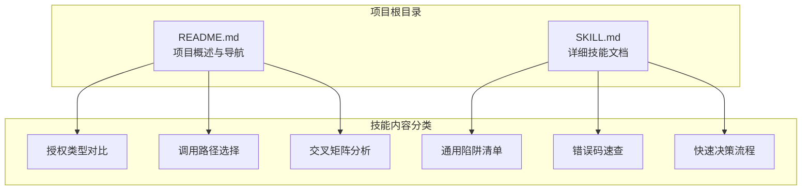

**图表来源**
- [README.md: 1-53:1-53](file://README.md#L1-L53)
- [SKILL.md: 1-436:1-436](file://SKILL.md#L1-L436)

**章节来源**
- [README.md: 1-53:1-53](file://README.md#L1-L53)
- [SKILL.md: 1-436:1-436](file://SKILL.md#L1-L436)

## 核心组件

本技能文档的核心价值在于其系统化的陷阱预防框架，包含以下关键组件：

### 授权体系组件
- **应用级授权（Appkey+Sign）**：适用于无人值守运行和后台任务
- **个人级授权（OAuth Bearer）**：适用于受用户权限约束的场景

### 调用路径组件  
- **MCP 协议**：AI 工具原生支持，适合直接操作数据
- **V3 REST API**：标准 HTTP JSON，适合代码集成

### 通用规范组件
- **驼峰命名规范**：统一参数命名风格
- **Filter 结构规范**：标准化查询条件
- **分页规范**：不同路径的分页限制

**章节来源**
- [SKILL.md: 13-32:13-32](file://SKILL.md#L13-L32)
- [SKILL.md: 35-54:35-54](file://SKILL.md#L35-L54)
- [SKILL.md: 250-298:250-298](file://SKILL.md#L250-L298)

## 架构概览

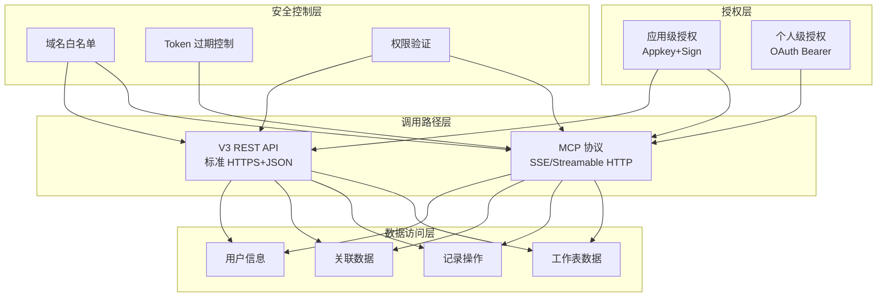

**图表来源**
- [SKILL.md: 13-64:13-64](file://SKILL.md#L13-L64)
- [SKILL.md: 35-53:35-53](file://SKILL.md#L35-L53)

## 详细组件分析

### 陷阱1：选项字段处理陷阱

**问题描述**：写入 SingleSelect/MultipleSelect 字段时必须使用 option key（UUID）而非显示文本。

**影响范围**：所有选项字段的写入操作

**预防措施**：
- 使用字段的 option key（UUID）进行写入
- 即使是单选也需要使用数组格式
- 在写入前获取字段的完整选项配置

**调试技巧**：
- 检查字段配置中的 option key
- 验证写入值是否为 UUID 格式
- 对比成功/失败的写入示例

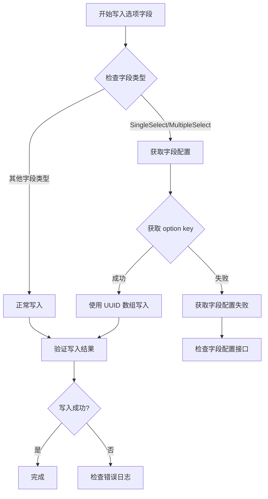

**图表来源**
- [SKILL.md: 303-316:303-316](file://SKILL.md#L303-L316)

**章节来源**
- [SKILL.md: 303-316:303-316](file://SKILL.md#L303-L316)

### 陷阱2：关联字段处理陷阱

**问题描述**：`get_record_list` 对部分 Relation 字段可能出现空值，即使后端存在关联。

**影响范围**：关联字段较多的工作表查询

**预防措施**：
- 对空值关联字段进行额外查询
- 使用 `get_record_details` 补全关联信息
- 实施双重查询策略

**调试技巧**：
- 比较列表查询和详情查询的结果差异
- 检查关联字段的配置复杂度
- 验证子表关联和多层关联的情况

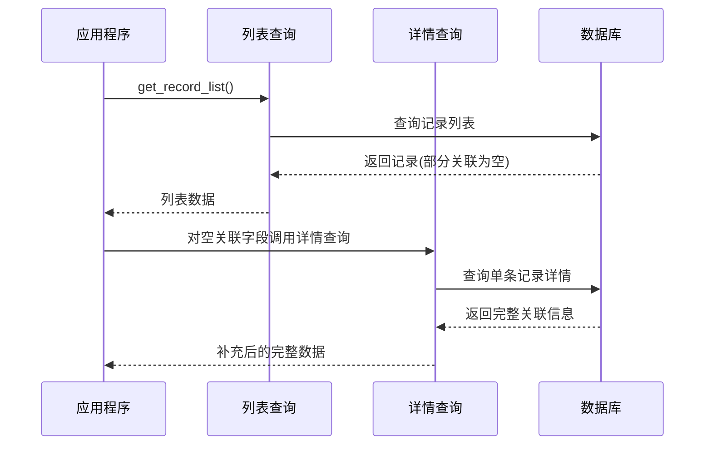

**图表来源**
- [SKILL.md: 317-322:317-322](file://SKILL.md#L317-L322)

**章节来源**
- [SKILL.md: 317-322:317-322](file://SKILL.md#L317-L322)

### 陷阱3：数值字段处理陷阱

**问题描述**：数值字段读写类型不一致，写入数字类型但读取返回字符串类型。

**影响范围**：所有数值字段的比较操作

**预防措施**：
- 在比较前进行类型转换
- 统一使用字符串比较数值
- 实施类型兼容性检查

**调试技巧**：
- 记录写入和读取的具体类型
- 实施类型转换函数
- 验证边界值处理

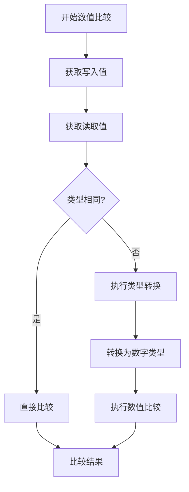

**图表来源**
- [SKILL.md: 350-356:350-356](file://SKILL.md#L350-L356)

**章节来源**
- [SKILL.md: 350-356:350-356](file://SKILL.md#L350-L356)

### 陷阱4：日期字段处理陷阱

**问题描述**：日期字段可能因服务端时区设置导致 ±1 天的偏移。

**影响范围**：所有日期字段的过滤操作

**预防措施**：
- 放宽过滤窗口范围
- 实施客户端二次过滤
- 考虑时区转换

**调试技巧**：
- 检查服务端时区配置
- 实施日期范围扩展策略
- 验证跨时区场景

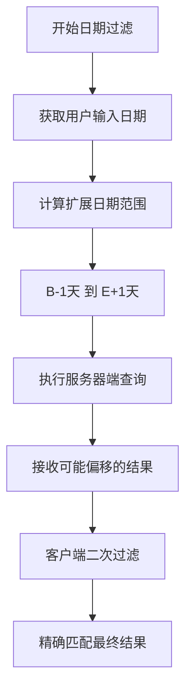

**图表来源**
- [SKILL.md: 357-362:357-362](file://SKILL.md#L357-L362)

**章节来源**
- [SKILL.md: 357-362:357-362](file://SKILL.md#L357-L362)

### 陷阱5：OAuth 域名白名单陷阱

**问题描述**：OAuth Bearer Token 只对创建时配置的域名有效，默认只支持 `api.mingdao.com`。

**影响范围**：所有 OAuth 授权场景

**预防措施**：
- 确保 MCP URL 使用正确的域名
- 验证 OAuth App 的域名配置
- 避免使用非白名单域名

**调试技巧**：
- 检查 OAuth App 的域名白名单
- 验证 MCP URL 的域名一致性
- 对比成功/失败的域名使用情况

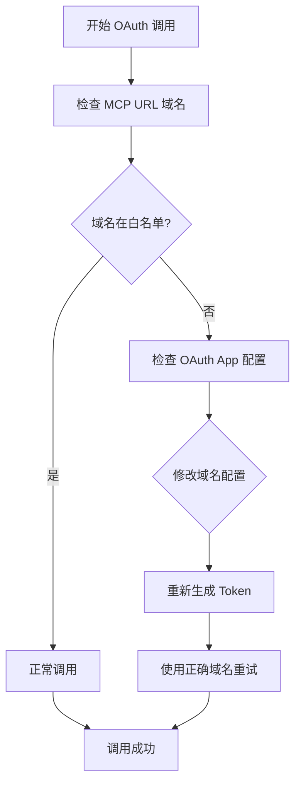

**图表来源**
- [SKILL.md: 335-343:335-343](file://SKILL.md#L335-L343)

**章节来源**
- [SKILL.md: 335-343:335-343](file://SKILL.md#L335-L343)

### 陷阱6：MCP 响应限制陷阱

**问题描述**：MCP 协议单次响应有约 256KB 的缓冲上限，超出会抛出异常。

**影响范围**：大数据量查询和复杂数据结构

**预防措施**：
- 降低 pageSize 值（推荐 50）
- 实施分批处理策略
- 考虑使用 V3 REST API 替代

**调试技巧**：
- 监控响应大小
- 实施渐进式分页
- 优化查询条件减少数据量

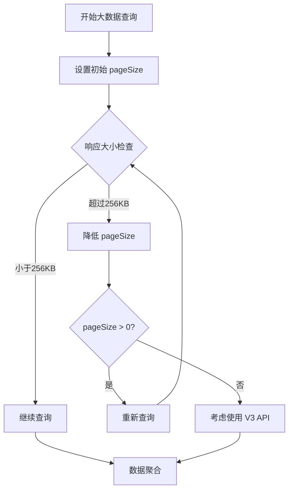

**图表来源**
- [SKILL.md: 344-349:344-349](file://SKILL.md#L344-L349)

**章节来源**
- [SKILL.md: 344-349:344-349](file://SKILL.md#L344-L349)

### 陷阱7：_owner 字段处理陷阱

**问题描述**：`_owner` 字段在列表/详情中始终返回空字符串，但 `filter.ownerid` 仍有效。

**影响范围**：需要 owner 信息的查询场景

**预防措施**：
- 从 `_createdBy.accountId` 获取 owner 信息
- 使用工作流回推获取 owner 关系
- 继续使用 `ownerid` 进行筛选

**调试技巧**：
- 比较不同字段的返回值
- 验证筛选功能的独立性
- 实施替代字段获取方案

**章节来源**
- [SKILL.md: 323-328:323-328](file://SKILL.md#L323-L328)

### 陷阱8：caid 服务端过滤陷阱

**问题描述**：服务端 `filter.field_id=caid` 对数组的 `in` 操作支持有限。

**影响范围**：需要批量筛选的场景

**预防措施**：
- 实施客户端过滤策略
- 先获取全量数据再进行筛选
- 使用其他筛选条件替代

**调试技巧**：
- 测试不同筛选条件的效果
- 实施客户端数据缓存
- 优化查询策略

**章节来源**
- [SKILL.md: 329-334:329-334](file://SKILL.md#L329-L334)

### 陷阱9：数值字段类型陷阱

**问题描述**：数值字段读写类型不一致，写入数字但读取返回字符串。

**影响范围**：所有数值字段的比较和计算

**预防措施**：
- 在比较前进行显式类型转换
- 统一使用字符串进行数值比较
- 实施类型兼容性处理

**调试技巧**：
- 记录具体的类型变化
- 实施类型转换函数
- 验证边界值处理

**章节来源**
- [SKILL.md: 350-356:350-356](file://SKILL.md#L350-L356)

### 陷阱10：Personal MCP 参数陷阱

**问题描述**：个人级 MCP 调用必须提供 `appId` 和 `ai_description` 参数，否则返回 401。

**影响范围**：所有个人级 MCP 调用

**预防措施**：
- 确保每次调用都包含必需参数
- 实施参数验证机制
- 提供清晰的用途描述

**调试技巧**：
- 检查参数完整性
- 验证参数格式
- 对比应用级和个人级的区别

**章节来源**
- [SKILL.md: 372-375:372-375](file://SKILL.md#L372-L375)

## 依赖关系分析

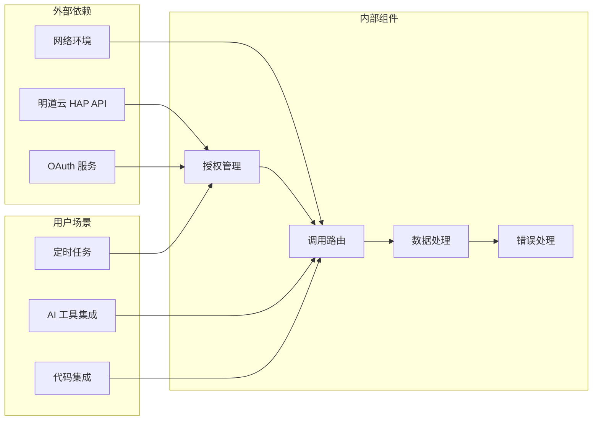

**图表来源**
- [SKILL.md: 13-64:13-64](file://SKILL.md#L13-L64)
- [SKILL.md: 301-376:301-376](file://SKILL.md#L301-L376)

**章节来源**
- [SKILL.md: 13-64:13-64](file://SKILL.md#L13-L64)
- [SKILL.md: 301-376:301-376](file://SKILL.md#L301-L376)

## 性能考虑

### 分页策略优化
- **MCP 路径**：pageSize 建议不超过 90，推荐 50
- **V3 API 路径**：pageSize 建议不超过 1000，推荐 100-500
- 实施渐进式加载策略

### 数据传输优化
- 避免不必要的字段查询
- 实施数据压缩和缓存
- 优化查询条件减少数据量

### 错误处理优化
- 实施指数退避重试机制
- 实现智能错误分类
- 建立错误监控和告警

## 故障排除指南

### 常见错误码诊断

| 错误码 | 含义 | 典型原因 | 解决方案 |
|--------|------|---------|---------|
| 1 | 成功 | 无问题 | 继续操作 |
| -1 | 通用失败 | 系统错误 | 检查日志详情 |
| 4 | 权限不足 | 权限不够 | 检查用户权限 |
| 10 | 参数错误 | 参数问题 | 验证参数格式 |
| 10001 | HTTP 头验证失败 | 域名不在白名单 | 检查域名配置 |
| 600101 | 授权已失效 | Token 过期 | 刷新 Token |

### 调试流程

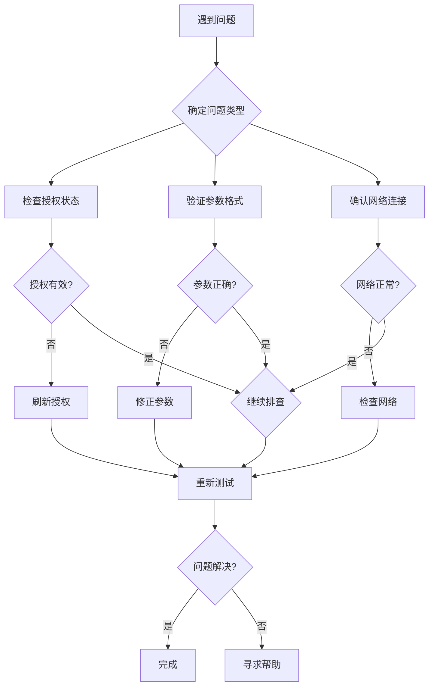

**章节来源**
- [SKILL.md: 378-398:378-398](file://SKILL.md#L378-L398)

## 结论

本陷阱预防清单涵盖了明道云 HAP 应用开发中的10个高频问题，每个陷阱都提供了具体的预防措施和调试技巧。通过遵循这些最佳实践，开发者可以显著提高应用的稳定性和可靠性。

关键要点：
- 建立完善的参数验证机制
- 实施合理的错误处理策略
- 优化数据处理和传输效率
- 建立有效的监控和告警系统

建议在项目开发过程中定期回顾这些陷阱预防措施，并根据实际使用情况进行调整和优化。

## 附录

### 快速决策流程

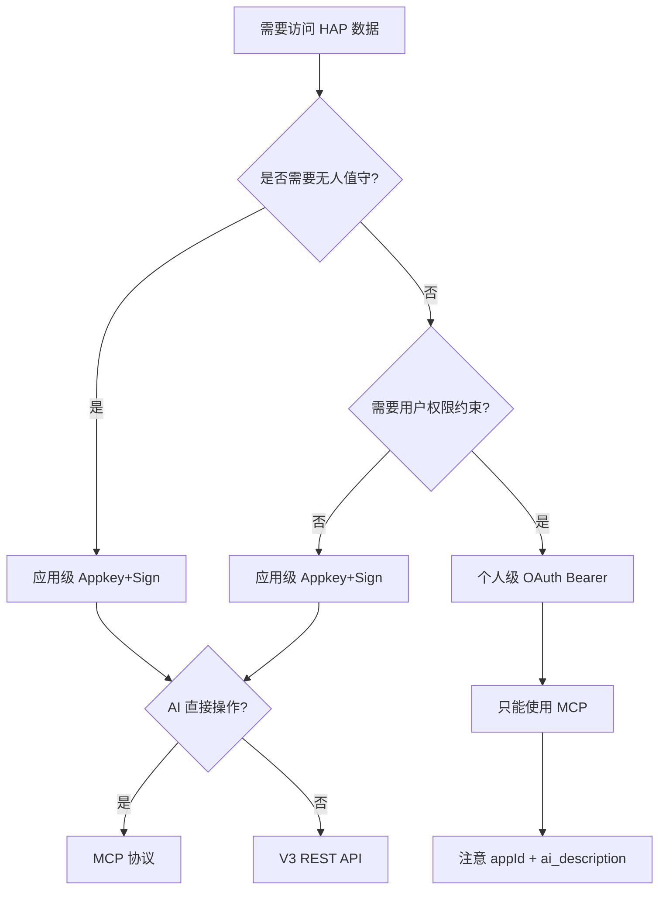

**图表来源**
- [SKILL.md: 401-418:401-418](file://SKILL.md#L401-L418)

### 相关技能链接
- **hap-mcp-usage**：MCP 配置自动化安装
- **hap-oauth-mcp**：OAuth 授权流程 + Token 管理
- **hap-v3-api**：V3 REST API 完整规范
- **hap-frontend-project**：HAP 作为后端搭建网站
- **hap-view-plugin**：自定义视图插件开发

**章节来源**
- [README.md: 39-49:39-49](file://README.md#L39-L49)
- [SKILL.md: 422-431:422-431](file://SKILL.md#L422-L431)