# 项目概述

<cite>
**本文档引用的文件**
- [README.md](file://README.md)
- [SKILL.md](file://SKILL.md)
</cite>

## 目录
1. [简介](#简介)
2. [项目结构](#项目结构)
3. [核心组件](#核心组件)
4. [架构概览](#架构概览)
5. [详细组件分析](#详细组件分析)
6. [依赖关系分析](#依赖关系分析)
7. [性能考虑](#性能考虑)
8. [故障排除指南](#故障排除指南)
9. [结论](#结论)
10. [附录](#附录)

## 简介

明道云 HAP 应用通用访问技能是一个专门为 AI 助手和开发者提供的通用方法论技能包，旨在解决访问明道云（HAP）应用数据的各种场景需求。该项目覆盖了两种授权类型（应用级 Appkey+Sign / 个人级 OAuth Bearer）与两种调用路径（MCP 协议 / V3 REST API）的完整交叉组合矩阵，为用户提供了一套标准化的访问方法论和最佳实践。

该项目的核心价值在于提供了一个清晰的选择框架，帮助用户在复杂的授权和调用路径中做出正确的技术决策，避免常见的技术陷阱和错误配置。

## 项目结构

该项目采用极简的文件结构设计，专注于内容的可移植性和可复用性：

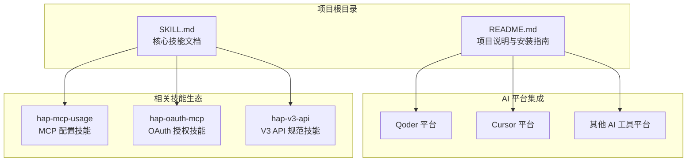

**图表来源**
- [README.md: 1-53:1-53](file://README.md#L1-L53)
- [SKILL.md: 1-436:1-436](file://SKILL.md#L1-L436)

**章节来源**
- [README.md: 1-53:1-53](file://README.md#L1-L53)
- [SKILL.md: 1-436:1-436](file://SKILL.md#L1-L436)

## 核心组件

### 授权类型组件

项目定义了两种核心授权类型，每种都有其独特的适用场景和技术特征：

#### 应用级授权（Appkey+Sign）

应用级授权提供了一种"应用身份"的访问方式，具有以下特征：
- **身份属性**：不受个人约束的应用身份
- **凭证特性**：Appkey + Sign（长期有效）
- **权限范围**：应用内 API 开关控制的全部数据
- **跨应用能力**：只能访问所属应用
- **适用场景**：后台定时任务、服务间同步、脚本自动化

#### 个人级授权（OAuth Bearer）

个人级授权模拟了"个人身份"的访问体验，具有以下特征：
- **身份属性**：等同于登录用户的个人身份
- **凭证特性**：Bearer Token（约 1 天过期）
- **权限范围**：当前登录用户在应用中可见的数据
- **跨应用能力**：可跨应用访问用户有权限的所有应用
- **适用场景**：个人数据查询、以用户视角读写数据

**章节来源**
- [SKILL.md: 13-32:13-32](file://SKILL.md#L13-L32)

### 调用路径组件

项目提供了两种不同的调用路径，满足不同使用场景的需求：

#### MCP 协议（SSE/Streamable HTTP）

MCP 协议专为 AI 助手设计，提供原生的工具发现和调用能力：
- **协议特性**：MCP（Model Context Protocol）
- **端点地址**：`https://api.mingdao.com/mcp`
- **鉴权注入**：URL query 参数或 SSE Header
- **工具发现**：自动暴露 40~70 个工具
- **调用方式**：AI 工具原生支持
- **分页限制**：pageSize 上限 **90**

#### V3 REST API（HTTP JSON）

V3 REST API 专为开发者设计，提供标准的 HTTP 接口：
- **协议特性**：标准 HTTPS + JSON
- **端点地址**：`https://api.mingdao.com/v3/open/...`
- **鉴权注入**：HTTP 请求头
- **工具发现**：需查 API 文档
- **调用方式**：代码中 `fetch`/`requests` 等
- **分页限制**：pageSize 上限 **1000**

**章节来源**
- [SKILL.md: 35-54:35-54](file://SKILL.md#L35-L54)

## 架构概览

项目采用"方法论 + 实践指南"的架构设计，形成了一个完整的技能生态系统：

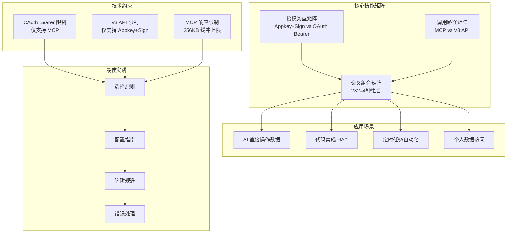

**图表来源**
- [SKILL.md: 57-65:57-65](file://SKILL.md#L57-L65)
- [SKILL.md: 401-418:401-418](file://SKILL.md#L401-L418)

### 交叉矩阵设计

项目的核心创新在于建立了完整的 2×2 交叉矩阵，明确了四种组合的可行性和限制：

|  | MCP 协议 | V3 REST API |
|---|---------|-------------|
| **应用级 Appkey+Sign** | ✅ 最常用，配置简单 | ✅ 代码集成首选 |
| **个人级 OAuth Bearer** | ✅ 跨应用 MCP | ❌ 不支持（Bearer 仅限 MCP 鉴权） |

**关键限制**：OAuth Bearer Token **不能**用于 V3 REST API 直连，只能用于 MCP 协议调用。V3 API 只认 Appkey+Sign。

**章节来源**
- [SKILL.md: 57-65:57-65](file://SKILL.md#L57-L65)

## 详细组件分析

### 应用级授权实现

#### 凭证获取流程

应用级授权的凭证获取遵循严格的步骤流程：

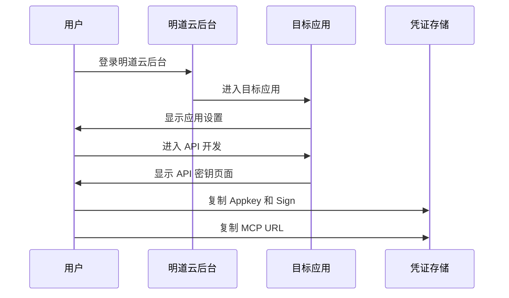

**图表来源**
- [SKILL.md: 70-75:70-75](file://SKILL.md#L70-L75)

#### MCP 配置实现

应用级授权在 MCP 环境中的配置相对简单：

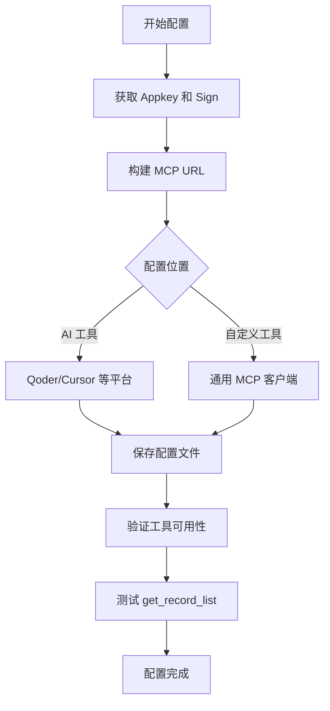

**图表来源**
- [SKILL.md: 76-97:76-97](file://SKILL.md#L76-L97)

#### V3 API 集成

应用级授权在 V3 API 中的实现提供了更丰富的功能：

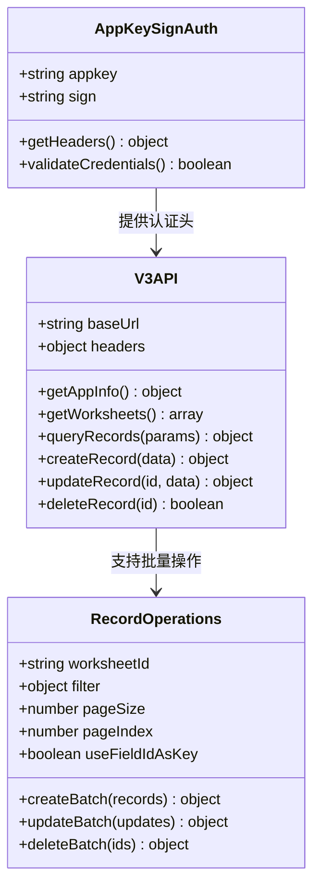

**图表来源**
- [SKILL.md: 98-165:98-165](file://SKILL.md#L98-L165)

**章节来源**
- [SKILL.md: 68-165:68-165](file://SKILL.md#L68-L165)

### 个人级授权实现

#### Token 获取流程

个人级授权的 Token 获取涉及 OAuth 授权流程：

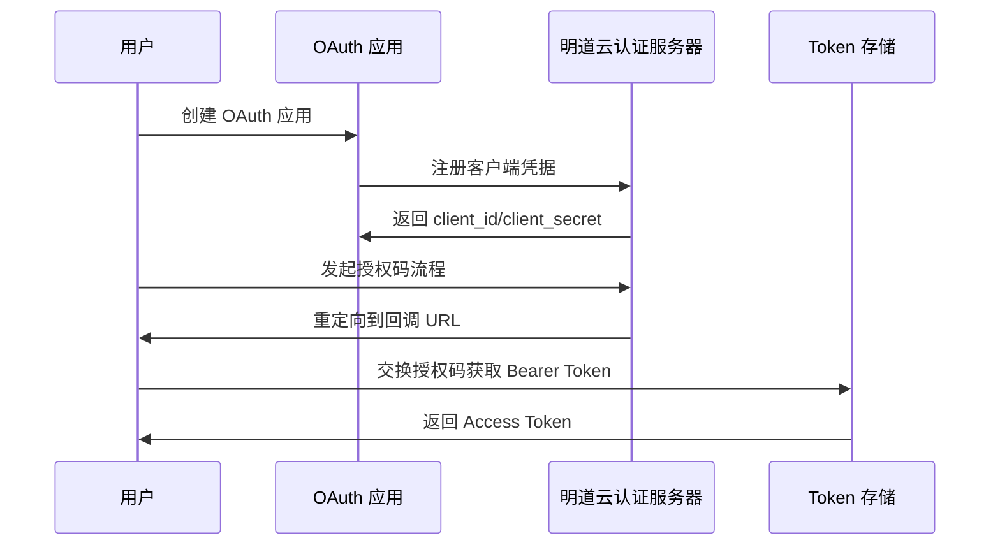

**图表来源**
- [SKILL.md: 170-175:170-175](file://SKILL.md#L170-L175)

#### MCP 配置差异

个人级授权在 MCP 中的配置需要额外的安全参数：

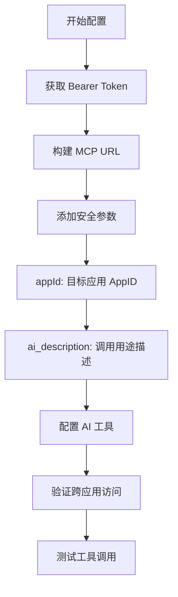

**图表来源**
- [SKILL.md: 176-210:176-210](file://SKILL.md#L176-L210)

#### Token 管理策略

个人级授权需要完善的 Token 管理机制：

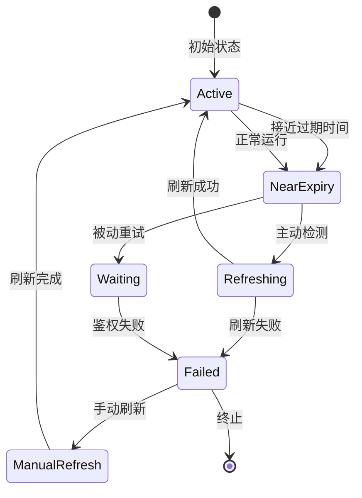

**图表来源**
- [SKILL.md: 211-229:211-229](file://SKILL.md#L211-L229)

**章节来源**
- [SKILL.md: 168-233:168-233](file://SKILL.md#L168-L233)

### 通用调用规范

#### 数据模型规范

项目制定了统一的数据模型规范，确保不同接口间的一致性：

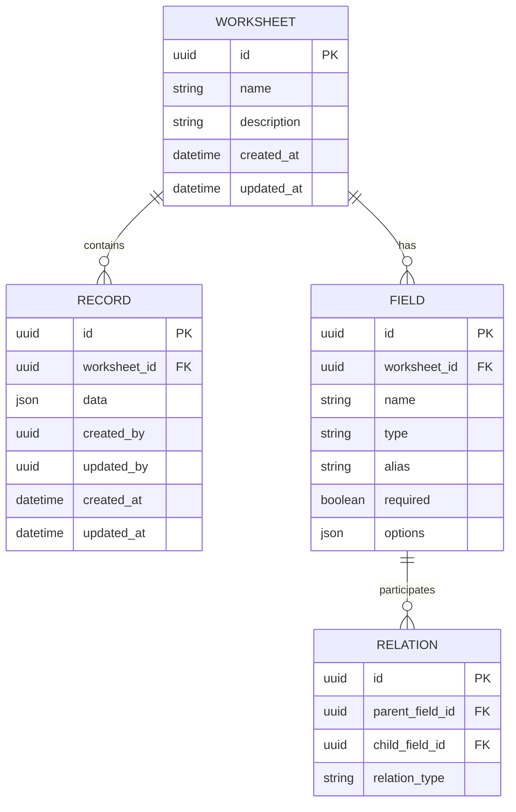

**图表来源**
- [SKILL.md: 250-298:250-298](file://SKILL.md#L250-L298)

#### 过滤器结构规范

项目定义了标准化的过滤器结构，支持复杂的查询条件：

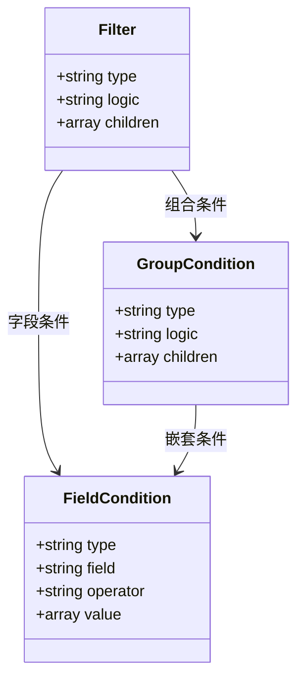

**图表来源**
- [SKILL.md: 256-273:256-273](file://SKILL.md#L256-L273)

**章节来源**
- [SKILL.md: 250-298:250-298](file://SKILL.md#L250-L298)

## 依赖关系分析

项目形成了一个相互关联的技能生态系统：

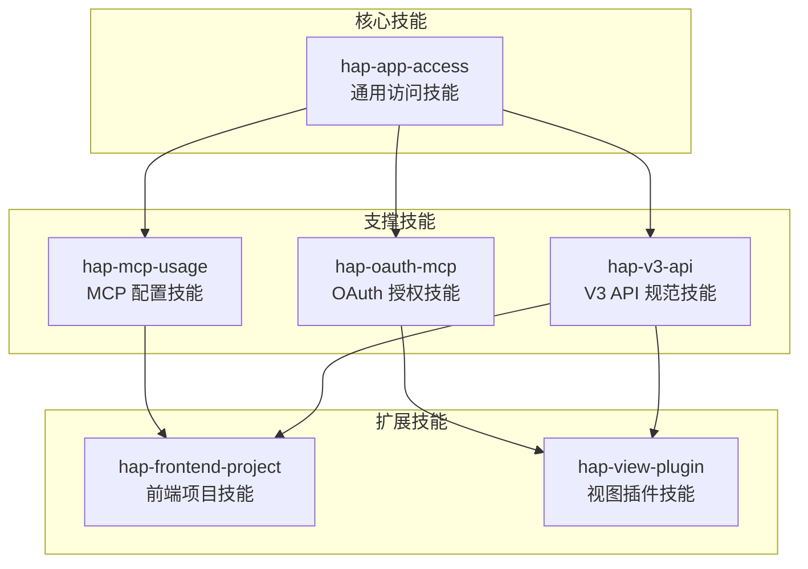

**图表来源**
- [README.md: 39-49:39-49](file://README.md#L39-L49)
- [SKILL.md: 422-431:422-431](file://SKILL.md#L422-L431)

### 技能定位关系

每个技能在生态系统中都有明确的定位和职责分工：

| 技能名称 | 定位 | 职责 | 依赖关系 |
|----------|------|------|----------|
| **hap-app-access**（本技能） | 上层方法论 | 选授权、选路径、避坑 | 无 |
| hap-mcp-usage | MCP 配置安装 | 9种 AI 工具平台配置 | hap-app-access |
| hap-oauth-mcp | OAuth 授权流程 | Bearer Token 获取/刷新 | hap-app-access |
| hap-v3-api | V3 REST API 规范 | 完整 API 使用规范 | hap-app-access |
| hap-frontend-project | 前端项目搭建 | HAP 作为后端 | hap-v3-api |
| hap-view-plugin | 视图插件开发 | 自定义视图插件 | hap-v3-api |

**章节来源**
- [README.md: 39-49:39-49](file://README.md#L39-L49)

## 性能考虑

### 响应大小限制

项目针对不同调用路径制定了明确的性能限制：

| 调用路径 | 响应大小限制 | 影响因素 | 优化建议 |
|----------|-------------|----------|----------|
| MCP 协议 | 256KB 缓冲上限 | SSE/Streamable HTTP | 降低 pageSize，使用分页 |
| V3 REST API | 无限制 | 标准 HTTP JSON | 控制单次请求数据量 |

### 分页策略

不同路径的分页策略存在显著差异：

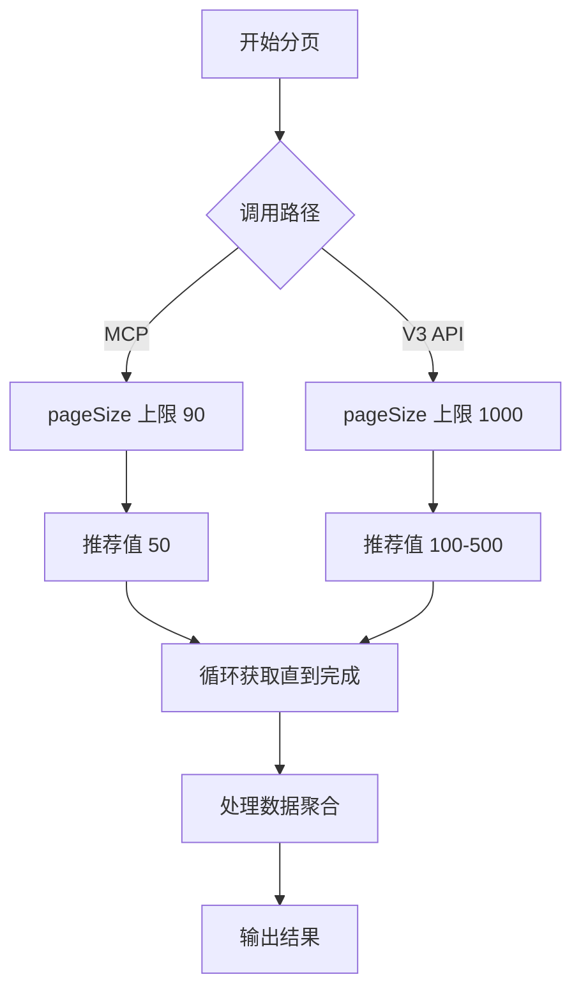

**图表来源**
- [SKILL.md: 280-288:280-288](file://SKILL.md#L280-L288)

### 性能优化建议

1. **大数据集处理**：优先使用 V3 API 的更大分页限制
2. **实时交互**：使用 MCP 协议获得更好的响应速度
3. **批量操作**：利用 V3 API 的批量操作端点减少请求次数
4. **缓存策略**：合理使用字段别名和 ID 的转换规则

## 故障排除指南

### 常见错误类型

项目整理了详细的错误码对照表，帮助快速定位问题：

| 错误码 | 含义 | 典型原因 | 解决方案 |
|--------|------|---------|----------|
| `1` | 成功 | 无问题 | 无需处理 |
| `-1` | 通用失败 | 未指定具体原因 | 查看 `error_msg` 详细信息 |
| `4` | 权限不足 | 当前身份无操作权限 | 检查授权类型和用户权限 |
| `10` | 参数错误 | 参数缺失或格式错误 | 检查参数名（驼峰）和值格式 |
| `10001` | HTTP Headers 验证失败 | OAuth token 域名不在白名单 | 确认使用 `api.mingdao.com` |
| `600101` | 授权已失效 | Bearer token 过期 | 刷新 token |
| `600100` | token 无效/缺失 | token 为空或格式错误 | 检查 Authorization 头 |

### 10001 vs 600101 区分

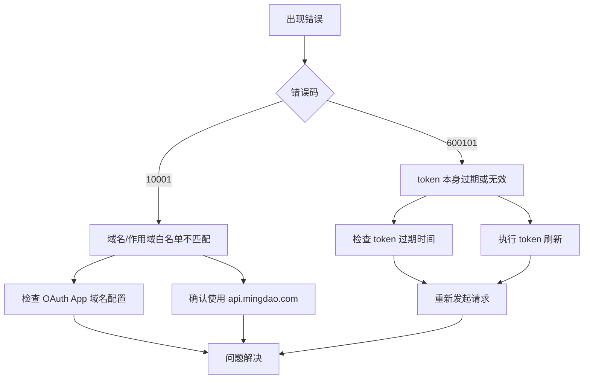

**图表来源**
- [SKILL.md: 390-398:390-398](file://SKILL.md#L390-L398)

### 陷阱清单详解

项目总结了 10 个高频陷阱及其解决方案：

#### 选项字段写入陷阱

写入 SingleSelect / MultipleSelect 字段时，必须使用 option key（UUID）而不是显示文本。即使是单选，也要使用数组格式。

#### 关联字段丢失陷阱

`get_record_list` 对部分 Relation 字段可能返回空字符串，需要额外调用 `get_record_details` 补全。

#### _owner 字段特殊行为

_owner 字段在记录列表/详情中永远返回空字符串，但 `filter.ownerid` 筛选仍然有效。

#### caid 过滤不稳定陷阱

服务端 `filter.field_id=caid` 对数组的 `in` 操作支持有限，需要客户端过滤。

#### OAuth Bearer 域名白名单陷阱

OAuth App 的 Bearer Token 只对创建时配置的域名鉴权有效，需要确保域名一致性。

#### MCP 响应大小限制陷阱

MCP 协议的单次响应有约 256KB 的缓冲上限，需要降低 pageSize 或改用 V3 API。

#### 数值字段类型不一致陷阱

写入使用数字类型，读取返回字符串，需要注意类型转换。

#### 日期过滤时区偏移陷阱

日期字段可能因服务端时区设置偏移 ±1 天，需要放宽过滤窗口。

#### triggerWorkflow 参数陷阱

创建/更新/删除记录时，`triggerWorkflow` 控制是否触发 HAP 工作流，默认为 true。

#### Personal MCP 参数陷阱

个人级 MCP 的每次调用必须提供 `appId` 和 `ai_description` 参数。

**章节来源**
- [SKILL.md: 301-376:301-376](file://SKILL.md#L301-L376)

## 结论

明道云 HAP 应用通用访问技能项目通过其精心设计的 2×2 交叉矩阵，为用户提供了清晰的技术选型指导。项目的核心价值体现在以下几个方面：

1. **标准化方法论**：提供了统一的授权选择和调用路径决策框架
2. **完整生态体系**：与相关技能形成互补，覆盖从配置到开发的全流程
3. **实用性强**：包含大量实际使用经验总结和陷阱规避方案
4. **可移植性好**：作为通用技能文件，可在多种 AI 平台间复用

该项目特别适合需要在明道云 HAP 应用中进行数据访问的 AI 助手开发者和企业用户，能够显著提升开发效率并减少技术风险。

## 附录

### 快速决策流程

项目提供了可视化的快速决策流程，帮助用户在复杂场景中做出正确选择：

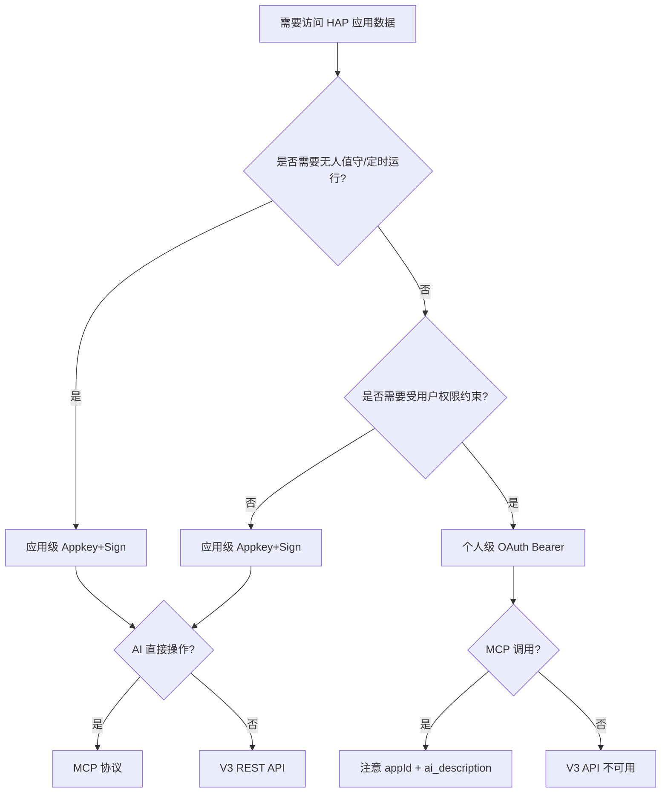

**图表来源**
- [SKILL.md: 401-418:401-418](file://SKILL.md#L401-L418)

### 相关资源链接

- **项目安装**：将 SKILL.md 文件放置到对应 AI 平台的技能目录下
- **平台兼容性**：支持 Qoder、Cursor 等主流 AI 工具平台
- **许可证**：MIT 开源许可证
- **版本信息**：v1.0 版本，适用于明道云 HAP（SaaS / Nocoly / 私有部署）